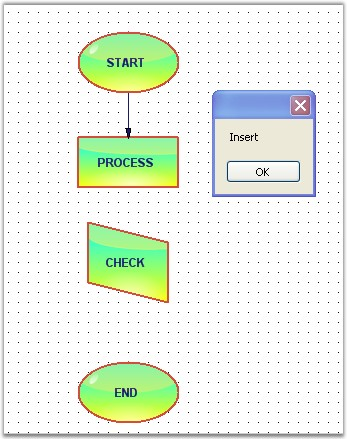
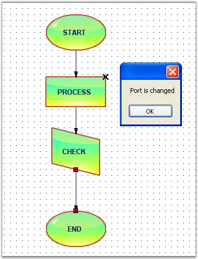

::: {style="DISPLAY: none"}
{#d2h_url_template}{#d2h_package_url style="WIDTH: 0px; DISPLAY: none; HEIGHT: 0px"}
:::

::::: {.d2h_secondary_topic style="PADDING-BOTTOM: 10pt; MARGIN: 0pt; PADDING-LEFT: 0pt; PADDING-RIGHT: 0pt; PADDING-TOP: 0pt"}
#### Connections and Ports Events[]{style="FONT-SIZE: 9pt"} {#connections-and-ports-events style="tab-stops: 0pt"}

[]{style="FONT-FAMILY: 'Trebuchet MS','sans-serif'; COLOR: #15428b; FONT-SIZE: 9pt"} 

The below events gets fired while the connection is created between two nodes.

The below table explains the Connections and Ports events.

[]{style="FONT-FAMILY: 'Trebuchet MS','sans-serif'; COLOR: #15428b; FONT-SIZE: 9pt"} 

::: {align="center"}
  -------------------- --------------------------------------------
  DocumentEventSink    Description
  ConnectionsChanged   Triggered after the connection is changed.
  PortsChanged         Triggered when ports are added or changed.
  -------------------- --------------------------------------------
:::

[]{style="FONT-FAMILY: 'Trebuchet MS','sans-serif'; COLOR: #15428b; FONT-SIZE: 9pt"} 

Data can be retrieved or set using the following members.

[]{style="FONT-FAMILY: 'Trebuchet MS','sans-serif'; COLOR: #15428b; FONT-SIZE: 9pt"} 

::: {align="center"}
+--------------------------------------+-------------------------------------------------------------------------------+
| Connection and Port EventArgs Member | Description                                                                   |
+--------------------------------------+-------------------------------------------------------------------------------+
| Cancel                               | Cancels the ConnectionChanging event.                                         |
+--------------------------------------+-------------------------------------------------------------------------------+
| ChangeType                           | It returns the following possible values,                                     |
|                                      |                                                                               |
|                                      | Insert - whether the node is inserted,                                        |
|                                      |                                                                               |
|                                      | Remove -- whether the node is removed.                                        |
+--------------------------------------+-------------------------------------------------------------------------------+
| Element                              | Returns whether the head or tail end is moved.                                |
+--------------------------------------+-------------------------------------------------------------------------------+
| Elements                             | Returns the elements collection on which the event occurs.                    |
+--------------------------------------+-------------------------------------------------------------------------------+
| Index                                | Returns the zero-based index into the collection on which the event occurred. |
+--------------------------------------+-------------------------------------------------------------------------------+
| Owner                                | Returns the owner object. This is a read-only boolean value.                  |
+--------------------------------------+-------------------------------------------------------------------------------+
:::

[]{style="FONT-FAMILY: 'Trebuchet MS','sans-serif'; COLOR: #15428b; FONT-SIZE: 9pt"} 

Connection Events

[]{style="FONT-FAMILY: 'Trebuchet MS','sans-serif'; COLOR: #15428b; FONT-SIZE: 9pt"} 

Programmatically, the Connection Event is handled as follows.

[]{style="FONT-FAMILY: 'Trebuchet MS','sans-serif'; COLOR: #15428b; FONT-SIZE: 9pt"} 

+------------------------------------------------------------------------------------------------------------------------------------------------------------------------------------------------------------------+
| **[\[C#\]]{style="FONT-FAMILY: 'Courier New'; COLOR: black"}**                                                                                                                                                   |
|                                                                                                                                                                                                                  |
| []{style="FONT-FAMILY: 'Courier New'"}                                                                                                                                                                           |
|                                                                                                                                                                                                                  |
| [public]{style="FONT-FAMILY: 'Courier New'; COLOR: blue"}[ [void]{style="COLOR: blue"} Form1_Load([object]{style="COLOR: blue"} sender, [EventArgs]{style="COLOR: teal"} e)]{style="FONT-FAMILY: 'Courier New'"} |
|                                                                                                                                                                                                                  |
| [{]{style="FONT-FAMILY: 'Courier New'"}                                                                                                                                                                          |
|                                                                                                                                                                                                                  |
| []{style="FONT-FAMILY: 'Courier New'"}                                                                                                                                                                           |
|                                                                                                                                                                                                                  |
| [    ((DocumentEventSink)model1.EventSink).ConnectionsChanged += [new]{style="COLOR: blue"} CollectionExEventHandler(Form1_ConnectionsChanged);]{style="FONT-FAMILY: 'Courier New'"}                             |
|                                                                                                                                                                                                                  |
| [    LineConnector line = [new]{style="COLOR: blue"} LineConnector(circle.PinPoint, polygon.PinPoint);]{style="FONT-FAMILY: 'Courier New'"}                                                                      |
|                                                                                                                                                                                                                  |
| [    polygon.CentralPort.TryConnect(line.HeadEndPoint);]{style="FONT-FAMILY: 'Courier New'"}                                                                                                                     |
|                                                                                                                                                                                                                  |
| [    circle.CentralPort.TryConnect(line.TailEndPoint);]{style="FONT-FAMILY: 'Courier New'"}                                                                                                                      |
|                                                                                                                                                                                                                  |
| [    model1.AppendChild(line);]{style="FONT-FAMILY: 'Courier New'"}                                                                                                                                              |
|                                                                                                                                                                                                                  |
| [}]{style="FONT-FAMILY: 'Courier New'"}                                                                                                                                                                          |
|                                                                                                                                                                                                                  |
| [void]{style="FONT-FAMILY: 'Courier New'; COLOR: blue"}[ Form1_ConnectionsChanged(CollectionExEventArgs evtArgs)]{style="FONT-FAMILY: 'Courier New'"}                                                            |
|                                                                                                                                                                                                                  |
| [{]{style="FONT-FAMILY: 'Courier New'"}                                                                                                                                                                          |
|                                                                                                                                                                                                                  |
| [    [MessageBox]{style="COLOR: teal"}.Show(evtArgs.ChangeType.ToString());]{style="FONT-FAMILY: 'Courier New'"}                                                                                                 |
|                                                                                                                                                                                                                  |
| [}]{style="FONT-FAMILY: 'Courier New'"}                                                                                                                                                                          |
+------------------------------------------------------------------------------------------------------------------------------------------------------------------------------------------------------------------+

[]{style="FONT-FAMILY: 'Courier New'"} 

+--------------------------------------------------------------------------------------------------------------------------------------------------------------------------------------------------------------------------------------------------------------------------------------------------------+
| **[\[VB\]]{style="FONT-FAMILY: 'Courier New'; COLOR: black"}**                                                                                                                                                                                                                                         |
|                                                                                                                                                                                                                                                                                                        |
| []{style="FONT-FAMILY: 'Courier New'; COLOR: blue"}                                                                                                                                                                                                                                                    |
|                                                                                                                                                                                                                                                                                                        |
| [Public]{style="FONT-FAMILY: 'Courier New'; COLOR: blue"}[ [Sub]{style="COLOR: blue"} Form1_Load([ByVal]{style="COLOR: blue"} sender [As]{style="COLOR: blue"} [Object]{style="COLOR: blue"}, [ByVal]{style="COLOR: blue"} e [As]{style="COLOR: blue"} EventArgs)]{style="FONT-FAMILY: 'Courier New'"} |
|                                                                                                                                                                                                                                                                                                        |
| [    [AddHandler]{style="COLOR: blue"} [DirectCast]{style="COLOR: blue"}(model1.EventSink, DocumentEventSink).ConnectionsChanged, [AddressOf]{style="COLOR: blue"} Form1_ConnectionsChanged]{style="FONT-FAMILY: 'Courier New'"}                                                                       |
|                                                                                                                                                                                                                                                                                                        |
| [    [Dim]{style="COLOR: blue"} line [As]{style="COLOR: blue"} [New]{style="COLOR: blue"} LineConnector(circle.PinPoint, polygon.PinPoint)]{style="FONT-FAMILY: 'Courier New'"}                                                                                                                        |
|                                                                                                                                                                                                                                                                                                        |
| [    polygon.CentralPort.TryConnect(line.HeadEndPoint)]{style="FONT-FAMILY: 'Courier New'"}                                                                                                                                                                                                            |
|                                                                                                                                                                                                                                                                                                        |
| [    circle.CentralPort.TryConnect(line.TailEndPoint)]{style="FONT-FAMILY: 'Courier New'"}                                                                                                                                                                                                             |
|                                                                                                                                                                                                                                                                                                        |
| [    model1.AppendChild(line)]{style="FONT-FAMILY: 'Courier New'"}                                                                                                                                                                                                                                     |
|                                                                                                                                                                                                                                                                                                        |
| [End]{style="FONT-FAMILY: 'Courier New'; COLOR: blue"}[ [Sub]{style="COLOR: blue"}]{style="FONT-FAMILY: 'Courier New'"}                                                                                                                                                                                |
|                                                                                                                                                                                                                                                                                                        |
| [Private]{style="FONT-FAMILY: 'Courier New'; COLOR: blue"}[ [Sub]{style="COLOR: blue"} Form1_ConnectionsChanged([ByVal]{style="COLOR: blue"} evtArgs [As]{style="COLOR: blue"} CollectionExEventArgs)]{style="FONT-FAMILY: 'Courier New'"}                                                             |
|                                                                                                                                                                                                                                                                                                        |
| [    MessageBox.Show(evtArgs.ChangeType.ToString())]{style="FONT-FAMILY: 'Courier New'"}                                                                                                                                                                                                               |
|                                                                                                                                                                                                                                                                                                        |
| [End]{style="FONT-FAMILY: 'Courier New'; COLOR: blue"}[ [Sub]{style="COLOR: blue"}]{style="FONT-FAMILY: 'Courier New'"}                                                                                                                                                                                |
+--------------------------------------------------------------------------------------------------------------------------------------------------------------------------------------------------------------------------------------------------------------------------------------------------------+

[]{style="FONT-FAMILY: 'Trebuchet MS','sans-serif'; COLOR: #15428b; FONT-SIZE: 9pt"} 

Sample diagram is as follows:

**[]{style="FONT-FAMILY: 'Trebuchet MS','sans-serif'; COLOR: #15428b; FONT-SIZE: 9pt"}** 

{border="0"}

[]{style="FONT-FAMILY: 'Trebuchet MS','sans-serif'; COLOR: #15428b; FONT-SIZE: 9pt"} 

Figure 63: ConnectionChanged Event

[]{style="FONT-FAMILY: 'Trebuchet MS','sans-serif'; COLOR: #15428b; FONT-SIZE: 9pt"} 

Ports Events

**[]{style="FONT-FAMILY: 'Trebuchet MS','sans-serif'; COLOR: #15428b"}** 

[]{style="FONT-FAMILY: 'Trebuchet MS','sans-serif'; COLOR: #15428b; FONT-SIZE: 9pt"} 

Programmatically, the events are handled as follows.

[]{style="FONT-FAMILY: 'Trebuchet MS','sans-serif'; COLOR: #15428b; FONT-SIZE: 9pt"} 

+------------------------------------------------------------------------------------------------------------------------------------------------------------------------------------------------------------------+
| **[\[C#\]]{style="FONT-FAMILY: 'Courier New'; COLOR: black"}**                                                                                                                                                   |
|                                                                                                                                                                                                                  |
| []{style="FONT-FAMILY: 'Courier New'"}                                                                                                                                                                           |
|                                                                                                                                                                                                                  |
| [public]{style="FONT-FAMILY: 'Courier New'; COLOR: blue"}[ [void]{style="COLOR: blue"} Form1_Load([object]{style="COLOR: blue"} sender, [EventArgs]{style="COLOR: teal"} e)]{style="FONT-FAMILY: 'Courier New'"} |
|                                                                                                                                                                                                                  |
| [{]{style="FONT-FAMILY: 'Courier New'"}                                                                                                                                                                          |
|                                                                                                                                                                                                                  |
| [    ((DocumentEventSink)model1.EventSink).PortsChanged += [new]{style="COLOR: blue"} CollectionExEventHandler(Form1_PortsChanged);]{style="FONT-FAMILY: 'Courier New'"}                                         |
|                                                                                                                                                                                                                  |
| [    node.EnableCentralPort = [false]{style="COLOR: blue"};]{style="FONT-FAMILY: 'Courier New'"}                                                                                                                 |
|                                                                                                                                                                                                                  |
| [}]{style="FONT-FAMILY: 'Courier New'"}                                                                                                                                                                          |
|                                                                                                                                                                                                                  |
| []{style="FONT-FAMILY: 'Courier New'"}                                                                                                                                                                           |
|                                                                                                                                                                                                                  |
| [void]{style="FONT-FAMILY: 'Courier New'; COLOR: blue"}[ Form1_PortsChanged(CollectionExEventArgs evtArgs)]{style="FONT-FAMILY: 'Courier New'"}                                                                  |
|                                                                                                                                                                                                                  |
| [{]{style="FONT-FAMILY: 'Courier New'"}                                                                                                                                                                          |
|                                                                                                                                                                                                                  |
| [    [MessageBox]{style="COLOR: teal"}.Show([\"Port is changed\"]{style="COLOR: maroon"});]{style="FONT-FAMILY: 'Courier New'"}                                                                                  |
|                                                                                                                                                                                                                  |
| [}]{style="FONT-FAMILY: 'Courier New'"}                                                                                                                                                                          |
+------------------------------------------------------------------------------------------------------------------------------------------------------------------------------------------------------------------+

[]{style="FONT-FAMILY: 'Courier New'"} 

+--------------------------------------------------------------------------------------------------------------------------------------------------------------------------------------------------------------------------------------------------------------------------------------------------------+
| **[\[VB\]]{style="FONT-FAMILY: 'Courier New'; COLOR: black"}**                                                                                                                                                                                                                                         |
|                                                                                                                                                                                                                                                                                                        |
| []{style="FONT-FAMILY: 'Courier New'; COLOR: blue"}                                                                                                                                                                                                                                                    |
|                                                                                                                                                                                                                                                                                                        |
| [Public]{style="FONT-FAMILY: 'Courier New'; COLOR: blue"}[ [Sub]{style="COLOR: blue"} Form1_Load([ByVal]{style="COLOR: blue"} sender [As]{style="COLOR: blue"} [Object]{style="COLOR: blue"}, [ByVal]{style="COLOR: blue"} e [As]{style="COLOR: blue"} EventArgs)]{style="FONT-FAMILY: 'Courier New'"} |
|                                                                                                                                                                                                                                                                                                        |
| [    [AddHandler]{style="COLOR: blue"} [DirectCast]{style="COLOR: blue"}(model1.EventSink, DocumentEventSink).PortsChanged, [AddressOf]{style="COLOR: blue"} Form1_PortsChanged]{style="FONT-FAMILY: 'Courier New'"}                                                                                   |
|                                                                                                                                                                                                                                                                                                        |
| [    node.EnableCentralPort = [False]{style="COLOR: blue"}]{style="FONT-FAMILY: 'Courier New'"}                                                                                                                                                                                                        |
|                                                                                                                                                                                                                                                                                                        |
| [End]{style="FONT-FAMILY: 'Courier New'; COLOR: blue"}[ [Sub]{style="COLOR: blue"}]{style="FONT-FAMILY: 'Courier New'"}                                                                                                                                                                                |
|                                                                                                                                                                                                                                                                                                        |
| []{style="FONT-FAMILY: 'Courier New'; COLOR: blue"}                                                                                                                                                                                                                                                    |
|                                                                                                                                                                                                                                                                                                        |
| [Private]{style="FONT-FAMILY: 'Courier New'; COLOR: blue"}[ [Sub]{style="COLOR: blue"} Form1_PortsChanged([ByVal]{style="COLOR: blue"} evtArgs [As]{style="COLOR: blue"} CollectionExEventArgs)]{style="FONT-FAMILY: 'Courier New'"}                                                                   |
|                                                                                                                                                                                                                                                                                                        |
| [    MessageBox.Show([\"Port is changed\"]{style="COLOR: maroon"})]{style="FONT-FAMILY: 'Courier New'"}                                                                                                                                                                                                |
|                                                                                                                                                                                                                                                                                                        |
| [End]{style="FONT-FAMILY: 'Courier New'; COLOR: blue"}[ [Sub]{style="COLOR: blue"}]{style="FONT-FAMILY: 'Courier New'"}                                                                                                                                                                                |
+--------------------------------------------------------------------------------------------------------------------------------------------------------------------------------------------------------------------------------------------------------------------------------------------------------+

[]{style="FONT-FAMILY: 'Trebuchet MS','sans-serif'; COLOR: #15428b; FONT-SIZE: 9pt"} 

Sample diagram is as follows:

**[]{style="FONT-FAMILY: 'Trebuchet MS','sans-serif'; COLOR: #15428b; FONT-SIZE: 9pt"}** 

{border="0"}

[]{style="FONT-FAMILY: 'Trebuchet MS','sans-serif'; COLOR: #15428b; FONT-SIZE: 9pt"} 

Figure 64: PortChanged Event

[]{#related-topics}
:::::
