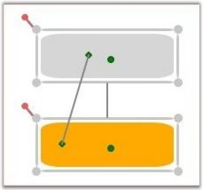

::: {style="DISPLAY: none"}
{#d2h_url_template}{#d2h_package_url style="WIDTH: 0px; DISPLAY: none; HEIGHT: 0px"}
:::

::::: {#nsbanner .d2h_main_nsbanner style="BORDER-BOTTOM: #999999 1px solid; POSITION: relative; PADDING-BOTTOM: 0px; BACKGROUND-COLOR: transparent; PADDING-LEFT: 0px; PADDING-RIGHT: 0px; DISPLAY: none; BORDER-TOP: #999999 1px solid; PADDING-TOP: 0px; LEFT: 0px"}
:::: {#TitleRow .d2h_main_titlerow style="PADDING-BOTTOM: 4px; BACKGROUND-COLOR: transparent; PADDING-LEFT: 22px; WIDTH: 100%; PADDING-RIGHT: 10px; DISPLAY: none; PADDING-TOP: 4px"}
::: {#ienav .d2h_main_ienav style="DISPLAY: none"}
{#D2HPrevious .D2HPreviousEnabled}  {#D2HNext .D2HNextEnabled}
:::
::::
:::::

:::: {#nstext .d2h_main_nstext style="PADDING-BOTTOM: 10px; BACKGROUND-COLOR: transparent; PADDING-LEFT: 22px; PADDING-RIGHT: 10px; HEIGHT: 100%; OVERFLOW: auto; PADDING-TOP: 5px" hasuserbackground="true" valign="bottom"}
::: {#d2h_breadcrumbs .d2h_breadcrumbs}
[Essential Studio User Guide Documentation](ms-xhelp:///?Id=12457748-09e3-4d74-a240-8e049cedf030){.d2h_breadcrumbsNormal}[ \> ]{.d2h_breadcrumbsLinkSeparator}[User Interface Edition](ms-xhelp:///?Id=c29296b7-531c-413b-a0ec-488ca1f7f669){.d2h_breadcrumbsNormal}[ \> ]{.d2h_breadcrumbsLinkSeparator}[Essential Silverlight](ms-xhelp:///?Id=66221bd1-ba2e-43c2-94a7-618f50e01d24){.d2h_breadcrumbsNormal}[ \> ]{.d2h_breadcrumbsLinkSeparator}[Essential Diagram]{.d2h_breadcrumbsContentsOnly}[ \> ]{.d2h_breadcrumbsLinkSeparator}[Concepts and Features](ms-xhelp:///?Id=d592a058-dcc0-44a4-994e-e7901da8db52){.d2h_breadcrumbsNormal}[ \> ]{.d2h_breadcrumbsLinkSeparator}[Connection Port](ms-xhelp:///?Id=a9f1c02d-01d3-40f5-aa89-afbd16955701){.d2h_breadcrumbsNormal}
:::

### Connections to Port {#connections-to-port style="tab-stops: 0pt"}

 

Make a connection to the port through code behind

[]{style="FONT-FAMILY: 'Trebuchet MS','sans-serif'; COLOR: #15428b; FONT-SIZE: 9pt"} 

The **ConnectionHeadPort** and **ConnectionTailPort** properties can be used to specify the ports to be used for connecting to the nodes. The **HeadNode** and **TailNode** should still be specified.

 

The following code shows the connection to the ports:

[]{style="FONT-FAMILY: 'Trebuchet MS','sans-serif'; COLOR: #15428b; FONT-SIZE: 9pt"} 

+---------------------------------------------------------------------------------------------------------------------------------------------------------------------------------------------------------------------------------------------------------+
| **[\[C#\]]{style="FONT-FAMILY: 'Courier New'; COLOR: black"}**                                                                                                                                                                                          |
|                                                                                                                                                                                                                                                         |
| []{style="FONT-FAMILY: 'Courier New'"}                                                                                                                                                                                                                  |
|                                                                                                                                                                                                                                                         |
| [Node]{style="FONT-FAMILY: 'Courier New'; COLOR: #2b91af"}[ nodeObject = [new]{style="COLOR: blue"} [Node]{style="COLOR: #2b91af"}([Guid]{style="COLOR: #2b91af"}.NewGuid(), [\"Node1\"]{style="COLOR: #a31515"});]{style="FONT-FAMILY: 'Courier New'"} |
|                                                                                                                                                                                                                                                         |
| [diagramModel.Nodes.Add(nodeObject);]{style="FONT-FAMILY: 'Courier New'"}                                                                                                                                                                               |
|                                                                                                                                                                                                                                                         |
| [nodeObject.AllowPortDrag = true;[Node]{style="COLOR: #2b91af"} node = [new]{style="COLOR: blue"} [Node]{style="COLOR: #2b91af"}([Guid]{style="COLOR: #2b91af"}.NewGuid(), [\"Node1\"]{style="COLOR: #a31515"});]{style="FONT-FAMILY: 'Courier New'"}   |
|                                                                                                                                                                                                                                                         |
| [node.Shape = [Shapes]{style="COLOR: #2b91af"}.RoundedSquare;]{style="FONT-FAMILY: 'Courier New'"}                                                                                                                                                      |
|                                                                                                                                                                                                                                                         |
| [node.Width = 150;]{style="FONT-FAMILY: 'Courier New'"}                                                                                                                                                                                                 |
|                                                                                                                                                                                                                                                         |
| [node.Height = 50;]{style="FONT-FAMILY: 'Courier New'"}                                                                                                                                                                                                 |
|                                                                                                                                                                                                                                                         |
| [node.OffsetX = 250;]{style="FONT-FAMILY: 'Courier New'"}                                                                                                                                                                                               |
|                                                                                                                                                                                                                                                         |
| [node.OffsetY = 100;]{style="FONT-FAMILY: 'Courier New'"}                                                                                                                                                                                               |
|                                                                                                                                                                                                                                                         |
| []{style="FONT-FAMILY: 'Courier New'; COLOR: #2b91af"}                                                                                                                                                                                                  |
|                                                                                                                                                                                                                                                         |
| [ConnectionPort]{style="FONT-FAMILY: 'Courier New'; COLOR: #2b91af"}[ port = [new]{style="COLOR: blue"} [ConnectionPort]{style="COLOR: #2b91af"}();]{style="FONT-FAMILY: 'Courier New'"}                                                                |
|                                                                                                                                                                                                                                                         |
| [port.Left = 50;]{style="FONT-FAMILY: 'Courier New'"}                                                                                                                                                                                                   |
|                                                                                                                                                                                                                                                         |
| [port.Top = 20;]{style="FONT-FAMILY: 'Courier New'"}                                                                                                                                                                                                    |
|                                                                                                                                                                                                                                                         |
| [port.Node = node;]{style="FONT-FAMILY: 'Courier New'"}                                                                                                                                                                                                 |
|                                                                                                                                                                                                                                                         |
| [node.Ports.Add(port);]{style="FONT-FAMILY: 'Courier New'"}                                                                                                                                                                                             |
|                                                                                                                                                                                                                                                         |
| [diagramModel.Nodes.Add(node);]{style="FONT-FAMILY: 'Courier New'"}                                                                                                                                                                                     |
|                                                                                                                                                                                                                                                         |
| []{style="FONT-FAMILY: 'Courier New'"}                                                                                                                                                                                                                  |
|                                                                                                                                                                                                                                                         |
| [Node]{style="FONT-FAMILY: 'Courier New'; COLOR: #2b91af"}[ node1 = [new]{style="COLOR: blue"} [Node]{style="COLOR: #2b91af"}([Guid]{style="COLOR: #2b91af"}.NewGuid(), [\"Node1\"]{style="COLOR: #a31515"});]{style="FONT-FAMILY: 'Courier New'"}      |
|                                                                                                                                                                                                                                                         |
| [node1.Shape = [Shapes]{style="COLOR: #2b91af"}.RoundedSquare;]{style="FONT-FAMILY: 'Courier New'"}                                                                                                                                                     |
|                                                                                                                                                                                                                                                         |
| [node1.Width = 150;]{style="FONT-FAMILY: 'Courier New'"}                                                                                                                                                                                                |
|                                                                                                                                                                                                                                                         |
| [node1.Height = 50;]{style="FONT-FAMILY: 'Courier New'"}                                                                                                                                                                                                |
|                                                                                                                                                                                                                                                         |
| [node1.OffsetX = 250;]{style="FONT-FAMILY: 'Courier New'"}                                                                                                                                                                                              |
|                                                                                                                                                                                                                                                         |
| [node1.OffsetY = 200;]{style="FONT-FAMILY: 'Courier New'"}                                                                                                                                                                                              |
|                                                                                                                                                                                                                                                         |
| [ConnectionPort]{style="FONT-FAMILY: 'Courier New'; COLOR: #2b91af"}[ port1 = [new]{style="COLOR: blue"} [ConnectionPort]{style="COLOR: #2b91af"}();]{style="FONT-FAMILY: 'Courier New'"}                                                               |
|                                                                                                                                                                                                                                                         |
| [port1.Left = 20;]{style="FONT-FAMILY: 'Courier New'"}                                                                                                                                                                                                  |
|                                                                                                                                                                                                                                                         |
| [port1.Top = 20;]{style="FONT-FAMILY: 'Courier New'"}                                                                                                                                                                                                   |
|                                                                                                                                                                                                                                                         |
| [port1.Node = node1;]{style="FONT-FAMILY: 'Courier New'"}                                                                                                                                                                                               |
|                                                                                                                                                                                                                                                         |
| [node1.Ports.Add(port1);]{style="FONT-FAMILY: 'Courier New'"}                                                                                                                                                                                           |
|                                                                                                                                                                                                                                                         |
| [diagramModel.Nodes.Add(node1);]{style="FONT-FAMILY: 'Courier New'"}                                                                                                                                                                                    |
|                                                                                                                                                                                                                                                         |
| [diagramModel.Nodes.Add(node1);]{style="FONT-FAMILY: 'Courier New'"}                                                                                                                                                                                    |
|                                                                                                                                                                                                                                                         |
| []{style="FONT-FAMILY: 'Courier New'"}                                                                                                                                                                                                                  |
|                                                                                                                                                                                                                                                         |
| [LineConnector]{style="FONT-FAMILY: 'Courier New'; COLOR: #2b91af"}[ o = [new]{style="COLOR: blue"} [LineConnector]{style="COLOR: #2b91af"}();]{style="FONT-FAMILY: 'Courier New'"}                                                                     |
|                                                                                                                                                                                                                                                         |
| [o.ConnectorType = [ConnectorType]{style="COLOR: #2b91af"}.Straight;]{style="FONT-FAMILY: 'Courier New'"}                                                                                                                                               |
|                                                                                                                                                                                                                                                         |
| [o.TailNode = node;]{style="FONT-FAMILY: 'Courier New'"}                                                                                                                                                                                                |
|                                                                                                                                                                                                                                                         |
| [o.HeadNode = node1;]{style="FONT-FAMILY: 'Courier New'"}                                                                                                                                                                                               |
|                                                                                                                                                                                                                                                         |
| [o.HeadDecoratorShape = [DecoratorShape]{style="COLOR: #2b91af"}.None;]{style="FONT-FAMILY: 'Courier New'"}                                                                                                                                             |
|                                                                                                                                                                                                                                                         |
| [o.TailDecoratorShape = [DecoratorShape]{style="COLOR: #2b91af"}.None;]{style="FONT-FAMILY: 'Courier New'"}                                                                                                                                             |
|                                                                                                                                                                                                                                                         |
| [o.ConnectionTailPort = port;]{style="FONT-FAMILY: 'Courier New'; COLOR: black"}                                                                                                                                                                        |
|                                                                                                                                                                                                                                                         |
| [o.ConnectionHeadPort = port1;]{style="FONT-FAMILY: 'Courier New'; COLOR: black"}                                                                                                                                                                       |
|                                                                                                                                                                                                                                                         |
| []{style="FONT-FAMILY: 'Courier New'"}                                                                                                                                                                                                                  |
|                                                                                                                                                                                                                                                         |
| [LineConnector]{style="FONT-FAMILY: 'Courier New'; COLOR: #2b91af"}[ o1 = [new]{style="COLOR: blue"} [LineConnector]{style="COLOR: #2b91af"}();]{style="FONT-FAMILY: 'Courier New'"}                                                                    |
|                                                                                                                                                                                                                                                         |
| [o1.ConnectorType = [ConnectorType]{style="COLOR: #2b91af"}.Straight;]{style="FONT-FAMILY: 'Courier New'"}                                                                                                                                              |
|                                                                                                                                                                                                                                                         |
| [o1.TailNode = node;]{style="FONT-FAMILY: 'Courier New'"}                                                                                                                                                                                               |
|                                                                                                                                                                                                                                                         |
| [o1.HeadNode = node1;]{style="FONT-FAMILY: 'Courier New'"}                                                                                                                                                                                              |
|                                                                                                                                                                                                                                                         |
| [o1.HeadDecoratorShape = [DecoratorShape]{style="COLOR: #2b91af"}.None;]{style="FONT-FAMILY: 'Courier New'"}                                                                                                                                            |
|                                                                                                                                                                                                                                                         |
| [o1.TailDecoratorShape = [DecoratorShape]{style="COLOR: #2b91af"}.None;]{style="FONT-FAMILY: 'Courier New'"}                                                                                                                                            |
|                                                                                                                                                                                                                                                         |
| [diagramModel.Connections.Add(o);]{style="FONT-FAMILY: 'Courier New'"}                                                                                                                                                                                  |
|                                                                                                                                                                                                                                                         |
| [diagramModel.Connections.Add(o1);]{style="FONT-FAMILY: 'Courier New'"}                                                                                                                                                                                 |
+---------------------------------------------------------------------------------------------------------------------------------------------------------------------------------------------------------------------------------------------------------+

[]{style="FONT-FAMILY: 'Trebuchet MS','sans-serif'; COLOR: #15428b; FONT-SIZE: 9pt"} 

+----------------------------------------------------------------------------------------------------------------------------------------------------------------------------------------------------------------------------------------------------------------------------+
| **[\[VB\]]{style="FONT-FAMILY: 'Courier New'; COLOR: black"}**                                                                                                                                                                                                             |
|                                                                                                                                                                                                                                                                            |
| []{style="FONT-FAMILY: 'Courier New'"}                                                                                                                                                                                                                                     |
|                                                                                                                                                                                                                                                                            |
| [Dim]{style="FONT-FAMILY: 'Courier New'; COLOR: blue"}[ nodeObject [As]{style="COLOR: blue"} [New]{style="COLOR: blue"} [Node]{style="COLOR: #2b91af"}([Guid]{style="COLOR: #2b91af"}.NewGuid(), [\"Node1\"]{style="COLOR: #a31515"})]{style="FONT-FAMILY: 'Courier New'"} |
|                                                                                                                                                                                                                                                                            |
| [diagramModel.Nodes.Add(nodeObject)]{style="FONT-FAMILY: 'Courier New'"}                                                                                                                                                                                                   |
|                                                                                                                                                                                                                                                                            |
| [nodeObject.AllowPortDrag = [True]{style="COLOR: blue"}]{style="FONT-FAMILY: 'Courier New'"}                                                                                                                                                                               |
|                                                                                                                                                                                                                                                                            |
| []{style="FONT-FAMILY: 'Courier New'"}                                                                                                                                                                                                                                     |
|                                                                                                                                                                                                                                                                            |
| [Dim]{style="FONT-FAMILY: 'Courier New'; COLOR: blue"}[ node [As]{style="COLOR: blue"} [New]{style="COLOR: blue"} [Node]{style="COLOR: #2b91af"}([Guid]{style="COLOR: #2b91af"}.NewGuid(), [\"Node1\"]{style="COLOR: #a31515"})]{style="FONT-FAMILY: 'Courier New'"}       |
|                                                                                                                                                                                                                                                                            |
| [node.Shape = Shapes.RoundedSquare]{style="FONT-FAMILY: 'Courier New'"}                                                                                                                                                                                                    |
|                                                                                                                                                                                                                                                                            |
| [node.Width = 150]{style="FONT-FAMILY: 'Courier New'"}                                                                                                                                                                                                                     |
|                                                                                                                                                                                                                                                                            |
| [node.Height = 50]{style="FONT-FAMILY: 'Courier New'"}                                                                                                                                                                                                                     |
|                                                                                                                                                                                                                                                                            |
| [node.OffsetX = 250]{style="FONT-FAMILY: 'Courier New'"}                                                                                                                                                                                                                   |
|                                                                                                                                                                                                                                                                            |
| [node.OffsetY = 100]{style="FONT-FAMILY: 'Courier New'"}                                                                                                                                                                                                                   |
|                                                                                                                                                                                                                                                                            |
| []{style="FONT-FAMILY: 'Courier New'"}                                                                                                                                                                                                                                     |
|                                                                                                                                                                                                                                                                            |
| [Dim]{style="FONT-FAMILY: 'Courier New'; COLOR: blue"}[ port [As]{style="COLOR: blue"} [New]{style="COLOR: blue"} [ConnectionPort]{style="COLOR: #2b91af"}()]{style="FONT-FAMILY: 'Courier New'"}                                                                          |
|                                                                                                                                                                                                                                                                            |
| [port.Left = 50]{style="FONT-FAMILY: 'Courier New'"}                                                                                                                                                                                                                       |
|                                                                                                                                                                                                                                                                            |
| [port.Top = 20]{style="FONT-FAMILY: 'Courier New'"}                                                                                                                                                                                                                        |
|                                                                                                                                                                                                                                                                            |
| [port.Node = node]{style="FONT-FAMILY: 'Courier New'"}                                                                                                                                                                                                                     |
|                                                                                                                                                                                                                                                                            |
| [node.Ports.Add(port)]{style="FONT-FAMILY: 'Courier New'"}                                                                                                                                                                                                                 |
|                                                                                                                                                                                                                                                                            |
| [diagramModel.Nodes.Add(node)]{style="FONT-FAMILY: 'Courier New'"}                                                                                                                                                                                                         |
|                                                                                                                                                                                                                                                                            |
| []{style="FONT-FAMILY: 'Courier New'"}                                                                                                                                                                                                                                     |
|                                                                                                                                                                                                                                                                            |
| [Dim]{style="FONT-FAMILY: 'Courier New'; COLOR: blue"}[ node1 [As]{style="COLOR: blue"} [New]{style="COLOR: blue"} [Node]{style="COLOR: #2b91af"}([Guid]{style="COLOR: #2b91af"}.NewGuid(), [\"Node1\"]{style="COLOR: #a31515"})]{style="FONT-FAMILY: 'Courier New'"}      |
|                                                                                                                                                                                                                                                                            |
| [node1.Shape = Shapes.RoundedSquare]{style="FONT-FAMILY: 'Courier New'"}                                                                                                                                                                                                   |
|                                                                                                                                                                                                                                                                            |
| [node1.Width = 150]{style="FONT-FAMILY: 'Courier New'"}                                                                                                                                                                                                                    |
|                                                                                                                                                                                                                                                                            |
| [node1.Height = 50]{style="FONT-FAMILY: 'Courier New'"}                                                                                                                                                                                                                    |
|                                                                                                                                                                                                                                                                            |
| [node1.OffsetX = 250]{style="FONT-FAMILY: 'Courier New'"}                                                                                                                                                                                                                  |
|                                                                                                                                                                                                                                                                            |
| [node1.OffsetY = 200]{style="FONT-FAMILY: 'Courier New'"}                                                                                                                                                                                                                  |
|                                                                                                                                                                                                                                                                            |
| []{style="FONT-FAMILY: 'Courier New'"}                                                                                                                                                                                                                                     |
|                                                                                                                                                                                                                                                                            |
| [Dim]{style="FONT-FAMILY: 'Courier New'; COLOR: blue"}[ port1 [As]{style="COLOR: blue"} [New]{style="COLOR: blue"} [ConnectionPort]{style="COLOR: #2b91af"}()]{style="FONT-FAMILY: 'Courier New'"}                                                                         |
|                                                                                                                                                                                                                                                                            |
| [port1.Left = 20]{style="FONT-FAMILY: 'Courier New'"}                                                                                                                                                                                                                      |
|                                                                                                                                                                                                                                                                            |
| [port1.Top = 20]{style="FONT-FAMILY: 'Courier New'"}                                                                                                                                                                                                                       |
|                                                                                                                                                                                                                                                                            |
| [port1.Node = node1]{style="FONT-FAMILY: 'Courier New'"}                                                                                                                                                                                                                   |
|                                                                                                                                                                                                                                                                            |
| [node1.Ports.Add(port1)]{style="FONT-FAMILY: 'Courier New'"}                                                                                                                                                                                                               |
|                                                                                                                                                                                                                                                                            |
| [diagramModel.Nodes.Add(node1)]{style="FONT-FAMILY: 'Courier New'"}                                                                                                                                                                                                        |
|                                                                                                                                                                                                                                                                            |
| [diagramModel.Nodes.Add(node1)]{style="FONT-FAMILY: 'Courier New'"}                                                                                                                                                                                                        |
|                                                                                                                                                                                                                                                                            |
| []{style="FONT-FAMILY: 'Courier New'"}                                                                                                                                                                                                                                     |
|                                                                                                                                                                                                                                                                            |
| [Dim]{style="FONT-FAMILY: 'Courier New'; COLOR: blue"}[ o [As]{style="COLOR: blue"} [New]{style="COLOR: blue"} [LineConnector]{style="COLOR: #2b91af"}()]{style="FONT-FAMILY: 'Courier New'"}                                                                              |
|                                                                                                                                                                                                                                                                            |
| [o.ConnectorType = ConnectorType.Straight]{style="FONT-FAMILY: 'Courier New'"}                                                                                                                                                                                             |
|                                                                                                                                                                                                                                                                            |
| [o.TailNode = node]{style="FONT-FAMILY: 'Courier New'"}                                                                                                                                                                                                                    |
|                                                                                                                                                                                                                                                                            |
| [o.HeadNode = node1]{style="FONT-FAMILY: 'Courier New'"}                                                                                                                                                                                                                   |
|                                                                                                                                                                                                                                                                            |
| [o.HeadDecoratorShape = DecoratorShape.None]{style="FONT-FAMILY: 'Courier New'"}                                                                                                                                                                                           |
|                                                                                                                                                                                                                                                                            |
| [o.TailDecoratorShape = DecoratorShape.None]{style="FONT-FAMILY: 'Courier New'"}                                                                                                                                                                                           |
|                                                                                                                                                                                                                                                                            |
| [o.ConnectionTailPort = port]{style="FONT-FAMILY: 'Courier New'"}                                                                                                                                                                                                          |
|                                                                                                                                                                                                                                                                            |
| [o.ConnectionHeadPort = port1]{style="FONT-FAMILY: 'Courier New'"}                                                                                                                                                                                                         |
|                                                                                                                                                                                                                                                                            |
| []{style="FONT-FAMILY: 'Courier New'"}                                                                                                                                                                                                                                     |
|                                                                                                                                                                                                                                                                            |
| [Dim]{style="FONT-FAMILY: 'Courier New'; COLOR: blue"}[ o1 [As]{style="COLOR: blue"} [New]{style="COLOR: blue"} [LineConnector]{style="COLOR: #2b91af"}()]{style="FONT-FAMILY: 'Courier New'"}                                                                             |
|                                                                                                                                                                                                                                                                            |
| [o1.ConnectorType = ConnectorType.Straight]{style="FONT-FAMILY: 'Courier New'"}                                                                                                                                                                                            |
|                                                                                                                                                                                                                                                                            |
| [o1.TailNode = node]{style="FONT-FAMILY: 'Courier New'"}                                                                                                                                                                                                                   |
|                                                                                                                                                                                                                                                                            |
| [o1.HeadNode = node1]{style="FONT-FAMILY: 'Courier New'"}                                                                                                                                                                                                                  |
|                                                                                                                                                                                                                                                                            |
| [o1.HeadDecoratorShape = DecoratorShape.None]{style="FONT-FAMILY: 'Courier New'"}                                                                                                                                                                                          |
|                                                                                                                                                                                                                                                                            |
| [o1.TailDecoratorShape = DecoratorShape.None]{style="FONT-FAMILY: 'Courier New'"}                                                                                                                                                                                          |
|                                                                                                                                                                                                                                                                            |
| [diagramModel.Connections.Add(o)]{style="FONT-FAMILY: 'Courier New'"}                                                                                                                                                                                                      |
|                                                                                                                                                                                                                                                                            |
| [diagramModel.Connections.Add(o1)]{style="FONT-FAMILY: 'Courier New'"}[]{style="FONT-FAMILY: 'Courier New'"}                                                                                                                                                               |
+----------------------------------------------------------------------------------------------------------------------------------------------------------------------------------------------------------------------------------------------------------------------------+

[]{style="FONT-FAMILY: 'Trebuchet MS','sans-serif'; COLOR: #15428b; FONT-SIZE: 9pt"} 

{border="0"}

Figure 76: Connecting to Port**[]{style="FONT-STYLE: normal; FONT-FAMILY: 'Trebuchet MS','sans-serif'; COLOR: #15428b"}**

 

[]{#p57} 

Make a connection to the port at run time

[]{style="FONT-FAMILY: 'Trebuchet MS','sans-serif'; COLOR: #15428b; FONT-SIZE: 9pt"} 

The following steps illustrate creating a connection to the port at run time.

 

To connect to a port on the node at run time:

1.   Click the desired line icon and start dragging the mouse from the desired port on the node to the target node or port.

2.   As the mouse pointer moves over the ports, a red border will appear on the respective ports indicating that the mouse is over the port.

3.   To make a connection, drop the other end of the line on the desired port or node.

Connecting to the center port will make the connection to the boundary of the node.

If the node does not contain any port other than the default center port and the end of the line connector is dropped on the node, then the connection will take place on the node\'s boundary.

In case the node contains a port, then to connect to the node\'s boundary, the line connector should be dropped on the center port. A red border will appear around the node indicating that the connection will be made to the node\'s boundary.

 

[]{#related-topics}
::::
