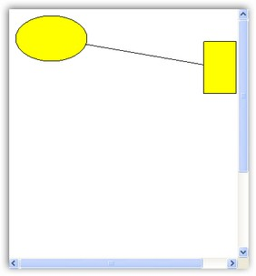
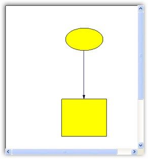

::: {style="DISPLAY: none"}
{#d2h_url_template}{#d2h_package_url style="WIDTH: 0px; DISPLAY: none; HEIGHT: 0px"}
:::

::: {.d2h_secondary_topic style="PADDING-BOTTOM: 10pt; MARGIN: 0pt; PADDING-LEFT: 0pt; PADDING-RIGHT: 0pt; PADDING-TOP: 0pt"}
#### Connectors or Links[]{style="FONT-SIZE: 9pt"} {#connectors-or-links style="tab-stops: 0pt"}

[]{style="FONT-FAMILY: 'Trebuchet MS','sans-serif'; COLOR: #15428b; FONT-SIZE: 9pt"} 

Connectors and lines have the following types of decorators.

[]{style="FONT-FAMILY: 'Trebuchet MS','sans-serif'; COLOR: #15428b; FONT-SIZE: 9pt"} 

[·      ]{style="FONT-FAMILY: Symbol"}Circle

[·      ]{style="FONT-FAMILY: Symbol"}CircleCross

[·      ]{style="FONT-FAMILY: Symbol"}CircleReverseArrow

[·      ]{style="FONT-FAMILY: Symbol"}Cross45

[·      ]{style="FONT-FAMILY: Symbol"}Cross90

[·      ]{style="FONT-FAMILY: Symbol"}CrossReverseArrow

[·      ]{style="FONT-FAMILY: Symbol"}Custom

[·      ]{style="FONT-FAMILY: Symbol"}Diamond

[·      ]{style="FONT-FAMILY: Symbol"}DimensionLine

[·      ]{style="FONT-FAMILY: Symbol"}DoubleArrow

[·      ]{style="FONT-FAMILY: Symbol"}DoubleCross

[·      ]{style="FONT-FAMILY: Symbol"}Filled45Arrow

[·      ]{style="FONT-FAMILY: Symbol"}Filled60Arrow

[·      ]{style="FONT-FAMILY: Symbol"}FilledCircle

[·      ]{style="FONT-FAMILY: Symbol"}FilledDiamond

[·      ]{style="FONT-FAMILY: Symbol"}FilledFancyArrow

[·      ]{style="FONT-FAMILY: Symbol"}FilledSquare

[·      ]{style="FONT-FAMILY: Symbol"}None

[·      ]{style="FONT-FAMILY: Symbol"}Open45Arrow

[·      ]{style="FONT-FAMILY: Symbol"}Open60Arrow

[·      ]{style="FONT-FAMILY: Symbol"}OpenFancyArrow

[·      ]{style="FONT-FAMILY: Symbol"}ReverseArrow

[·      ]{style="FONT-FAMILY: Symbol"}ReverseDoubleArrow

[·      ]{style="FONT-FAMILY: Symbol"}Square

[]{style="FONT-FAMILY: 'Trebuchet MS','sans-serif'; COLOR: #15428b; FONT-SIZE: 9pt"} 

Connecting Two Nodes with a Line Connector

[]{style="FONT-FAMILY: 'Trebuchet MS','sans-serif'; COLOR: #15428b; FONT-SIZE: 9pt"} 

The following code example illustrates how to create a link between two nodes.

[]{style="FONT-FAMILY: 'Trebuchet MS','sans-serif'; COLOR: #15428b; FONT-SIZE: 9pt"} 

+----------------------------------------------------------------------------------------------------------------------------------------------------------------------------------------------------------------------------------------------------------------------------------------------------------------------------------------------------------------------------------------------------------------+
| **[\[C#\]]{style="FONT-FAMILY: 'Courier New'"}**                                                                                                                                                                                                                                                                                                                                                               |
|                                                                                                                                                                                                                                                                                                                                                                                                                |
| []{style="FONT-FAMILY: 'Courier New'"}                                                                                                                                                                                                                                                                                                                                                                         |
|                                                                                                                                                                                                                                                                                                                                                                                                                |
| [protected]{style="FONT-FAMILY: 'Courier New'; COLOR: blue"}[ [void]{style="COLOR: blue"} Page_Load([object]{style="COLOR: blue"} sender, [EventArgs]{style="COLOR: #2b91af"} e)]{style="FONT-FAMILY: 'Courier New'"}                                                                                                                                                                                          |
|                                                                                                                                                                                                                                                                                                                                                                                                                |
| [{]{style="FONT-FAMILY: 'Courier New'"}                                                                                                                                                                                                                                                                                                                                                                        |
|                                                                                                                                                                                                                                                                                                                                                                                                                |
| [Syncfusion.Windows.Forms.Diagram.[Ellipse]{style="COLOR: #2b91af"} ellipse = [new]{style="COLOR: blue"} Syncfusion.Windows.Forms.Diagram.[Ellipse]{style="COLOR: #2b91af"}(10, 10, 110, 70);]{style="FONT-FAMILY: 'Courier New'"}                                                                                                                                                                             |
|                                                                                                                                                                                                                                                                                                                                                                                                                |
| [Syncfusion.Windows.Forms.Diagram.[Rectangle]{style="COLOR: #2b91af"} rectangle = [new]{style="COLOR: blue"} Syncfusion.Windows.Forms.Diagram.[Rectangle]{style="COLOR: #2b91af"}(300, 50, 50, 80);]{style="FONT-FAMILY: 'Courier New'"}                                                                                                                                                                       |
|                                                                                                                                                                                                                                                                                                                                                                                                                |
| [Syncfusion.Windows.Forms.Diagram.[LineConnector]{style="COLOR: #2b91af"} lineconnector = [new]{style="COLOR: blue"} Syncfusion.Windows.Forms.Diagram.[LineConnector]{style="COLOR: #2b91af"}([new]{style="COLOR: blue"} System.Drawing.[PointF]{style="COLOR: #2b91af"}(10, 200), [new]{style="COLOR: blue"} System.Drawing.[PointF]{style="COLOR: #2b91af"}(300, 250));]{style="FONT-FAMILY: 'Courier New'"} |
|                                                                                                                                                                                                                                                                                                                                                                                                                |
| [this]{style="FONT-FAMILY: 'Courier New'; COLOR: blue"}[.DiagramWebControl1.Model.AppendChild(ellipse);]{style="FONT-FAMILY: 'Courier New'"}                                                                                                                                                                                                                                                                   |
|                                                                                                                                                                                                                                                                                                                                                                                                                |
| [this]{style="FONT-FAMILY: 'Courier New'; COLOR: blue"}[.DiagramWebControl1.Model.AppendChild(rectangle);]{style="FONT-FAMILY: 'Courier New'"}                                                                                                                                                                                                                                                                 |
|                                                                                                                                                                                                                                                                                                                                                                                                                |
| [ellipse.CentralPort.TryConnect(lineconnector.HeadEndPoint);]{style="FONT-FAMILY: 'Courier New'"}                                                                                                                                                                                                                                                                                                              |
|                                                                                                                                                                                                                                                                                                                                                                                                                |
| [rectangle.CentralPort.TryConnect(lineconnector.TailEndPoint);]{style="FONT-FAMILY: 'Courier New'"}                                                                                                                                                                                                                                                                                                            |
|                                                                                                                                                                                                                                                                                                                                                                                                                |
| [this]{style="FONT-FAMILY: 'Courier New'; COLOR: blue"}[.DiagramWebControl1.Model.AppendChild(lineconnector);]{style="FONT-FAMILY: 'Courier New'"}                                                                                                                                                                                                                                                             |
|                                                                                                                                                                                                                                                                                                                                                                                                                |
| [}]{style="FONT-FAMILY: 'Courier New'"}                                                                                                                                                                                                                                                                                                                                                                        |
+----------------------------------------------------------------------------------------------------------------------------------------------------------------------------------------------------------------------------------------------------------------------------------------------------------------------------------------------------------------------------------------------------------------+

[]{style="FONT-FAMILY: 'Trebuchet MS','sans-serif'; COLOR: #15428b; FONT-SIZE: 9pt"} 

{border="0"}

[]{style="FONT-FAMILY: 'Trebuchet MS','sans-serif'; COLOR: #15428b; FONT-SIZE: 9pt"} 

Figure 8: Diagram with Connector

[]{style="FONT-FAMILY: 'Trebuchet MS','sans-serif'; COLOR: #15428b; FONT-SIZE: 9pt"} 

Connector Property Settings

[]{style="FONT-FAMILY: 'Trebuchet MS','sans-serif'; COLOR: #15428b; FONT-SIZE: 9pt"} 

Connectors have separate properties which can be set dynamically through code. The following code example illustrates the Line properties of Connectors.

[]{style="FONT-FAMILY: 'Trebuchet MS','sans-serif'; COLOR: #15428b; FONT-SIZE: 9pt"} 

+----------------------------------------------------------------------------------------------------------------------------------------------------------------------------------------------------------------------------------------------------------------------------------------------------------------------------------------------------------------------------------------------------------------+
| **[\[C#\]]{style="FONT-FAMILY: 'Courier New'"}**                                                                                                                                                                                                                                                                                                                                                               |
|                                                                                                                                                                                                                                                                                                                                                                                                                |
| []{style="FONT-FAMILY: 'Courier New'"}                                                                                                                                                                                                                                                                                                                                                                         |
|                                                                                                                                                                                                                                                                                                                                                                                                                |
| [protected]{style="FONT-FAMILY: 'Courier New'; COLOR: blue"}[ [void]{style="COLOR: blue"} Page_Load([object]{style="COLOR: blue"} sender, [EventArgs]{style="COLOR: #2b91af"} e)]{style="FONT-FAMILY: 'Courier New'"}                                                                                                                                                                                          |
|                                                                                                                                                                                                                                                                                                                                                                                                                |
| [{]{style="FONT-FAMILY: 'Courier New'"}                                                                                                                                                                                                                                                                                                                                                                        |
|                                                                                                                                                                                                                                                                                                                                                                                                                |
| [Syncfusion.Windows.Forms.Diagram.[Ellipse]{style="COLOR: #2b91af"} ellipse = [new]{style="COLOR: blue"} Syncfusion.Windows.Forms.Diagram.[Ellipse]{style="COLOR: #2b91af"}(160, 60, 100, 60);]{style="FONT-FAMILY: 'Courier New'"}                                                                                                                                                                            |
|                                                                                                                                                                                                                                                                                                                                                                                                                |
| [Syncfusion.Windows.Forms.Diagram.[Rectangle]{style="COLOR: #2b91af"} rectangle = [new]{style="COLOR: blue"} Syncfusion.Windows.Forms.Diagram.[Rectangle]{style="COLOR: #2b91af"}(150, 250, 120, 100);]{style="FONT-FAMILY: 'Courier New'"}                                                                                                                                                                    |
|                                                                                                                                                                                                                                                                                                                                                                                                                |
| [Syncfusion.Windows.Forms.Diagram.[LineConnector]{style="COLOR: #2b91af"} lineconnector = [new]{style="COLOR: blue"} Syncfusion.Windows.Forms.Diagram.[LineConnector]{style="COLOR: #2b91af"}([new]{style="COLOR: blue"} System.Drawing.[PointF]{style="COLOR: #2b91af"}(10, 200), [new]{style="COLOR: blue"} System.Drawing.[PointF]{style="COLOR: #2b91af"}(300, 250));]{style="FONT-FAMILY: 'Courier New'"} |
|                                                                                                                                                                                                                                                                                                                                                                                                                |
| [this]{style="FONT-FAMILY: 'Courier New'; COLOR: blue"}[.DiagramWebControl1.Model.AppendChild(ellipse);]{style="FONT-FAMILY: 'Courier New'"}                                                                                                                                                                                                                                                                   |
|                                                                                                                                                                                                                                                                                                                                                                                                                |
| [this]{style="FONT-FAMILY: 'Courier New'; COLOR: blue"}[.DiagramWebControl1.Model.AppendChild(rectangle);]{style="FONT-FAMILY: 'Courier New'"}                                                                                                                                                                                                                                                                 |
|                                                                                                                                                                                                                                                                                                                                                                                                                |
| [ellipse.CentralPort.TryConnect(lineconnector.TailEndPoint);]{style="FONT-FAMILY: 'Courier New'"}                                                                                                                                                                                                                                                                                                              |
|                                                                                                                                                                                                                                                                                                                                                                                                                |
| [rectangle.CentralPort.TryConnect(lineconnector.HeadEndPoint);]{style="FONT-FAMILY: 'Courier New'"}                                                                                                                                                                                                                                                                                                            |
|                                                                                                                                                                                                                                                                                                                                                                                                                |
| [this]{style="FONT-FAMILY: 'Courier New'; COLOR: blue"}[.DiagramWebControl1.Model.AppendChild(lineconnector);]{style="FONT-FAMILY: 'Courier New'"}                                                                                                                                                                                                                                                             |
|                                                                                                                                                                                                                                                                                                                                                                                                                |
| [lineconnector.HeadDecorator.DecoratorShape = DecoratorShape.Filled45Arrow;]{style="FONT-FAMILY: 'Courier New'"}                                                                                                                                                                                                                                                                                               |
|                                                                                                                                                                                                                                                                                                                                                                                                                |
| [lineconnector.LineStyle.LineColor = Color.MidnightBlue;]{style="FONT-FAMILY: 'Courier New'"}                                                                                                                                                                                                                                                                                                                  |
|                                                                                                                                                                                                                                                                                                                                                                                                                |
| [lineconnector.HeadDecorator.FillStyle.Color = Color.MidnightBlue;]{style="FONT-FAMILY: 'Courier New'"}                                                                                                                                                                                                                                                                                                        |
|                                                                                                                                                                                                                                                                                                                                                                                                                |
| [lineconnector.HeadDecorator.Size = [new]{style="COLOR: blue"} SizeF(10, 5);]{style="FONT-FAMILY: 'Courier New'"}                                                                                                                                                                                                                                                                                              |
|                                                                                                                                                                                                                                                                                                                                                                                                                |
| [}]{style="FONT-FAMILY: 'Courier New'"}                                                                                                                                                                                                                                                                                                                                                                        |
+----------------------------------------------------------------------------------------------------------------------------------------------------------------------------------------------------------------------------------------------------------------------------------------------------------------------------------------------------------------------------------------------------------------+

[]{style="FONT-FAMILY: 'Trebuchet MS','sans-serif'; COLOR: #15428b; FONT-SIZE: 9pt"} 

{border="0"}

[]{style="FONT-FAMILY: 'Trebuchet MS','sans-serif'; COLOR: #15428b; FONT-SIZE: 9pt"} 

Figure 9: Diagram with Connection Property Settings

[]{#related-topics}
:::
