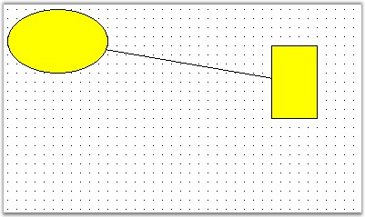
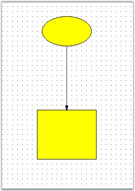

::: {style="DISPLAY: none"}
{#d2h_url_template}{#d2h_package_url style="WIDTH: 0px; DISPLAY: none; HEIGHT: 0px"}
:::

::: {.d2h_secondary_topic style="PADDING-BOTTOM: 10pt; MARGIN: 0pt; PADDING-LEFT: 0pt; PADDING-RIGHT: 0pt; PADDING-TOP: 0pt"}
#### Connectors Or Links {#connectors-or-links style="tab-stops: 0pt"}

[]{style="FONT-FAMILY: 'Trebuchet MS','sans-serif'; COLOR: #15428b; FONT-SIZE: 9pt"} 

Connectors and lines have the following different decorators.

[]{style="FONT-FAMILY: 'Trebuchet MS','sans-serif'; COLOR: #15428b; FONT-SIZE: 9pt"} 

[·      ]{style="FONT-FAMILY: Symbol"}Circle

[·      ]{style="FONT-FAMILY: Symbol"}CircleCross

[·      ]{style="FONT-FAMILY: Symbol"}CirclereverseArrow

[·      ]{style="FONT-FAMILY: Symbol"}Cross45

[·      ]{style="FONT-FAMILY: Symbol"}Cross90

[·      ]{style="FONT-FAMILY: Symbol"}CrossreverseArrow

[·      ]{style="FONT-FAMILY: Symbol"}Custom

[·      ]{style="FONT-FAMILY: Symbol"}Diamond

[·      ]{style="FONT-FAMILY: Symbol"}DimensionLine

[·      ]{style="FONT-FAMILY: Symbol"}DoubleArrow

[·      ]{style="FONT-FAMILY: Symbol"}DoubleCross

[·      ]{style="FONT-FAMILY: Symbol"}Filled45Arrow

[·      ]{style="FONT-FAMILY: Symbol"}Filled60Arrow

[·      ]{style="FONT-FAMILY: Symbol"}FilledCircle

[·      ]{style="FONT-FAMILY: Symbol"}FilledDiamond

[·      ]{style="FONT-FAMILY: Symbol"}FilledFancyArrow

[·      ]{style="FONT-FAMILY: Symbol"}FilledSquare

[·      ]{style="FONT-FAMILY: Symbol"}None

[·      ]{style="FONT-FAMILY: Symbol"}Open45Arrow

[·      ]{style="FONT-FAMILY: Symbol"}Open60Arrow

[·      ]{style="FONT-FAMILY: Symbol"}OpenFancyArrow

[·      ]{style="FONT-FAMILY: Symbol"}ReverseArrow

[·      ]{style="FONT-FAMILY: Symbol"}ReverseDoubleArrow

[·      ]{style="FONT-FAMILY: Symbol"}Square

**[]{style="FONT-FAMILY: 'Trebuchet MS','sans-serif'; COLOR: #15428b; FONT-SIZE: 9pt"}** 

Connecting two Nodes with Line Connector

**[]{style="FONT-FAMILY: 'Trebuchet MS','sans-serif'; COLOR: #15428b; FONT-SIZE: 9pt"}** 

The following code snippet creates links between two nodes.

**[]{style="FONT-FAMILY: 'Trebuchet MS','sans-serif'; COLOR: #15428b; FONT-SIZE: 9pt"}** 

+----------------------------------------------------------------------------------------------------------------------------------------------------------------------------------------------------------------------------------------------------------------------------------------------------------------------------------------------------------+
| **[\[C#\]]{style="FONT-FAMILY: 'Courier New'; COLOR: black"}**                                                                                                                                                                                                                                                                                           |
|                                                                                                                                                                                                                                                                                                                                                          |
| []{style="FONT-FAMILY: 'Courier New'"}                                                                                                                                                                                                                                                                                                                   |
|                                                                                                                                                                                                                                                                                                                                                          |
| [protected]{style="FONT-FAMILY: 'Courier New'; COLOR: blue"}[ [void]{style="COLOR: blue"} Page_Load([object]{style="COLOR: blue"} sender, [EventArgs]{style="COLOR: teal"} e)]{style="FONT-FAMILY: 'Courier New'"}                                                                                                                                       |
|                                                                                                                                                                                                                                                                                                                                                          |
| [{]{style="FONT-FAMILY: 'Courier New'"}                                                                                                                                                                                                                                                                                                                  |
|                                                                                                                                                                                                                                                                                                                                                          |
| [    Syncfusion.Windows.Forms.Diagram.Ellipse ellipse = [new]{style="COLOR: blue"} Syncfusion.Windows.Forms.Diagram.Ellipse(10, 10, 110, 70);]{style="FONT-FAMILY: 'Courier New'"}                                                                                                                                                                       |
|                                                                                                                                                                                                                                                                                                                                                          |
| [    Syncfusion.Windows.Forms.Diagram.Rectangle rectangle = [new]{style="COLOR: blue"} Syncfusion.Windows.Forms.Diagram.Rectangle(300, 50, 50, 80);]{style="FONT-FAMILY: 'Courier New'"}                                                                                                                                                                 |
|                                                                                                                                                                                                                                                                                                                                                          |
| [    Syncfusion.Windows.Forms.Diagram.LineConnector lineconnector = [new]{style="COLOR: blue"} Syncfusion.Windows.Forms.Diagram.LineConnector([new]{style="COLOR: blue"} System.Drawing.[PointF]{style="COLOR: teal"}(10, 200), [new]{style="COLOR: blue"} System.Drawing.[PointF]{style="COLOR: teal"}(300, 250));]{style="FONT-FAMILY: 'Courier New'"} |
|                                                                                                                                                                                                                                                                                                                                                          |
| [    [this]{style="COLOR: blue"}.DiagramWebControl1.Model.AppendChild(ellipse);]{style="FONT-FAMILY: 'Courier New'"}                                                                                                                                                                                                                                     |
|                                                                                                                                                                                                                                                                                                                                                          |
| [    [this]{style="COLOR: blue"}.DiagramWebControl1.Model.AppendChild(rectangle);]{style="FONT-FAMILY: 'Courier New'"}                                                                                                                                                                                                                                   |
|                                                                                                                                                                                                                                                                                                                                                          |
| [    ellipse.CentralPort.TryConnect(lineconnector.HeadEndPoint);]{style="FONT-FAMILY: 'Courier New'"}                                                                                                                                                                                                                                                    |
|                                                                                                                                                                                                                                                                                                                                                          |
| [    rectangle.CentralPort.TryConnect(lineconnector.TailEndPoint);]{style="FONT-FAMILY: 'Courier New'"}                                                                                                                                                                                                                                                  |
|                                                                                                                                                                                                                                                                                                                                                          |
| [    [this]{style="COLOR: blue"}.DiagramWebControl1.Model.AppendChild(lineconnector);]{style="FONT-FAMILY: 'Courier New'"}                                                                                                                                                                                                                               |
|                                                                                                                                                                                                                                                                                                                                                          |
| [}]{style="FONT-FAMILY: 'Courier New'"}                                                                                                                                                                                                                                                                                                                  |
+----------------------------------------------------------------------------------------------------------------------------------------------------------------------------------------------------------------------------------------------------------------------------------------------------------------------------------------------------------+

[]{style="FONT-FAMILY: 'Courier New'"} 

+---------------------------------------------------------------------------------------------------------------------------------------------------------------------------------------------------------------------------------------------------------------------------------------------------------------+
| **[\[VB\]]{style="FONT-FAMILY: 'Courier New'; COLOR: black"}**                                                                                                                                                                                                                                                |
|                                                                                                                                                                                                                                                                                                               |
| []{style="FONT-FAMILY: 'Courier New'; COLOR: blue"}                                                                                                                                                                                                                                                           |
|                                                                                                                                                                                                                                                                                                               |
| [Protected]{style="FONT-FAMILY: 'Courier New'; COLOR: blue"}[ [Sub]{style="COLOR: blue"} Page_Load([ByVal]{style="COLOR: blue"} sender [As]{style="COLOR: blue"} [Object]{style="COLOR: blue"}, [ByVal]{style="COLOR: blue"} e [As]{style="COLOR: blue"} EventArgs)]{style="FONT-FAMILY: 'Courier New'"}      |
|                                                                                                                                                                                                                                                                                                               |
| [    [Dim]{style="COLOR: blue"} ellipse [As]{style="COLOR: blue"} [New]{style="COLOR: blue"} Syncfusion.Windows.Forms.Diagram.Ellipse(10, 10, 110, 70)]{style="FONT-FAMILY: 'Courier New'"}                                                                                                                   |
|                                                                                                                                                                                                                                                                                                               |
| [    [Dim]{style="COLOR: blue"} rectangle [As]{style="COLOR: blue"} [New]{style="COLOR: blue"} Syncfusion.Windows.Forms.Diagram.Rectangle(300, 50, 50, 80)]{style="FONT-FAMILY: 'Courier New'"}                                                                                                               |
|                                                                                                                                                                                                                                                                                                               |
| [    [Dim]{style="COLOR: blue"} lineconnector [As]{style="COLOR: blue"} [New]{style="COLOR: blue"} Syncfusion.Windows.Forms.Diagram.LineConnector([New]{style="COLOR: blue"} System.Drawing.PointF(10, 200), [New]{style="COLOR: blue"} System.Drawing.PointF(300, 250))]{style="FONT-FAMILY: 'Courier New'"} |
|                                                                                                                                                                                                                                                                                                               |
| [    [Me]{style="COLOR: blue"}.DiagramWebControl1.Model.AppendChild(ellipse)]{style="FONT-FAMILY: 'Courier New'"}                                                                                                                                                                                             |
|                                                                                                                                                                                                                                                                                                               |
| [    [Me]{style="COLOR: blue"}.DiagramWebControl1.Model.AppendChild(rectangle)]{style="FONT-FAMILY: 'Courier New'"}                                                                                                                                                                                           |
|                                                                                                                                                                                                                                                                                                               |
| [    ellipse.CentralPort.TryConnect(lineconnector.HeadEndPoint)]{style="FONT-FAMILY: 'Courier New'"}                                                                                                                                                                                                          |
|                                                                                                                                                                                                                                                                                                               |
| [    rectangle.CentralPort.TryConnect(lineconnector.TailEndPoint)]{style="FONT-FAMILY: 'Courier New'"}                                                                                                                                                                                                        |
|                                                                                                                                                                                                                                                                                                               |
| []{style="FONT-FAMILY: 'Courier New'"}                                                                                                                                                                                                                                                                        |
|                                                                                                                                                                                                                                                                                                               |
| [    [Me]{style="COLOR: blue"}.DiagramWebControl1.Model.AppendChild(lineconnector)]{style="FONT-FAMILY: 'Courier New'"}                                                                                                                                                                                       |
|                                                                                                                                                                                                                                                                                                               |
| [End]{style="FONT-FAMILY: 'Courier New'; COLOR: blue"}[ [Sub]{style="COLOR: blue"}]{style="FONT-FAMILY: 'Courier New'"}                                                                                                                                                                                       |
+---------------------------------------------------------------------------------------------------------------------------------------------------------------------------------------------------------------------------------------------------------------------------------------------------------------+

**[]{style="FONT-FAMILY: 'Trebuchet MS','sans-serif'; COLOR: #15428b; FONT-SIZE: 9pt"}** 

{border="0"}

**[]{style="FONT-FAMILY: 'Trebuchet MS','sans-serif'; COLOR: #15428b; FONT-SIZE: 9pt"}** 

Figure 36: Connection Property Settings

[]{style="FONT-FAMILY: 'Trebuchet MS','sans-serif'; COLOR: #15428b; FONT-SIZE: 9pt"} 

We can change the appearance of the connectors using its properties through code. The below sample illustrates the line properties.

[]{style="FONT-FAMILY: 'Trebuchet MS','sans-serif'; COLOR: #15428b; FONT-SIZE: 9pt"} 

+----------------------------------------------------------------------------------------------------------------------------------------------------------------------------------------------------------------------------------------------------------------------------------------------------------------------------------------------------------+
| **[\[C#\]]{style="FONT-FAMILY: 'Courier New'; COLOR: black"}**                                                                                                                                                                                                                                                                                           |
|                                                                                                                                                                                                                                                                                                                                                          |
| []{style="FONT-FAMILY: 'Courier New'"}                                                                                                                                                                                                                                                                                                                   |
|                                                                                                                                                                                                                                                                                                                                                          |
| [protected]{style="FONT-FAMILY: 'Courier New'; COLOR: blue"}[ [void]{style="COLOR: blue"} Page_Load([object]{style="COLOR: blue"} sender, [EventArgs]{style="COLOR: teal"} e)]{style="FONT-FAMILY: 'Courier New'"}                                                                                                                                       |
|                                                                                                                                                                                                                                                                                                                                                          |
| [{]{style="FONT-FAMILY: 'Courier New'"}                                                                                                                                                                                                                                                                                                                  |
|                                                                                                                                                                                                                                                                                                                                                          |
| []{style="FONT-FAMILY: 'Courier New'"}                                                                                                                                                                                                                                                                                                                   |
|                                                                                                                                                                                                                                                                                                                                                          |
| [    Syncfusion.Windows.Forms.Diagram.Ellipse ellipse = [new]{style="COLOR: blue"} Syncfusion.Windows.Forms.Diagram.Ellipse(160, 60, 100, 60);]{style="FONT-FAMILY: 'Courier New'"}                                                                                                                                                                      |
|                                                                                                                                                                                                                                                                                                                                                          |
| [    Syncfusion.Windows.Forms.Diagram.Rectangle rectangle = [new]{style="COLOR: blue"} Syncfusion.Windows.Forms.Diagram.Rectangle(150, 250, 120, 100);]{style="FONT-FAMILY: 'Courier New'"}                                                                                                                                                              |
|                                                                                                                                                                                                                                                                                                                                                          |
| [    Syncfusion.Windows.Forms.Diagram.LineConnector lineconnector = [new]{style="COLOR: blue"} Syncfusion.Windows.Forms.Diagram.LineConnector([new]{style="COLOR: blue"} System.Drawing.[PointF]{style="COLOR: teal"}(10, 200), [new]{style="COLOR: blue"} System.Drawing.[PointF]{style="COLOR: teal"}(300, 250));]{style="FONT-FAMILY: 'Courier New'"} |
|                                                                                                                                                                                                                                                                                                                                                          |
| [    [this]{style="COLOR: blue"}.diagram1.Model.AppendChild(ellipse);]{style="FONT-FAMILY: 'Courier New'"}                                                                                                                                                                                                                                               |
|                                                                                                                                                                                                                                                                                                                                                          |
| [    [this]{style="COLOR: blue"}.diagram1.Model.AppendChild(rectangle);]{style="FONT-FAMILY: 'Courier New'"}                                                                                                                                                                                                                                             |
|                                                                                                                                                                                                                                                                                                                                                          |
| [    ellipse.CentralPort.TryConnect(lineconnector.TailEndPoint);]{style="FONT-FAMILY: 'Courier New'"}                                                                                                                                                                                                                                                    |
|                                                                                                                                                                                                                                                                                                                                                          |
| [    rectangle.CentralPort.TryConnect(lineconnector.HeadEndPoint);]{style="FONT-FAMILY: 'Courier New'"}                                                                                                                                                                                                                                                  |
|                                                                                                                                                                                                                                                                                                                                                          |
| [    [this]{style="COLOR: blue"}.diagram1.Model.AppendChild(lineconnector);]{style="FONT-FAMILY: 'Courier New'"}                                                                                                                                                                                                                                         |
|                                                                                                                                                                                                                                                                                                                                                          |
| [    lineconnector.HeadDecorator.DecoratorShape = DecoratorShape.Filled45Arrow;]{style="FONT-FAMILY: 'Courier New'"}                                                                                                                                                                                                                                     |
|                                                                                                                                                                                                                                                                                                                                                          |
| [    lineconnector.LineStyle.LineColor = [Color]{style="COLOR: teal"}.MidnightBlue;]{style="FONT-FAMILY: 'Courier New'"}                                                                                                                                                                                                                                 |
|                                                                                                                                                                                                                                                                                                                                                          |
| [    lineconnector.HeadDecorator.FillStyle.Color = [Color]{style="COLOR: teal"}.MidnightBlue;]{style="FONT-FAMILY: 'Courier New'"}                                                                                                                                                                                                                       |
|                                                                                                                                                                                                                                                                                                                                                          |
| [    lineconnector.HeadDecorator.Size = [new]{style="COLOR: blue"} [SizeF]{style="COLOR: teal"}(10, 5);]{style="FONT-FAMILY: 'Courier New'"}                                                                                                                                                                                                             |
|                                                                                                                                                                                                                                                                                                                                                          |
| [}]{style="FONT-FAMILY: 'Courier New'"}                                                                                                                                                                                                                                                                                                                  |
+----------------------------------------------------------------------------------------------------------------------------------------------------------------------------------------------------------------------------------------------------------------------------------------------------------------------------------------------------------+

[]{style="FONT-FAMILY: 'Courier New'"} 

+---------------------------------------------------------------------------------------------------------------------------------------------------------------------------------------------------------------------------------------------------------------------------------------------------------------+
| **[\[VB\]]{style="FONT-FAMILY: 'Courier New'; COLOR: black"}**                                                                                                                                                                                                                                                |
|                                                                                                                                                                                                                                                                                                               |
| **[]{style="FONT-FAMILY: 'Courier New'; COLOR: black"}**                                                                                                                                                                                                                                                      |
|                                                                                                                                                                                                                                                                                                               |
| [Protected]{style="FONT-FAMILY: 'Courier New'; COLOR: blue"}[ [Sub]{style="COLOR: blue"} Page_Load([ByVal]{style="COLOR: blue"} sender [As]{style="COLOR: blue"} [Object]{style="COLOR: blue"}, [ByVal]{style="COLOR: blue"} e [As]{style="COLOR: blue"} EventArgs)]{style="FONT-FAMILY: 'Courier New'"}      |
|                                                                                                                                                                                                                                                                                                               |
| []{style="FONT-FAMILY: 'Courier New'"}                                                                                                                                                                                                                                                                        |
|                                                                                                                                                                                                                                                                                                               |
| [    [Dim]{style="COLOR: blue"} ellipse [As]{style="COLOR: blue"} [New]{style="COLOR: blue"} Syncfusion.Windows.Forms.Diagram.Ellipse(160, 60, 100, 60)]{style="FONT-FAMILY: 'Courier New'"}                                                                                                                  |
|                                                                                                                                                                                                                                                                                                               |
| [    [Dim]{style="COLOR: blue"} rectangle [As]{style="COLOR: blue"} [New]{style="COLOR: blue"} Syncfusion.Windows.Forms.Diagram.Rectangle(150, 250, 120, 100)]{style="FONT-FAMILY: 'Courier New'"}                                                                                                            |
|                                                                                                                                                                                                                                                                                                               |
| [    [Dim]{style="COLOR: blue"} lineconnector [As]{style="COLOR: blue"} [New]{style="COLOR: blue"} Syncfusion.Windows.Forms.Diagram.LineConnector([New]{style="COLOR: blue"} System.Drawing.PointF(10, 200), [New]{style="COLOR: blue"} System.Drawing.PointF(300, 250))]{style="FONT-FAMILY: 'Courier New'"} |
|                                                                                                                                                                                                                                                                                                               |
| [    [Me]{style="COLOR: blue"}.diagram1.Model.AppendChild(ellipse)]{style="FONT-FAMILY: 'Courier New'"}                                                                                                                                                                                                       |
|                                                                                                                                                                                                                                                                                                               |
| [    [Me]{style="COLOR: blue"}.diagram1.Model.AppendChild(rectangle)]{style="FONT-FAMILY: 'Courier New'"}                                                                                                                                                                                                     |
|                                                                                                                                                                                                                                                                                                               |
| [    ellipse.CentralPort.TryConnect(lineconnector.TailEndPoint)]{style="FONT-FAMILY: 'Courier New'"}                                                                                                                                                                                                          |
|                                                                                                                                                                                                                                                                                                               |
| [    rectangle.CentralPort.TryConnect(lineconnector.HeadEndPoint)]{style="FONT-FAMILY: 'Courier New'"}                                                                                                                                                                                                        |
|                                                                                                                                                                                                                                                                                                               |
| [    [Me]{style="COLOR: blue"}.diagram1.Model.AppendChild(lineconnector)]{style="FONT-FAMILY: 'Courier New'"}                                                                                                                                                                                                 |
|                                                                                                                                                                                                                                                                                                               |
| [    lineconnector.HeadDecorator.DecoratorShape = DecoratorShape.Filled45Arrow]{style="FONT-FAMILY: 'Courier New'"}                                                                                                                                                                                           |
|                                                                                                                                                                                                                                                                                                               |
| [    lineconnector.LineStyle.LineColor = Color.MidnightBlue]{style="FONT-FAMILY: 'Courier New'"}                                                                                                                                                                                                              |
|                                                                                                                                                                                                                                                                                                               |
| [    lineconnector.HeadDecorator.FillStyle.Color = Color.MidnightBlue]{style="FONT-FAMILY: 'Courier New'"}                                                                                                                                                                                                    |
|                                                                                                                                                                                                                                                                                                               |
| [    lineconnector.HeadDecorator.Size = [New]{style="COLOR: blue"} SizeF(10, 5)]{style="FONT-FAMILY: 'Courier New'"}                                                                                                                                                                                          |
|                                                                                                                                                                                                                                                                                                               |
| [End]{style="FONT-FAMILY: 'Courier New'; COLOR: blue"}[ [Sub]{style="COLOR: blue"}]{style="FONT-FAMILY: 'Courier New'"}                                                                                                                                                                                       |
+---------------------------------------------------------------------------------------------------------------------------------------------------------------------------------------------------------------------------------------------------------------------------------------------------------------+

**[]{style="FONT-FAMILY: 'Trebuchet MS','sans-serif'; COLOR: #15428b; FONT-SIZE: 9pt"}** 

{border="0"}

**[]{style="FONT-FAMILY: 'Trebuchet MS','sans-serif'; COLOR: #15428b; FONT-SIZE: 9pt"}** 

Figure 37: Diagram with Connector Property Settings

 

[]{#p19} 

 

[]{#related-topics}
:::
