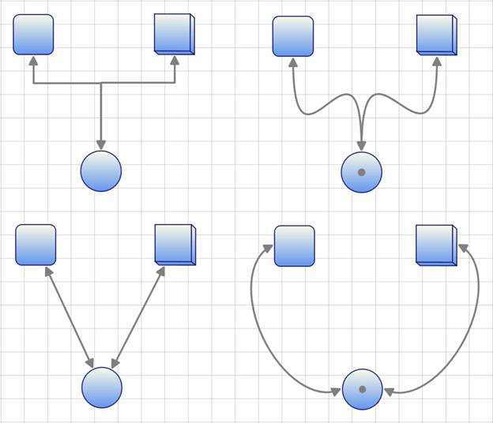
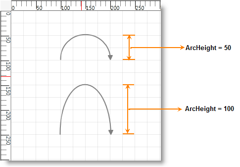
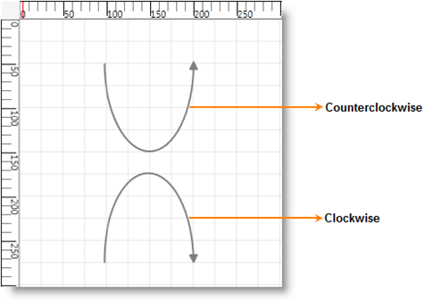

::: {style="DISPLAY: none"}
{#d2h_url_template}{#d2h_package_url style="WIDTH: 0px; DISPLAY: none; HEIGHT: 0px"}
:::

::::: {#nsbanner .d2h_main_nsbanner style="BORDER-BOTTOM: #999999 1px solid; POSITION: relative; PADDING-BOTTOM: 0px; BACKGROUND-COLOR: transparent; PADDING-LEFT: 0px; PADDING-RIGHT: 0px; DISPLAY: none; BORDER-TOP: #999999 1px solid; PADDING-TOP: 0px; LEFT: 0px"}
:::: {#TitleRow .d2h_main_titlerow style="PADDING-BOTTOM: 4px; BACKGROUND-COLOR: transparent; PADDING-LEFT: 22px; WIDTH: 100%; PADDING-RIGHT: 10px; DISPLAY: none; PADDING-TOP: 4px"}
::: {#ienav .d2h_main_ienav style="DISPLAY: none"}
{#D2HPrevious .D2HPreviousEnabled}  {#D2HNext .D2HNextEnabled}
:::
::::
:::::

::::: {#nstext .d2h_main_nstext style="PADDING-BOTTOM: 10px; BACKGROUND-COLOR: transparent; PADDING-LEFT: 22px; PADDING-RIGHT: 10px; HEIGHT: 100%; OVERFLOW: auto; PADDING-TOP: 5px" hasuserbackground="true" valign="bottom"}
::: {#d2h_breadcrumbs .d2h_breadcrumbs}
[Essential Studio User Guide Documentation](ms-xhelp:///?Id=12457748-09e3-4d74-a240-8e049cedf030){.d2h_breadcrumbsNormal}[ \> ]{.d2h_breadcrumbsLinkSeparator}[User Interface Edition](ms-xhelp:///?Id=c29296b7-531c-413b-a0ec-488ca1f7f669){.d2h_breadcrumbsNormal}[ \> ]{.d2h_breadcrumbsLinkSeparator}[Essential WPF](ms-xhelp:///?Id=7f4f82c5-151c-4262-94d0-75c4626c77bc){.d2h_breadcrumbsNormal}[ \> ]{.d2h_breadcrumbsLinkSeparator}[Essential Diagram]{.d2h_breadcrumbsContentsOnly}[ \> ]{.d2h_breadcrumbsLinkSeparator}[Concepts and Features](ms-xhelp:///?Id=8625d466-6e21-495a-b811-4ecee754da81){.d2h_breadcrumbsNormal}[ \> ]{.d2h_breadcrumbsLinkSeparator}[Line Connectors](ms-xhelp:///?Id=aa573b6b-29bb-4c85-aa22-7ebc69ffbdcc){.d2h_breadcrumbsNormal}
:::

### Connector Type {#connector-type style="tab-stops: 0pt"}

The **ConnectorType** property specifies the type of connector to be used for connection.

 

 

+---------------+------------------------------------------------------------------------------------------------------------------+---------------------+--------------------------+----------------+
| Property      | Description                                                                                                      | Type                | Data Type                | Reference Link |
+---------------+------------------------------------------------------------------------------------------------------------------+---------------------+--------------------------+----------------+
| ConnectorType | Gets or sets the connector type to be used.                                                                      | Dependency property | ConnectorType.Orthogonal | NA             |
|               |                                                                                                                  |                     |                          |                |
|               | There are four values namely Orthogonal, Straight, Bezier and Arc can be specified. Default Value is Orthogonal. |                     | ConnectorType.Bezier     |                |
|               |                                                                                                                  |                     |                          |                |
|               |                                                                                                                  |                     | ConnectorType.Straight   |                |
|               |                                                                                                                  |                     |                          |                |
|               |                                                                                                                  |                     | ConnectorType.Arc        |                |
+---------------+------------------------------------------------------------------------------------------------------------------+---------------------+--------------------------+----------------+

 

Following types of connectors are supported:

              

[·      ]{style="FONT-FAMILY: Symbol"}**Orthogonal---**Creates a line in which line segments (if any) are placed at right angles to each other.

[·      ]{style="FONT-FAMILY: Symbol"}**Bezier---**Renders a Bezier curve with two points.

[·      ]{style="FONT-FAMILY: Symbol"}**Straight---**Renders a line with two points.

[·      ]{style="FONT-FAMILY: Symbol"}**Arc---C**[reates a link between two nodes. ]{style="COLOR: black"}

 

The following code illustrates how to set the connector type:

 

+--------------------------------------------------------------------------------------------------------------------------------------------------------------------------------------+
| **[\[C#\]]{style="FONT-FAMILY: 'Courier New'; COLOR: black"}**[]{style="FONT-FAMILY: 'Courier New'"}                                                                                 |
|                                                                                                                                                                                      |
| []{style="FONT-FAMILY: 'Courier New'"}                                                                                                                                               |
|                                                                                                                                                                                      |
| [LineConnector]{style="FONT-FAMILY: 'Courier New'; COLOR: #2b91af"}[ l1 = [new]{style="COLOR: blue"} [LineConnector]{style="COLOR: #2b91af"}();]{style="FONT-FAMILY: 'Courier New'"} |
|                                                                                                                                                                                      |
| [l1.HeadNode = n1;]{style="FONT-FAMILY: 'Courier New'"}                                                                                                                              |
|                                                                                                                                                                                      |
| [l1.TailNode = n2;]{style="FONT-FAMILY: 'Courier New'"}                                                                                                                              |
|                                                                                                                                                                                      |
| [l1.ConnectorType = [ConnectorType]{style="COLOR: #2b91af"}.Bezier;]{style="FONT-FAMILY: 'Courier New'"}                                                                             |
|                                                                                                                                                                                      |
| [diagramModel.Connections.Add(l1);]{style="FONT-FAMILY: 'Courier New'"}                                                                                                              |
+--------------------------------------------------------------------------------------------------------------------------------------------------------------------------------------+

 

+------------------------------------------------------------------------------------------------------------------------------------------------------------------------------------------------+
| **[\[VB\]]{style="FONT-FAMILY: 'Courier New'; COLOR: black"}**[]{style="FONT-FAMILY: 'Courier New'"}                                                                                           |
|                                                                                                                                                                                                |
| []{style="FONT-FAMILY: 'Courier New'"}                                                                                                                                                         |
|                                                                                                                                                                                                |
| [Dim]{style="FONT-FAMILY: 'Courier New'; COLOR: blue"}[ l1 [As]{style="COLOR: blue"} [New]{style="COLOR: blue"} [LineConnector]{style="COLOR: #2b91af"}()]{style="FONT-FAMILY: 'Courier New'"} |
|                                                                                                                                                                                                |
| [l1.HeadNode = n1]{style="FONT-FAMILY: 'Courier New'"}                                                                                                                                         |
|                                                                                                                                                                                                |
| [l1.TailNode = n2]{style="FONT-FAMILY: 'Courier New'"}                                                                                                                                         |
|                                                                                                                                                                                                |
| [l1.ConnectorType = ConnectorType.Bezier]{style="FONT-FAMILY: 'Courier New'"}                                                                                                                  |
|                                                                                                                                                                                                |
| [diagramModel.Connections.Add(l1)]{style="FONT-FAMILY: 'Courier New'"}                                                                                                                         |
+------------------------------------------------------------------------------------------------------------------------------------------------------------------------------------------------+

 

 

{border="0"}

Figure 59: Connector Types

 

 

Arc Line Connector Type

Arc Line Connector creates link between two nodes. This can act as other line connectors like Bezier, Straight and Orthogonal. You can blend the Arc Line Connector and change its angel. Arc height and direction can be customized. []{style="FONT-FAMILY: 'Calibri','sans-serif'; FONT-SIZE: 11pt"}

 

Properties

*[]{style="FONT-SIZE: 9pt"}* 

Table 30: Arc Line Connector Customization Property Table

::: {align="center"}
+-----------------------------------------+--------------------------------------------------------------+----------------------+----------------+-----------------+
| Property                                | Description                                                  | Type of the property | Data Type      | Reference Links |
+-----------------------------------------+--------------------------------------------------------------+----------------------+----------------+-----------------+
| ArcHeight                               | Gets or sets a value for the height of the Arc connector.    | Dependency property  | double         | NA              |
|                                         |                                                              |                      |                |                 |
|                                         | The default value is 50.                                     |                      |                |                 |
+-----------------------------------------+--------------------------------------------------------------+----------------------+----------------+-----------------+
|                                         |                                                              |                      |                | NA              |
|                                         |                                                              |                      |                |                 |
| ArcDirection[]{style="FONT-SIZE: 11pt"} | Gets or sets a value for the direction of the Arc connector. | Dependency property  | SweepDirection |                 |
|                                         |                                                              |                      |                |                 |
|                                         | The default value is Clockwise                               |                      |                |                 |
|                                         |                                                              |                      |                |                 |
|                                         |                                                              |                      |                |                 |
+-----------------------------------------+--------------------------------------------------------------+----------------------+----------------+-----------------+
:::

[]{style="FONT-FAMILY: 'Calibri','sans-serif'; FONT-SIZE: 11pt"} 

Customizing Arc Line Connector type

Use the *ArcHeight* and the *ArcDirection* property of *ConnectorBase* to customize the hieght and direction fo the Arc.

[·      ]{style="FONT-FAMILY: Symbol"}ArcHeight -- Gets or Sets the height of the Arc.

[·      ]{style="FONT-FAMILY: Symbol"}ArcDirection -- Gets or Sets the direction of the Arc

 

Following code illustrates how to customize the hieght and direction fo the Arc:

 

+-------------------------------------------------------------------------------------------------------------------------------------------------------------------------------------------------------------------------------------------------------------------+
| [\[C#\]]{style="FONT-FAMILY: 'Courier New'"}                                                                                                                                                                                                                      |
|                                                                                                                                                                                                                                                                   |
| [           ]{style="FONT-FAMILY: Consolas; COLOR: #2b91af; FONT-SIZE: 9.5pt"}[LineConnector]{style="FONT-FAMILY: 'Courier New'; COLOR: #2b91af"}[ l = [new]{style="COLOR: blue"} [LineConnector]{style="COLOR: #2b91af"}();]{style="FONT-FAMILY: 'Courier New'"} |
|                                                                                                                                                                                                                                                                   |
| [          l.ConnectorType = [ConnectorType]{style="COLOR: #2b91af"}.Arc;]{style="FONT-FAMILY: 'Courier New'"}                                                                                                                                                    |
|                                                                                                                                                                                                                                                                   |
| [          l.ArcHeight = 100;]{style="FONT-FAMILY: 'Courier New'"}                                                                                                                                                                                                |
|                                                                                                                                                                                                                                                                   |
| [          [//l.ArcDirection = SweepDirection.Clockwise; // Default]{style="COLOR: green"}]{style="FONT-FAMILY: 'Courier New'"}                                                                                                                                   |
|                                                                                                                                                                                                                                                                   |
| [          l.ArcDirection = [SweepDirection]{style="COLOR: #2b91af"}.Counterclockwise;]{style="FONT-FAMILY: 'Courier New'"}                                                                                                                                       |
|                                                                                                                                                                                                                                                                   |
| [          l.StartPointPosition = [new]{style="COLOR: blue"} [Point]{style="COLOR: #2b91af"}(50, 150);]{style="FONT-FAMILY: 'Courier New'"}                                                                                                                       |
|                                                                                                                                                                                                                                                                   |
| [          l.EndPointPosition = [new]{style="COLOR: blue"} [Point]{style="COLOR: #2b91af"}(150, 150);]{style="FONT-FAMILY: 'Courier New'"}                                                                                                                        |
|                                                                                                                                                                                                                                                                   |
| []{style="FONT-FAMILY: 'Courier New'"}                                                                                                                                                                                                                            |
|                                                                                                                                                                                                                                                                   |
| [          diagramModel1.Connections.Add(l);]{style="FONT-FAMILY: 'Courier New'"}                                                                                                                                                                                 |
|                                                                                                                                                                                                                                                                   |
| []{style="FONT-FAMILY: 'Courier New'"}                                                                                                                                                                                                                            |
+-------------------------------------------------------------------------------------------------------------------------------------------------------------------------------------------------------------------------------------------------------------------+

[]{style="FONT-FAMILY: 'Calibri','sans-serif'; FONT-SIZE: 11pt"} 

+-------------------------------------------------------------------------------------------------------------------------------------------------------------------------------------------------------------------------------------------------------+
| [\[VB\]]{style="FONT-FAMILY: 'Courier New'"}                                                                                                                                                                                                          |
|                                                                                                                                                                                                                                                       |
| [          ]{style="FONT-FAMILY: 'Courier New'; COLOR: #2b91af; FONT-SIZE: 9.5pt"}[Dim]{style="FONT-FAMILY: 'Courier New'; COLOR: blue"}[ l [As]{style="COLOR: blue"} [New]{style="COLOR: blue"} LineConnector()]{style="FONT-FAMILY: 'Courier New'"} |
|                                                                                                                                                                                                                                                       |
| [         l.ConnectorType = ConnectorType.Arc]{style="FONT-FAMILY: 'Courier New'"}                                                                                                                                                                    |
|                                                                                                                                                                                                                                                       |
| [         l.ArcHeight = 100]{style="FONT-FAMILY: 'Courier New'"}                                                                                                                                                                                      |
|                                                                                                                                                                                                                                                       |
| [         [\'l.ArcDirection = SweepDirection.Clockwise; // Default]{style="COLOR: green"}]{style="FONT-FAMILY: 'Courier New'"}                                                                                                                        |
|                                                                                                                                                                                                                                                       |
| [         l.ArcDirection = SweepDirection.Counterclockwise]{style="FONT-FAMILY: 'Courier New'"}                                                                                                                                                       |
|                                                                                                                                                                                                                                                       |
| [         l.StartPointPosition = [New]{style="COLOR: blue"} Point(50, 150)]{style="FONT-FAMILY: 'Courier New'"}                                                                                                                                       |
|                                                                                                                                                                                                                                                       |
| [         l.EndPointPosition = [New]{style="COLOR: blue"} Point(150, 150)]{style="FONT-FAMILY: 'Courier New'"}                                                                                                                                        |
|                                                                                                                                                                                                                                                       |
| []{style="FONT-FAMILY: 'Courier New'"}                                                                                                                                                                                                                |
|                                                                                                                                                                                                                                                       |
| [         diagramModel1.Connections.Add(l)]{style="FONT-FAMILY: 'Courier New'"}[]{style="FONT-FAMILY: 'Courier New'; FONT-SIZE: 9.5pt"}                                                                                                               |
|                                                                                                                                                                                                                                                       |
| []{style="FONT-FAMILY: 'Courier New'"}                                                                                                                                                                                                                |
+-------------------------------------------------------------------------------------------------------------------------------------------------------------------------------------------------------------------------------------------------------+

[]{style="FONT-FAMILY: 'Calibri','sans-serif'; FONT-SIZE: 11pt"} 

{border="0"}{border="0"}

Figure 60: Customized Arc Line Connector

 

[]{style="FONT-FAMILY: 'Calibri','sans-serif'; FONT-SIZE: 11pt"} 

 

[]{#related-topics}
:::::
