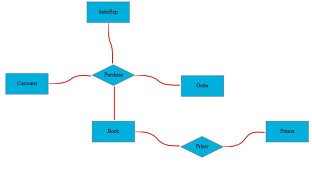
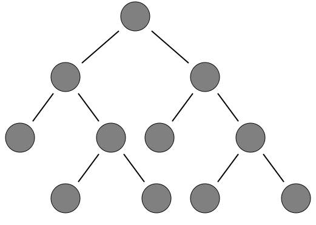
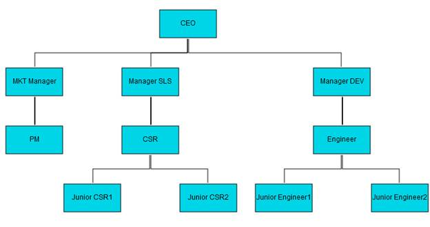

::: {style="DISPLAY: none"}
{#d2h_url_template}{#d2h_package_url style="WIDTH: 0px; DISPLAY: none; HEIGHT: 0px"}
:::

::::: {#nsbanner .d2h_main_nsbanner style="BORDER-BOTTOM: #999999 1px solid; POSITION: relative; PADDING-BOTTOM: 0px; BACKGROUND-COLOR: transparent; PADDING-LEFT: 0px; PADDING-RIGHT: 0px; DISPLAY: none; BORDER-TOP: #999999 1px solid; PADDING-TOP: 0px; LEFT: 0px"}
:::: {#TitleRow .d2h_main_titlerow style="PADDING-BOTTOM: 4px; BACKGROUND-COLOR: transparent; PADDING-LEFT: 22px; WIDTH: 100%; PADDING-RIGHT: 10px; DISPLAY: none; PADDING-TOP: 4px"}
::: {#ienav .d2h_main_ienav style="DISPLAY: none"}
{#D2HPrevious .D2HPreviousEnabled}  {#D2HNext .D2HNextEnabled}
:::
::::
:::::

:::: {#nstext .d2h_main_nstext style="PADDING-BOTTOM: 10px; BACKGROUND-COLOR: transparent; PADDING-LEFT: 22px; PADDING-RIGHT: 10px; HEIGHT: 100%; OVERFLOW: auto; PADDING-TOP: 5px" hasuserbackground="true" valign="bottom"}
::: {#d2h_breadcrumbs .d2h_breadcrumbs}
[Essential Studio User Guide Documentation](ms-xhelp:///?Id=12457748-09e3-4d74-a240-8e049cedf030){.d2h_breadcrumbsNormal}[ \> ]{.d2h_breadcrumbsLinkSeparator}[User Interface Edition](ms-xhelp:///?Id=c29296b7-531c-413b-a0ec-488ca1f7f669){.d2h_breadcrumbsNormal}[ \> ]{.d2h_breadcrumbsLinkSeparator}[Essential ASP.NET MVC](ms-xhelp:///?Id=4b14e7d1-65c4-4f67-b1aa-2c37709905a5){.d2h_breadcrumbsNormal}[ \> ]{.d2h_breadcrumbsLinkSeparator}[Essential Diagram]{.d2h_breadcrumbsContentsOnly}[ \> ]{.d2h_breadcrumbsLinkSeparator}[Concepts and Features](ms-xhelp:///?Id=04839cdf-94fc-4d24-9f6b-119fdbd7bbfb){.d2h_breadcrumbsNormal}[ \> ]{.d2h_breadcrumbsLinkSeparator}[Line Connector](ms-xhelp:///?Id=c7ae1b55-3b10-4b74-889d-cf088e9eca27){.d2h_breadcrumbsNormal}
:::

### Connector Types {#connector-types style="tab-stops: 0pt"}

The **ConnectorType** property specifies the type of connector that is to be used for the connection.

 

Property

+---------------+---------------------------------------------------------------------------------------------------------------+----------------------+--------------------------+--------------------------------------------------+
| Property      | Description                                                                                                   | Type of the Property | Value it Accepts         | Any Other Dependencies/Sub-Properties Associated |
+===============+===============================================================================================================+======================+==========================+==================================================+
| ConnectorType | Gets or sets the connector type to be used.                                                                   | Dependency property  | ConnectorType.Orthogonal | No                                               |
|               |                                                                                                               |                      |                          |                                                  |
|               | Three values namely Orthogonal, Straight and Bezier can be specified. Default Value: ConnectorType.Orthogonal |                      | ConnectorType.Bezier     |                                                  |
|               |                                                                                                               |                      |                          |                                                  |
|               |                                                                                                               |                      | ConnectorType.Straight   |                                                  |
+---------------+---------------------------------------------------------------------------------------------------------------+----------------------+--------------------------+--------------------------------------------------+

 

Three types are supported. 

[·      ]{style="FONT-FAMILY: Symbol"}**Orthogonal** creates a line in which line segments (if any) are placed at right angles to each other.

[·      ]{style="FONT-FAMILY: Symbol"}**Bezier** renders a Bezier curve with two points.

[·      ]{style="FONT-FAMILY: Symbol"}**Straight** renders a line with two points. 

The default type is orthogonal. 

The following code can be used to change the connector type. 

+--------------------------------------------------------------------------------------------------------------------------------------------------------------------------------------------------------------------------------------------+
| **[Controller]{style="FONT-FAMILY: 'Courier New'; FONT-SIZE: 11pt"}**[]{style="FONT-FAMILY: 'Courier New'; FONT-SIZE: 11pt"}                                                                                                               |
|                                                                                                                                                                                                                                            |
| [          LineConnector]{style="FONT-FAMILY: 'Courier New'; COLOR: #2b91af; FONT-SIZE: 11pt"}[ lineConnector = [new]{style="COLOR: blue"} [LineConnector]{style="COLOR: #2b91af"}()]{style="FONT-FAMILY: 'Courier New'; FONT-SIZE: 11pt"} |
|                                                                                                                                                                                                                                            |
| [            {]{style="FONT-FAMILY: 'Courier New'; FONT-SIZE: 11pt"}                                                                                                                                                                       |
|                                                                                                                                                                                                                                            |
| [                Name=name,]{style="FONT-FAMILY: 'Courier New'; FONT-SIZE: 11pt"}                                                                                                                                                          |
|                                                                                                                                                                                                                                            |
| [                HeadNode = headNode,]{style="FONT-FAMILY: 'Courier New'; FONT-SIZE: 11pt"}                                                                                                                                                |
|                                                                                                                                                                                                                                            |
| [                TailNode = tailNode,]{style="FONT-FAMILY: 'Courier New'; FONT-SIZE: 11pt"}                                                                                                                                                |
|                                                                                                                                                                                                                                            |
| [                **ConnectorType = [ConnectorType]{style="COLOR: #2b91af"}.Beizer,**]{style="FONT-FAMILY: 'Courier New'; FONT-SIZE: 11pt"}                                                                                                 |
|                                                                                                                                                                                                                                            |
| [                LineColor = [\"red\"]{style="COLOR: #a31515"},]{style="FONT-FAMILY: 'Courier New'; FONT-SIZE: 11pt"}                                                                                                                      |
|                                                                                                                                                                                                                                            |
| [                LineWidth = 2]{style="FONT-FAMILY: 'Courier New'; FONT-SIZE: 11pt"}                                                                                                                                                       |
|                                                                                                                                                                                                                                            |
| [            };]{style="FONT-FAMILY: 'Courier New'; FONT-SIZE: 11pt"}                                                                                                                                                                      |
+--------------------------------------------------------------------------------------------------------------------------------------------------------------------------------------------------------------------------------------------+

 {border="0"}

Figure 62: Beizer Line Connectors

 

                                  * *

{border="0"}

Figure 63: Straight Line Connectors

 

{border="0"}

Figure 64: Orthogonal Line Connectors[]{style="FONT-STYLE: normal"}

[]{#related-topics}
::::
