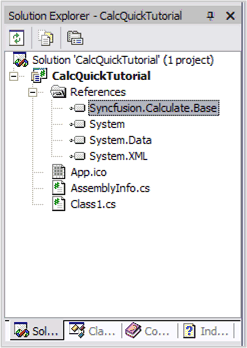
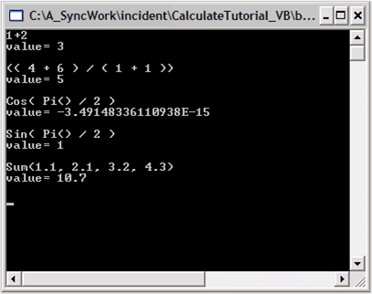

::: {style="DISPLAY: none"}
{#d2h_url_template}{#d2h_package_url style="WIDTH: 0px; DISPLAY: none; HEIGHT: 0px"}
:::

::: {.d2h_secondary_topic style="PADDING-BOTTOM: 10pt; MARGIN: 0pt; PADDING-LEFT: 0pt; PADDING-RIGHT: 0pt; PADDING-TOP: 0pt"}
#### Console Application CalcQuickBase {#console-application-calcquickbase style="tab-stops: 0pt"}

 

The step-by-step procedure to create a simple console application is as follows:

 

1.   From Visual Studio, use File \| New \| Project to create a new Console Application named CalcQuickBaseTutorial. After creating the project, open the References node in the Solution Explorer and add a reference to Syncfusion.Calculate.Base. At this point, your Solution Explorer window should appear similar to this one.

[]{style="FONT-FAMILY: 'Trebuchet MS','sans-serif'; COLOR: #15428b; FONT-SIZE: 9pt"} 

{border="0"}

Figure 15: Essential Calculate Reference Added to the Project

[]{style="FONT-FAMILY: 'Trebuchet MS','sans-serif'; COLOR: #15428b; FONT-SIZE: 9pt"} 

2.   In the Main method, add the code to create a **CalcQuickBase** object. Also add the code to loop through the process of retrieving a string and using **CalcQuickBase.ParseAndCompute** to perform the calculation that is represented by the string. Given below is the code that handles these tasks.

[]{style="FONT-FAMILY: 'Trebuchet MS','sans-serif'; COLOR: #15428b; FONT-SIZE: 9pt"} 

+---------------------------------------------------------------------------------------------------------------------------------------------------------------------------------------------------------------------------------------------------------------------------------------------------------------------+
| **[\[C#\]]{style="FONT-FAMILY: 'Courier New'; COLOR: black"}**                                                                                                                                                                                                                                                      |
|                                                                                                                                                                                                                                                                                                                     |
| []{style="FONT-FAMILY: 'Courier New'; COLOR: #15428b"}                                                                                                                                                                                                                                                              |
|                                                                                                                                                                                                                                                                                                                     |
| [using]{style="FONT-FAMILY: 'Courier New'; COLOR: blue"}[ System;]{style="FONT-FAMILY: 'Courier New'; COLOR: black"}                                                                                                                                                                                                |
|                                                                                                                                                                                                                                                                                                                     |
| [using]{style="FONT-FAMILY: 'Courier New'; COLOR: blue"}[ Syncfusion.Calculate;]{style="FONT-FAMILY: 'Courier New'; COLOR: black"}                                                                                                                                                                                  |
|                                                                                                                                                                                                                                                                                                                     |
| []{style="FONT-FAMILY: 'Courier New'; COLOR: black"}                                                                                                                                                                                                                                                                |
|                                                                                                                                                                                                                                                                                                                     |
| [namespace]{style="FONT-FAMILY: 'Courier New'; COLOR: blue"}[ CalcQuickBaseTutorial]{style="FONT-FAMILY: 'Courier New'; COLOR: black"}                                                                                                                                                                              |
|                                                                                                                                                                                                                                                                                                                     |
| [{]{style="FONT-FAMILY: 'Courier New'; COLOR: black"}                                                                                                                                                                                                                                                               |
|                                                                                                                                                                                                                                                                                                                     |
| [      ]{style="FONT-FAMILY: 'Courier New'; COLOR: black"}[  /// \<summary\>]{style="FONT-FAMILY: 'Courier New'; COLOR: green"}                                                                                                                                                                                     |
|                                                                                                                                                                                                                                                                                                                     |
| [        /// Summary description for Class1.]{style="FONT-FAMILY: 'Courier New'; COLOR: green"}                                                                                                                                                                                                                     |
|                                                                                                                                                                                                                                                                                                                     |
| [        /// \</summary\>]{style="FONT-FAMILY: 'Courier New'; COLOR: green"}                                                                                                                                                                                                                                        |
|                                                                                                                                                                                                                                                                                                                     |
| [        ]{style="FONT-FAMILY: 'Courier New'; COLOR: black"}[class]{style="FONT-FAMILY: 'Courier New'; COLOR: blue"}[ Class1]{style="FONT-FAMILY: 'Courier New'; COLOR: black"}                                                                                                                                     |
|                                                                                                                                                                                                                                                                                                                     |
| [        {]{style="FONT-FAMILY: 'Courier New'; COLOR: black"}                                                                                                                                                                                                                                                       |
|                                                                                                                                                                                                                                                                                                                     |
| [              ]{style="FONT-FAMILY: 'Courier New'; COLOR: black"}[  /// \<summary\>]{style="FONT-FAMILY: 'Courier New'; COLOR: green"}                                                                                                                                                                             |
|                                                                                                                                                                                                                                                                                                                     |
| [                /// The main entry point for the application.]{style="FONT-FAMILY: 'Courier New'; COLOR: green"}                                                                                                                                                                                                   |
|                                                                                                                                                                                                                                                                                                                     |
| [                /// \</summary\>]{style="FONT-FAMILY: 'Courier New'; COLOR: green"}                                                                                                                                                                                                                                |
|                                                                                                                                                                                                                                                                                                                     |
| [                \[STAThread\]]{style="FONT-FAMILY: 'Courier New'; COLOR: black"}                                                                                                                                                                                                                                   |
|                                                                                                                                                                                                                                                                                                                     |
| [               ]{style="FONT-FAMILY: 'Courier New'; COLOR: black"}[ static void]{style="FONT-FAMILY: 'Courier New'; COLOR: blue"}[ Main(]{style="FONT-FAMILY: 'Courier New'; COLOR: black"}[string]{style="FONT-FAMILY: 'Courier New'; COLOR: blue"}[\[\] args)]{style="FONT-FAMILY: 'Courier New'; COLOR: black"} |
|                                                                                                                                                                                                                                                                                                                     |
| [                {]{style="FONT-FAMILY: 'Courier New'; COLOR: black"}                                                                                                                                                                                                                                               |
|                                                                                                                                                                                                                                                                                                                     |
| [                        CalcQuickBase cq = ]{style="FONT-FAMILY: 'Courier New'; COLOR: black"}[new]{style="FONT-FAMILY: 'Courier New'; COLOR: blue"}[ CalcQuickBase();]{style="FONT-FAMILY: 'Courier New'; COLOR: black"}                                                                                          |
|                                                                                                                                                                                                                                                                                                                     |
| []{style="FONT-FAMILY: 'Courier New'; COLOR: black"}                                                                                                                                                                                                                                                                |
|                                                                                                                                                                                                                                                                                                                     |
| [                        ]{style="FONT-FAMILY: 'Courier New'; COLOR: black"}[string]{style="FONT-FAMILY: 'Courier New'; COLOR: blue"}[ s;]{style="FONT-FAMILY: 'Courier New'; COLOR: black"}                                                                                                                        |
|                                                                                                                                                                                                                                                                                                                     |
| [                        ]{style="FONT-FAMILY: 'Courier New'; COLOR: black"}[while]{style="FONT-FAMILY: 'Courier New'; COLOR: blue"}[( (s = Console.ReadLine()) != \"\" )]{style="FONT-FAMILY: 'Courier New'; COLOR: black"}                                                                                        |
|                                                                                                                                                                                                                                                                                                                     |
| [                        {]{style="FONT-FAMILY: 'Courier New'; COLOR: black"}                                                                                                                                                                                                                                       |
|                                                                                                                                                                                                                                                                                                                     |
| [                                ]{style="FONT-FAMILY: 'Courier New'; COLOR: black"}[string]{style="FONT-FAMILY: 'Courier New'; COLOR: blue"}[ val = cq.ParseAndCompute(s);]{style="FONT-FAMILY: 'Courier New'; COLOR: black"}                                                                                      |
|                                                                                                                                                                                                                                                                                                                     |
| [                                Console.WriteLine(\"value= \" + val);]{style="FONT-FAMILY: 'Courier New'; COLOR: black"}                                                                                                                                                                                           |
|                                                                                                                                                                                                                                                                                                                     |
| []{style="FONT-FAMILY: 'Courier New'; COLOR: black"}                                                                                                                                                                                                                                                                |
|                                                                                                                                                                                                                                                                                                                     |
| [                                // Blank line]{style="FONT-FAMILY: 'Courier New'; COLOR: green"}                                                                                                                                                                                                                   |
|                                                                                                                                                                                                                                                                                                                     |
| [                                Console.WriteLine(\"\"); ]{style="FONT-FAMILY: 'Courier New'; COLOR: black"}                                                                                                                                                                                                       |
|                                                                                                                                                                                                                                                                                                                     |
| [                        }]{style="FONT-FAMILY: 'Courier New'; COLOR: black"}                                                                                                                                                                                                                                       |
|                                                                                                                                                                                                                                                                                                                     |
| [                }]{style="FONT-FAMILY: 'Courier New'; COLOR: black"}                                                                                                                                                                                                                                               |
|                                                                                                                                                                                                                                                                                                                     |
| [        }]{style="FONT-FAMILY: 'Courier New'; COLOR: black"}                                                                                                                                                                                                                                                       |
|                                                                                                                                                                                                                                                                                                                     |
| [}]{style="FONT-FAMILY: 'Courier New'; COLOR: black"}                                                                                                                                                                                                                                                               |
+---------------------------------------------------------------------------------------------------------------------------------------------------------------------------------------------------------------------------------------------------------------------------------------------------------------------+

[]{style="FONT-FAMILY: 'Trebuchet MS','sans-serif'; COLOR: #15428b; FONT-SIZE: 9pt"} 

+-----------------------------------------------------------------------------------------------------------------------------------------------------------------------------------------------------------------------------------------------------------------------------------------------------------------------------+
| **[\[VB.NET\]]{style="FONT-FAMILY: 'Courier New'; COLOR: black"}**                                                                                                                                                                                                                                                          |
|                                                                                                                                                                                                                                                                                                                             |
| []{style="FONT-FAMILY: 'Courier New'; COLOR: #15428b"}                                                                                                                                                                                                                                                                      |
|                                                                                                                                                                                                                                                                                                                             |
| [Imports]{style="FONT-FAMILY: 'Courier New'; COLOR: blue"}[ System]{style="FONT-FAMILY: 'Courier New'; COLOR: black"}                                                                                                                                                                                                       |
|                                                                                                                                                                                                                                                                                                                             |
| [Imports]{style="FONT-FAMILY: 'Courier New'; COLOR: blue"}[ Syncfusion.Calculate]{style="FONT-FAMILY: 'Courier New'; COLOR: black"}                                                                                                                                                                                         |
|                                                                                                                                                                                                                                                                                                                             |
| []{style="FONT-FAMILY: 'Courier New'; COLOR: black"}                                                                                                                                                                                                                                                                        |
|                                                                                                                                                                                                                                                                                                                             |
| [Namespace]{style="FONT-FAMILY: 'Courier New'; COLOR: blue"}[ CalcQuickBaseTutorial]{style="FONT-FAMILY: 'Courier New'; COLOR: black"}                                                                                                                                                                                      |
|                                                                                                                                                                                                                                                                                                                             |
| [    ]{style="FONT-FAMILY: 'Courier New'; COLOR: black"}[Class]{style="FONT-FAMILY: 'Courier New'; COLOR: blue"}[ Class1]{style="FONT-FAMILY: 'Courier New'; COLOR: black"}                                                                                                                                                 |
|                                                                                                                                                                                                                                                                                                                             |
| []{style="FONT-FAMILY: 'Courier New'; COLOR: black"}                                                                                                                                                                                                                                                                        |
|                                                                                                                                                                                                                                                                                                                             |
| [       ]{style="FONT-FAMILY: 'Courier New'; COLOR: black"}[ Public Overloads Shared]{style="FONT-FAMILY: 'Courier New'; COLOR: blue"}[ ]{style="FONT-FAMILY: 'Courier New'; COLOR: black"}[Sub]{style="FONT-FAMILY: 'Courier New'; COLOR: blue"}[ Main()]{style="FONT-FAMILY: 'Courier New'; COLOR: black"}                |
|                                                                                                                                                                                                                                                                                                                             |
| [            ]{style="FONT-FAMILY: 'Courier New'; COLOR: black"}[Dim]{style="FONT-FAMILY: 'Courier New'; COLOR: blue"}[ cq ]{style="FONT-FAMILY: 'Courier New'; COLOR: black"}[As New]{style="FONT-FAMILY: 'Courier New'; COLOR: blue"}[ CalcQuickBase]{style="FONT-FAMILY: 'Courier New'; COLOR: black"}                   |
|                                                                                                                                                                                                                                                                                                                             |
| [            ]{style="FONT-FAMILY: 'Courier New'; COLOR: black"}[Dim]{style="FONT-FAMILY: 'Courier New'; COLOR: blue"}[ s ]{style="FONT-FAMILY: 'Courier New'; COLOR: black"}[As String]{style="FONT-FAMILY: 'Courier New'; COLOR: blue"}[ = Console.ReadLine()]{style="FONT-FAMILY: 'Courier New'; COLOR: black"}          |
|                                                                                                                                                                                                                                                                                                                             |
| [           ]{style="FONT-FAMILY: 'Courier New'; COLOR: black"}[ Do While]{style="FONT-FAMILY: 'Courier New'; COLOR: blue"}[ s \<\> \"\"]{style="FONT-FAMILY: 'Courier New'; COLOR: black"}                                                                                                                                 |
|                                                                                                                                                                                                                                                                                                                             |
| [                ]{style="FONT-FAMILY: 'Courier New'; COLOR: black"}[Dim]{style="FONT-FAMILY: 'Courier New'; COLOR: blue"}[ val ]{style="FONT-FAMILY: 'Courier New'; COLOR: black"}[As String]{style="FONT-FAMILY: 'Courier New'; COLOR: blue"}[ = cq.ParseAndCompute(s)]{style="FONT-FAMILY: 'Courier New'; COLOR: black"} |
|                                                                                                                                                                                                                                                                                                                             |
| [                Console.WriteLine((\"value= \" + val))]{style="FONT-FAMILY: 'Courier New'; COLOR: black"}                                                                                                                                                                                                                  |
|                                                                                                                                                                                                                                                                                                                             |
| [                Console.WriteLine(\"\") ]{style="FONT-FAMILY: 'Courier New'; COLOR: black"}                                                                                                                                                                                                                                |
|                                                                                                                                                                                                                                                                                                                             |
| []{style="FONT-FAMILY: 'Courier New'; COLOR: black"}                                                                                                                                                                                                                                                                        |
|                                                                                                                                                                                                                                                                                                                             |
| [                \' Blank line]{style="FONT-FAMILY: 'Courier New'; COLOR: green"}                                                                                                                                                                                                                                           |
|                                                                                                                                                                                                                                                                                                                             |
| [                s = Console.ReadLine()]{style="FONT-FAMILY: 'Courier New'; COLOR: black"}                                                                                                                                                                                                                                  |
|                                                                                                                                                                                                                                                                                                                             |
| [            ]{style="FONT-FAMILY: 'Courier New'; COLOR: black"}[Loop]{style="FONT-FAMILY: 'Courier New'; COLOR: blue"}                                                                                                                                                                                                     |
|                                                                                                                                                                                                                                                                                                                             |
| []{style="FONT-FAMILY: 'Courier New'; COLOR: blue"}                                                                                                                                                                                                                                                                         |
|                                                                                                                                                                                                                                                                                                                             |
| [        ]{style="FONT-FAMILY: 'Courier New'; COLOR: blue"}[\' Main]{style="FONT-FAMILY: 'Courier New'; COLOR: green"}[ ]{style="FONT-FAMILY: 'Courier New'; COLOR: black"}                                                                                                                                                 |
|                                                                                                                                                                                                                                                                                                                             |
| [        ]{style="FONT-FAMILY: 'Courier New'; COLOR: black"}[End Sub]{style="FONT-FAMILY: 'Courier New'; COLOR: blue"}[ ]{style="FONT-FAMILY: 'Courier New'; COLOR: black"}                                                                                                                                                 |
|                                                                                                                                                                                                                                                                                                                             |
| []{style="FONT-FAMILY: 'Courier New'; COLOR: black"}                                                                                                                                                                                                                                                                        |
|                                                                                                                                                                                                                                                                                                                             |
| [    ]{style="FONT-FAMILY: 'Courier New'; COLOR: black"}[\' Class1]{style="FONT-FAMILY: 'Courier New'; COLOR: green"}                                                                                                                                                                                                       |
|                                                                                                                                                                                                                                                                                                                             |
| [  ]{style="FONT-FAMILY: 'Courier New'; COLOR: black"}[  End Class]{style="FONT-FAMILY: 'Courier New'; COLOR: blue"}[ ]{style="FONT-FAMILY: 'Courier New'; COLOR: black"}                                                                                                                                                   |
|                                                                                                                                                                                                                                                                                                                             |
| []{style="FONT-FAMILY: 'Courier New'; COLOR: black"}                                                                                                                                                                                                                                                                        |
|                                                                                                                                                                                                                                                                                                                             |
| [\' CalcQuickBaseTutorial]{style="FONT-FAMILY: 'Courier New'; COLOR: green"}                                                                                                                                                                                                                                                |
|                                                                                                                                                                                                                                                                                                                             |
| [End Namespace]{style="FONT-FAMILY: 'Courier New'; COLOR: blue"}[ ]{style="FONT-FAMILY: 'Courier New'; COLOR: black"}                                                                                                                                                                                                       |
+-----------------------------------------------------------------------------------------------------------------------------------------------------------------------------------------------------------------------------------------------------------------------------------------------------------------------------+

[]{style="FONT-FAMILY: 'Trebuchet MS','sans-serif'; COLOR: #15428b; FONT-SIZE: 9pt"} 

3.   Once the code is entered, run the application by pressing F5. Then enter an expression such as 1+2 and press Enter. Enter additional algebraic combinations of constants and named functions from the Function Library like Sin, Cos, Sum and Pi. Press Enter without entering anything to terminate the program. Below is a typical display of this.

[]{style="FONT-FAMILY: 'Trebuchet MS','sans-serif'; COLOR: #15428b; FONT-SIZE: 9pt"} 

[{border="0"}]{style="FONT-FAMILY: 'Trebuchet MS','sans-serif'; COLOR: #15428b; FONT-SIZE: 9pt"}

**[Figure ]{style="FONT-FAMILY: 'Trebuchet MS','sans-serif'; COLOR: #15428b"}[16]{style="FONT-FAMILY: 'Trebuchet MS','sans-serif'; COLOR: #15428b"}[: Application Display]{style="FONT-FAMILY: 'Trebuchet MS','sans-serif'; COLOR: #15428b"}**[]{style="FONT-FAMILY: 'Trebuchet MS','sans-serif'; COLOR: #15428b"}

 

[]{#p21} 

[]{#related-topics}
:::
