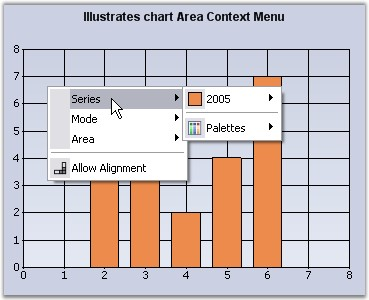
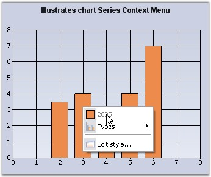
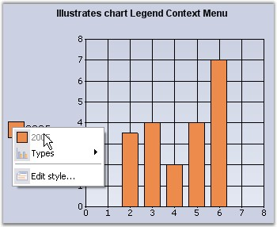

::: {style="DISPLAY: none"}
{#d2h_url_template}{#d2h_package_url style="WIDTH: 0px; DISPLAY: none; HEIGHT: 0px"}
:::

::::: {#nsbanner .d2h_main_nsbanner style="BORDER-BOTTOM: #999999 1px solid; POSITION: relative; PADDING-BOTTOM: 0px; BACKGROUND-COLOR: transparent; PADDING-LEFT: 0px; PADDING-RIGHT: 0px; DISPLAY: none; BORDER-TOP: #999999 1px solid; PADDING-TOP: 0px; LEFT: 0px"}
:::: {#TitleRow .d2h_main_titlerow style="PADDING-BOTTOM: 4px; BACKGROUND-COLOR: transparent; PADDING-LEFT: 22px; WIDTH: 100%; PADDING-RIGHT: 10px; DISPLAY: none; PADDING-TOP: 4px"}
::: {#ienav .d2h_main_ienav style="DISPLAY: none"}
{#D2HPrevious .D2HPreviousEnabled}  {#D2HNext .D2HNextEnabled}
:::
::::
:::::

:::: {#nstext .d2h_main_nstext style="PADDING-BOTTOM: 10px; BACKGROUND-COLOR: transparent; PADDING-LEFT: 22px; PADDING-RIGHT: 10px; HEIGHT: 100%; OVERFLOW: auto; PADDING-TOP: 5px" hasuserbackground="true" valign="bottom"}
::: {#d2h_breadcrumbs .d2h_breadcrumbs}
[Essential Studio User Guide Documentation](ms-xhelp:///?Id=12457748-09e3-4d74-a240-8e049cedf030){.d2h_breadcrumbsNormal}[ \> ]{.d2h_breadcrumbsLinkSeparator}[User Interface Edition](ms-xhelp:///?Id=c29296b7-531c-413b-a0ec-488ca1f7f669){.d2h_breadcrumbsNormal}[ \> ]{.d2h_breadcrumbsLinkSeparator}[Essential Windows](ms-xhelp:///?Id=e60759d8-47a4-4570-9d7a-16a68d63f2ea){.d2h_breadcrumbsNormal}[ \> ]{.d2h_breadcrumbsLinkSeparator}[Essential Chart]{.d2h_breadcrumbsContentsOnly}[ \> ]{.d2h_breadcrumbsLinkSeparator}[Concepts and Features](ms-xhelp:///?Id=71321e9c-336c-4c1c-a127-be9f135ad4bb){.d2h_breadcrumbsNormal}[ \> ]{.d2h_breadcrumbsLinkSeparator}[Runtime Features](ms-xhelp:///?Id=90d48bbb-6229-484d-9d3e-31e26c59f1d3){.d2h_breadcrumbsNormal}
:::

### Context Menu {#context-menu style="tab-stops: 0pt"}

 

Chart Area and Series Context menu

 

The chart has a built-in context menu, which can be enabled by setting the **ShowContextMenu** property to **true**. This context menu will let the user change the chart type on a series, enable zooming, switch between 2D and 3D modes and so on.

 

There are two types of context menus, both of which get shown by default when the above property is set to **true**.

 

1.   Chart Area context menu - This will be displayed when the mouse is over the chart area.

 

{border="0"}

 

Figure 301: **[Chart Area Context Menu]{style="FONT-STYLE: normal"}**

 

This context menu can be disabled by setting the **DisplayChartContextMenu** property to **false**.

 

2.   Chart Series context menu - This will be displayed when the mouse is over a series.

**[]{style="COLOR: red; FONT-SIZE: 8pt"}** 

{border="0"}

**** 

Figure 302: Chart Series Context Menu

 

This context menu can be disabled by setting the **DisplaySeriesContextMenu** property to **false**.

 

Legend Context Menu

 

This context menu can be enabled by setting the **ShowContextMenuInLegend** property to **true**.

 

{border="0"}

**** 

Figure 303: Legend Context Menu

 

[]{#p202} 

[]{#related-topics}
::::
