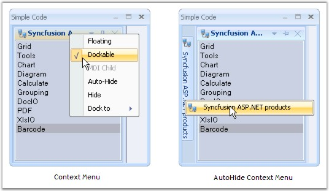
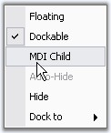
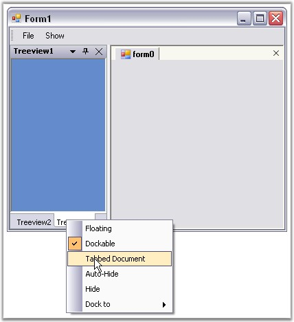

::: {style="DISPLAY: none"}
{#d2h_url_template}{#d2h_package_url style="WIDTH: 0px; DISPLAY: none; HEIGHT: 0px"}
:::

:::: {.d2h_secondary_topic style="PADDING-BOTTOM: 10pt; MARGIN: 0pt; PADDING-LEFT: 0pt; PADDING-RIGHT: 0pt; PADDING-TOP: 0pt"}
##### Context Menu {#context-menu style="tab-stops: 0pt"}

[]{style="COLOR: #15428b"} 

A context menu will be displayed whenever the user right clicks the caption bar or clicks the menu button in the caption bar. EnableContextMenu property should be true for displaying the context menu. By default it is true.

 

When the docked control is in autohide mode and when the auto hide tab is right-clicked, an unique context menu will be displayed, similar to Visual Studio. EnableAutoHideTabContextMenu property should be true for this. By default this value is true.

[]{style="COLOR: #15428b"} 

+---------------------------------------------------------------------------------------------------------------------------------------------------------------------------+
| **[\[C#\]]{style="FONT-FAMILY: 'Courier New'; COLOR: black"}**                                                                                                            |
|                                                                                                                                                                           |
| []{style="FONT-FAMILY: 'Courier New'; COLOR: green"}                                                                                                                      |
|                                                                                                                                                                           |
| [this]{style="FONT-FAMILY: 'Courier New'; COLOR: blue"}[.dockingManager1.EnableContextMenu = [true]{style="COLOR: blue"};]{style="FONT-FAMILY: 'Courier New'"}            |
|                                                                                                                                                                           |
| [this]{style="FONT-FAMILY: 'Courier New'; COLOR: blue"}[.dockingManager1.EnableAutoHideTabContextMenu = [true]{style="COLOR: blue"};]{style="FONT-FAMILY: 'Courier New'"} |
+---------------------------------------------------------------------------------------------------------------------------------------------------------------------------+

[]{style="COLOR: #15428b"} 

+------------------------------------------------------------------------------------------------------------------------------------------------------------------------+
| **[\[VB.NET\]]{style="FONT-FAMILY: 'Courier New'; COLOR: black"}**                                                                                                     |
|                                                                                                                                                                        |
| []{style="FONT-FAMILY: 'Courier New'; COLOR: green"}                                                                                                                   |
|                                                                                                                                                                        |
| [Me]{style="FONT-FAMILY: 'Courier New'; COLOR: blue"}[.dockingManager1.EnableContextMenu = [True]{style="COLOR: blue"}]{style="FONT-FAMILY: 'Courier New'"}            |
|                                                                                                                                                                        |
| [Me]{style="FONT-FAMILY: 'Courier New'; COLOR: blue"}[.dockingManager1.EnableAutoHideTabContextMenu = [True]{style="COLOR: blue"}]{style="FONT-FAMILY: 'Courier New'"} |
+------------------------------------------------------------------------------------------------------------------------------------------------------------------------+

**[]{style="COLOR: #15428b"}** 

The below images illustrates context menu features.

**[]{style="COLOR: #15428b"}** 

{border="0"}

[]{style="COLOR: #15428b"} 

Figure 69: Docking Manager Context Menu

**[       ]{style="COLOR: #15428b"}**

::: {style="BORDER-BOTTOM: windowtext 1pt solid; BORDER-LEFT: medium none; PADDING-BOTTOM: 1pt; MARGIN-TOP: 9pt; PADDING-LEFT: 0pt; PADDING-RIGHT: 0pt; MARGIN-BOTTOM: 9pt; BORDER-TOP: windowtext 1pt solid; BORDER-RIGHT: medium none; PADDING-TOP: 1pt"}
{border="0"} Note: If MDIContainer property of the form is set to true, then the context menu will include MDI child option. You can observe that the MDI Child option is disabled for the above image. This is because MDIContainer property is false for this case.
:::

[]{style="COLOR: #15428b"} 

{border="0"}

**[]{style="COLOR: #15428b"}** 

Figure 70: Context Menu displaying MDI Child option, when MDIContainer = \"True\"

**[]{style="COLOR: #15428b"}** 

Context Menu for TabbedControls

**[]{style="COLOR: #15428b"}** 

Context menu for the tabbed controls is similar to the default context menu like the above image. When TabbedMDIManager component is used, context menu will include TabbedDocument instead of MDI child.

[]{style="COLOR: #15428b"} 

{border="0"}

***[]{style="COLOR: #15428b"}*** 

Figure 71: Context Menu for Tabbed Controls

**[]{style="COLOR: #15428b"}** 

See Also

**[]{style="COLOR: #15428b"}** 

[Dock Context Menu Event]{.UGHyperlink}[, ]{.UGHyperlink}[How to display context menu of a docked control at a specified point?]{.UGHyperlink}[]{.UGHyperlink}

[]{#related-topics}
::::
