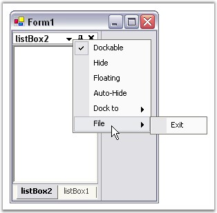

::: {style="DISPLAY: none"}
{#d2h_url_template}{#d2h_package_url style="WIDTH: 0px; DISPLAY: none; HEIGHT: 0px"}
:::

:::::: {.d2h_secondary_topic style="PADDING-BOTTOM: 10pt; MARGIN: 0pt; PADDING-LEFT: 0pt; PADDING-RIGHT: 0pt; PADDING-TOP: 0pt"}
##### Context Menu {#context-menu style="tab-stops: 0pt"}

[]{style="COLOR: #15428b"} 

This section covers the following events:

[]{style="COLOR: #15428b"} 

###### []{#_AutoHideTabContextMenu_Event}3.2.3.8.3.1 AutoHideTabContextMenu Event {#autohidetabcontextmenu-event style="tab-stops: 0pt"}

[]{style="COLOR: #15428b"} 

This event occurs when the right mouse button is clicked over a autohidden tab control.

[]{style="COLOR: #15428b"} 

Event Data

**[]{style="COLOR: #15428b"}** 

The event handler receives an argument of type AutoHideTabContextMenuEventArgs containing data related to this event. The following AutoHideTabContextMenuEventArgs properties provide information specific to this event.

[]{style="COLOR: #15428b"} 

::: {align="center"}
  ------------- ------------------------------------------------------------
  Members       Description
  ContextMenu   Gets / sets the context menu to be displayed.
  DockBorder    This returns the side to where the AutoHideTab is aligned.
  ------------- ------------------------------------------------------------
:::

[]{style="COLOR: #15428b"} 

+------------------------------------------------------------------------------------------------------------------------------------------------------------------------------------------------------------------------------------------------------------------------------------------------------------------------------------------------------+
| **[\[C#\]]{style="FONT-FAMILY: 'Courier New'; COLOR: black"}**                                                                                                                                                                                                                                                                                       |
|                                                                                                                                                                                                                                                                                                                                                      |
| **[]{style="FONT-FAMILY: 'Courier New'; COLOR: black"}**                                                                                                                                                                                                                                                                                             |
|                                                                                                                                                                                                                                                                                                                                                      |
| [private void ]{style="FONT-FAMILY: 'Courier New'; COLOR: blue"}[dockingManager1_AutoHideTabContextMenu(]{style="FONT-FAMILY: 'Courier New'; COLOR: black"}[object ]{style="FONT-FAMILY: 'Courier New'; COLOR: blue"}[sender, Syncfusion.Windows.Forms.Tools.AutoHideTabContextMenuEventArgs arg)]{style="FONT-FAMILY: 'Courier New'; COLOR: black"} |
|                                                                                                                                                                                                                                                                                                                                                      |
| [{]{style="FONT-FAMILY: 'Courier New'; COLOR: black"}                                                                                                                                                                                                                                                                                                |
|                                                                                                                                                                                                                                                                                                                                                      |
| [// You can see the below line in output window during runtime.]{style="FONT-FAMILY: 'Courier New'; COLOR: #008100"}                                                                                                                                                                                                                                 |
|                                                                                                                                                                                                                                                                                                                                                      |
| [Console.WriteLine(\"AutoHideTabContextMenu event is raised\");]{style="FONT-FAMILY: 'Courier New'; COLOR: black"}                                                                                                                                                                                                                                   |
|                                                                                                                                                                                                                                                                                                                                                      |
| [}]{style="FONT-FAMILY: 'Courier New'; COLOR: black"}                                                                                                                                                                                                                                                                                                |
+------------------------------------------------------------------------------------------------------------------------------------------------------------------------------------------------------------------------------------------------------------------------------------------------------------------------------------------------------+

[]{style="COLOR: #15428b"} 

+-----------------------------------------------------------------------------------------------------------------------------------------------------------------------------------------------------------------------------------------------------------------------------------------------------------------------------------------------------------------------------------------------------------------------------------------------------------------------------+
| **[\[VB.NET\]]{style="FONT-FAMILY: 'Courier New'; COLOR: black"}**                                                                                                                                                                                                                                                                                                                                                                                                          |
|                                                                                                                                                                                                                                                                                                                                                                                                                                                                             |
| **[]{style="FONT-FAMILY: 'Courier New'; COLOR: black"}**                                                                                                                                                                                                                                                                                                                                                                                                                    |
|                                                                                                                                                                                                                                                                                                                                                                                                                                                                             |
| [Private Sub ]{style="FONT-FAMILY: 'Courier New'; COLOR: blue"}[dockingManager1_AutoHideTabContextMenu(]{style="FONT-FAMILY: 'Courier New'; COLOR: black"}[ByVal]{style="FONT-FAMILY: 'Courier New'; COLOR: blue"}[ sender [As]{style="COLOR: blue"} [Object]{style="COLOR: blue"}, [ByVal]{style="COLOR: blue"} arg [As]{style="COLOR: blue"} Syncfusion.Windows.Forms.Tools.[AutoHideTabContextMenuEventArgs)]{style="COLOR: black"}]{style="FONT-FAMILY: 'Courier New'"} |
|                                                                                                                                                                                                                                                                                                                                                                                                                                                                             |
| [\' You can see the below line in output window during runtime.]{style="FONT-FAMILY: 'Courier New'; COLOR: #008100"}                                                                                                                                                                                                                                                                                                                                                        |
|                                                                                                                                                                                                                                                                                                                                                                                                                                                                             |
| [Console.WriteLine(\"AutoHideTabContextMenu event is raised\")]{style="FONT-FAMILY: 'Courier New'; COLOR: black"}                                                                                                                                                                                                                                                                                                                                                           |
|                                                                                                                                                                                                                                                                                                                                                                                                                                                                             |
| [End]{style="FONT-FAMILY: 'Courier New'; COLOR: blue"}[ [Sub]{style="COLOR: blue"}]{style="FONT-FAMILY: 'Courier New'"}                                                                                                                                                                                                                                                                                                                                                     |
+-----------------------------------------------------------------------------------------------------------------------------------------------------------------------------------------------------------------------------------------------------------------------------------------------------------------------------------------------------------------------------------------------------------------------------------------------------------------------------+

###### []{#p93}[]{#_DockContextMenu_Event}3.2.3.8.3.2 DockContextMenu Event {#dockcontextmenu-event style="tab-stops: 0pt"}

[]{style="COLOR: #15428b"} 

The DockContextMenu event is fired when the mouse is right-clicked over a docking window\'s caption.

[]{style="COLOR: #15428b"} 

Event Data

**[]{style="COLOR: #15428b"}** 

The event handler receives an argument of type DockContextMenuEventArgs containing data related to this event. The following DockContextMenuEventArgs properties provide information specific to this event.

[]{style="COLOR: #15428b"} 

::: {align="center"}
  ------------- -------------------------------------------------------
  Members       Description
  ContextMenu   Gets or sets the context menu to be displayed.
  Owner         Gets the control that is displaying the context menu.
  ------------- -------------------------------------------------------
:::

[]{style="COLOR: #15428b"} 

Editing the context menu of a Docked Control

**[]{style="COLOR: #15428b"}** 

The DockContextMenuEventArgs allows us to,

[]{style="COLOR: #15428b"} 

[·      ]{style="FONT-FAMILY: Symbol"}Edit the context menu that appears when right clicked on the caption bar (Using DockContextMenuEventArgs.ContextMenu).

[·      ]{style="FONT-FAMILY: Symbol"}Retrieve the control that is displaying the context menu (Using DockContextMenuEventArgs.Owner).

[]{style="COLOR: #15428b"} 

Create a simple docking window. Add the required name spaces. Declare and initialize the bar items to be placed in the context menu as shown in the code below.

[]{style="COLOR: #15428b"} 

+-----------------------------------------------------------------------------------------------------------------------------------------------------------------------------------------------------------------------------------------------------------------------------------------------------------+
| **[\[C#\]]{style="FONT-FAMILY: 'Courier New'; COLOR: black"}**                                                                                                                                                                                                                                            |
|                                                                                                                                                                                                                                                                                                           |
| **[]{style="FONT-FAMILY: 'Courier New'; COLOR: black"}**                                                                                                                                                                                                                                                  |
|                                                                                                                                                                                                                                                                                                           |
| [//Adding namespaces]{style="FONT-FAMILY: 'Courier New'; COLOR: green"}                                                                                                                                                                                                                                   |
|                                                                                                                                                                                                                                                                                                           |
| [using]{style="FONT-FAMILY: 'Courier New'; COLOR: blue"}[ Syncfusion.Windows.Forms.Tools.XPMenus;]{style="FONT-FAMILY: 'Courier New'"}                                                                                                                                                                    |
|                                                                                                                                                                                                                                                                                                           |
| []{style="FONT-FAMILY: 'Courier New'"}                                                                                                                                                                                                                                                                    |
|                                                                                                                                                                                                                                                                                                           |
| [//Declaring the bar items]{style="FONT-FAMILY: 'Courier New'; COLOR: green"}                                                                                                                                                                                                                             |
|                                                                                                                                                                                                                                                                                                           |
| [private]{style="FONT-FAMILY: 'Courier New'; COLOR: blue"}[ Syncfusion.Windows.Forms.Tools.XPMenus.BarItem bar1;]{style="FONT-FAMILY: 'Courier New'"}                                                                                                                                                     |
|                                                                                                                                                                                                                                                                                                           |
| [private]{style="FONT-FAMILY: 'Courier New'; COLOR: blue"}[ Syncfusion.Windows.Forms.Tools.XPMenus.ParentBarItem pbiFile;]{style="FONT-FAMILY: 'Courier New'"}                                                                                                                                            |
|                                                                                                                                                                                                                                                                                                           |
| []{style="FONT-FAMILY: 'Courier New'"}                                                                                                                                                                                                                                                                    |
|                                                                                                                                                                                                                                                                                                           |
| [//Initialize and set the properties.]{style="FONT-FAMILY: 'Courier New'; COLOR: green"}                                                                                                                                                                                                                  |
|                                                                                                                                                                                                                                                                                                           |
| [this]{style="FONT-FAMILY: 'Courier New'; COLOR: blue"}[.pbiFile = [new]{style="COLOR: blue"} Syncfusion.Windows.Forms.Tools.XPMenus.ParentBarItem();]{style="FONT-FAMILY: 'Courier New'"}                                                                                                                |
|                                                                                                                                                                                                                                                                                                           |
| [this]{style="FONT-FAMILY: 'Courier New'; COLOR: blue"}[.bar1 = [new]{style="COLOR: blue"} Syncfusion.Windows.Forms.Tools.XPMenus.BarItem();]{style="FONT-FAMILY: 'Courier New'"}                                                                                                                         |
|                                                                                                                                                                                                                                                                                                           |
| [this]{style="FONT-FAMILY: 'Courier New'; COLOR: blue"}[.pbiFile.Text = \"File\";]{style="FONT-FAMILY: 'Courier New'"}                                                                                                                                                                                    |
|                                                                                                                                                                                                                                                                                                           |
| [this]{style="FONT-FAMILY: 'Courier New'; COLOR: blue"}[.bar1.Text = \"Exit\";]{style="FONT-FAMILY: 'Courier New'"}                                                                                                                                                                                       |
|                                                                                                                                                                                                                                                                                                           |
| [this]{style="FONT-FAMILY: 'Courier New'; COLOR: blue"}[.pbiFile.Items.AddRange([new]{style="COLOR: blue"} Syncfusion.Windows.Forms.Tools.XPMenus.BarItem\[\] {]{style="FONT-FAMILY: 'Courier New'"}[this]{style="FONT-FAMILY: 'Courier New'; COLOR: blue"}[.bar1});]{style="FONT-FAMILY: 'Courier New'"} |
|                                                                                                                                                                                                                                                                                                           |
| [//Call the event]{style="FONT-FAMILY: 'Courier New'; COLOR: green"}                                                                                                                                                                                                                                      |
|                                                                                                                                                                                                                                                                                                           |
| [this]{style="FONT-FAMILY: 'Courier New'; COLOR: blue"}[.dockingManager1.DockContextMenu += [new]{style="COLOR: blue"} Syncfusion.Windows.Forms.Tools.DockContextMenuEventHandler([this]{style="COLOR: blue"}.dockingManager1_DockContextMenu);]{style="FONT-FAMILY: 'Courier New'"}                      |
|                                                                                                                                                                                                                                                                                                           |
| []{style="FONT-FAMILY: 'Courier New'"}                                                                                                                                                                                                                                                                    |
|                                                                                                                                                                                                                                                                                                           |
| [private]{style="FONT-FAMILY: 'Courier New'; COLOR: blue"}[ [void]{style="COLOR: blue"} dockingManager1_DockContextMenu([object]{style="COLOR: blue"} sender, Syncfusion.Windows.Forms.Tools.DockContextMenuEventArgs arg)]{style="FONT-FAMILY: 'Courier New'"}                                           |
|                                                                                                                                                                                                                                                                                                           |
| [{]{style="FONT-FAMILY: 'Courier New'"}                                                                                                                                                                                                                                                                   |
|                                                                                                                                                                                                                                                                                                           |
| [    arg.ContextMenu.ParentBarItem.Items.Add([this]{style="COLOR: blue"}.pbiFile);]{style="FONT-FAMILY: 'Courier New'"}                                                                                                                                                                                   |
|                                                                                                                                                                                                                                                                                                           |
| [}]{style="FONT-FAMILY: 'Courier New'"}                                                                                                                                                                                                                                                                   |
+-----------------------------------------------------------------------------------------------------------------------------------------------------------------------------------------------------------------------------------------------------------------------------------------------------------+

[]{style="COLOR: #15428b"} 

+------------------------------------------------------------------------------------------------------------------------------------------------------------------------------------------------------------------------------------------------------------------------------------------------------------------------------------------------------------------------------------------------------+
| **[\[VB.NET\]]{style="FONT-FAMILY: 'Courier New'; COLOR: black"}**                                                                                                                                                                                                                                                                                                                                   |
|                                                                                                                                                                                                                                                                                                                                                                                                      |
| **[]{style="FONT-FAMILY: 'Courier New'; COLOR: black"}**                                                                                                                                                                                                                                                                                                                                             |
|                                                                                                                                                                                                                                                                                                                                                                                                      |
| [\' Adding Namespace]{style="FONT-FAMILY: 'Courier New'; COLOR: green"}                                                                                                                                                                                                                                                                                                                              |
|                                                                                                                                                                                                                                                                                                                                                                                                      |
| [Imports]{style="FONT-FAMILY: 'Courier New'; COLOR: blue"}[ Syncfusion.Windows.Forms.Tools.XPMenus]{style="FONT-FAMILY: 'Courier New'"}                                                                                                                                                                                                                                                              |
|                                                                                                                                                                                                                                                                                                                                                                                                      |
| []{style="FONT-FAMILY: 'Courier New'"}                                                                                                                                                                                                                                                                                                                                                               |
|                                                                                                                                                                                                                                                                                                                                                                                                      |
| [\'Declaration]{style="FONT-FAMILY: 'Courier New'; COLOR: green"}                                                                                                                                                                                                                                                                                                                                    |
|                                                                                                                                                                                                                                                                                                                                                                                                      |
| [Private]{style="FONT-FAMILY: 'Courier New'; COLOR: blue"}[ pbiFile [As]{style="COLOR: blue"} Syncfusion.Windows.Forms.Tools.XPMenus.ParentBarItem]{style="FONT-FAMILY: 'Courier New'"}                                                                                                                                                                                                              |
|                                                                                                                                                                                                                                                                                                                                                                                                      |
| [Private]{style="FONT-FAMILY: 'Courier New'; COLOR: blue"}[ [WithEvents]{style="COLOR: blue"} bar1 [As]{style="COLOR: blue"} Syncfusion.Windows.Forms.Tools.XPMenus.BarItem]{style="FONT-FAMILY: 'Courier New'"}                                                                                                                                                                                     |
|                                                                                                                                                                                                                                                                                                                                                                                                      |
| [\'Initialize and set the properties]{style="FONT-FAMILY: 'Courier New'; COLOR: green"}                                                                                                                                                                                                                                                                                                              |
|                                                                                                                                                                                                                                                                                                                                                                                                      |
| [Me]{style="FONT-FAMILY: 'Courier New'; COLOR: blue"}[.pbiFile = [New]{style="COLOR: blue"} Syncfusion.Windows.Forms.Tools.XPMenus.ParentBarItem()]{style="FONT-FAMILY: 'Courier New'"}                                                                                                                                                                                                              |
|                                                                                                                                                                                                                                                                                                                                                                                                      |
| [Me]{style="FONT-FAMILY: 'Courier New'; COLOR: blue"}[.bar1 = [New]{style="COLOR: blue"} Syncfusion.Windows.Forms.Tools.XPMenus.BarItem()]{style="FONT-FAMILY: 'Courier New'"}                                                                                                                                                                                                                       |
|                                                                                                                                                                                                                                                                                                                                                                                                      |
| [Me]{style="FONT-FAMILY: 'Courier New'; COLOR: blue"}[.pbiFile.Text = \"File\"]{style="FONT-FAMILY: 'Courier New'"}                                                                                                                                                                                                                                                                                  |
|                                                                                                                                                                                                                                                                                                                                                                                                      |
| [Me]{style="FONT-FAMILY: 'Courier New'; COLOR: blue"}[.bar1.Text = \"Exit\"]{style="FONT-FAMILY: 'Courier New'"}                                                                                                                                                                                                                                                                                     |
|                                                                                                                                                                                                                                                                                                                                                                                                      |
| [Me]{style="FONT-FAMILY: 'Courier New'; COLOR: blue"}[.pbiFile.Items.AddRange([New]{style="COLOR: blue"} Syncfusion.Windows.Forms.Tools.XPMenus.BarItem() { [Me]{style="COLOR: blue"}.bar1})]{style="FONT-FAMILY: 'Courier New'"}                                                                                                                                                                    |
|                                                                                                                                                                                                                                                                                                                                                                                                      |
| []{style="FONT-FAMILY: 'Courier New'"}                                                                                                                                                                                                                                                                                                                                                               |
|                                                                                                                                                                                                                                                                                                                                                                                                      |
| [//handling the event]{style="FONT-FAMILY: 'Courier New'; COLOR: green"}                                                                                                                                                                                                                                                                                                                             |
|                                                                                                                                                                                                                                                                                                                                                                                                      |
| [Private]{style="FONT-FAMILY: 'Courier New'; COLOR: blue"}[ [Sub]{style="COLOR: blue"} dockingManager1_DockContextMenu([ByVal]{style="COLOR: blue"} sender [As]{style="COLOR: blue"} [Object]{style="COLOR: blue"}, [ByVal]{style="COLOR: blue"} arg [As]{style="COLOR: blue"} Syncfusion.Windows.Forms.Tools.[DockContextMenuEventArgs]{style="COLOR: black"})]{style="FONT-FAMILY: 'Courier New'"} |
|                                                                                                                                                                                                                                                                                                                                                                                                      |
| [arg.ContextMenu.ParentBarItem.Items.Add([Me]{style="COLOR: blue"}.pbiFile)]{style="FONT-FAMILY: 'Courier New'"}                                                                                                                                                                                                                                                                                     |
|                                                                                                                                                                                                                                                                                                                                                                                                      |
| [End]{style="FONT-FAMILY: 'Courier New'; COLOR: blue"}[ [Sub]{style="COLOR: blue"}]{style="FONT-FAMILY: 'Courier New'"}                                                                                                                                                                                                                                                                              |
+------------------------------------------------------------------------------------------------------------------------------------------------------------------------------------------------------------------------------------------------------------------------------------------------------------------------------------------------------------------------------------------------------+

[]{style="COLOR: #15428b"} 

{border="0"}

[]{style="COLOR: #15428b"} 

Figure 100: Context Menu Items Added

**[]{style="COLOR: #15428b"}** 

See Also

**[]{style="COLOR: #15428b"}** 

[Context Menu]{.UGHyperlink}[]{.UGHyperlink}

 

[]{#p94} 

###### []{#_DocMenuClick_Event}3.2.3.8.3.3 DocMenuClick Event {#docmenuclick-event style="tab-stops: 0pt"}

[]{style="COLOR: #15428b"} 

DockMenuClick event is fired, when the redock context menu item has been clicked. The menu button available for the docked controls, provides options for changing the docking position. Whenever the user tries to redock the control to some other position, DockMenuClick event will be triggered. The options provided are left, top, right and bottom. The redocked style can be displayed using the below code.

[]{style="COLOR: #15428b"} 

Event Data

**[]{style="COLOR: #15428b"}** 

The DockMenuClickEventHandler receives an argument of type DockMenuClickEventArgs containing data related to this event. The following DockMenuClickEventArgs properties provide information specific to this event.

[]{style="COLOR: #15428b"} 

::: {align="center"}
  -------------- ------------------------------------
  Members        Description
  DockingStyle   Returns the docking of the window.
  -------------- ------------------------------------
:::

[]{style="COLOR: #15428b"} 

+-------------------------------------------------------------------------------------------------------------------------------------------------------------------------------------------------------------------------------------------------------------------------------------------------------------------------------------------------------------------------------------------------+
| **[\[C#\]]{style="FONT-FAMILY: 'Courier New'; COLOR: black"}**                                                                                                                                                                                                                                                                                                                                  |
|                                                                                                                                                                                                                                                                                                                                                                                                 |
| **[]{style="FONT-FAMILY: 'Courier New'; COLOR: black"}**                                                                                                                                                                                                                                                                                                                                        |
|                                                                                                                                                                                                                                                                                                                                                                                                 |
| [private void ]{style="FONT-FAMILY: 'Courier New'; COLOR: blue"}[dockingManager1_DocMenuClick(]{style="FONT-FAMILY: 'Courier New'; COLOR: black"}[object ]{style="FONT-FAMILY: 'Courier New'; COLOR: blue"}[sender, Syncfusion.Windows.Forms.Tools.]{style="FONT-FAMILY: 'Courier New'; COLOR: black"}[DockMenuClickEventArgs[ arg)]{style="COLOR: black"}]{style="FONT-FAMILY: 'Courier New'"} |
|                                                                                                                                                                                                                                                                                                                                                                                                 |
| [{]{style="FONT-FAMILY: 'Courier New'; COLOR: black"}                                                                                                                                                                                                                                                                                                                                           |
|                                                                                                                                                                                                                                                                                                                                                                                                 |
| [// You can see the below line in output window during runtime.]{style="FONT-FAMILY: 'Courier New'; COLOR: #008100"}                                                                                                                                                                                                                                                                            |
|                                                                                                                                                                                                                                                                                                                                                                                                 |
| [Console.WriteLine(\"Dock Menu Click event is raised\");]{style="FONT-FAMILY: 'Courier New'; COLOR: black"}                                                                                                                                                                                                                                                                                     |
|                                                                                                                                                                                                                                                                                                                                                                                                 |
| [//Display the Docking Style]{style="FONT-FAMILY: 'Courier New'; COLOR: green"}                                                                                                                                                                                                                                                                                                                 |
|                                                                                                                                                                                                                                                                                                                                                                                                 |
| [Console]{style="FONT-FAMILY: 'Courier New'; COLOR: teal"}[.WriteLine([\"DockingStyle : \"]{style="COLOR: maroon"} + arg.DockingStyle.ToString());]{style="FONT-FAMILY: 'Courier New'"}                                                                                                                                                                                                         |
|                                                                                                                                                                                                                                                                                                                                                                                                 |
| [}]{style="FONT-FAMILY: 'Courier New'; COLOR: black"}                                                                                                                                                                                                                                                                                                                                           |
+-------------------------------------------------------------------------------------------------------------------------------------------------------------------------------------------------------------------------------------------------------------------------------------------------------------------------------------------------------------------------------------------------+

[]{style="COLOR: #15428b"} 

+----------------------------------------------------------------------------------------------------------------------------------------------------------------------------------------------------------------------------------------------------------------------------------------------------------------------------------------------------------------------------------------------------------------------------------------------------------+
| **[\[VB.NET\]]{style="FONT-FAMILY: 'Courier New'; COLOR: black"}**                                                                                                                                                                                                                                                                                                                                                                                       |
|                                                                                                                                                                                                                                                                                                                                                                                                                                                          |
| **[]{style="FONT-FAMILY: 'Courier New'; COLOR: black"}**                                                                                                                                                                                                                                                                                                                                                                                                 |
|                                                                                                                                                                                                                                                                                                                                                                                                                                                          |
| [Private Sub ]{style="FONT-FAMILY: 'Courier New'; COLOR: blue"}[dockingManager1_DocMenuClick(]{style="FONT-FAMILY: 'Courier New'; COLOR: black"}[ByVal]{style="FONT-FAMILY: 'Courier New'; COLOR: blue"}[ sender [As]{style="COLOR: blue"} [Object]{style="COLOR: blue"}, [ByVal]{style="COLOR: blue"} arg [As]{style="COLOR: blue"} Syncfusion.Windows.Forms.Tools.DockMenuClickEventArgs[)]{style="COLOR: black"}]{style="FONT-FAMILY: 'Courier New'"} |
|                                                                                                                                                                                                                                                                                                                                                                                                                                                          |
| [\' You can see the below line in output window during runtime.]{style="FONT-FAMILY: 'Courier New'; COLOR: #008100"}                                                                                                                                                                                                                                                                                                                                     |
|                                                                                                                                                                                                                                                                                                                                                                                                                                                          |
| [Console.WriteLine(\"Dock Menu click event is raised\")]{style="FONT-FAMILY: 'Courier New'; COLOR: black"}                                                                                                                                                                                                                                                                                                                                               |
|                                                                                                                                                                                                                                                                                                                                                                                                                                                          |
| [\'Display the Docking Style]{style="FONT-FAMILY: 'Courier New'; COLOR: green"}                                                                                                                                                                                                                                                                                                                                                                          |
|                                                                                                                                                                                                                                                                                                                                                                                                                                                          |
| [Console]{style="FONT-FAMILY: 'Courier New'; COLOR: teal"}[.WriteLine([\"DockingStyle : \"]{style="COLOR: maroon"} + arg.DockingStyle.ToString());]{style="FONT-FAMILY: 'Courier New'"}                                                                                                                                                                                                                                                                  |
|                                                                                                                                                                                                                                                                                                                                                                                                                                                          |
| [End]{style="FONT-FAMILY: 'Courier New'; COLOR: blue"}[ [Sub]{style="COLOR: blue"}]{style="FONT-FAMILY: 'Courier New'"}                                                                                                                                                                                                                                                                                                                                  |
+----------------------------------------------------------------------------------------------------------------------------------------------------------------------------------------------------------------------------------------------------------------------------------------------------------------------------------------------------------------------------------------------------------------------------------------------------------+

[]{#related-topics}
::::::
