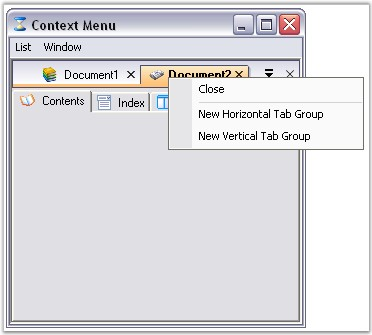
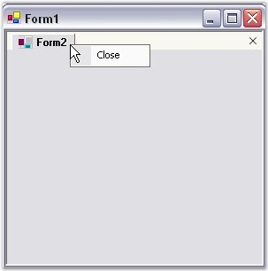
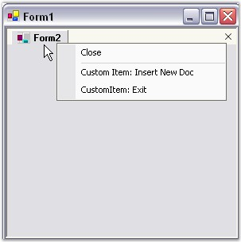

::: {style="DISPLAY: none"}
{#d2h_url_template}{#d2h_package_url style="WIDTH: 0px; DISPLAY: none; HEIGHT: 0px"}
:::

::: {.d2h_secondary_topic style="PADDING-BOTTOM: 10pt; MARGIN: 0pt; PADDING-LEFT: 0pt; PADDING-RIGHT: 0pt; PADDING-TOP: 0pt"}
##### Context Menu {#context-menu style="MARGIN-LEFT: 18pt; tab-stops: 18.0pt"}

 

The TabbedMDI Layout mode enables the default Context Menu that pops-up whenever the user right clicks on any of the tabs.

 

The **ContextMenuItem** property is used to select the context menu that should be used along with the default tab context menu when the user right-clicks on a tab.

 

Below image will reproduce the Context Menu feature available in an MDI application in TabbedMDI mode.

[]{style="COLOR: #15428b"} 

{border="0"}

[]{style="COLOR: #15428b"} 

Figure 1102: TabbedMDI with Context Menu Illustrated

[]{style="COLOR: #15428b"} 

Customize Context Menu

**[]{style="COLOR: #15428b"}** 

On right clicking the tabs in the TabbedMDI layout, a default context menu will appear. This context menu can be customized programmatically, to add custom bar items.

[]{style="COLOR: #15428b"} 

[·      ]{style="FONT-FAMILY: Symbol"}Create a TabbedMDI Layout.

[·      ]{style="FONT-FAMILY: Symbol"}Add the below code snippets in the respective places as directed.

[·      ]{style="FONT-FAMILY: Symbol"}The below given code will add two bar items to the default context menu. The same is shown in the image below.

[]{style="COLOR: #15428b"} 

+--------------------------------------------------------------------------------------------------------------------------------------------------------------------+
| **[\[C#\]]{style="FONT-FAMILY: 'Courier New'; COLOR: black"}**                                                                                                     |
|                                                                                                                                                                    |
| []{style="FONT-FAMILY: 'Courier New'; COLOR: black"}                                                                                                               |
|                                                                                                                                                                    |
| [//Add Namespace]{style="FONT-FAMILY: 'Courier New'; COLOR: green"}                                                                                                |
|                                                                                                                                                                    |
| [using]{style="FONT-FAMILY: 'Courier New'; COLOR: blue"}[ Syncfusion.Windows.Forms.Tools.XPMenus;]{style="FONT-FAMILY: 'Courier New'"}                             |
|                                                                                                                                                                    |
| []{style="FONT-FAMILY: 'Courier New'"}                                                                                                                             |
|                                                                                                                                                                    |
| [// Append menus to the standard MDI tab context menu.]{style="FONT-FAMILY: 'Courier New'; COLOR: green"}                                                          |
|                                                                                                                                                                    |
| [//Adding Bar Item 1]{style="FONT-FAMILY: 'Courier New'; COLOR: green"}                                                                                            |
|                                                                                                                                                                    |
| [ParentBarItem contextMenuItem = [new]{style="COLOR: blue"} ParentBarItem();]{style="FONT-FAMILY: 'Courier New'"}                                                  |
|                                                                                                                                                                    |
| [BarItem newDocItem = [new]{style="COLOR: blue"} BarItem();]{style="FONT-FAMILY: 'Courier New'"}                                                                   |
|                                                                                                                                                                    |
| [newDocItem.ImageIndex = 5;]{style="FONT-FAMILY: 'Courier New'"}                                                                                                   |
|                                                                                                                                                                    |
| [newDocItem.Text = \"Custom Item: Insert New Doc\";]{style="FONT-FAMILY: 'Courier New'"}                                                                           |
|                                                                                                                                                                    |
| [newDocItem.MergeOrder = 30;]{style="FONT-FAMILY: 'Courier New'"}                                                                                                  |
|                                                                                                                                                                    |
| [contextMenuItem.Items.Add(newDocItem);]{style="FONT-FAMILY: 'Courier New'"}                                                                                       |
|                                                                                                                                                                    |
| []{style="FONT-FAMILY: 'Courier New'"}                                                                                                                             |
|                                                                                                                                                                    |
| [//Adding Bar Item 2 ]{style="FONT-FAMILY: 'Courier New'; COLOR: green"}                                                                                           |
|                                                                                                                                                                    |
| [BarItem exitItem = [new]{style="COLOR: blue"} BarItem();]{style="FONT-FAMILY: 'Courier New'"}                                                                     |
|                                                                                                                                                                    |
| [exitItem.ImageIndex = 2;]{style="FONT-FAMILY: 'Courier New'"}                                                                                                     |
|                                                                                                                                                                    |
| [exitItem.Text = \"CustomItem: Exit\";]{style="FONT-FAMILY: 'Courier New'"}                                                                                        |
|                                                                                                                                                                    |
| [exitItem.MergeOrder = 30;]{style="FONT-FAMILY: 'Courier New'"}                                                                                                    |
|                                                                                                                                                                    |
| [contextMenuItem.Items.Add(exitItem);]{style="FONT-FAMILY: 'Courier New'"}                                                                                         |
|                                                                                                                                                                    |
| [contextMenuItem.BeginGroupAt(newDocItem);]{style="FONT-FAMILY: 'Courier New'"}                                                                                    |
|                                                                                                                                                                    |
| [// Items in this Parent Bar Item will be merged with the standard context menu Parent Bar Item of the MDI tab.]{style="FONT-FAMILY: 'Courier New'; COLOR: green"} |
|                                                                                                                                                                    |
| [tb.ContextMenuItem = contextMenuItem;]{style="FONT-FAMILY: 'Courier New'"}                                                                                        |
+--------------------------------------------------------------------------------------------------------------------------------------------------------------------+

[]{style="COLOR: #15428b"} 

+----------------------------------------------------------------------------------------------------------------------------------------------------------------------------------------------------------------------------------------------------+
| **[\[VB.NET\]]{style="FONT-FAMILY: 'Courier New'; COLOR: black"}**                                                                                                                                                                                 |
|                                                                                                                                                                                                                                                    |
| []{style="FONT-FAMILY: 'Courier New'; COLOR: black"}                                                                                                                                                                                               |
|                                                                                                                                                                                                                                                    |
| [\' Add Namespace]{style="FONT-FAMILY: 'Courier New'; COLOR: green"}                                                                                                                                                                               |
|                                                                                                                                                                                                                                                    |
| [Imports]{style="FONT-FAMILY: 'Courier New'; COLOR: blue"}[ Syncfusion.Windows.Forms.Tools.XPMenus]{style="FONT-FAMILY: 'Courier New'"}                                                                                                            |
|                                                                                                                                                                                                                                                    |
| []{style="FONT-FAMILY: 'Courier New'"}                                                                                                                                                                                                             |
|                                                                                                                                                                                                                                                    |
| [\' Append menus to the standard MDI tab context menu.]{style="FONT-FAMILY: 'Courier New'; COLOR: green"}                                                                                                                                          |
|                                                                                                                                                                                                                                                    |
| [Dim ]{style="FONT-FAMILY: 'Courier New'; COLOR: blue"}[contextMenuItem ]{style="FONT-FAMILY: 'Courier New'; COLOR: black"}[As]{style="FONT-FAMILY: 'Courier New'; COLOR: blue"}[ ParentBarItem]{style="FONT-FAMILY: 'Courier New'; COLOR: black"} |
|                                                                                                                                                                                                                                                    |
| [contextMenuItem = ]{style="FONT-FAMILY: 'Courier New'; COLOR: black"}[New]{style="FONT-FAMILY: 'Courier New'; COLOR: blue"}[ ParentBarItem()]{style="FONT-FAMILY: 'Courier New'; COLOR: black"}                                                   |
|                                                                                                                                                                                                                                                    |
| []{style="FONT-FAMILY: 'Courier New'; COLOR: black"}                                                                                                                                                                                               |
|                                                                                                                                                                                                                                                    |
| [\' Bar Item 1]{style="FONT-FAMILY: 'Courier New'; COLOR: green"}                                                                                                                                                                                  |
|                                                                                                                                                                                                                                                    |
| [Dim]{style="FONT-FAMILY: 'Courier New'; COLOR: blue"}[ newDocItem ]{style="FONT-FAMILY: 'Courier New'; COLOR: black"}[As]{style="FONT-FAMILY: 'Courier New'; COLOR: blue"}[ BarItem]{style="FONT-FAMILY: 'Courier New'; COLOR: black"}            |
|                                                                                                                                                                                                                                                    |
| [newDocItem = ]{style="FONT-FAMILY: 'Courier New'; COLOR: black"}[New]{style="FONT-FAMILY: 'Courier New'; COLOR: blue"}[ BarItem()]{style="FONT-FAMILY: 'Courier New'; COLOR: black"}                                                              |
|                                                                                                                                                                                                                                                    |
| [newDocItem.Text = \"Custom Item: Insert New Doc\"]{style="FONT-FAMILY: 'Courier New'; COLOR: black"}                                                                                                                                              |
|                                                                                                                                                                                                                                                    |
| [newDocItem.MergeOrder = 30]{style="FONT-FAMILY: 'Courier New'; COLOR: black"}                                                                                                                                                                     |
|                                                                                                                                                                                                                                                    |
| [contextMenuItem.Items.Add(newDocItem)]{style="FONT-FAMILY: 'Courier New'; COLOR: black"}                                                                                                                                                          |
|                                                                                                                                                                                                                                                    |
| []{style="FONT-FAMILY: 'Courier New'; COLOR: black"}                                                                                                                                                                                               |
|                                                                                                                                                                                                                                                    |
| [\' Bar Item 2]{style="FONT-FAMILY: 'Courier New'; COLOR: green"}                                                                                                                                                                                  |
|                                                                                                                                                                                                                                                    |
| [Dim]{style="FONT-FAMILY: 'Courier New'; COLOR: blue"}[ exitItem ]{style="FONT-FAMILY: 'Courier New'; COLOR: black"}[As]{style="FONT-FAMILY: 'Courier New'; COLOR: blue"}[ BarItem]{style="FONT-FAMILY: 'Courier New'; COLOR: black"}              |
|                                                                                                                                                                                                                                                    |
| [exitItem = ]{style="FONT-FAMILY: 'Courier New'; COLOR: black"}[New]{style="FONT-FAMILY: 'Courier New'; COLOR: blue"}[ BarItem()]{style="FONT-FAMILY: 'Courier New'; COLOR: black"}                                                                |
|                                                                                                                                                                                                                                                    |
| [exitItem.Text = \"CustomItem: Exit\"]{style="FONT-FAMILY: 'Courier New'; COLOR: black"}                                                                                                                                                           |
|                                                                                                                                                                                                                                                    |
| [exitItem.MergeOrder = 30]{style="FONT-FAMILY: 'Courier New'; COLOR: black"}                                                                                                                                                                       |
|                                                                                                                                                                                                                                                    |
| [contextMenuItem.Items.Add(exitItem)]{style="FONT-FAMILY: 'Courier New'; COLOR: black"}                                                                                                                                                            |
|                                                                                                                                                                                                                                                    |
| [contextMenuItem.BeginGroupAt(newDocItem)]{style="FONT-FAMILY: 'Courier New'; COLOR: black"}                                                                                                                                                       |
|                                                                                                                                                                                                                                                    |
| [\' Items in this Parent Bar Item will be merged with the standard context menu Parent Bar Item of the MDI tab.]{style="FONT-FAMILY: 'Courier New'; COLOR: green"}                                                                                 |
|                                                                                                                                                                                                                                                    |
| [tabbedMDIManager.ContextMenuItem = contextMenuItem]{style="FONT-FAMILY: 'Courier New'; COLOR: black"}                                                                                                                                             |
+----------------------------------------------------------------------------------------------------------------------------------------------------------------------------------------------------------------------------------------------------+

[]{style="COLOR: #15428b"} 

{border="0"}

**[]{style="COLOR: #15428b"}** 

Figure 1103: Default Context Menu

[]{style="COLOR: #15428b"} 

{border="0"}

**[]{style="COLOR: #15428b"}** 

Figure 1104: Context Menu with Custom Bar Items

**[]{style="COLOR: #15428b"}** 

See Also

[]{style="COLOR: #15428b"} 

[[How to remove the Context Menu for a particular tab?]{.UGHyperlink}](../../../../../../../../Documents%20and%20Settings/sylviap/Desktop/Tools%20-%20Part%202.docx#_How_to_remove)[]{.UGHyperlink}

 

 

 

[]{#p922} 

[]{#related-topics}
:::
