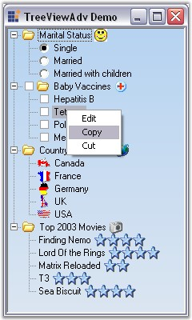

::: {style="DISPLAY: none"}
{#d2h_url_template}{#d2h_package_url style="WIDTH: 0px; DISPLAY: none; HEIGHT: 0px"}
:::

:::: {.d2h_secondary_topic style="PADDING-BOTTOM: 10pt; MARGIN: 0pt; PADDING-LEFT: 0pt; PADDING-RIGHT: 0pt; PADDING-TOP: 0pt"}
##### Context Menu {#context-menu style="MARGIN-LEFT: 18pt; tab-stops: 18.0pt"}

[]{style="COLOR: red; FONT-SIZE: 8pt"} 

TreeViewAdv control provides option for displaying context menu on right clicking on any node in the TreeViewAdv control. It also let users add custom menu items.

[]{style="COLOR: #15428b"} 

Adding Custom Menu Items

 

1.              Declare and initialize a context menu.

[]{style="COLOR: #15428b"} 

+----------------------------------------------------------------------------------------------------------------------------------------------------------------------------------------------------------+
| **[\[C#\]]{style="FONT-FAMILY: 'Courier New'; COLOR: black"}**                                                                                                                                           |
|                                                                                                                                                                                                          |
| **[]{style="FONT-FAMILY: 'Courier New'; COLOR: black"}**                                                                                                                                                 |
|                                                                                                                                                                                                          |
| [// Create and initialize a context Menu required]{style="FONT-FAMILY: 'Courier New'; COLOR: green"}                                                                                                     |
|                                                                                                                                                                                                          |
| [private]{style="FONT-FAMILY: 'Courier New'; COLOR: blue"}[ System.Windows.Forms.ContextMenu contextMenu1;]{style="FONT-FAMILY: 'Courier New'"}                                                          |
|                                                                                                                                                                                                          |
| [this]{style="FONT-FAMILY: 'Courier New'; COLOR: blue"}[.contextMenu1 = [new]{style="COLOR: blue"} System.Windows.Forms.ContextMenu();]{style="FONT-FAMILY: 'Courier New'"}                              |
|                                                                                                                                                                                                          |
| []{style="FONT-FAMILY: 'Courier New'"}                                                                                                                                                                   |
|                                                                                                                                                                                                          |
| [//Associate the context menu with the TreeView control]{style="FONT-FAMILY: 'Courier New'; COLOR: green"}                                                                                               |
|                                                                                                                                                                                                          |
| [this]{style="FONT-FAMILY: 'Courier New'; COLOR: blue"}[.treeViewAdv1.ContextMenu = [this]{style="COLOR: blue"}.contextMenu1;]{style="FONT-FAMILY: 'Courier New'"}[]{style="FONT-FAMILY: 'Courier New'"} |
+----------------------------------------------------------------------------------------------------------------------------------------------------------------------------------------------------------+

[]{style="COLOR: #15428b"} 

+------------------------------------------------------------------------------------------------------------------------------------------------------------------------------------------------------------+
| **[\[VB.NET\]]{style="FONT-FAMILY: 'Courier New'; COLOR: black"}**                                                                                                                                         |
|                                                                                                                                                                                                            |
| **[]{style="FONT-FAMILY: 'Courier New'; COLOR: black"}**                                                                                                                                                   |
|                                                                                                                                                                                                            |
| [\' Create and initialize a context Menu required]{style="FONT-FAMILY: 'Courier New'; COLOR: green"}                                                                                                       |
|                                                                                                                                                                                                            |
| [Private]{style="FONT-FAMILY: 'Courier New'; COLOR: blue"}[ [WithEvents]{style="COLOR: blue"} contextMenu1 [As]{style="COLOR: blue"} System.Windows.Forms.ContextMenu]{style="FONT-FAMILY: 'Courier New'"} |
|                                                                                                                                                                                                            |
| [Me]{style="FONT-FAMILY: 'Courier New'; COLOR: blue"}[.contextMenu1 = [New]{style="COLOR: blue"} System.Windows.Forms.ContextMenu()]{style="FONT-FAMILY: 'Courier New'"}                                   |
|                                                                                                                                                                                                            |
| []{style="FONT-FAMILY: 'Courier New'"}                                                                                                                                                                     |
|                                                                                                                                                                                                            |
| [\'Associate the context menu with the TreeView control]{style="FONT-FAMILY: 'Courier New'; COLOR: green"}                                                                                                 |
|                                                                                                                                                                                                            |
| [Me]{style="FONT-FAMILY: 'Courier New'; COLOR: blue"}[.treeViewAdv1.ContextMenu = [Me]{style="COLOR: blue"}.contextMenu1]{style="FONT-FAMILY: 'Courier New'"}[]{style="FONT-FAMILY: 'Courier New'"}        |
+------------------------------------------------------------------------------------------------------------------------------------------------------------------------------------------------------------+

[]{style="COLOR: #15428b"} 

2.   Add the context menu items.

[]{style="COLOR: #15428b"} 

+-------------------------------------------------------------------------------------------------------------------------------------------------------------------------------------------------------------------------------------+
| **[\[C#\]]{style="FONT-FAMILY: 'Courier New'; COLOR: black"}**                                                                                                                                                                      |
|                                                                                                                                                                                                                                     |
| **[]{style="FONT-FAMILY: 'Courier New'; COLOR: black"}**                                                                                                                                                                            |
|                                                                                                                                                                                                                                     |
| [private]{style="FONT-FAMILY: 'Courier New'; COLOR: blue"}[ System.Windows.Forms.[MenuItem]{style="COLOR: teal"} editItem;]{style="FONT-FAMILY: 'Courier New'"}                                                                     |
|                                                                                                                                                                                                                                     |
| [this]{style="FONT-FAMILY: 'Courier New'; COLOR: blue"}[.editItem = [new]{style="COLOR: blue"} System.Windows.Forms.[MenuItem]{style="COLOR: teal"}();]{style="FONT-FAMILY: 'Courier New'"}                                         |
|                                                                                                                                                                                                                                     |
| [          ]{style="FONT-FAMILY: 'Courier New'"}                                                                                                                                                                                    |
|                                                                                                                                                                                                                                     |
| [//Add context Menu items]{style="FONT-FAMILY: 'Courier New'; COLOR: green"}                                                                                                                                                        |
|                                                                                                                                                                                                                                     |
| [this]{style="FONT-FAMILY: 'Courier New'; COLOR: blue"}[.contextMenu1.MenuItems.AddRange([new]{style="COLOR: blue"} System.Windows.Forms.MenuItem\[\] {[this]{style="COLOR: blue"}.editItem});]{style="FONT-FAMILY: 'Courier New'"} |
|                                                                                                                                                                                                                                     |
| []{style="FONT-FAMILY: 'Courier New'"}                                                                                                                                                                                              |
|                                                                                                                                                                                                                                     |
| [//Pop the context Menu]{style="FONT-FAMILY: 'Courier New'; COLOR: green"}                                                                                                                                                          |
|                                                                                                                                                                                                                                     |
| [this]{style="FONT-FAMILY: 'Courier New'; COLOR: blue"}[.contextMenu1.Popup += [new]{style="COLOR: blue"} System.EventHandler([this]{style="COLOR: blue"}.contextMenu1_Popup);]{style="FONT-FAMILY: 'Courier New'"}                 |
|                                                                                                                                                                                                                                     |
| []{style="FONT-FAMILY: 'Courier New'"}                                                                                                                                                                                              |
|                                                                                                                                                                                                                                     |
| [//Set the context menu items]{style="FONT-FAMILY: 'Courier New'; COLOR: green"}                                                                                                                                                    |
|                                                                                                                                                                                                                                     |
| [this]{style="FONT-FAMILY: 'Courier New'; COLOR: blue"}[.editItem.Index = 0;]{style="FONT-FAMILY: 'Courier New'"}                                                                                                                   |
|                                                                                                                                                                                                                                     |
| [this]{style="FONT-FAMILY: 'Courier New'; COLOR: blue"}[.editItem.Text = \"&Edit\";]{style="FONT-FAMILY: 'Courier New'"}                                                                                                            |
|                                                                                                                                                                                                                                     |
| [this]{style="FONT-FAMILY: 'Courier New'; COLOR: blue"}[.editItem.Click += [new]{style="COLOR: blue"} System.EventHandler([this]{style="COLOR: blue"}.editItem_Click);]{style="FONT-FAMILY: 'Courier New'"}                         |
+-------------------------------------------------------------------------------------------------------------------------------------------------------------------------------------------------------------------------------------+

[]{style="COLOR: #15428b"} 

+------------------------------------------------------------------------------------------------------------------------------------------------------------------------------------------------------------------------------+
| **[\[VB.NET\]]{style="FONT-FAMILY: 'Courier New'; COLOR: black"}**                                                                                                                                                           |
|                                                                                                                                                                                                                              |
| **[]{style="FONT-FAMILY: 'Courier New'; COLOR: black"}**                                                                                                                                                                     |
|                                                                                                                                                                                                                              |
| [Private]{style="FONT-FAMILY: 'Courier New'; COLOR: blue"}[ [WithEvents]{style="COLOR: blue"} editItem [As]{style="COLOR: blue"} System.Windows.Forms.MenuItem]{style="FONT-FAMILY: 'Courier New'"}                          |
|                                                                                                                                                                                                                              |
| [Me]{style="FONT-FAMILY: 'Courier New'; COLOR: blue"}[.editItem = [New]{style="COLOR: blue"} System.Windows.Forms.MenuItem()]{style="FONT-FAMILY: 'Courier New'"}                                                            |
|                                                                                                                                                                                                                              |
| []{style="FONT-FAMILY: 'Courier New'"}                                                                                                                                                                                       |
|                                                                                                                                                                                                                              |
| [\'Add context Menu items]{style="FONT-FAMILY: 'Courier New'; COLOR: green"}                                                                                                                                                 |
|                                                                                                                                                                                                                              |
| [Me]{style="FONT-FAMILY: 'Courier New'; COLOR: blue"}[.contextMenu1.MenuItems.AddRange([New]{style="COLOR: blue"} System.Windows.Forms.MenuItem() {[Me]{style="COLOR: blue"}.editItem})]{style="FONT-FAMILY: 'Courier New'"} |
|                                                                                                                                                                                                                              |
| []{style="FONT-FAMILY: 'Courier New'"}                                                                                                                                                                                       |
|                                                                                                                                                                                                                              |
| [\'Set the context Menu items]{style="FONT-FAMILY: 'Courier New'; COLOR: green"}                                                                                                                                             |
|                                                                                                                                                                                                                              |
| [Me]{style="FONT-FAMILY: 'Courier New'; COLOR: blue"}[.editItem.Index = 0]{style="FONT-FAMILY: 'Courier New'"}                                                                                                               |
|                                                                                                                                                                                                                              |
| [Me]{style="FONT-FAMILY: 'Courier New'; COLOR: blue"}[.editItem.Text = \"&Edit\"]{style="FONT-FAMILY: 'Courier New'"}                                                                                                        |
+------------------------------------------------------------------------------------------------------------------------------------------------------------------------------------------------------------------------------+

[]{style="COLOR: #15428b"} 

3.   Defining context menu pop-up.[]{#p976}

[]{style="COLOR: #15428b"} 

+--------------------------------------------------------------------------------------------------------------------------------------------------------------------------------------------------------------------------------------------------------------------+
| **[\[C#\]]{style="FONT-FAMILY: 'Courier New'; COLOR: black"}**                                                                                                                                                                                                     |
|                                                                                                                                                                                                                                                                    |
| **[]{style="FONT-FAMILY: 'Courier New'; COLOR: black"}**                                                                                                                                                                                                           |
|                                                                                                                                                                                                                                                                    |
| [// Declared to NULL if the right click is outside the node area .]{style="FONT-FAMILY: 'Courier New'; COLOR: green"}                                                                                                                                              |
|                                                                                                                                                                                                                                                                    |
| [private]{style="FONT-FAMILY: 'Courier New'; COLOR: blue"}[ TreeNodeAdv rightMouseDownNodeCached = ]{style="FONT-FAMILY: 'Courier New'; COLOR: black"}[null]{style="FONT-FAMILY: 'Courier New'; COLOR: blue"}[;]{style="FONT-FAMILY: 'Courier New'; COLOR: black"} |
|                                                                                                                                                                                                                                                                    |
| []{style="FONT-FAMILY: 'Courier New'; COLOR: black"}                                                                                                                                                                                                               |
|                                                                                                                                                                                                                                                                    |
| [// Context menu pop up]{style="FONT-FAMILY: 'Courier New'; COLOR: green"}                                                                                                                                                                                         |
|                                                                                                                                                                                                                                                                    |
| [private]{style="FONT-FAMILY: 'Courier New'; COLOR: blue"}[ [void]{style="COLOR: blue"} contextMenu1_Popup([object]{style="COLOR: blue"} sender, System.[EventArgs]{style="COLOR: teal"} e)]{style="FONT-FAMILY: 'Courier New'"}                                   |
|                                                                                                                                                                                                                                                                    |
| [{]{style="FONT-FAMILY: 'Courier New'"}                                                                                                                                                                                                                            |
|                                                                                                                                                                                                                                                                    |
| [this]{style="FONT-FAMILY: 'Courier New'; COLOR: blue"}[.rightMouseDownNodeCached = [this]{style="COLOR: blue"}.treeViewAdv1.RMouseDownNode;]{style="FONT-FAMILY: 'Courier New'"}                                                                                  |
|                                                                                                                                                                                                                                                                    |
| [// This will be null if the user clicked in the empty portion of the tree.]{style="FONT-FAMILY: 'Courier New'; COLOR: green"}                                                                                                                                     |
|                                                                                                                                                                                                                                                                    |
| [if]{style="FONT-FAMILY: 'Courier New'; COLOR: blue"}[([this]{style="COLOR: blue"}.treeViewAdv1.RMouseDownNode == [null]{style="COLOR: blue"})]{style="FONT-FAMILY: 'Courier New'"}                                                                                |
|                                                                                                                                                                                                                                                                    |
| [{]{style="FONT-FAMILY: 'Courier New'"}                                                                                                                                                                                                                            |
|                                                                                                                                                                                                                                                                    |
| [this]{style="FONT-FAMILY: 'Courier New'; COLOR: blue"}[.copyItem.Visible = [false]{style="COLOR: blue"};]{style="FONT-FAMILY: 'Courier New'"}                                                                                                                     |
|                                                                                                                                                                                                                                                                    |
| [this]{style="FONT-FAMILY: 'Courier New'; COLOR: blue"}[.cutItem.Visible = [false]{style="COLOR: blue"};]{style="FONT-FAMILY: 'Courier New'"}                                                                                                                      |
|                                                                                                                                                                                                                                                                    |
| [this]{style="FONT-FAMILY: 'Courier New'; COLOR: blue"}[.editItem.Visible = [false]{style="COLOR: blue"};]{style="FONT-FAMILY: 'Courier New'"}                                                                                                                     |
|                                                                                                                                                                                                                                                                    |
| [}]{style="FONT-FAMILY: 'Courier New'"}                                                                                                                                                                                                                            |
|                                                                                                                                                                                                                                                                    |
| [else]{style="FONT-FAMILY: 'Courier New'; COLOR: blue"}                                                                                                                                                                                                            |
|                                                                                                                                                                                                                                                                    |
| [{]{style="FONT-FAMILY: 'Courier New'"}                                                                                                                                                                                                                            |
|                                                                                                                                                                                                                                                                    |
| [this]{style="FONT-FAMILY: 'Courier New'; COLOR: blue"}[.copyItem.Visible = [true]{style="COLOR: blue"};]{style="FONT-FAMILY: 'Courier New'"}                                                                                                                      |
|                                                                                                                                                                                                                                                                    |
| [this]{style="FONT-FAMILY: 'Courier New'; COLOR: blue"}[.cutItem.Visible = [true]{style="COLOR: blue"};]{style="FONT-FAMILY: 'Courier New'"}                                                                                                                       |
|                                                                                                                                                                                                                                                                    |
| [this]{style="FONT-FAMILY: 'Courier New'; COLOR: blue"}[.editItem.Visible = [true]{style="COLOR: blue"};]{style="FONT-FAMILY: 'Courier New'"}                                                                                                                      |
|                                                                                                                                                                                                                                                                    |
| [}]{style="FONT-FAMILY: 'Courier New'"}                                                                                                                                                                                                                            |
|                                                                                                                                                                                                                                                                    |
| [}]{style="FONT-FAMILY: 'Courier New'"}[]{style="FONT-FAMILY: 'Courier New'"}                                                                                                                                                                                      |
+--------------------------------------------------------------------------------------------------------------------------------------------------------------------------------------------------------------------------------------------------------------------+

[]{style="COLOR: #15428b"} 

+---------------------------------------------------------------------------------------------------------------------------------------------------------------------------------------------------------------------------------------------------------------------------------------------------------------------------------------------------------------------------------+
| **[\[VB.NET\]]{style="FONT-FAMILY: 'Courier New'; COLOR: black"}**                                                                                                                                                                                                                                                                                                              |
|                                                                                                                                                                                                                                                                                                                                                                                 |
| **[]{style="FONT-FAMILY: 'Courier New'; COLOR: black"}**                                                                                                                                                                                                                                                                                                                        |
|                                                                                                                                                                                                                                                                                                                                                                                 |
| [\' Declared to NULL if the right click is outside the node area .]{style="FONT-FAMILY: 'Courier New'; COLOR: green"}                                                                                                                                                                                                                                                           |
|                                                                                                                                                                                                                                                                                                                                                                                 |
| [Private]{style="FONT-FAMILY: 'Courier New'; COLOR: blue"}[ rightMouseDownNodeCached As ]{style="FONT-FAMILY: 'Courier New'; COLOR: black"}[TreeNodeAdv ]{style="FONT-FAMILY: 'Courier New'; COLOR: black"}[=  ]{style="FONT-FAMILY: 'Courier New'; COLOR: black"}[Nothing]{style="FONT-FAMILY: 'Courier New'; COLOR: blue"}[]{style="FONT-FAMILY: 'Courier New'; COLOR: blue"} |
|                                                                                                                                                                                                                                                                                                                                                                                 |
| []{style="FONT-FAMILY: 'Courier New'"}                                                                                                                                                                                                                                                                                                                                          |
|                                                                                                                                                                                                                                                                                                                                                                                 |
| [\' [Context menu Popup]{style="COLOR: green"}]{style="FONT-FAMILY: 'Courier New'"}                                                                                                                                                                                                                                                                                             |
|                                                                                                                                                                                                                                                                                                                                                                                 |
| [Private]{style="FONT-FAMILY: 'Courier New'; COLOR: blue"}[ [Sub]{style="COLOR: blue"} contextMenu1_Popup([ByVal]{style="COLOR: blue"} sender [As]{style="COLOR: blue"} [Object]{style="COLOR: blue"}, [ByVal]{style="COLOR: blue"} e [As]{style="COLOR: blue"} System.EventArgs) [Handles]{style="COLOR: blue"} contextMenu1.Popup]{style="FONT-FAMILY: 'Courier New'"}        |
|                                                                                                                                                                                                                                                                                                                                                                                 |
| [Me]{style="FONT-FAMILY: 'Courier New'; COLOR: blue"}[.rightMouseDownNodeCached = [Me]{style="COLOR: blue"}.treeViewAdv1.RMouseDownNode]{style="FONT-FAMILY: 'Courier New'"}                                                                                                                                                                                                    |
|                                                                                                                                                                                                                                                                                                                                                                                 |
| [\' This will be null if the user clicked in the empty portion of the tree.]{style="FONT-FAMILY: 'Courier New'; COLOR: green"}                                                                                                                                                                                                                                                  |
|                                                                                                                                                                                                                                                                                                                                                                                 |
| [If]{style="FONT-FAMILY: 'Courier New'; COLOR: blue"}[ [Me]{style="COLOR: blue"}.treeViewAdv1.RMouseDownNode [Is]{style="COLOR: blue"} [Nothing]{style="COLOR: blue"} [Then]{style="COLOR: blue"}]{style="FONT-FAMILY: 'Courier New'"}                                                                                                                                          |
|                                                                                                                                                                                                                                                                                                                                                                                 |
| [Me]{style="FONT-FAMILY: 'Courier New'; COLOR: blue"}[.copyItem.Visible = [False]{style="COLOR: blue"}]{style="FONT-FAMILY: 'Courier New'"}                                                                                                                                                                                                                                     |
|                                                                                                                                                                                                                                                                                                                                                                                 |
| [Me]{style="FONT-FAMILY: 'Courier New'; COLOR: blue"}[.cutItem.Visible = [False]{style="COLOR: blue"}]{style="FONT-FAMILY: 'Courier New'"}                                                                                                                                                                                                                                      |
|                                                                                                                                                                                                                                                                                                                                                                                 |
| [Me]{style="FONT-FAMILY: 'Courier New'; COLOR: blue"}[.editItem.Visible = [False]{style="COLOR: blue"}]{style="FONT-FAMILY: 'Courier New'"}                                                                                                                                                                                                                                     |
|                                                                                                                                                                                                                                                                                                                                                                                 |
| [Else]{style="FONT-FAMILY: 'Courier New'; COLOR: blue"}                                                                                                                                                                                                                                                                                                                         |
|                                                                                                                                                                                                                                                                                                                                                                                 |
| [Me]{style="FONT-FAMILY: 'Courier New'; COLOR: blue"}[.copyItem.Visible = [True]{style="COLOR: blue"}]{style="FONT-FAMILY: 'Courier New'"}                                                                                                                                                                                                                                      |
|                                                                                                                                                                                                                                                                                                                                                                                 |
| [Me]{style="FONT-FAMILY: 'Courier New'; COLOR: blue"}[.cutItem.Visible = [True]{style="COLOR: blue"}]{style="FONT-FAMILY: 'Courier New'"}                                                                                                                                                                                                                                       |
|                                                                                                                                                                                                                                                                                                                                                                                 |
| [Me]{style="FONT-FAMILY: 'Courier New'; COLOR: blue"}[.editItem.Visible = [True]{style="COLOR: blue"}]{style="FONT-FAMILY: 'Courier New'"}                                                                                                                                                                                                                                      |
|                                                                                                                                                                                                                                                                                                                                                                                 |
| [End]{style="FONT-FAMILY: 'Courier New'; COLOR: blue"}[ [If]{style="COLOR: blue"}]{style="FONT-FAMILY: 'Courier New'"}                                                                                                                                                                                                                                                          |
|                                                                                                                                                                                                                                                                                                                                                                                 |
| [End]{style="FONT-FAMILY: 'Courier New'; COLOR: blue"}[ [Sub]{style="COLOR: blue"}]{style="FONT-FAMILY: 'Courier New'"}[]{style="FONT-FAMILY: 'Courier New'; COLOR: blue"}                                                                                                                                                                                                      |
+---------------------------------------------------------------------------------------------------------------------------------------------------------------------------------------------------------------------------------------------------------------------------------------------------------------------------------------------------------------------------------+

[]{style="COLOR: #15428b"} 

{border="0"}

[]{style="COLOR: #15428b"} 

Figure 1138: \"Edit\", \"Copy\" and \"Cut\" menu items added to the Context Menu

 

**Editing the nodes using \"Edit\" Menu Item**

 

4.We can include editing functionality when you click the Edit menu item using the EditItem_Click event. In the below example, it calls the **BeginEdit** method and begins editing the node that is selected.

[]{style="COLOR: #15428b"} 

::: {align="center"}
+-----------------------------------+---------------------------------------------------------------------------------------------------------------------------------------------------+
| treeViewAdv Methods               | Description                                                                                                                                       |
+-----------------------------------+---------------------------------------------------------------------------------------------------------------------------------------------------+
| BeginEdit                         | Edits the selected node.                                                                                                                          |
+-----------------------------------+---------------------------------------------------------------------------------------------------------------------------------------------------+
| BeginEdit(Overloaded)             | Edits the specified node that is passed as the parameter. The parameter is,                                                                       |
|                                   |                                                                                                                                                   |
|                                   |                                                                                                                                                   |
|                                   |                                                                                                                                                   |
|                                   | node - Indicates the particular node to edit.                                                                                                     |
+-----------------------------------+---------------------------------------------------------------------------------------------------------------------------------------------------+
| EndEdit                           | Forces to end the editing of the selected node. It saves or cancels the editing of the selected node based on the bool value passed as parameter. |
|                                   |                                                                                                                                                   |
|                                   |                                                                                                                                                   |
|                                   |                                                                                                                                                   |
|                                   | true - Cancels the editing without saving.                                                                                                        |
|                                   |                                                                                                                                                   |
|                                   | false - Saves the changes.                                                                                                                        |
+-----------------------------------+---------------------------------------------------------------------------------------------------------------------------------------------------+
:::

[]{style="COLOR: #15428b"} 

+----------------------------------------------------------------------------------------------------------------------------------------------------------------------------------------------------------------------------------------------------------------------------------------------------------------------------------------------------------------+
| **[\[C#\]]{style="FONT-FAMILY: 'Courier New'; COLOR: black"}**                                                                                                                                                                                                                                                                                                 |
|                                                                                                                                                                                                                                                                                                                                                                |
| **[]{style="FONT-FAMILY: 'Courier New'; COLOR: black"}**                                                                                                                                                                                                                                                                                                       |
|                                                                                                                                                                                                                                                                                                                                                                |
| [//Edits the Selected node]{style="FONT-FAMILY: 'Courier New'; COLOR: green"}                                                                                                                                                                                                                                                                                  |
|                                                                                                                                                                                                                                                                                                                                                                |
| [this]{style="FONT-FAMILY: 'Courier New'; COLOR: blue"}[.treeViewAdv1.BeginEdit();]{style="FONT-FAMILY: 'Courier New'; COLOR: black"}                                                                                                                                                                                                                          |
|                                                                                                                                                                                                                                                                                                                                                                |
| []{style="FONT-FAMILY: 'Courier New'; COLOR: green"}                                                                                                                                                                                                                                                                                                           |
|                                                                                                                                                                                                                                                                                                                                                                |
| [//Edits the Specified node]{style="FONT-FAMILY: 'Courier New'; COLOR: green"}                                                                                                                                                                                                                                                                                 |
|                                                                                                                                                                                                                                                                                                                                                                |
| [//Context menu item\'s click events]{style="FONT-FAMILY: 'Courier New'; COLOR: green"}                                                                                                                                                                                                                                                                        |
|                                                                                                                                                                                                                                                                                                                                                                |
| [private void]{style="FONT-FAMILY: 'Courier New'; COLOR: blue"}[ editItem_Click(]{style="FONT-FAMILY: 'Courier New'; COLOR: black"}[object]{style="FONT-FAMILY: 'Courier New'; COLOR: blue"}[ sender, System.EventArgs e)]{style="FONT-FAMILY: 'Courier New'; COLOR: black"}                                                                                   |
|                                                                                                                                                                                                                                                                                                                                                                |
| [{]{style="FONT-FAMILY: 'Courier New'; COLOR: black"}                                                                                                                                                                                                                                                                                                          |
|                                                                                                                                                                                                                                                                                                                                                                |
| [if]{style="FONT-FAMILY: 'Courier New'; COLOR: blue"}[(]{style="FONT-FAMILY: 'Courier New'; COLOR: black"}[this]{style="FONT-FAMILY: 'Courier New'; COLOR: blue"}[.rightMouseDownNodeCached != ]{style="FONT-FAMILY: 'Courier New'; COLOR: black"}[null]{style="FONT-FAMILY: 'Courier New'; COLOR: blue"}[)]{style="FONT-FAMILY: 'Courier New'; COLOR: black"} |
|                                                                                                                                                                                                                                                                                                                                                                |
| [// You can also alternatively turn on F2 label editing for all nodes using the]{style="FONT-FAMILY: 'Courier New'; COLOR: green"}[ ]{style="FONT-FAMILY: 'Courier New'; COLOR: black"}[LabelEdit property of the tree.]{style="FONT-FAMILY: 'Courier New'; COLOR: green"}                                                                                     |
|                                                                                                                                                                                                                                                                                                                                                                |
| [this]{style="FONT-FAMILY: 'Courier New'; COLOR: blue"}[.treeViewAdv1.BeginEdit(]{style="FONT-FAMILY: 'Courier New'; COLOR: black"}[this]{style="FONT-FAMILY: 'Courier New'; COLOR: blue"}[.rightMouseDownNodeCached);]{style="FONT-FAMILY: 'Courier New'; COLOR: black"}                                                                                      |
|                                                                                                                                                                                                                                                                                                                                                                |
| [}]{style="FONT-FAMILY: 'Courier New'; COLOR: black"}                                                                                                                                                                                                                                                                                                          |
|                                                                                                                                                                                                                                                                                                                                                                |
| []{style="FONT-FAMILY: 'Courier New'; COLOR: black"}                                                                                                                                                                                                                                                                                                           |
|                                                                                                                                                                                                                                                                                                                                                                |
| [this]{style="FONT-FAMILY: 'Courier New'; COLOR: blue"}[.treeViewAdv1.EndEdit([false]{style="COLOR: blue"});]{style="FONT-FAMILY: 'Courier New'"}[]{style="FONT-FAMILY: 'Courier New'"}                                                                                                                                                                        |
+----------------------------------------------------------------------------------------------------------------------------------------------------------------------------------------------------------------------------------------------------------------------------------------------------------------------------------------------------------------+

[]{style="COLOR: #15428b"} 

+---------------------------------------------------------------------------------------------------------------------------------------------------------------------------------------------------------------------------------------------------------------------------------------------------------------------------------------------------------------------------------------------------------------------------------------------------------------------------------------------------------------------------------------------------------------------------------------------------------------------+
| **[\[VB.NET\]]{style="FONT-FAMILY: 'Courier New'; COLOR: black"}**                                                                                                                                                                                                                                                                                                                                                                                                                                                                                                                                                  |
|                                                                                                                                                                                                                                                                                                                                                                                                                                                                                                                                                                                                                     |
| **[]{style="FONT-FAMILY: 'Courier New'; COLOR: black"}**                                                                                                                                                                                                                                                                                                                                                                                                                                                                                                                                                            |
|                                                                                                                                                                                                                                                                                                                                                                                                                                                                                                                                                                                                                     |
| [\'Edits the Selected node]{style="FONT-FAMILY: 'Courier New'; COLOR: green"}                                                                                                                                                                                                                                                                                                                                                                                                                                                                                                                                       |
|                                                                                                                                                                                                                                                                                                                                                                                                                                                                                                                                                                                                                     |
| [Me]{style="FONT-FAMILY: 'Courier New'; COLOR: blue"}[.treeViewAdv1.BeginEdit()]{style="FONT-FAMILY: 'Courier New'; COLOR: black"}                                                                                                                                                                                                                                                                                                                                                                                                                                                                                  |
|                                                                                                                                                                                                                                                                                                                                                                                                                                                                                                                                                                                                                     |
| []{style="FONT-FAMILY: 'Courier New'; COLOR: black"}                                                                                                                                                                                                                                                                                                                                                                                                                                                                                                                                                                |
|                                                                                                                                                                                                                                                                                                                                                                                                                                                                                                                                                                                                                     |
| [\'Edits the Specified node]{style="FONT-FAMILY: 'Courier New'; COLOR: green"}                                                                                                                                                                                                                                                                                                                                                                                                                                                                                                                                      |
|                                                                                                                                                                                                                                                                                                                                                                                                                                                                                                                                                                                                                     |
| [\'Context menu item\'s click events]{style="FONT-FAMILY: 'Courier New'; COLOR: green"}                                                                                                                                                                                                                                                                                                                                                                                                                                                                                                                             |
|                                                                                                                                                                                                                                                                                                                                                                                                                                                                                                                                                                                                                     |
| [Private  Sub]{style="FONT-FAMILY: 'Courier New'; COLOR: blue"}[ editItem_Click(]{style="FONT-FAMILY: 'Courier New'; COLOR: black"}[ByVal]{style="FONT-FAMILY: 'Courier New'; COLOR: blue"}[ sender ]{style="FONT-FAMILY: 'Courier New'; COLOR: black"}[As Object]{style="FONT-FAMILY: 'Courier New'; COLOR: blue"}[, ]{style="FONT-FAMILY: 'Courier New'; COLOR: black"}[ByVal]{style="FONT-FAMILY: 'Courier New'; COLOR: blue"}[ e ]{style="FONT-FAMILY: 'Courier New'; COLOR: black"}[As]{style="FONT-FAMILY: 'Courier New'; COLOR: blue"}[ System.EventArgs)]{style="FONT-FAMILY: 'Courier New'; COLOR: black"} |
|                                                                                                                                                                                                                                                                                                                                                                                                                                                                                                                                                                                                                     |
| [If Not]{style="FONT-FAMILY: 'Courier New'; COLOR: blue"}[ ]{style="FONT-FAMILY: 'Courier New'; COLOR: black"}[Me]{style="FONT-FAMILY: 'Courier New'; COLOR: blue"}[.rightMouseDownNodeCached ]{style="FONT-FAMILY: 'Courier New'; COLOR: black"}[Is Nothing Then]{style="FONT-FAMILY: 'Courier New'; COLOR: blue"}                                                                                                                                                                                                                                                                                                 |
|                                                                                                                                                                                                                                                                                                                                                                                                                                                                                                                                                                                                                     |
| [\'You can also alternatively turn on F2 label editing for all nodes using the]{style="FONT-FAMILY: 'Courier New'; COLOR: green"}[ ]{style="FONT-FAMILY: 'Courier New'; COLOR: black"}[LabelEdit property of the tree.]{style="FONT-FAMILY: 'Courier New'; COLOR: green"}                                                                                                                                                                                                                                                                                                                                           |
|                                                                                                                                                                                                                                                                                                                                                                                                                                                                                                                                                                                                                     |
| [Me]{style="FONT-FAMILY: 'Courier New'; COLOR: blue"}[.treeViewAdv1.BeginEdit(]{style="FONT-FAMILY: 'Courier New'; COLOR: black"}[Me]{style="FONT-FAMILY: 'Courier New'; COLOR: blue"}[.rightMouseDownNodeCached)]{style="FONT-FAMILY: 'Courier New'; COLOR: black"}                                                                                                                                                                                                                                                                                                                                                |
|                                                                                                                                                                                                                                                                                                                                                                                                                                                                                                                                                                                                                     |
| [End If]{style="FONT-FAMILY: 'Courier New'; COLOR: blue"}                                                                                                                                                                                                                                                                                                                                                                                                                                                                                                                                                           |
|                                                                                                                                                                                                                                                                                                                                                                                                                                                                                                                                                                                                                     |
| [End Sub]{style="FONT-FAMILY: 'Courier New'; COLOR: blue"}                                                                                                                                                                                                                                                                                                                                                                                                                                                                                                                                                          |
|                                                                                                                                                                                                                                                                                                                                                                                                                                                                                                                                                                                                                     |
| []{style="FONT-FAMILY: 'Courier New'; COLOR: blue"}                                                                                                                                                                                                                                                                                                                                                                                                                                                                                                                                                                 |
|                                                                                                                                                                                                                                                                                                                                                                                                                                                                                                                                                                                                                     |
| [Me]{style="FONT-FAMILY: 'Courier New'; COLOR: blue"}[.treeViewAdv1.EndEdit([False]{style="COLOR: blue"})]{style="FONT-FAMILY: 'Courier New'"}[]{style="FONT-FAMILY: 'Courier New'"}                                                                                                                                                                                                                                                                                                                                                                                                                                |
+---------------------------------------------------------------------------------------------------------------------------------------------------------------------------------------------------------------------------------------------------------------------------------------------------------------------------------------------------------------------------------------------------------------------------------------------------------------------------------------------------------------------------------------------------------------------------------------------------------------------+

**[]{style="COLOR: #15428b"}** 

A sample which includes the Context Menu feature is available in the below installation path.

**** 

***..\\My Documents\\Syncfusion\\EssentialStudio\\Version Number\\Windows\\Tools.Windows\\Samples\\2.0\\Tree Package\\TreeViewAdvDemo***

 

**See Also**

**[]{style="COLOR: #15428b"}** 

[[Node Editing]{.UGHyperlink}](../../../../../../../../Documents%20and%20Settings/sylviap/Desktop/Tools%20-%20Part%202.docx#_Node_Editing_Events)[]{.UGHyperlink}

 

 

 

 

[]{#related-topics}
::::
