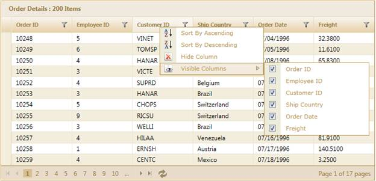

::: {style="DISPLAY: none"}
{#d2h_url_template}{#d2h_package_url style="WIDTH: 0px; DISPLAY: none; HEIGHT: 0px"}
:::

::::: {#nsbanner .d2h_main_nsbanner style="BORDER-BOTTOM: #999999 1px solid; POSITION: relative; PADDING-BOTTOM: 0px; BACKGROUND-COLOR: transparent; PADDING-LEFT: 0px; PADDING-RIGHT: 0px; DISPLAY: none; BORDER-TOP: #999999 1px solid; PADDING-TOP: 0px; LEFT: 0px"}
:::: {#TitleRow .d2h_main_titlerow style="PADDING-BOTTOM: 4px; BACKGROUND-COLOR: transparent; PADDING-LEFT: 22px; WIDTH: 100%; PADDING-RIGHT: 10px; DISPLAY: none; PADDING-TOP: 4px"}
::: {#ienav .d2h_main_ienav style="DISPLAY: none"}
{#D2HPrevious .D2HPreviousEnabled}  {#D2HNext .D2HNextEnabled}
:::
::::
:::::

:::: {#nstext .d2h_main_nstext style="PADDING-BOTTOM: 10px; BACKGROUND-COLOR: transparent; PADDING-LEFT: 22px; PADDING-RIGHT: 10px; HEIGHT: 100%; OVERFLOW: auto; PADDING-TOP: 5px" hasuserbackground="true" valign="bottom"}
::: {#d2h_breadcrumbs .d2h_breadcrumbs}
[Essential Studio User Guide Documentation](ms-xhelp:///?Id=12457748-09e3-4d74-a240-8e049cedf030){.d2h_breadcrumbsNormal}[ \> ]{.d2h_breadcrumbsLinkSeparator}[User Interface Edition](ms-xhelp:///?Id=c29296b7-531c-413b-a0ec-488ca1f7f669){.d2h_breadcrumbsNormal}[ \> ]{.d2h_breadcrumbsLinkSeparator}[Essential ASP.NET MVC](ms-xhelp:///?Id=4b14e7d1-65c4-4f67-b1aa-2c37709905a5){.d2h_breadcrumbsNormal}[ \> ]{.d2h_breadcrumbsLinkSeparator}[Essential Grid]{.d2h_breadcrumbsContentsOnly}[ \> ]{.d2h_breadcrumbsLinkSeparator}[Getting Started](ms-xhelp:///?Id=c7ed3902-b25b-4170-be58-1d3d0b57748a){.d2h_breadcrumbsNormal}[ \> ]{.d2h_breadcrumbsLinkSeparator}[Feature Summary](ms-xhelp:///?Id=1923e679-441a-44e0-9bca-e0e50988a857){.d2h_breadcrumbsNormal}[ \> ]{.d2h_breadcrumbsLinkSeparator}[Concepts and Features](ms-xhelp:///?Id=4a1657fa-4756-42b9-9153-aebf5dcfc503){.d2h_breadcrumbsNormal}
:::

## Context Menu {#context-menu style="tab-stops: 0pt"}

The context menu support in Essential Grid for MVC improves user interaction by allowing you to access the basic operations of the grid such as paging, sorting, grouping, filtering etc.

The context menu allows you to access the various basic functions of the grid and to customize it with great ease by allowing you to add, remove, and clear the items.

 

The following figure gives you a basic idea of the structure and appearance of the context menu in Essential Grid for MVC:

{border="0"}

Figure 248: Grid with Context Menu in Header

More:

[ ]{#related-topics}

[{border="0" align="absMiddle"}To View the Samples](ms-xhelp:///?Id=10f8cc6a-9860-4de5-845a-27c11ecade9e){style="TEXT-DECORATION: none"}

[{border="0" align="absMiddle"}Built-in Context Menu Items](ms-xhelp:///?Id=a6481f79-58e3-40cc-9d94-932cd2ad60ef){style="TEXT-DECORATION: none"}

[{border="0" align="absMiddle"}Enabling the Context Menu](ms-xhelp:///?Id=aeecc208-2b55-430f-a72a-c0601c8970df){style="TEXT-DECORATION: none"}

[{border="0" align="absMiddle"}Property, Method, and Event Tables](ms-xhelp:///?Id=ca5381ff-67bf-40c8-a2bc-13a34ac1db4b){style="TEXT-DECORATION: none"}

[{border="0" align="absMiddle"}Customizing the Context Menu](ms-xhelp:///?Id=992a39cf-6a05-45f7-a3ac-e4f4443c7624){style="TEXT-DECORATION: none"}
::::
