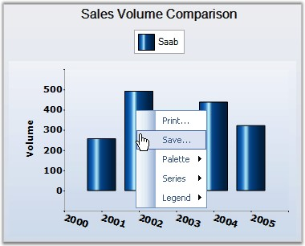
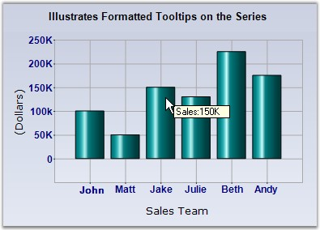
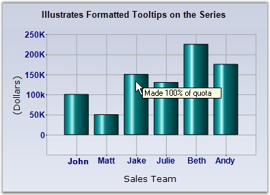

::: {style="DISPLAY: none"}
{#d2h_url_template}{#d2h_package_url style="WIDTH: 0px; DISPLAY: none; HEIGHT: 0px"}
:::

::::: {#nsbanner .d2h_main_nsbanner style="BORDER-BOTTOM: #999999 1px solid; POSITION: relative; PADDING-BOTTOM: 0px; BACKGROUND-COLOR: transparent; PADDING-LEFT: 0px; PADDING-RIGHT: 0px; DISPLAY: none; BORDER-TOP: #999999 1px solid; PADDING-TOP: 0px; LEFT: 0px"}
:::: {#TitleRow .d2h_main_titlerow style="PADDING-BOTTOM: 4px; BACKGROUND-COLOR: transparent; PADDING-LEFT: 22px; WIDTH: 100%; PADDING-RIGHT: 10px; DISPLAY: none; PADDING-TOP: 4px"}
::: {#ienav .d2h_main_ienav style="DISPLAY: none"}
{#D2HPrevious .D2HPreviousEnabled}  {#D2HNext .D2HNextEnabled}
:::
::::
:::::

:::::: {#nstext .d2h_main_nstext style="PADDING-BOTTOM: 10px; BACKGROUND-COLOR: transparent; PADDING-LEFT: 22px; PADDING-RIGHT: 10px; HEIGHT: 100%; OVERFLOW: auto; PADDING-TOP: 5px" hasuserbackground="true" valign="bottom"}
::: {#d2h_breadcrumbs .d2h_breadcrumbs}
[Essential Studio User Guide Documentation](ms-xhelp:///?Id=12457748-09e3-4d74-a240-8e049cedf030){.d2h_breadcrumbsNormal}[ \> ]{.d2h_breadcrumbsLinkSeparator}[User Interface Edition](ms-xhelp:///?Id=c29296b7-531c-413b-a0ec-488ca1f7f669){.d2h_breadcrumbsNormal}[ \> ]{.d2h_breadcrumbsLinkSeparator}[Essential ASP.NET](ms-xhelp:///?Id=25c35330-c127-4dad-9a92-ed79dc7261a6){.d2h_breadcrumbsNormal}[ \> ]{.d2h_breadcrumbsLinkSeparator}[Essential Chart]{.d2h_breadcrumbsContentsOnly}[ \> ]{.d2h_breadcrumbsLinkSeparator}[Concepts and Features](ms-xhelp:///?Id=100687ce-82f2-4424-9d16-0949ea76cf15){.d2h_breadcrumbsNormal}[ \> ]{.d2h_breadcrumbsLinkSeparator}[Runtime Features](ms-xhelp:///?Id=c39d19cc-1870-49f0-82da-e2e91ebb2e43){.d2h_breadcrumbsNormal}
:::

### Context Menu and Tooltip {#context-menu-and-tooltip style="tab-stops: 0pt"}

[]{style="FONT-FAMILY: 'Trebuchet MS','sans-serif'; FONT-SIZE: 9pt"} 

Context Menu

[]{style="FONT-FAMILY: 'Trebuchet MS','sans-serif'; FONT-SIZE: 9pt"} 

The default context menu in chart web control is controlled by the **ShowContextMenu** property which looks like the below image.

[]{style="FONT-FAMILY: 'Trebuchet MS','sans-serif'; FONT-SIZE: 9pt"} 

{border="0"}

**[]{style="FONT-FAMILY: 'Trebuchet MS','sans-serif'; FONT-SIZE: 9pt"}** 

***[Context Menu displayed on a Chart Web Control]{style="FONT-FAMILY: 'Trebuchet MS','sans-serif'; FONT-SIZE: 9pt"}***

**[ToolTips]{style="FONT-FAMILY: 'Trebuchet MS','sans-serif'"}**

[]{style="FONT-FAMILY: 'Trebuchet MS','sans-serif'; FONT-SIZE: 9pt"} 

Essential Chart supports ToolTips in different areas of the chart which comes with multiple customization options.

The different tooltips in the chart can be turned off using the control\'s **ShowToolTips** property.

[]{style="FONT-FAMILY: 'Trebuchet MS','sans-serif'; FONT-SIZE: 9pt"} 

::: {style="BORDER-BOTTOM: windowtext 1pt solid; BORDER-LEFT: medium none; PADDING-BOTTOM: 1pt; MARGIN-TOP: 9pt; PADDING-LEFT: 0pt; PADDING-RIGHT: 0pt; MARGIN-BOTTOM: 9pt; BORDER-TOP: windowtext 1pt solid; BORDER-RIGHT: medium none; PADDING-TOP: 1pt"}
{border="0"}Note: The ShowToolTips property in the chart is false by default, so remember to turn this on, before setting tooltips in the different chart areas.
:::

[]{style="FONT-FAMILY: 'Trebuchet MS','sans-serif'; FONT-SIZE: 9pt"} 

DataPoint Tooltips

**[]{style="FONT-FAMILY: 'Trebuchet MS','sans-serif'"}** 

Tooltips can be shown on each data point when the mouse hovers on them. The format of the tooltip is specified by the following property in ChartSeries.

[]{style="FONT-FAMILY: 'Trebuchet MS','sans-serif'; FONT-SIZE: 9pt"} 

::: {align="center"}
+-----------------------------------+------------------------------------------------------------------------------------------------------------------------------------------------------------+
| ChartSeries Property              | Description                                                                                                                                                |
+-----------------------------------+------------------------------------------------------------------------------------------------------------------------------------------------------------+
| PointsToolTipFormat               | Specifies the format for the datapoint tooltips. The following place-holders can be used in the value.                                                     |
|                                   |                                                                                                                                                            |
|                                   |                                                                                                                                                            |
|                                   |                                                                                                                                                            |
|                                   | **{0}** - Will be replaced by the corresponding **ChartSeries.Name**.                                                                                      |
|                                   |                                                                                                                                                            |
|                                   | **{1}** - Will be replaced by the corresponding ChartSeries.Style.ToolTip.                                                                                 |
|                                   |                                                                                                                                                            |
|                                   | **{2}** - Will be replaced by the corresponding data point\'s tooltip, for example to set the first point\'s tooltip, use \"series1.Styles\[0\].ToolTip\". |
|                                   |                                                                                                                                                            |
|                                   | **{3}** - Will be replaced by the corresponding X value of the point.                                                                                      |
|                                   |                                                                                                                                                            |
|                                   | **{4}** - Will be replaced by the corresponding Y value of the point. **Default setting.**                                                                 |
|                                   |                                                                                                                                                            |
|                                   | **{5}** - Will be replaced by the 2nd Y value, if any.                                                                                                     |
|                                   |                                                                                                                                                            |
|                                   | **{6}** - and so on.                                                                                                                                       |
+-----------------------------------+------------------------------------------------------------------------------------------------------------------------------------------------------------+
:::

**[]{style="COLOR: red; FONT-SIZE: 8pt"}** 

+--------------------------------------------------------------------------------------------------------------+
| **[\[C#\]]{style="FONT-FAMILY: 'Courier New'; COLOR: black"}**                                               |
|                                                                                                              |
| **[]{style="FONT-FAMILY: 'Courier New'; COLOR: black"}**                                                     |
|                                                                                                              |
| [series1.PointsToolTipFormat = [\"Sales:{4}K\"]{style="COLOR: maroon"};]{style="FONT-FAMILY: 'Courier New'"} |
+--------------------------------------------------------------------------------------------------------------+

[]{style="FONT-FAMILY: 'Trebuchet MS','sans-serif'; FONT-SIZE: 9pt"} 

+-------------------------------------------------------------------------------------------------------------+
| **[\[VB.NET\]]{style="FONT-FAMILY: 'Courier New'; COLOR: black"}**                                          |
|                                                                                                             |
| **[]{style="FONT-FAMILY: 'Courier New'; COLOR: black"}**                                                    |
|                                                                                                             |
| [series1.PointsToolTipFormat = [\"Sales:{4}K\"]{style="COLOR: maroon"}]{style="FONT-FAMILY: 'Courier New'"} |
+-------------------------------------------------------------------------------------------------------------+

**[]{style="COLOR: red; FONT-SIZE: 8pt"}** 

{border="0"}

***[]{style="FONT-FAMILY: 'Trebuchet MS','sans-serif'; FONT-SIZE: 9pt"}*** 

Figure 292: ToolTip Format set for Data Points

[]{style="FONT-FAMILY: 'Trebuchet MS','sans-serif'; FONT-SIZE: 9pt"} 

You can also customize the tooltip for individual data points by setting the ToolTip style for each data point. This is best accomplished by listening to the **ChartSeries.PrepareStyle** event as shown below.

[]{style="FONT-FAMILY: 'Trebuchet MS','sans-serif'; FONT-SIZE: 9pt"} 

+-------------------------------------------------------------------------------------------------------------------------------------------------------------------------------------------------------------------------------------------------------+
| **[\[C#\]]{style="FONT-FAMILY: 'Courier New'; COLOR: black"}**                                                                                                                                                                                        |
|                                                                                                                                                                                                                                                       |
| **[]{style="FONT-FAMILY: 'Courier New'; COLOR: black"}**                                                                                                                                                                                              |
|                                                                                                                                                                                                                                                       |
| [//Setting the Tooltip Format]{style="FONT-FAMILY: 'Courier New'; COLOR: green"}                                                                                                                                                                      |
|                                                                                                                                                                                                                                                       |
| [series1.PointsToolTipFormat = [\"{2}\"]{style="COLOR: maroon"}; ]{style="FONT-FAMILY: 'Courier New'"}                                                                                                                                                |
|                                                                                                                                                                                                                                                       |
| []{style="FONT-FAMILY: 'Courier New'"}                                                                                                                                                                                                                |
|                                                                                                                                                                                                                                                       |
| [protected]{style="FONT-FAMILY: 'Courier New'; COLOR: blue"}[ [void]{style="COLOR: blue"} series1_PrepareStyle([object]{style="COLOR: blue"} sender, [ChartPrepareStyleInfoEventArgs]{style="COLOR: teal"} args)]{style="FONT-FAMILY: 'Courier New'"} |
|                                                                                                                                                                                                                                                       |
| [{]{style="FONT-FAMILY: 'Courier New'"}                                                                                                                                                                                                               |
|                                                                                                                                                                                                                                                       |
| [  // Style formatting using a callback. You can apply the same settings directly on the series style on the]{style="FONT-FAMILY: 'Courier New'; COLOR: green"}                                                                                       |
|                                                                                                                                                                                                                                                       |
| [  [// point styles.]{style="COLOR: green"}]{style="FONT-FAMILY: 'Courier New'"}                                                                                                                                                                      |
|                                                                                                                                                                                                                                                       |
| [  [ChartSeries]{style="COLOR: teal"} series = sender [as]{style="COLOR: blue"} [ChartSeries]{style="COLOR: teal"};]{style="FONT-FAMILY: 'Courier New'"}                                                                                              |
|                                                                                                                                                                                                                                                       |
| [  [if]{style="COLOR: blue"} (series != [null]{style="COLOR: blue"})]{style="FONT-FAMILY: 'Courier New'"}                                                                                                                                             |
|                                                                                                                                                                                                                                                       |
| [  {]{style="FONT-FAMILY: 'Courier New'"}                                                                                                                                                                                                             |
|                                                                                                                                                                                                                                                       |
| [    args.Style.ToolTip = [\"Made \"]{style="COLOR: maroon"} + ( (series.Points\[args.Index\].YValues\[0\] / 150) \* 100) + [\"% of quota\"]{style="COLOR: maroon"};]{style="FONT-FAMILY: 'Courier New'"}                                             |
|                                                                                                                                                                                                                                                       |
| [    args.Handled = [true]{style="COLOR: blue"};]{style="FONT-FAMILY: 'Courier New'"}                                                                                                                                                                 |
|                                                                                                                                                                                                                                                       |
| [  }]{style="FONT-FAMILY: 'Courier New'"}                                                                                                                                                                                                             |
|                                                                                                                                                                                                                                                       |
| [}]{style="FONT-FAMILY: 'Courier New'"}                                                                                                                                                                                                               |
+-------------------------------------------------------------------------------------------------------------------------------------------------------------------------------------------------------------------------------------------------------+

[]{style="FONT-FAMILY: 'Trebuchet MS','sans-serif'; FONT-SIZE: 9pt"} 

+---------------------------------------------------------------------------------------------------------------------------------------------------------------------------------------------------------------------------------------------------------------------------------------------------------------------------------------------+
| **[\[VB.NET\]]{style="FONT-FAMILY: 'Courier New'; COLOR: black"}**                                                                                                                                                                                                                                                                          |
|                                                                                                                                                                                                                                                                                                                                             |
| **[]{style="FONT-FAMILY: 'Courier New'; COLOR: black"}**                                                                                                                                                                                                                                                                                    |
|                                                                                                                                                                                                                                                                                                                                             |
| [\'Setting the Tooltip Format]{style="FONT-FAMILY: 'Courier New'; COLOR: green"}                                                                                                                                                                                                                                                            |
|                                                                                                                                                                                                                                                                                                                                             |
| [series1.PointsToolTipFormat = [\"{2}\"]{style="COLOR: maroon"}]{style="FONT-FAMILY: 'Courier New'"}                                                                                                                                                                                                                                        |
|                                                                                                                                                                                                                                                                                                                                             |
| []{style="FONT-FAMILY: 'Courier New'; COLOR: maroon"}                                                                                                                                                                                                                                                                                       |
|                                                                                                                                                                                                                                                                                                                                             |
| [Protected]{style="FONT-FAMILY: 'Courier New'; COLOR: blue"}[ [Sub]{style="COLOR: blue"} series1_PrepareStyle([ByVal]{style="COLOR: blue"} sender [As]{style="COLOR: blue"} [Object]{style="COLOR: blue"}, [ByVal]{style="COLOR: blue"} args [As]{style="COLOR: blue"} ChartPrepareStyleInfoEventArgs)]{style="FONT-FAMILY: 'Courier New'"} |
|                                                                                                                                                                                                                                                                                                                                             |
| [\' Style formatting using a callback. You can apply the same settings directly on the series style on the]{style="FONT-FAMILY: 'Courier New'; COLOR: green"}                                                                                                                                                                               |
|                                                                                                                                                                                                                                                                                                                                             |
| [\' point styles.]{style="FONT-FAMILY: 'Courier New'; COLOR: green"}                                                                                                                                                                                                                                                                        |
|                                                                                                                                                                                                                                                                                                                                             |
| [    [Dim]{style="COLOR: blue"} series [As]{style="COLOR: blue"} ChartSeries = [CType]{style="COLOR: blue"}(IIf([TypeOf]{style="COLOR: blue"} sender [Is]{style="COLOR: blue"} ChartSeries, sender, [Nothing]{style="COLOR: blue"}), ChartSeries)]{style="FONT-FAMILY: 'Courier New'"}                                                      |
|                                                                                                                                                                                                                                                                                                                                             |
| [    [If]{style="COLOR: blue"} [Not]{style="COLOR: blue"} series [Is]{style="COLOR: blue"} [Nothing]{style="COLOR: blue"} [Then]{style="COLOR: blue"}]{style="FONT-FAMILY: 'Courier New'"}                                                                                                                                                  |
|                                                                                                                                                                                                                                                                                                                                             |
| [      args.Style.ToolTip = [\"Made \"]{style="COLOR: maroon"} + ( (series.Points\[args.Index\].YValues\[0\] / 150) \* 100) + [\"% of quota\"]{style="COLOR: maroon"}]{style="FONT-FAMILY: 'Courier New'"}                                                                                                                                  |
|                                                                                                                                                                                                                                                                                                                                             |
| [      args.Handled = [True]{style="COLOR: blue"}]{style="FONT-FAMILY: 'Courier New'"}                                                                                                                                                                                                                                                      |
|                                                                                                                                                                                                                                                                                                                                             |
| [    [End]{style="COLOR: blue"} [If]{style="COLOR: blue"}]{style="FONT-FAMILY: 'Courier New'"}                                                                                                                                                                                                                                              |
|                                                                                                                                                                                                                                                                                                                                             |
| [End]{style="FONT-FAMILY: 'Courier New'; COLOR: blue"}[ [Sub]{style="COLOR: blue"}]{style="FONT-FAMILY: 'Courier New'"}                                                                                                                                                                                                                     |
+---------------------------------------------------------------------------------------------------------------------------------------------------------------------------------------------------------------------------------------------------------------------------------------------------------------------------------------------+

**[]{style="COLOR: red; FONT-SIZE: 8pt"}** 

{border="0"}

***[]{style="FONT-FAMILY: 'Trebuchet MS','sans-serif'; FONT-SIZE: 9pt"}*** 

Figure 293: ToolTip Format set for Individual Data Points

**[]{style="FONT-FAMILY: 'Trebuchet MS','sans-serif'; FONT-SIZE: 9pt"}** 

Chart Area Tooltip

**[]{style="FONT-FAMILY: 'Trebuchet MS','sans-serif'; FONT-SIZE: 9pt"}** 

Tooltips can also be set for the whole chart area (does not include legends and the space around legends) through the **ChartAreaToolTip**. The data points tooltips will of course override this setting.

[]{style="FONT-FAMILY: 'Trebuchet MS','sans-serif'; FONT-SIZE: 9pt"} 

Chart Empty Area Tooltip

[]{style="FONT-FAMILY: 'Trebuchet MS','sans-serif'; FONT-SIZE: 9pt"} 

The chart also lets you show a tooltip when the mouse hovers over empty areas in the chart (usually around the legend) via the **ChartToolTip** property.

[]{style="FONT-FAMILY: 'Trebuchet MS','sans-serif'; FONT-SIZE: 9pt"} 

Toolbar Tooltip

**[]{style="FONT-FAMILY: 'Trebuchet MS','sans-serif'"}** 

ToolTip for the ChartWeb toolbar is set through **ChartWebControl.Toolbar.Tooltip** property.

[]{#p203} 

[]{#related-topics}
::::::
