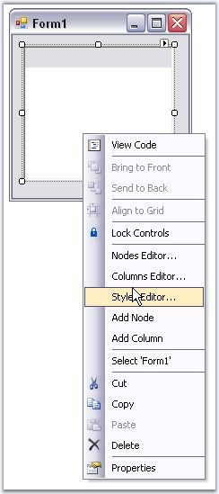

::: {style="DISPLAY: none"}
{#d2h_url_template}{#d2h_package_url style="WIDTH: 0px; DISPLAY: none; HEIGHT: 0px"}
:::

::: {.d2h_secondary_topic style="PADDING-BOTTOM: 10pt; MARGIN: 0pt; PADDING-LEFT: 0pt; PADDING-RIGHT: 0pt; PADDING-TOP: 0pt"}
##### Context Menu at DesignTime {#context-menu-at-designtime style="MARGIN-LEFT: 18pt; tab-stops: 18.0pt"}

[]{style="COLOR: #15428b"} 

You can access the below options using this context menu at the design time.

[]{style="COLOR: #15428b"} 

[·      ]{style="FONT-FAMILY: Symbol"}Nodes Editor, opens the NodeCollection Editor

[·      ]{style="FONT-FAMILY: Symbol"}Columns Editor, opens the Columns Editor which lets you add columns.

[·      ]{style="FONT-FAMILY: Symbol"}Add Columns, lets you directly add new columns.

[·      ]{style="FONT-FAMILY: Symbol"}Styles Editor, opens the BaseStyles Collection Editor.

[·      ]{style="FONT-FAMILY: Symbol"}Add Node, lets you add new nodes.

[]{style="COLOR: #15428b"} 

{border="0"}

[]{style="COLOR: #15428b"} 

Figure 1185: Design-Time Context Menu

 

 

 

 

[]{#related-topics}
:::
