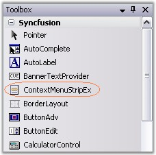
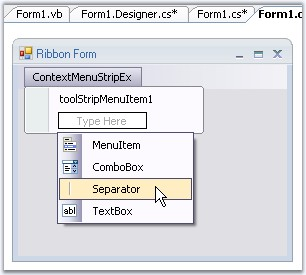
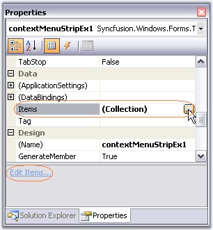
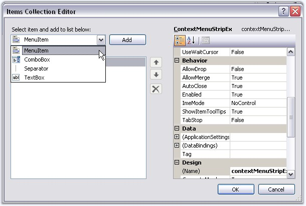
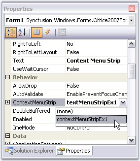
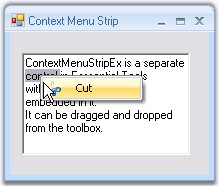

::: {style="DISPLAY: none"}
{#d2h_url_template}{#d2h_package_url style="WIDTH: 0px; DISPLAY: none; HEIGHT: 0px"}
:::

::: {.d2h_secondary_topic style="PADDING-BOTTOM: 10pt; MARGIN: 0pt; PADDING-LEFT: 0pt; PADDING-RIGHT: 0pt; PADDING-TOP: 0pt"}
#### ContextMenuStripEx {#contextmenustripex style="tab-stops: 0pt"}

[]{style="COLOR: #15428b"} 

ContextMenuStripEx is a separate control in Essential Tools with advanced features embedded in it. It can be dragged and dropped from the toolbox.

[]{style="COLOR: #15428b"} 

{border="0"}

[]{style="COLOR: #15428b"} 

Figure 1418: ContextMenuStripEx in the Toolbox

[]{style="COLOR: #15428b"} 

Creating ContextMenuStripEx

**[]{style="COLOR: #15428b"}** 

Through Designer

**[]{style="COLOR: #15428b"}** 

Drag and drop a ContextMenuStripEx to the form. Click \"Type Here\" to add the items. This displays a collection of menu items, using which user can add the menu items.

[]{style="COLOR: #15428b"} 

{border="0"}

**[]{style="COLOR: #15428b"}** 

Figure 1419: Adding Menu Items Through Designer

**[]{style="COLOR: #15428b"}** 

Items can also be added using **ContextMenuStripEx.Items** property or **Edit Items\...** command in the property grid.

[]{style="COLOR: #15428b"} 

{border="0"}

[]{style="COLOR: #15428b"} 

***[]{style="COLOR: #15428b"}*** 

Figure 1420: Options for Accessing Items Collection Editor through Item property or Edit Items\... Command

**[]{style="COLOR: #15428b"}** 

{border="0"}

**[]{style="COLOR: #15428b"}** 

Figure 1421: Adding Menu Items through Items Collection Editor in Designer

[]{style="COLOR: #15428b"} 

Through Code

**[]{style="COLOR: #15428b"}** 

The below code snippets adds a ToolStripItem (Cut) to the menu list.

[]{style="COLOR: #15428b"} 

+-----------------------------------------------------------------------------------------------------------------------------------------------------------------------------------------------------------------------------------------------------------------------------------+
| **[\[C#\]]{style="FONT-FAMILY: 'Courier New'; COLOR: black"}**                                                                                                                                                                                                                    |
|                                                                                                                                                                                                                                                                                   |
| []{style="COLOR: #15428b"}                                                                                                                                                                                                                                                        |
|                                                                                                                                                                                                                                                                                   |
| [//Declaration]{style="FONT-FAMILY: 'Courier New'; COLOR: green"}                                                                                                                                                                                                                 |
|                                                                                                                                                                                                                                                                                   |
| [private]{style="FONT-FAMILY: 'Courier New'; COLOR: blue"}[ Syncfusion.Windows.Forms.Tools.[ContextMenuStripEx]{style="COLOR: teal"} EditorContextMenuStripEx;]{style="FONT-FAMILY: 'Courier New'"}                                                                               |
|                                                                                                                                                                                                                                                                                   |
| [private]{style="FONT-FAMILY: 'Courier New'; COLOR: blue"}[ System.Windows.Forms.[ToolStripMenuItem]{style="COLOR: teal"} toolStripMenuItem1;]{style="FONT-FAMILY: 'Courier New'"}                                                                                                |
|                                                                                                                                                                                                                                                                                   |
| []{style="FONT-FAMILY: 'Courier New'"}                                                                                                                                                                                                                                            |
|                                                                                                                                                                                                                                                                                   |
| [//Initializing]{style="FONT-FAMILY: 'Courier New'; COLOR: green"}                                                                                                                                                                                                                |
|                                                                                                                                                                                                                                                                                   |
| [this]{style="FONT-FAMILY: 'Courier New'; COLOR: blue"}[.EditorContextMenuStripEx = [new]{style="COLOR: blue"} Syncfusion.Windows.Forms.Tools.[ContextMenuStripEx]{style="COLOR: teal"}();]{style="FONT-FAMILY: 'Courier New'"}                                                   |
|                                                                                                                                                                                                                                                                                   |
| []{style="FONT-FAMILY: 'Courier New'"}                                                                                                                                                                                                                                            |
|                                                                                                                                                                                                                                                                                   |
| [//Assigning the ContextMenuStrip created]{style="FONT-FAMILY: 'Courier New'; COLOR: green"}                                                                                                                                                                                      |
|                                                                                                                                                                                                                                                                                   |
| [this]{style="FONT-FAMILY: 'Courier New'; COLOR: blue"}[.richTextBox1.ContextMenuStrip = [this]{style="COLOR: blue"}.EditorContextMenuStripEx;]{style="FONT-FAMILY: 'Courier New'"}                                                                                               |
|                                                                                                                                                                                                                                                                                   |
| []{style="FONT-FAMILY: 'Courier New'"}                                                                                                                                                                                                                                            |
|                                                                                                                                                                                                                                                                                   |
| [//Adding a menu item]{style="FONT-FAMILY: 'Courier New'; COLOR: green"}                                                                                                                                                                                                          |
|                                                                                                                                                                                                                                                                                   |
| [this]{style="FONT-FAMILY: 'Courier New'; COLOR: blue"}[.EditorContextMenuStripEx.Items.AddRange([new]{style="COLOR: blue"} System.Windows.Forms.[ToolStripItem]{style="COLOR: teal"}\[\] {[this]{style="COLOR: blue"}.toolStripMenuItem1});]{style="FONT-FAMILY: 'Courier New'"} |
|                                                                                                                                                                                                                                                                                   |
| [this]{style="FONT-FAMILY: 'Courier New'; COLOR: blue"}[.toolStripMenuItem1.Image = ((System.Drawing.[Image]{style="COLOR: teal"})(resources.GetObject([\"toolStripMenuItem1.Image\"]{style="COLOR: maroon"})));]{style="FONT-FAMILY: 'Courier New'"}                             |
|                                                                                                                                                                                                                                                                                   |
| [this]{style="FONT-FAMILY: 'Courier New'; COLOR: blue"}[.toolStripMenuItem1.Text = [\"Cu&t\"]{style="COLOR: maroon"};]{style="FONT-FAMILY: 'Courier New'"}                                                                                                                        |
|                                                                                                                                                                                                                                                                                   |
| []{style="FONT-FAMILY: 'Courier New'"}                                                                                                                                                                                                                                            |
|                                                                                                                                                                                                                                                                                   |
| [this]{style="FONT-FAMILY: 'Courier New'; COLOR: blue"}[.EditorContextMenuStripEx.ResumeLayout([false]{style="COLOR: blue"});]{style="FONT-FAMILY: 'Courier New'"}                                                                                                                |
+-----------------------------------------------------------------------------------------------------------------------------------------------------------------------------------------------------------------------------------------------------------------------------------+

[]{#p1181}[]{style="COLOR: #15428b"} 

+---------------------------------------------------------------------------------------------------------------------------------------------------------------------------------------------------------------------------------------------------------+
| **[\[VB.NET\]]{style="FONT-FAMILY: 'Courier New'; COLOR: black"}**                                                                                                                                                                                      |
|                                                                                                                                                                                                                                                         |
| []{style="FONT-FAMILY: 'Courier New'; COLOR: green"}                                                                                                                                                                                                    |
|                                                                                                                                                                                                                                                         |
| [\'Declaration]{style="FONT-FAMILY: 'Courier New'; COLOR: green"}                                                                                                                                                                                       |
|                                                                                                                                                                                                                                                         |
| [Private]{style="FONT-FAMILY: 'Courier New'; COLOR: blue"}[ EditorContextMenuStripEx [As]{style="COLOR: blue"} Syncfusion.Windows.Forms.Tools.ContextMenuStripEx]{style="FONT-FAMILY: 'Courier New'"}                                                   |
|                                                                                                                                                                                                                                                         |
| [Private]{style="FONT-FAMILY: 'Courier New'; COLOR: blue"}[ toolStripMenuItem1 [As]{style="COLOR: blue"} System.Windows.Forms.ToolStripMenuItem]{style="FONT-FAMILY: 'Courier New'"}                                                                    |
|                                                                                                                                                                                                                                                         |
| []{style="FONT-FAMILY: 'Courier New'; COLOR: green"}                                                                                                                                                                                                    |
|                                                                                                                                                                                                                                                         |
| [\'Initializing]{style="FONT-FAMILY: 'Courier New'; COLOR: green"}                                                                                                                                                                                      |
|                                                                                                                                                                                                                                                         |
| [Me]{style="FONT-FAMILY: 'Courier New'; COLOR: blue"}[.EditorContextMenuStripEx = [New]{style="COLOR: blue"} Syncfusion.Windows.Forms.Tools.ContextMenuStripEx]{style="FONT-FAMILY: 'Courier New'"}                                                     |
|                                                                                                                                                                                                                                                         |
| []{style="FONT-FAMILY: 'Courier New'; COLOR: green"}                                                                                                                                                                                                    |
|                                                                                                                                                                                                                                                         |
| [\'Assigning the contextmenustrip created]{style="FONT-FAMILY: 'Courier New'; COLOR: green"}                                                                                                                                                            |
|                                                                                                                                                                                                                                                         |
| [Me]{style="FONT-FAMILY: 'Courier New'; COLOR: blue"}[.richTextBox1.ContextMenuStrip = [Me]{style="COLOR: blue"}.EditorContextMenuStripEx]{style="FONT-FAMILY: 'Courier New'"}                                                                          |
|                                                                                                                                                                                                                                                         |
| []{style="FONT-FAMILY: 'Courier New'; COLOR: green"}                                                                                                                                                                                                    |
|                                                                                                                                                                                                                                                         |
| [\'Adding a menu item]{style="FONT-FAMILY: 'Courier New'; COLOR: green"}                                                                                                                                                                                |
|                                                                                                                                                                                                                                                         |
| [Me]{style="FONT-FAMILY: 'Courier New'; COLOR: blue"}[.EditorContextMenuStripEx.Items.AddRange([New]{style="COLOR: blue"} System.Windows.Forms.ToolStripItem() {[Me]{style="COLOR: blue"}.toolStripMenuItem1})]{style="FONT-FAMILY: 'Courier New'"}     |
|                                                                                                                                                                                                                                                         |
| [Me]{style="FONT-FAMILY: 'Courier New'; COLOR: blue"}[.toolStripMenuItem1.Image = [CType]{style="COLOR: blue"}((Resources.GetObject([\"toolStripMenuItem1.Image\"]{style="COLOR: maroon"})), System.Drawing.Image)]{style="FONT-FAMILY: 'Courier New'"} |
|                                                                                                                                                                                                                                                         |
| [Me]{style="FONT-FAMILY: 'Courier New'; COLOR: blue"}[.toolStripMenuItem1.Text = [\"Cu&t\"]{style="COLOR: maroon"}]{style="FONT-FAMILY: 'Courier New'"}                                                                                                 |
|                                                                                                                                                                                                                                                         |
| []{style="FONT-FAMILY: 'Courier New'; COLOR: blue"}                                                                                                                                                                                                     |
|                                                                                                                                                                                                                                                         |
| [Me]{style="FONT-FAMILY: 'Courier New'; COLOR: blue"}[.EditorContextMenuStripEx.ResumeLayout([False]{style="COLOR: blue"})]{style="FONT-FAMILY: 'Courier New'"}[]{style="FONT-FAMILY: 'Courier New'"}                                                   |
+---------------------------------------------------------------------------------------------------------------------------------------------------------------------------------------------------------------------------------------------------------+

[]{style="COLOR: #15428b"} 

Associating the ContextMenuStrip to a control

[]{style="COLOR: #15428b"} 

This can be easily done by assigning the ContextMenuStripEx to the **Control.ContextMenuStrip** property.

[]{style="COLOR: #15428b"} 

{border="0"}

[]{style="COLOR: #15428b"} 

***[]{style="COLOR: #15428b"}*** 

Figure 1422: Associating ContextMenuStripEx to RichTextBox

**[]{style="COLOR: #15428b"}** 

+----------------------------------------------------------------------------------------------------------------------------------------------------------------------------------------------------------------------+
| **[\[C#\]]{style="FONT-FAMILY: 'Courier New'; COLOR: black"}**                                                                                                                                                       |
|                                                                                                                                                                                                                      |
| []{style="COLOR: #15428b"}                                                                                                                                                                                           |
|                                                                                                                                                                                                                      |
| [this]{style="FONT-FAMILY: 'Courier New'; COLOR: blue"}[.richTextBox1.ContextMenuStrip = [this]{style="COLOR: blue"}.contextMenuStripEx1;]{style="FONT-FAMILY: 'Courier New'"}[]{style="FONT-FAMILY: 'Courier New'"} |
+----------------------------------------------------------------------------------------------------------------------------------------------------------------------------------------------------------------------+

[]{style="COLOR: #15428b"} 

+---------------------------------------------------------------------------------------------------------------------------------------------------------------------------+
| **[\[VB.NET\]]{style="FONT-FAMILY: 'Courier New'; COLOR: black"}**                                                                                                        |
|                                                                                                                                                                           |
| []{style="FONT-FAMILY: 'Courier New'; COLOR: green"}                                                                                                                      |
|                                                                                                                                                                           |
| [Me]{style="FONT-FAMILY: 'Courier New'; COLOR: blue"}[.richTextBox1.ContextMenuStrip = [Me]{style="COLOR: blue"}.contextMenuStripEx1]{style="FONT-FAMILY: 'Courier New'"} |
+---------------------------------------------------------------------------------------------------------------------------------------------------------------------------+

[]{style="COLOR: #15428b"} 

At Run time, when the user right clicks the control, menu items will be displayed like the below image.

[]{style="COLOR: #15428b"} 

{border="0"}

[]{style="COLOR: #15428b"} 

Figure 1423: Context Menu displayed on a RichTextBox

**[]{style="COLOR: #15428b"}** 

Various Features and Customization options are discussed in the following topics.

[]{style="COLOR: #15428b"} 

[·      ]{style="FONT-FAMILY: Symbol"}Style Settings

[·      ]{style="FONT-FAMILY: Symbol"}Foreground Settings

[·      ]{style="FONT-FAMILY: Symbol"}Margin and Shadow Settings

[·      ]{style="FONT-FAMILY: Symbol"}RunTime Features

[·      ]{style="FONT-FAMILY: Symbol"}RTL Support

[·      ]{style="FONT-FAMILY: Symbol"}ToolStripItems

 

More:

[ ]{#related-topics}

[{border="0" align="absMiddle"}Style Settings](ms-xhelp:///?Id=a9a7cf97-feb9-4df8-b5be-65e7a51990d5){style="TEXT-DECORATION: none"}

[{border="0" align="absMiddle"}Foreground Settings of ContextMenuStripEx](ms-xhelp:///?Id=59a73ea5-8f25-4964-97bc-07974339c6a0){style="TEXT-DECORATION: none"}

[{border="0" align="absMiddle"}Margin and Shadow Settings](ms-xhelp:///?Id=76803ed8-abf3-48cf-89a0-94087be77e52){style="TEXT-DECORATION: none"}

[{border="0" align="absMiddle"}RunTime Features](ms-xhelp:///?Id=54603769-96ce-4737-bf42-907e16335cc7){style="TEXT-DECORATION: none"}

[{border="0" align="absMiddle"}RTL Support](ms-xhelp:///?Id=cc44d9c5-56de-48f4-a800-b5f267635f11){style="TEXT-DECORATION: none"}

[{border="0" align="absMiddle"}ToolStripItems](ms-xhelp:///?Id=6e8a5926-0c77-4998-9937-f11b3f29e8df){style="TEXT-DECORATION: none"}
:::
