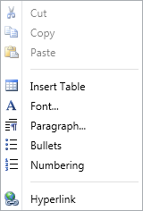

::: {style="DISPLAY: none"}
{#d2h_url_template}{#d2h_package_url style="WIDTH: 0px; DISPLAY: none; HEIGHT: 0px"}
:::

::: {.d2h_secondary_topic style="PADDING-BOTTOM: 10pt; MARGIN: 0pt; PADDING-LEFT: 0pt; PADDING-RIGHT: 0pt; PADDING-TOP: 0pt"}
#### Context Menu Support {#context-menu-support style="tab-stops: 0pt"}

RichTextBoxAdv supports a context menu similar to MS Word. It supports the following list of features in its context menu:

1.  Cut

2.  Copy

3.  Paste

4.  Insert Table

5.  Font

6.  Paragraph

7.  Bullets

8.  Numbering

9.  Hyperlink

{border="0"}

Figure 917: Context Menu

[]{#related-topics}
:::
