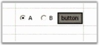

::: {style="DISPLAY: none"}
{#d2h_url_template}{#d2h_package_url style="WIDTH: 0px; DISPLAY: none; HEIGHT: 0px"}
:::

::: {.d2h_secondary_topic style="PADDING-BOTTOM: 10pt; MARGIN: 0pt; PADDING-LEFT: 0pt; PADDING-RIGHT: 0pt; PADDING-TOP: 0pt"}
##### Control {#control style="tab-stops: 0pt"}

[]{style="FONT-FAMILY: 'Trebuchet MS','sans-serif'; COLOR: #15428b; FONT-SIZE: 9pt"} 

You can place an arbitrary control in a grid cell through the **Control** cell type. This cell type differs from most other cell types shipped with Essential Grid in which it cannot be shared among several cells. The Control cell type requires you to instantiate a control object for each cell that uses this cell type, and set that object to *style.Control*. A different control object is required for every cell that makes use of the Control cell type.

[]{style="FONT-FAMILY: 'Trebuchet MS','sans-serif'; COLOR: #15428b; FONT-SIZE: 9pt"} 

The following code example illustrates how to set the cell type to Control.

[]{style="FONT-FAMILY: 'Courier New'; COLOR: #15428b"} 

+---------------------------------------------------------------------------------------------------------------------------------------------------------------------------------------+
| **[\[C#\]]{style="FONT-FAMILY: 'Courier New'; COLOR: black"}**                                                                                                                        |
|                                                                                                                                                                                       |
| []{style="FONT-FAMILY: 'Courier New'; COLOR: black"}                                                                                                                                  |
|                                                                                                                                                                                       |
| [// Set up a Control Cell.]{style="FONT-FAMILY: 'Courier New'; COLOR: green"}                                                                                                         |
|                                                                                                                                                                                       |
| [this]{style="FONT-FAMILY: 'Courier New'; COLOR: blue"}[.radioButton1.Checked = [true]{style="COLOR: blue"}; ]{style="FONT-FAMILY: 'Courier New'"}                                    |
|                                                                                                                                                                                       |
| [this]{style="FONT-FAMILY: 'Courier New'; COLOR: blue"}[.gridControl1.CoveredRanges.Add([GridRangeInfo]{style="COLOR: #2b91af"}.Cells(2,2,8,2));]{style="FONT-FAMILY: 'Courier New'"} |
|                                                                                                                                                                                       |
| [this]{style="FONT-FAMILY: 'Courier New'; COLOR: blue"}[.gridControl1.ColWidths\[2\] = 200; ]{style="FONT-FAMILY: 'Courier New'"}                                                     |
|                                                                                                                                                                                       |
| [this]{style="FONT-FAMILY: 'Courier New'; COLOR: blue"}[.gridControl1\[2,2\].CellType = [\"Control\"]{style="COLOR: #a31515"}; ]{style="FONT-FAMILY: 'Courier New'"}                  |
|                                                                                                                                                                                       |
| []{style="FONT-FAMILY: 'Courier New'"}                                                                                                                                                |
|                                                                                                                                                                                       |
| [// Set the control object.]{style="FONT-FAMILY: 'Courier New'; COLOR: green"}                                                                                                        |
|                                                                                                                                                                                       |
| [this]{style="FONT-FAMILY: 'Courier New'; COLOR: blue"}[.gridControl1\[2,2\].Control = [this]{style="COLOR: blue"}.dataPanel;]{style="FONT-FAMILY: 'Courier New'"}                    |
+---------------------------------------------------------------------------------------------------------------------------------------------------------------------------------------+

[]{style="FONT-FAMILY: 'Trebuchet MS','sans-serif'; COLOR: #15428b; FONT-SIZE: 9pt"} 

+-----------------------------------------------------------------------------------------------------------------------------------------------------------------+
| **[\[VB.NET\]]{style="FONT-FAMILY: 'Courier New'; COLOR: black"}**                                                                                              |
|                                                                                                                                                                 |
| []{style="FONT-FAMILY: 'Courier New'; COLOR: black"}                                                                                                            |
|                                                                                                                                                                 |
| [\' Set up a Control Cell.]{style="FONT-FAMILY: 'Courier New'; COLOR: green"}                                                                                   |
|                                                                                                                                                                 |
| [Me]{style="FONT-FAMILY: 'Courier New'; COLOR: blue"}[.radioButton1.Checked = [True]{style="COLOR: blue"}]{style="FONT-FAMILY: 'Courier New'"}                  |
|                                                                                                                                                                 |
| [Me]{style="FONT-FAMILY: 'Courier New'; COLOR: blue"}[.gridControl1.CoveredRanges.Add(GridRangeInfo.Cells(2, 2, 8, 2))]{style="FONT-FAMILY: 'Courier New'"}     |
|                                                                                                                                                                 |
| [Me]{style="FONT-FAMILY: 'Courier New'; COLOR: blue"}[.gridControl1.ColWidths(2) = 200]{style="FONT-FAMILY: 'Courier New'"}                                     |
|                                                                                                                                                                 |
| [Me]{style="FONT-FAMILY: 'Courier New'; COLOR: blue"}[.gridControl1(2, 2).CellType = [\"Control\"]{style="COLOR: #a31515"}]{style="FONT-FAMILY: 'Courier New'"} |
|                                                                                                                                                                 |
| []{style="FONT-FAMILY: 'Courier New'; COLOR: #a31515"}                                                                                                          |
|                                                                                                                                                                 |
| [\' Set the control object.]{style="FONT-FAMILY: 'Courier New'; COLOR: green"}                                                                                  |
|                                                                                                                                                                 |
| [Me]{style="FONT-FAMILY: 'Courier New'; COLOR: blue"}[.gridControl1(2, 2).Control = [Me]{style="COLOR: blue"}.dataPanel]{style="FONT-FAMILY: 'Courier New'"}    |
+-----------------------------------------------------------------------------------------------------------------------------------------------------------------+

[]{style="FONT-FAMILY: 'Trebuchet MS','sans-serif'; COLOR: #15428b; FONT-SIZE: 9pt"} 

The following screen shot shows a panel holding two radio buttons and a push button in the cell.

[]{style="FONT-FAMILY: 'Trebuchet MS','sans-serif'; COLOR: #15428b; FONT-SIZE: 9pt"} 

{border="0"}

[]{style="FONT-FAMILY: 'Trebuchet MS','sans-serif'; COLOR: #15428b; FONT-SIZE: 9pt"} 

Figure 77: Control Cells

 

[]{#p54} 

 

[]{#related-topics}
:::
