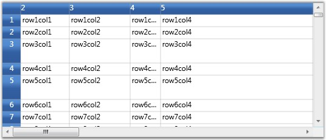
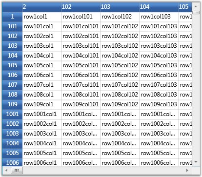
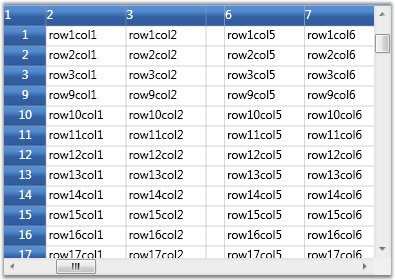
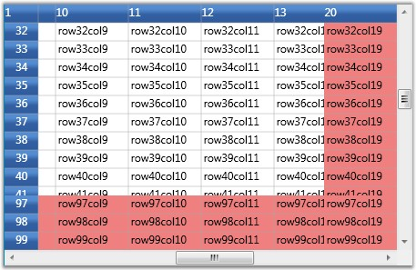
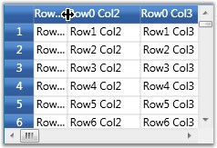
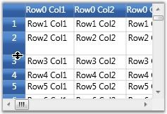
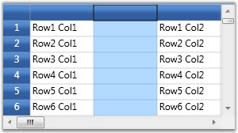
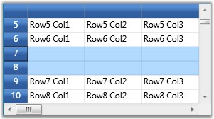
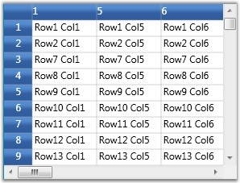

::: {style="DISPLAY: none"}
{#d2h_url_template}{#d2h_package_url style="WIDTH: 0px; DISPLAY: none; HEIGHT: 0px"}
:::

::::::: {.d2h_secondary_topic style="PADDING-BOTTOM: 10pt; MARGIN: 0pt; PADDING-LEFT: 0pt; PADDING-RIGHT: 0pt; PADDING-TOP: 0pt"}
#### Controlling Rows and Columns {#controlling-rows-and-columns style="tab-stops: 0pt"}

[]{style="FONT-FAMILY: 'Trebuchet MS','sans-serif'; COLOR: #15428b; FONT-SIZE: 9pt"} 

Each Grid instance is tied to a model, which contains the data represented by the Grid control. The grid model exposes properties that allow the user to manipulate grid rows and columns.

[]{style="FONT-FAMILY: 'Trebuchet MS','sans-serif'; COLOR: #15428b; FONT-SIZE: 9pt"} 

Setting Rows and Columns count

**[]{style="FONT-FAMILY: 'Trebuchet MS','sans-serif'; COLOR: #15428b; FONT-SIZE: 9pt"}** 

The grid model has **RowCount** and **ColumnCount** properties. These can be set to change the number of rows and columns in the grid control, as shown below:

[]{style="FONT-FAMILY: 'Trebuchet MS','sans-serif'; COLOR: red; FONT-SIZE: 9pt"} 

+-------------------------------------------------------------------------+
| **[\[C#\]]{style="FONT-FAMILY: 'Courier New'; COLOR: black"}**          |
|                                                                         |
| **[]{style="FONT-FAMILY: 'Courier New'; COLOR: black"}**                |
|                                                                         |
| [// Set Row count]{style="FONT-FAMILY: 'Courier New'; COLOR: green"}    |
|                                                                         |
| [grid.Model.RowCount = 10;]{style="FONT-FAMILY: 'Courier New'"}         |
|                                                                         |
| []{style="FONT-FAMILY: 'Courier New'"}                                  |
|                                                                         |
| [// Set Column count]{style="FONT-FAMILY: 'Courier New'; COLOR: green"} |
|                                                                         |
| [grid.Model.ColumnCount = 20;]{style="FONT-FAMILY: 'Courier New'"}      |
+-------------------------------------------------------------------------+

[]{style="FONT-FAMILY: 'Trebuchet MS','sans-serif'; COLOR: #15428b; FONT-SIZE: 9pt"} 

Setting Row Heights and Column Widths

**[]{style="FONT-FAMILY: 'Trebuchet MS','sans-serif'; COLOR: #15428b; FONT-SIZE: 9pt"}** 

The grid model also stores information on row heights and column widths. Its ColumnWidths and RowHeights properties can be changed using indexers as shown below:

[]{style="FONT-FAMILY: 'Trebuchet MS','sans-serif'; COLOR: #15428b; FONT-SIZE: 9pt"} 

+------------------------------------------------------------------------------+
| **[\[C#\]]{style="FONT-FAMILY: 'Courier New'; COLOR: black"}**               |
|                                                                              |
| **[]{style="FONT-FAMILY: 'Courier New'; COLOR: black"}**                     |
|                                                                              |
| [// Setting column widths]{style="FONT-FAMILY: 'Courier New'; COLOR: green"} |
|                                                                              |
| [grid.Model.ColumnWidths\[0\] = 30;]{style="FONT-FAMILY: 'Courier New'"}     |
|                                                                              |
| [grid.Model.ColumnWidths\[1\] = 80;]{style="FONT-FAMILY: 'Courier New'"}     |
|                                                                              |
| [grid.Model.ColumnWidths\[2\] = 100;]{style="FONT-FAMILY: 'Courier New'"}    |
|                                                                              |
| [grid.Model.ColumnWidths\[3\] = 50;]{style="FONT-FAMILY: 'Courier New'"}     |
|                                                                              |
| [grid.Model.ColumnWidths\[4\] = 250;]{style="FONT-FAMILY: 'Courier New'"}    |
|                                                                              |
| []{style="FONT-FAMILY: 'Courier New'"}                                       |
|                                                                              |
| [// Setting row heights]{style="FONT-FAMILY: 'Courier New'; COLOR: green"}   |
|                                                                              |
| [grid.Model.RowHeights\[5\] = 40;]{style="FONT-FAMILY: 'Courier New'"}       |
|                                                                              |
| [grid.Model.RowHeights\[3\] = 40;]{style="FONT-FAMILY: 'Courier New'"}       |
+------------------------------------------------------------------------------+

[]{style="FONT-FAMILY: 'Trebuchet MS','sans-serif'; COLOR: #15428b; FONT-SIZE: 9pt"} 

{border="0"}

[]{style="FONT-FAMILY: 'Trebuchet MS','sans-serif'; COLOR: #15428b; FONT-SIZE: 9pt"} 

Figure 49: Setting Row heights and Column widths

[]{style="FONT-FAMILY: 'Trebuchet MS','sans-serif'; COLOR: #15428b; FONT-SIZE: 9pt"} 

You can also specify the **DefaultLineSize** setting on **ColumnWidths** and **RowHeights** in order to set the default width or height.

[]{style="FONT-FAMILY: 'Trebuchet MS','sans-serif'; COLOR: #15428b; FONT-SIZE: 9pt"} 

+------------------------------------------------------------------------------------------------------+
| **[\[C#\]]{style="FONT-FAMILY: 'Courier New'; COLOR: black; FONT-SIZE: 9pt"}**                       |
|                                                                                                      |
| **[]{style="FONT-FAMILY: 'Courier New'; COLOR: black; FONT-SIZE: 9pt"}**                             |
|                                                                                                      |
| [grid.Model.RowHeights.DefaultLineSize = 20;]{style="FONT-FAMILY: 'Courier New'; FONT-SIZE: 9pt"}    |
|                                                                                                      |
| [grid.Model.ColumnWidths.DefaultLineSize = 100;]{style="FONT-FAMILY: 'Courier New'; FONT-SIZE: 9pt"} |
+------------------------------------------------------------------------------------------------------+

[]{style="FONT-FAMILY: 'Trebuchet MS','sans-serif'; COLOR: #15428b; FONT-SIZE: 9pt"} 

Hiding Rows and Columns

**[]{style="FONT-FAMILY: 'Trebuchet MS','sans-serif'; COLOR: #15428b; FONT-SIZE: 9pt"}** 

Essential Grid supports efficient hiding of rows and columns. You can hide and unhide ranges of rows and columns using SetHidden method on ColumnWidths and RowHeights.

[]{style="FONT-FAMILY: 'Trebuchet MS','sans-serif'; COLOR: #15428b; FONT-SIZE: 9pt"} 

::: {style="BORDER-BOTTOM: windowtext 1pt solid; BORDER-LEFT: medium none; PADDING-BOTTOM: 1pt; MARGIN-TOP: 9pt; PADDING-LEFT: 0pt; PADDING-RIGHT: 0pt; MARGIN-BOTTOM: 9pt; BORDER-TOP: windowtext 1pt solid; BORDER-RIGHT: medium none; PADDING-TOP: 1pt"}
{border="0"}Note: SetHidden method accepts the following three parameters:
:::

[·      ]{style="FONT-FAMILY: Symbol"}The first parameter is an integer, which specifies the starting row/column to hide/unhide

[·      ]{style="FONT-FAMILY: Symbol"}The second parameter is an integer, which specifies the ending row/column to hide/unhide

[·      ]{style="FONT-FAMILY: Symbol"}Third is a boolean parameter that determines whether to hide or unhide the specified number of rows or columns. The rows/columns will be hidden when this parameter is set to true.

[]{style="FONT-FAMILY: 'Trebuchet MS','sans-serif'; COLOR: #15428b; FONT-SIZE: 9pt"} 

The following code illustrates the usage of SetHidden method:

[]{style="FONT-FAMILY: 'Trebuchet MS','sans-serif'; COLOR: #15428b; FONT-SIZE: 9pt"} 

+-------------------------------------------------------------------------------------------------------------------------------------+
| **[\[C#\]]{style="FONT-FAMILY: 'Courier New'; COLOR: black; FONT-SIZE: 9pt"}**                                                      |
|                                                                                                                                     |
| []{style="FONT-FAMILY: 'Courier New'; FONT-SIZE: 9pt"}                                                                              |
|                                                                                                                                     |
| [// Hide rows]{style="FONT-FAMILY: 'Courier New'; COLOR: green; FONT-SIZE: 9pt"}                                                    |
|                                                                                                                                     |
| [grid.Model.RowHeights.SetHidden(2, 100, [true]{style="COLOR: blue"});]{style="FONT-FAMILY: 'Courier New'; FONT-SIZE: 9pt"}         |
|                                                                                                                                     |
| [grid.Model.RowHeights.SetHidden(110, 1000, [true]{style="COLOR: blue"});]{style="FONT-FAMILY: 'Courier New'; FONT-SIZE: 9pt"}      |
|                                                                                                                                     |
| [// Unhide rows]{style="FONT-FAMILY: 'Courier New'; COLOR: green; FONT-SIZE: 9pt"}                                                  |
|                                                                                                                                     |
| [grid.Model.RowHeights.SetHidden(1010, 10000, [false]{style="COLOR: blue"});]{style="FONT-FAMILY: 'Courier New'; FONT-SIZE: 9pt"}   |
|                                                                                                                                     |
| []{style="FONT-FAMILY: 'Courier New'; FONT-SIZE: 9pt"}                                                                              |
|                                                                                                                                     |
| [//Hide columns]{style="FONT-FAMILY: 'Courier New'; COLOR: green; FONT-SIZE: 9pt"}                                                  |
|                                                                                                                                     |
| [grid.Model.ColumnWidths.SetHidden(2, 100, [true]{style="COLOR: blue"});]{style="FONT-FAMILY: 'Courier New'; FONT-SIZE: 9pt"}       |
|                                                                                                                                     |
| [grid.Model.ColumnWidths.SetHidden(110, 150, [true]{style="COLOR: blue"});]{style="FONT-FAMILY: 'Courier New'; FONT-SIZE: 9pt"}     |
|                                                                                                                                     |
| [// Unhide columns]{style="FONT-FAMILY: 'Courier New'; COLOR: green; FONT-SIZE: 9pt"}                                               |
|                                                                                                                                     |
| [grid.Model.ColumnWidths.SetHidden(1010, 10000, [false]{style="COLOR: blue"});]{style="FONT-FAMILY: 'Courier New'; FONT-SIZE: 9pt"} |
+-------------------------------------------------------------------------------------------------------------------------------------+

[]{style="FONT-FAMILY: 'Trebuchet MS','sans-serif'; COLOR: #15428b; FONT-SIZE: 9pt"} 

[{border="0"}]{style="FONT-FAMILY: 'Trebuchet MS','sans-serif'; COLOR: #15428b; FONT-SIZE: 9pt"}[]{style="FONT-FAMILY: 'Trebuchet MS','sans-serif'; COLOR: #15428b; FONT-SIZE: 9pt"}

[]{style="FONT-FAMILY: 'Trebuchet MS','sans-serif'; COLOR: #15428b; FONT-SIZE: 9pt"} 

Figure 50: Hiding rows and columns

**[]{style="FONT-FAMILY: 'Trebuchet MS','sans-serif'; COLOR: #15428b"}** 

Freeze Rows and Columns

**[]{style="FONT-FAMILY: 'Trebuchet MS','sans-serif'; COLOR: #15428b; FONT-SIZE: 9pt"}** 

It is possible to fix any number of rows and columns so that they are still visible when a grid is scrolled. This feature is called as freezing. It can be achieved in the Grid by setting the **FrozenRows** and **FrozenColumns** properties of grid model, as shown below:

[]{style="FONT-FAMILY: 'Trebuchet MS','sans-serif'; COLOR: #15428b; FONT-SIZE: 9pt"} 

+------------------------------------------------------------------------------------------------+
| **[\[C#\]]{style="FONT-FAMILY: 'Courier New'; COLOR: black; FONT-SIZE: 9pt"}**                 |
|                                                                                                |
| []{style="FONT-FAMILY: 'Courier New'; FONT-SIZE: 9pt"}                                         |
|                                                                                                |
| [// Freeze rows and columns]{style="FONT-FAMILY: 'Courier New'; COLOR: green; FONT-SIZE: 9pt"} |
|                                                                                                |
| [grid.Model.FrozenRows = 4;]{style="FONT-FAMILY: 'Courier New'; FONT-SIZE: 9pt"}               |
|                                                                                                |
| [grid.Model.FrozenColumns = 3;]{style="FONT-FAMILY: 'Courier New'; FONT-SIZE: 9pt"}            |
+------------------------------------------------------------------------------------------------+

[]{style="FONT-FAMILY: 'Trebuchet MS','sans-serif'; COLOR: #15428b; FONT-SIZE: 9pt"} 

{border="0"}

[]{style="FONT-FAMILY: 'Trebuchet MS','sans-serif'; COLOR: #15428b; FONT-SIZE: 9pt"} 

Figure 51: Frozen rows and columns

***[]{style="FONT-FAMILY: 'Trebuchet MS','sans-serif'; COLOR: #15428b; FONT-SIZE: 9pt"}*** 

Footer Rows and Columns

***[]{style="FONT-FAMILY: 'Trebuchet MS','sans-serif'; COLOR: #15428b; FONT-SIZE: 9pt"}*** 

You can also fix rows to the right of the grid and columns to the bottom. Such fixed rows and columns are referred to as Footer rows and Footer columns. The properties **FooterRows** and **FooterColumns** determine the number of footer rows and footer columns. The footer row or column can be customized by using the **FooterStyle** property.

 

The following code illustrates the usage of FooterRows, FooterColumns and FooterStyle properties:

[]{style="FONT-FAMILY: 'Trebuchet MS','sans-serif'; COLOR: #15428b; FONT-SIZE: 9pt"} 

+-------------------------------------------------------------------------------------------------------------------------------------------------------------------------------+
| **[\[C#\]]{style="FONT-FAMILY: 'Courier New'; COLOR: black; FONT-SIZE: 9pt"}**                                                                                                |
|                                                                                                                                                                               |
| []{style="FONT-FAMILY: 'Courier New'; FONT-SIZE: 9pt"}                                                                                                                        |
|                                                                                                                                                                               |
| [// Footer rows and columns]{style="FONT-FAMILY: 'Courier New'; COLOR: green; FONT-SIZE: 9pt"}                                                                                |
|                                                                                                                                                                               |
| [grid.Model.FooterRows = 3;]{style="FONT-FAMILY: 'Courier New'; FONT-SIZE: 9pt"}                                                                                              |
|                                                                                                                                                                               |
| [grid.Model.FooterColumns = 1;]{style="FONT-FAMILY: 'Courier New'; FONT-SIZE: 9pt"}                                                                                           |
|                                                                                                                                                                               |
| [grid.Model.FooterStyle.Background = [Brushes]{style="COLOR: #2b91af"}.LightCoral]{style="FONT-FAMILY: 'Courier New'; FONT-SIZE: 9pt"}[;]{style="FONT-FAMILY: 'Courier New'"} |
+-------------------------------------------------------------------------------------------------------------------------------------------------------------------------------+

[]{style="FONT-FAMILY: 'Trebuchet MS','sans-serif'; COLOR: #15428b; FONT-SIZE: 9pt"} 

{border="0"}

[]{style="FONT-FAMILY: 'Trebuchet MS','sans-serif'; COLOR: #15428b; FONT-SIZE: 9pt"} 

Figure 52: Footer rows and footer columns

[]{style="FONT-FAMILY: 'Trebuchet MS','sans-serif'; COLOR: #15428b; FONT-SIZE: 9pt"} 

Header Rows and Columns

[]{style="FONT-FAMILY: 'Trebuchet MS','sans-serif'; COLOR: #15428b; FONT-SIZE: 9pt"} 

Grid allows the user to have any number of header rows and columns. It is done by using the **HeaderRows** and **HeaderColumns** properties of the grid model. The **HeaderStyle** property of the grid model controls the appearance of these header rows and header columns.

[]{style="FONT-FAMILY: 'Trebuchet MS','sans-serif'; COLOR: #15428b; FONT-SIZE: 9pt"} 

The following code illustrates the usage of HeaderRows, HeaderColumns and HeaderStyle properties:

[]{style="FONT-FAMILY: 'Trebuchet MS','sans-serif'; COLOR: #15428b; FONT-SIZE: 9pt"} 

+------------------------------------------------------------------------------------------------------------------+
| **[\[C#\]]{style="FONT-FAMILY: 'Courier New'; COLOR: black; FONT-SIZE: 9pt"}**                                   |
|                                                                                                                  |
| []{style="FONT-FAMILY: 'Courier New'; FONT-SIZE: 9pt"}                                                           |
|                                                                                                                  |
| [// Header rows and columns]{style="FONT-FAMILY: 'Courier New'; COLOR: green; FONT-SIZE: 9pt"}                   |
|                                                                                                                  |
| [grid.Model.HeaderRows = 3;]{style="FONT-FAMILY: 'Courier New'; FONT-SIZE: 9pt"}                                 |
|                                                                                                                  |
| [grid.Model.HeaderColumns = 2;]{style="FONT-FAMILY: 'Courier New'; FONT-SIZE: 9pt"}                              |
|                                                                                                                  |
| [grid.Model.HeaderStyle.Font.FontStyle = FontStyles.Italic;]{style="FONT-FAMILY: 'Courier New'; FONT-SIZE: 9pt"} |
+------------------------------------------------------------------------------------------------------------------+

**[]{style="FONT-FAMILY: 'Trebuchet MS','sans-serif'; COLOR: #15428b; FONT-SIZE: 9pt"}** 

{border="0"}

[]{style="FONT-FAMILY: 'Trebuchet MS','sans-serif'; COLOR: #15428b; FONT-SIZE: 9pt"} 

Figure 53: Header rows and header columns

**[]{style="FONT-FAMILY: 'Trebuchet MS','sans-serif'; COLOR: #15428b"}** 

Resize Rows and Columns

[]{style="FONT-FAMILY: 'Trebuchet MS','sans-serif'; COLOR: #15428b; FONT-SIZE: 9pt"} 

Grid allows the user to resize the rows and columns at run time. When this feature is enabled and if you move the mouse over the row or column divider, it will show a resize cursor using which you can resize the row or column to the required level. The following images illustrate the resizing of a column and a row:

[]{style="FONT-FAMILY: 'Trebuchet MS','sans-serif'; COLOR: #15428b; FONT-SIZE: 9pt"} 

{border="0"}

[]{style="FONT-FAMILY: 'Trebuchet MS','sans-serif'; COLOR: #15428b; FONT-SIZE: 9pt"} 

Figure 54: Column Resizing

 

{border="0"}

***[]{style="FONT-FAMILY: 'Trebuchet MS','sans-serif'; COLOR: #15428b; FONT-SIZE: 9pt"}*** 

Figure 55: Row Resizing

[]{style="FONT-FAMILY: 'Trebuchet MS','sans-serif'; COLOR: #15428b; FONT-SIZE: 9pt"} 

This feature is turned on by default. To disable column or row resizing, you need to detach the corresponding mouse controllers from grid, as shown below:

[]{style="FONT-FAMILY: 'Trebuchet MS','sans-serif'; COLOR: #15428b; FONT-SIZE: 9pt"} 

+--------------------------------------------------------------------------------------------------------------------------------------------------------------------+
| **[\[C#\]]{style="FONT-FAMILY: 'Courier New'; COLOR: black"}**                                                                                                     |
|                                                                                                                                                                    |
| []{style="FONT-FAMILY: 'Courier New'"}                                                                                                                             |
|                                                                                                                                                                    |
| [IMouseController controller = grid.MouseControllerDispatcher.Find ([\"ResizeRowsMouseController\"]{style="COLOR: #a31515"});]{style="FONT-FAMILY: 'Courier New'"} |
|                                                                                                                                                                    |
| [grid.MouseControllerDispatcher.Remove(controller);]{style="FONT-FAMILY: 'Courier New'"}                                                                           |
|                                                                                                                                                                    |
| []{style="FONT-FAMILY: 'Courier New'"}                                                                                                                             |
|                                                                                                                                                                    |
| [controller = grid.MouseControllerDispatcher.Find  ([\"ResizeColumnsMouseController\"]{style="COLOR: #a31515"});]{style="FONT-FAMILY: 'Courier New'"}              |
|                                                                                                                                                                    |
| [grid.MouseControllerDispatcher.Remove(controller);]{style="FONT-FAMILY: 'Courier New'"}                                                                           |
+--------------------------------------------------------------------------------------------------------------------------------------------------------------------+

**[]{style="FONT-FAMILY: 'Trebuchet MS','sans-serif'; COLOR: #15428b; FONT-SIZE: 9pt"}** 

::: {style="BORDER-BOTTOM: windowtext 1pt solid; BORDER-LEFT: medium none; PADDING-BOTTOM: 1pt; MARGIN-TOP: 9pt; PADDING-LEFT: 0pt; PADDING-RIGHT: 0pt; MARGIN-BOTTOM: 9pt; BORDER-TOP: windowtext 1pt solid; BORDER-RIGHT: medium none; PADDING-TOP: 1pt"}
{border="0"}Note: To prevent resizing of specific row or column, it is required to handle ResizingRows and ResizingColumns events.
:::

**[]{style="FONT-FAMILY: 'Trebuchet MS','sans-serif'; COLOR: #15428b"}** 

Inserting Rows and Columns

[]{style="FONT-FAMILY: 'Trebuchet MS','sans-serif'; COLOR: #15428b; FONT-SIZE: 9pt"} 

New columns and rows can be inserted at run time by using the following APIs:

[]{style="FONT-FAMILY: 'Trebuchet MS','sans-serif'; COLOR: #15428b; FONT-SIZE: 9pt"} 

[·      ]{style="FONT-FAMILY: Symbol"}InsertColumns()

[·      ]{style="FONT-FAMILY: Symbol"}InsertRows()

[]{style="FONT-FAMILY: 'Trebuchet MS','sans-serif'; COLOR: #15428b; FONT-SIZE: 9pt"} 

Both these methods accept the following two parameters:

[]{style="FONT-FAMILY: 'Trebuchet MS','sans-serif'; COLOR: #15428b; FONT-SIZE: 9pt"} 

1.   Position index

2.   Number of rows or columns to insert

[]{style="FONT-FAMILY: 'Trebuchet MS','sans-serif'; COLOR: #15428b; FONT-SIZE: 9pt"} 

The following code illustrates the usage of InsertColumns and InsertRows methods:

[]{style="FONT-FAMILY: 'Trebuchet MS','sans-serif'; COLOR: #15428b; FONT-SIZE: 9pt"} 

+--------------------------------------------------------------------------------------+
| **[\[C#\]]{style="FONT-FAMILY: 'Courier New'; COLOR: black"}**                       |
|                                                                                      |
| **[]{style="FONT-FAMILY: 'Courier New'; COLOR: black"}**                             |
|                                                                                      |
| [//Insert a column at position 2.]{style="FONT-FAMILY: 'Courier New'; COLOR: green"} |
|                                                                                      |
| [grid.Model.InsertColumns(2, 1);]{style="FONT-FAMILY: 'Courier New'"}                |
|                                                                                      |
| []{style="FONT-FAMILY: 'Courier New'"}                                               |
|                                                                                      |
| [//Insert 2 rows at position 5.]{style="FONT-FAMILY: 'Courier New'; COLOR: green"}   |
|                                                                                      |
| [grid.Model.InsertRows(5, 2);]{style="FONT-FAMILY: 'Courier New'"}                   |
+--------------------------------------------------------------------------------------+

**[]{style="FONT-FAMILY: 'Trebuchet MS','sans-serif'; COLOR: #15428b; FONT-SIZE: 9pt"}** 

{border="0"}

**[]{style="FONT-FAMILY: 'Trebuchet MS','sans-serif'; COLOR: #15428b; FONT-SIZE: 9pt"}** 

Figure 56: Inserted new Column at index 2

***[]{style="FONT-FAMILY: 'Trebuchet MS','sans-serif'; COLOR: #15428b; FONT-SIZE: 9pt"}*** 

{border="0"}

***[]{style="FONT-FAMILY: 'Trebuchet MS','sans-serif'; COLOR: #15428b; FONT-SIZE: 9pt"}*** 

Figure 57: Inserted new Row at index 7

***[]{style="FONT-FAMILY: 'Trebuchet MS','sans-serif'; COLOR: #15428b; FONT-SIZE: 9pt"}*** 

::: {style="BORDER-BOTTOM: windowtext 1pt solid; BORDER-LEFT: medium none; PADDING-BOTTOM: 1pt; MARGIN-TOP: 9pt; PADDING-LEFT: 0pt; PADDING-RIGHT: 0pt; MARGIN-BOTTOM: 9pt; BORDER-TOP: windowtext 1pt solid; BORDER-RIGHT: medium none; PADDING-TOP: 1pt"}
{border="0"}Note: You can track the moment the rows or columns are inserted by handling the RowsInserted and ColumnsInserted events.
:::

[]{style="FONT-FAMILY: 'Trebuchet MS','sans-serif'; COLOR: #15428b; FONT-SIZE: 9pt"} 

Moving Rows and Columns

**[]{style="FONT-FAMILY: 'Trebuchet MS','sans-serif'; COLOR: #15428b; FONT-SIZE: 9pt"}** 

The rows and columns can be rearranged dynamically by moving them from one position to another using the following APIs:

[]{style="FONT-FAMILY: 'Trebuchet MS','sans-serif'; COLOR: #15428b; FONT-SIZE: 9pt"} 

[·      ]{style="FONT-FAMILY: Symbol"}MoveRows()

[·      ]{style="FONT-FAMILY: Symbol"}MoveColumns()

[]{style="FONT-FAMILY: 'Trebuchet MS','sans-serif'; COLOR: #15428b; FONT-SIZE: 9pt"} 

These methods accept the following three parameters:

[]{style="FONT-FAMILY: 'Trebuchet MS','sans-serif'; COLOR: #15428b; FONT-SIZE: 9pt"} 

[·      ]{style="FONT-FAMILY: Symbol"}Position from which the rows or columns should be removed

[·      ]{style="FONT-FAMILY: Symbol"}Number of rows or columns

[·      ]{style="FONT-FAMILY: Symbol"}The new position at which these rows or columns should be inserted

[]{style="FONT-FAMILY: 'Trebuchet MS','sans-serif'; COLOR: #15428b; FONT-SIZE: 9pt"} 

You can also achieve this by a simple drag-and-drop action on the desired rows and columns.

 

The following code illustrates the usage of MoveColumns and MoveRows methods:

[]{style="FONT-FAMILY: 'Trebuchet MS','sans-serif'; COLOR: #15428b; FONT-SIZE: 9pt"} 

+-----------------------------------------------------------------------------------------------+
| **[\[C#\]]{style="FONT-FAMILY: 'Courier New'; COLOR: black"}**                                |
|                                                                                               |
| **[]{style="FONT-FAMILY: 'Courier New'; COLOR: black"}**                                      |
|                                                                                               |
| [//Move 3 rows from index 2 to index 5.]{style="FONT-FAMILY: 'Courier New'; COLOR: green"}    |
|                                                                                               |
| [grid.Model.MoveRows(2, 3, 5);]{style="FONT-FAMILY: 'Courier New'"}                           |
|                                                                                               |
| []{style="FONT-FAMILY: 'Courier New'"}                                                        |
|                                                                                               |
| [//Move 2 columns from index 1 to index 4.]{style="FONT-FAMILY: 'Courier New'; COLOR: green"} |
|                                                                                               |
| [grid.Model.MoveColumns(1, 2, 4);]{style="FONT-FAMILY: 'Courier New'"}                        |
+-----------------------------------------------------------------------------------------------+

**[]{style="FONT-FAMILY: 'Trebuchet MS','sans-serif'; COLOR: #15428b; FONT-SIZE: 9pt"}** 

{border="0"}

[]{style="FONT-FAMILY: 'Trebuchet MS','sans-serif'; COLOR: #15428b; FONT-SIZE: 9pt"} 

Figure 58: Moving rows and columns

***[]{style="FONT-FAMILY: 'Trebuchet MS','sans-serif'; COLOR: #15428b; FONT-SIZE: 9pt"}*** 

::: {style="BORDER-BOTTOM: windowtext 1pt solid; BORDER-LEFT: medium none; PADDING-BOTTOM: 1pt; MARGIN-TOP: 9pt; PADDING-LEFT: 0pt; PADDING-RIGHT: 0pt; MARGIN-BOTTOM: 9pt; BORDER-TOP: windowtext 1pt solid; BORDER-RIGHT: medium none; PADDING-TOP: 1pt"}
{border="0"}Note: You can track the moment the rows or columns are moved by handling the RowsMoved and  ColumnsMoved event.
:::

**[]{style="FONT-FAMILY: 'Trebuchet MS','sans-serif'; COLOR: #15428b"}** 

Removing Rows and Columns

**[]{style="FONT-FAMILY: 'Trebuchet MS','sans-serif'; COLOR: #15428b; FONT-SIZE: 9pt"}** 

It is possible to remove a range of rows and columns from the grid. The APIs RemoveRows() and RemoveColumns() are used to achieve this. They accept two parameters--

[]{style="FONT-FAMILY: 'Trebuchet MS','sans-serif'; COLOR: #15428b; FONT-SIZE: 9pt"} 

1.   An index, from which the rows or columns should be removed

2.   Total number of rows or columns to be removed

[]{style="FONT-FAMILY: 'Trebuchet MS','sans-serif'; COLOR: #15428b; FONT-SIZE: 9pt"} 

The following code illustrates the usage of RemoveColumns and RemoveRows methods:

[]{style="FONT-FAMILY: 'Trebuchet MS','sans-serif'; COLOR: #15428b; FONT-SIZE: 9pt"} 

+---------------------------------------------------------------------------------------------------------+
| **[\[C#\]]{style="FONT-FAMILY: 'Courier New'; COLOR: black; FONT-SIZE: 9pt"}**                          |
|                                                                                                         |
| []{style="FONT-FAMILY: 'Courier New'; FONT-SIZE: 9pt"}                                                  |
|                                                                                                         |
| [//Remove 4 rows from position 3.]{style="FONT-FAMILY: 'Courier New'; COLOR: green; FONT-SIZE: 9pt"}    |
|                                                                                                         |
| [grid.Model.RemoveRows(3, 4);]{style="FONT-FAMILY: 'Courier New'; FONT-SIZE: 9pt"}                      |
|                                                                                                         |
| []{style="FONT-FAMILY: 'Courier New'; FONT-SIZE: 9pt"}                                                  |
|                                                                                                         |
| [//Remove 3 columns from position 2.]{style="FONT-FAMILY: 'Courier New'; COLOR: green; FONT-SIZE: 9pt"} |
|                                                                                                         |
| [grid.Model.RemoveColumns(2, 3);]{style="FONT-FAMILY: 'Courier New'; FONT-SIZE: 9pt"}                   |
+---------------------------------------------------------------------------------------------------------+

**[]{style="FONT-FAMILY: 'Trebuchet MS','sans-serif'; COLOR: #15428b; FONT-SIZE: 9pt"}** 

{border="0"}

Figure 59: Removing columns 2, 3 and 4

 

You can track the moment the rows or columns are inserted by handling the RowsRemoved and ColumnsRemoved events.

[]{style="FONT-FAMILY: 'Trebuchet MS','sans-serif'; COLOR: #15428b; FONT-SIZE: 9pt"} 

AutoFit content

**[]{style="FONT-FAMILY: 'Trebuchet MS','sans-serif'; COLOR: #15428b; FONT-SIZE: 9pt"}** 

The rows heights and column widths can be made to adjust themselves automatically to fit the content by using the methods **ResizeRowsToFit()** and **ResizeColumnsToFit()**, which accept the following two parameters --

[]{style="FONT-FAMILY: 'Trebuchet MS','sans-serif'; COLOR: #15428b; FONT-SIZE: 9pt"} 

1.   A range of rows or columns whose size should be adjusted

2.   A GridResizeToFitOptions enumeration value.

[]{style="FONT-FAMILY: 'Trebuchet MS','sans-serif'; COLOR: #15428b; FONT-SIZE: 9pt"} 

The GridResizeToFitOptions enum value specifies how the resizing action should be performed; whether to include covered cells, hidden cells, headers, and whether or not to shrink size, and the like.

 

The following code illustrates the usage of ResizeRowsToFit and ResizeColumnsToFit methods:

[]{style="FONT-FAMILY: 'Trebuchet MS','sans-serif'; COLOR: #15428b; FONT-SIZE: 9pt"} 

+---------------------------------------------------------------------------------------------------------------------------------+
| **[\[C#\]]{style="FONT-FAMILY: 'Courier New'; COLOR: black"}**                                                                  |
|                                                                                                                                 |
| []{style="FONT-FAMILY: 'Courier New'"}                                                                                          |
|                                                                                                                                 |
| [//Auto fit column 3]{style="FONT-FAMILY: 'Courier New'; COLOR: green"}                                                         |
|                                                                                                                                 |
| [grid.Model.ResizeColumnsToFit(GridRangeInfo.Col(3), GridResizeToFitOptions.NoShrinkSize);]{style="FONT-FAMILY: 'Courier New'"} |
|                                                                                                                                 |
| []{style="FONT-FAMILY: 'Courier New'"}                                                                                          |
|                                                                                                                                 |
| [//Auto fit row 2]{style="FONT-FAMILY: 'Courier New'; COLOR: green"}                                                            |
|                                                                                                                                 |
| [grid.Model.ResizeRowsToFit(GridRangeInfo.Row(2), GridResizeToFitOptions.NoShrinkSize);]{style="FONT-FAMILY: 'Courier New'"}    |
+---------------------------------------------------------------------------------------------------------------------------------+

**[]{style="FONT-FAMILY: 'Trebuchet MS','sans-serif'; COLOR: #15428b; FONT-SIZE: 9pt"}** 

{border="0"}

Figure 60: Auto fit Column 3

***[]{style="FONT-FAMILY: 'Trebuchet MS','sans-serif'; COLOR: #15428b; FONT-SIZE: 9pt"}*** 

{border="0"}

Figure 61: Auto fit Row 2

[]{#p190} 

[]{#related-topics}
:::::::
