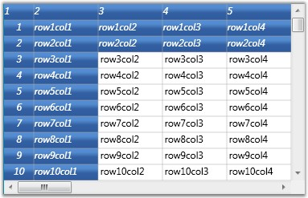
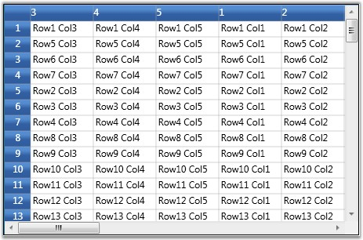

::: {style="DISPLAY: none"}
{#d2h_url_template}{#d2h_package_url style="WIDTH: 0px; DISPLAY: none; HEIGHT: 0px"}
:::

:::::::: {.d2h_secondary_topic style="PADDING-BOTTOM: 10pt; MARGIN: 0pt; PADDING-LEFT: 0pt; PADDING-RIGHT: 0pt; PADDING-TOP: 0pt"}
#### Controlling Rows and Columns {#controlling-rows-and-columns style="tab-stops: 0pt"}

[]{#p206}Each Grid instance is tied to a model, which contains the data represented by the Grid control. The grid model exposes properties that allow the user to manipulate grid rows and columns.

 

Setting Rows and Columns count

 

The grid model has RowCount and ColumnCount properties. These can be set to change the number of rows and columns in the grid control, as shown below:

 

+-------------------------------------------------------------------------+
| [\[C#\]]{style="FONT-FAMILY: 'Courier New'; COLOR: black"}              |
|                                                                         |
| **[]{style="FONT-FAMILY: 'Courier New'; COLOR: black"}**                |
|                                                                         |
| [// Set Row count]{style="FONT-FAMILY: 'Courier New'; COLOR: green"}    |
|                                                                         |
| [grid.Model.RowCount = 10;]{style="FONT-FAMILY: 'Courier New'"}         |
|                                                                         |
| []{style="FONT-FAMILY: 'Courier New'"}                                  |
|                                                                         |
| [// Set Column count]{style="FONT-FAMILY: 'Courier New'; COLOR: green"} |
|                                                                         |
| [grid.Model.ColumnCount = 20;]{style="FONT-FAMILY: 'Courier New'"}      |
+-------------------------------------------------------------------------+

[]{style="COLOR: #15428b"} 

Setting Row Heights and Column Widths

 

The grid model also stores information on row heights and column widths. Its ColumnWidths and RowHeights properties can be changed using indexers as shown below:

 

+------------------------------------------------------------------------------+
| [\[C#\]]{style="FONT-FAMILY: 'Courier New'; COLOR: black"}                   |
|                                                                              |
| **[]{style="FONT-FAMILY: 'Courier New'; COLOR: black"}**                     |
|                                                                              |
| [// Setting column widths]{style="FONT-FAMILY: 'Courier New'; COLOR: green"} |
|                                                                              |
| [grid.Model.ColumnWidths\[0\] = 30;]{style="FONT-FAMILY: 'Courier New'"}     |
|                                                                              |
| [grid.Model.ColumnWidths\[1\] = 80;]{style="FONT-FAMILY: 'Courier New'"}     |
|                                                                              |
| [grid.Model.ColumnWidths\[2\] = 100;]{style="FONT-FAMILY: 'Courier New'"}    |
|                                                                              |
| [grid.Model.ColumnWidths\[3\] = 50;]{style="FONT-FAMILY: 'Courier New'"}     |
|                                                                              |
| [grid.Model.ColumnWidths\[4\] = 250;]{style="FONT-FAMILY: 'Courier New'"}    |
|                                                                              |
| []{style="FONT-FAMILY: 'Courier New'"}                                       |
|                                                                              |
| [// Setting row heights]{style="FONT-FAMILY: 'Courier New'; COLOR: green"}   |
|                                                                              |
| [grid.Model.RowHeights\[5\] = 40;]{style="FONT-FAMILY: 'Courier New'"}       |
|                                                                              |
| [grid.Model.RowHeights\[3\] = 40;]{style="FONT-FAMILY: 'Courier New'"}       |
+------------------------------------------------------------------------------+

[]{style="COLOR: #15428b"} 

{border="0"}

Figure 55: Setting Row heights and Column widths

 

You can also specify the DefaultLineSize setting on ColumnWidths and RowHeights in order to set the default width or height.

 

+--------------------------------------------------------------------------------------+
| [\[C#\]]{style="FONT-FAMILY: 'Courier New'; COLOR: black"}                           |
|                                                                                      |
| **[]{style="FONT-FAMILY: 'Courier New'; COLOR: black"}**                             |
|                                                                                      |
| [grid.Model.RowHeights.DefaultLineSize = 20;]{style="FONT-FAMILY: 'Courier New'"}    |
|                                                                                      |
| [grid.Model.ColumnWidths.DefaultLineSize = 100;]{style="FONT-FAMILY: 'Courier New'"} |
+--------------------------------------------------------------------------------------+

 

Hiding Rows and Columns

 

Essential Grid supports efficient hiding of rows and columns. You can hide and unhide ranges of rows and columns using SetHidden method on ColumnWidths and RowHeights.

::: {style="BORDER-BOTTOM: windowtext 1pt solid; BORDER-LEFT: medium none; PADDING-BOTTOM: 1pt; MARGIN-TOP: 9pt; PADDING-LEFT: 0pt; PADDING-RIGHT: 0pt; MARGIN-BOTTOM: 9pt; BORDER-TOP: windowtext 1pt solid; BORDER-RIGHT: medium none; PADDING-TOP: 1pt"}
 

{border="0"}Note: SetHidden method accepts the following three parameters:
:::

::: {style="BORDER-BOTTOM: windowtext 1pt solid; BORDER-LEFT: medium none; PADDING-BOTTOM: 1pt; MARGIN: 9pt 0pt 9pt 18pt; PADDING-LEFT: 0pt; PADDING-RIGHT: 0pt; BORDER-TOP: windowtext 1pt solid; BORDER-RIGHT: medium none; PADDING-TOP: 1pt"}
***[·    ]{style="FONT-FAMILY: Symbol"}***The first parameter is an integer, which specifies the starting row/column to hide/unhide

***[·    ]{style="FONT-FAMILY: Symbol"}***The second parameter is an integer, which specifies the ending row/column to hide/unhide

***[·    ]{style="FONT-FAMILY: Symbol"}***Third is a boolean parameter that determines whether to hide or unhide the specified number of rows or columns. The rows/columns will be hidden when this parameter is set to true.
:::

**[]{style="COLOR: #15428b"}** 

The following code illustrates the usage of SetHidden method:

[]{style="COLOR: #15428b"} 

+---------------------------------------------------------------------------------------------------------------------+
| [\[C#\]]{style="FONT-FAMILY: 'Courier New'; COLOR: black"}                                                          |
|                                                                                                                     |
| []{style="FONT-FAMILY: 'Courier New'"}                                                                              |
|                                                                                                                     |
| [// Hide rows]{style="FONT-FAMILY: 'Courier New'; COLOR: green"}                                                    |
|                                                                                                                     |
| [grid.Model.RowHeights.SetHidden(2, 100, [true]{style="COLOR: blue"});]{style="FONT-FAMILY: 'Courier New'"}         |
|                                                                                                                     |
| [grid.Model.RowHeights.SetHidden(110, 1000, [true]{style="COLOR: blue"});]{style="FONT-FAMILY: 'Courier New'"}      |
|                                                                                                                     |
| [// Unhide rows]{style="FONT-FAMILY: 'Courier New'; COLOR: green"}                                                  |
|                                                                                                                     |
| [grid.Model.RowHeights.SetHidden(1010, 10000, [false]{style="COLOR: blue"});]{style="FONT-FAMILY: 'Courier New'"}   |
|                                                                                                                     |
| []{style="FONT-FAMILY: 'Courier New'"}                                                                              |
|                                                                                                                     |
| [//Hide columns]{style="FONT-FAMILY: 'Courier New'; COLOR: green"}                                                  |
|                                                                                                                     |
| [grid.Model.ColumnWidths.SetHidden(2, 100, [true]{style="COLOR: blue"});]{style="FONT-FAMILY: 'Courier New'"}       |
|                                                                                                                     |
| [grid.Model.ColumnWidths.SetHidden(110, 150, [true]{style="COLOR: blue"});]{style="FONT-FAMILY: 'Courier New'"}     |
|                                                                                                                     |
| [// Unhide columns]{style="FONT-FAMILY: 'Courier New'; COLOR: green"}                                               |
|                                                                                                                     |
| [grid.Model.ColumnWidths.SetHidden(1010, 10000, [false]{style="COLOR: blue"});]{style="FONT-FAMILY: 'Courier New'"} |
+---------------------------------------------------------------------------------------------------------------------+

[]{style="COLOR: #15428b"} 

{border="0"}

Figure 56: Hiding rows and columns

**[]{style="COLOR: #15428b"}** 

Freeze Rows and Columns

 

It is possible to fix any number of rows and columns so that they are still visible when a grid is scrolled. This feature is called as freezing. It can be achieved in the Grid by setting the FrozenRows and FrozenColumns properties of grid model, as shown below:

 

+--------------------------------------------------------------------------------+
| [\[C#\]]{style="FONT-FAMILY: 'Courier New'; COLOR: black"}                     |
|                                                                                |
| []{style="FONT-FAMILY: 'Courier New'"}                                         |
|                                                                                |
| [// Freeze rows and columns]{style="FONT-FAMILY: 'Courier New'; COLOR: green"} |
|                                                                                |
| [grid.Model.FrozenRows = 4;]{style="FONT-FAMILY: 'Courier New'"}               |
|                                                                                |
| [grid.Model.FrozenColumns = 3;]{style="FONT-FAMILY: 'Courier New'"}            |
+--------------------------------------------------------------------------------+

[]{style="COLOR: #15428b"} 

{border="0"}

Figure 57: Frozen rows and columns

***[]{style="COLOR: #15428b"}*** 

You can also fix rows to the right of the grid and columns to the bottom. Such fixed rows and columns are referred to as Footer rows and Footer columns. The properties FooterRows and FooterColumns determine the number of footer rows and footer columns. The footer row or column can be customized by using the FooterStyle property.

 

The following code illustrates the usage of FooterRows, FooterColumns and FooterStyle properties:

 

+---------------------------------------------------------------------------------------------------------------------------------------------------------------+
| [\[C#\]]{style="FONT-FAMILY: 'Courier New'; COLOR: black"}                                                                                                    |
|                                                                                                                                                               |
| []{style="FONT-FAMILY: 'Courier New'"}                                                                                                                        |
|                                                                                                                                                               |
| [// Footer rows and columns]{style="FONT-FAMILY: 'Courier New'; COLOR: green"}                                                                                |
|                                                                                                                                                               |
| [grid.Model.FooterRows = 3;]{style="FONT-FAMILY: 'Courier New'"}                                                                                              |
|                                                                                                                                                               |
| [grid.Model.FooterColumns = 1;]{style="FONT-FAMILY: 'Courier New'"}                                                                                           |
|                                                                                                                                                               |
| [grid.Model.FooterStyle.Background = [Brushes]{style="COLOR: #2b91af"}.LightCoral]{style="FONT-FAMILY: 'Courier New'"}[;]{style="FONT-FAMILY: 'Courier New'"} |
+---------------------------------------------------------------------------------------------------------------------------------------------------------------+

[]{style="COLOR: #15428b"} 

{border="0"}

Figure 58: Footer rows and footer columns

[]{style="COLOR: #15428b"} 

Header Rows and Columns

 

Grid allows the user to have any number of header rows and columns. It is done by using the HeaderRows and HeaderColumns properties of the grid model. The HeaderStyle property of the grid model controls the appearance of these header rows and header columns.

 

The following code illustrates the usage of HeaderRows, HeaderColumns and HeaderStyle properties:

 

+--------------------------------------------------------------------------------------------------+
| [\[C#\]]{style="FONT-FAMILY: 'Courier New'; COLOR: black"}                                       |
|                                                                                                  |
| []{style="FONT-FAMILY: 'Courier New'"}                                                           |
|                                                                                                  |
| [// Header rows and columns]{style="FONT-FAMILY: 'Courier New'; COLOR: green"}                   |
|                                                                                                  |
| [grid.Model.HeaderRows = 3;]{style="FONT-FAMILY: 'Courier New'"}                                 |
|                                                                                                  |
| [grid.Model.HeaderColumns = 2;]{style="FONT-FAMILY: 'Courier New'"}                              |
|                                                                                                  |
| [grid.Model.HeaderStyle.Font.FontStyle = FontStyles.Italic;]{style="FONT-FAMILY: 'Courier New'"} |
+--------------------------------------------------------------------------------------------------+

**[]{style="COLOR: #15428b"}** 

{border="0"}

Figure 59: Header rows and header columns

 

Resize Rows and Columns

 

Grid allows the user to resize the rows and columns at run time. When this feature is enabled and if you move the mouse over the row or column divider, it will show a resize cursor using which you can resize the row or column to the required level. The following images illustrate the resizing of a column and a row:

 

{border="0"}

Figure 60: Column Resizing

*[]{style="COLOR: #15428b"}* 

{border="0"}

Figure 61: Row Resizing

[]{style="COLOR: #15428b"} 

This feature is turned on by default. To disable column or row resizing, you need to detach the corresponding mouse controllers from grid, as shown below:

**[]{style="COLOR: #15428b"}** 

+--------------------------------------------------------------------------------------------------------------------------------------------------------------------+
| [\[C#\]]{style="FONT-FAMILY: 'Courier New'; COLOR: black"}                                                                                                         |
|                                                                                                                                                                    |
| []{style="FONT-FAMILY: 'Courier New'"}                                                                                                                             |
|                                                                                                                                                                    |
| [IMouseController controller = grid.MouseControllerDispatcher.Find ([\"ResizeRowsMouseController\"]{style="COLOR: #a31515"});]{style="FONT-FAMILY: 'Courier New'"} |
|                                                                                                                                                                    |
| [grid.MouseControllerDispatcher.Remove(controller);]{style="FONT-FAMILY: 'Courier New'"}                                                                           |
|                                                                                                                                                                    |
| []{style="FONT-FAMILY: 'Courier New'"}                                                                                                                             |
|                                                                                                                                                                    |
| [controller = grid.MouseControllerDispatcher.Find  ([\"ResizeColumnsMouseController\"]{style="COLOR: #a31515"});]{style="FONT-FAMILY: 'Courier New'"}              |
|                                                                                                                                                                    |
| [grid.MouseControllerDispatcher.Remove(controller);]{style="FONT-FAMILY: 'Courier New'"}                                                                           |
+--------------------------------------------------------------------------------------------------------------------------------------------------------------------+

**[]{style="COLOR: #15428b"}** 

::: {style="BORDER-BOTTOM: windowtext 1pt solid; BORDER-LEFT: medium none; PADDING-BOTTOM: 1pt; MARGIN-TOP: 9pt; PADDING-LEFT: 0pt; PADDING-RIGHT: 0pt; MARGIN-BOTTOM: 9pt; BORDER-TOP: windowtext 1pt solid; BORDER-RIGHT: medium none; PADDING-TOP: 1pt"}
{border="0"}Note: To prevent resizing of specific row or column, it is required to handle ResizingRows and ResizingColumns events.
:::

**[]{style="COLOR: #15428b"}** 

Inserting Rows and Columns

**[]{style="COLOR: #15428b"}** 

New columns and rows can be inserted at run time by using the following APIs:

**[]{style="COLOR: #15428b"}** 

[·      ]{style="FONT-FAMILY: Symbol"}InsertColumns()

[·      ]{style="FONT-FAMILY: Symbol"}InsertRows()

**[]{style="COLOR: #15428b"}** 

Both these methods accept the following two parameters:

**[]{style="COLOR: #15428b"}** 

1.   position index

2.   number of rows or columns to insert

 

The following code illustrates the usage of InsertColumns and InsertRows methods:

 

+--------------------------------------------------------------------------------------+
| [\[C#\]]{style="FONT-FAMILY: 'Courier New'; COLOR: black"}                           |
|                                                                                      |
| **[]{style="FONT-FAMILY: 'Courier New'; COLOR: black"}**                             |
|                                                                                      |
| [//Insert a column at position 2.]{style="FONT-FAMILY: 'Courier New'; COLOR: green"} |
|                                                                                      |
| [grid.Model.InsertColumns(2, 1);]{style="FONT-FAMILY: 'Courier New'"}                |
|                                                                                      |
| []{style="FONT-FAMILY: 'Courier New'"}                                               |
|                                                                                      |
| [//Insert 2 rows at position 5.]{style="FONT-FAMILY: 'Courier New'; COLOR: green"}   |
|                                                                                      |
| [grid.Model.InsertRows(5, 2);]{style="FONT-FAMILY: 'Courier New'"}                   |
+--------------------------------------------------------------------------------------+

**[]{style="COLOR: #15428b"}** 

{border="0"}

Figure 62: Inserted new Column at index 2

***[]{style="COLOR: #15428b"}*** 

{border="0"}

Figure 63: Inserted new Row at index 7

***[]{style="COLOR: #15428b"}*** 

::: {style="BORDER-BOTTOM: windowtext 1pt solid; BORDER-LEFT: medium none; PADDING-BOTTOM: 1pt; MARGIN-TOP: 9pt; PADDING-LEFT: 0pt; PADDING-RIGHT: 0pt; MARGIN-BOTTOM: 9pt; BORDER-TOP: windowtext 1pt solid; BORDER-RIGHT: medium none; PADDING-TOP: 1pt"}
{border="0"}Note: You can track the moment the rows or columns are inserted by handling the RowsInserted and ColumnsInserted events.
:::

[]{style="COLOR: #15428b"} 

Moving Rows and Columns

 

The rows and columns can be rearranged dynamically by moving them from one position to another using the following APIs:

 

[·      ]{style="FONT-FAMILY: Symbol"}MoveRows()

[·      ]{style="FONT-FAMILY: Symbol"}MoveColumns()

 

These methods accept the following three parameters:

 

[·      ]{style="FONT-FAMILY: Symbol"}Position from which the rows or columns should be removed

[·      ]{style="FONT-FAMILY: Symbol"}Number of rows or columns

[·      ]{style="FONT-FAMILY: Symbol"}The new position at which these rows or columns should be inserted

 

You can also achieve this by a simple drag-and-drop action on the desired rows and columns.

 

The following code illustrates the usage of MoveColumns and MoveRows methods:

**[]{style="COLOR: #15428b"}** 

+-----------------------------------------------------------------------------------------------+
| [\[C#\]]{style="FONT-FAMILY: 'Courier New'; COLOR: black"}                                    |
|                                                                                               |
| **[]{style="FONT-FAMILY: 'Courier New'; COLOR: black"}**                                      |
|                                                                                               |
| [//Move 3 rows from index 2 to index 5.]{style="FONT-FAMILY: 'Courier New'; COLOR: green"}    |
|                                                                                               |
| [grid.Model.MoveRows(2, 3, 5);]{style="FONT-FAMILY: 'Courier New'"}                           |
|                                                                                               |
| []{style="FONT-FAMILY: 'Courier New'"}                                                        |
|                                                                                               |
| [//Move 2 columns from index 1 to index 4.]{style="FONT-FAMILY: 'Courier New'; COLOR: green"} |
|                                                                                               |
| [grid.Model.MoveColumns(1, 2, 4);]{style="FONT-FAMILY: 'Courier New'"}                        |
+-----------------------------------------------------------------------------------------------+

**[]{style="COLOR: #15428b"}** 

{border="0"}

Figure 64: Moving rows and columns

***[]{style="COLOR: #15428b"}*** 

::: {style="BORDER-BOTTOM: windowtext 1pt solid; BORDER-LEFT: medium none; PADDING-BOTTOM: 1pt; MARGIN-TOP: 9pt; PADDING-LEFT: 0pt; PADDING-RIGHT: 0pt; MARGIN-BOTTOM: 9pt; BORDER-TOP: windowtext 1pt solid; BORDER-RIGHT: medium none; PADDING-TOP: 1pt"}
{border="0"}Note: You can track the moment the rows or columns are moved by handling the RowsMoved and  ColumnsMoved event.
:::

**[]{style="COLOR: #15428b"}** 

Removing Rows and Columns

 

It is possible to remove a range of rows and columns from the grid. The APIs RemoveRows() and RemoveColumns() are used to achieve this. They accept two parameters--

 

1.   An index, from which the rows or columns should be removed

2.   Total number of rows or columns to be removed

 

The following code illustrates the usage of RemoveColumns and RemoveRows methods:

 

+-----------------------------------------------------------------------------------------+
| [\[C#\]]{style="FONT-FAMILY: 'Courier New'; COLOR: black"}                              |
|                                                                                         |
| []{style="FONT-FAMILY: 'Courier New'"}                                                  |
|                                                                                         |
| [//Remove 4 rows from position 3.]{style="FONT-FAMILY: 'Courier New'; COLOR: green"}    |
|                                                                                         |
| [grid.Model.RemoveRows(3, 4);]{style="FONT-FAMILY: 'Courier New'"}                      |
|                                                                                         |
| []{style="FONT-FAMILY: 'Courier New'"}                                                  |
|                                                                                         |
| [//Remove 3 columns from position 2.]{style="FONT-FAMILY: 'Courier New'; COLOR: green"} |
|                                                                                         |
| [grid.Model.RemoveColumns(2, 3);]{style="FONT-FAMILY: 'Courier New'"}                   |
+-----------------------------------------------------------------------------------------+

**[]{style="COLOR: #15428b"}** 

{border="0"}

Figure 65: Removing columns 2, 3 and 4

***[]{style="COLOR: #15428b"}*** 

You can track the moment the rows or columns are inserted by handling the RowsRemoved and ColumnsRemoved events.

 

AutoFit content

 

The rows heights and column widths can be made to adjust themselves automatically to fit the content by using the methods ResizeRowsToFit() and ResizeColumnsToFit(), which accept the following two parameters --

 

1.   A range of rows or columns whose size should be adjusted

2.   A GridResizeToFitOptions enumeration value.

 

The GridResizeToFitOptions enum value specifies how the resizing action should be performed; whether to include covered cells, hidden cells, headers, and whether or not to shrink size, and the like.

 

The following code illustrates the usage of ResizeRowsToFit and ResizeColumnsToFit methods:

 

+---------------------------------------------------------------------------------------------------------------------------------+
| [\[C#\]]{style="FONT-FAMILY: 'Courier New'; COLOR: black"}                                                                      |
|                                                                                                                                 |
| []{style="FONT-FAMILY: 'Courier New'"}                                                                                          |
|                                                                                                                                 |
| [//Auto fit column 3]{style="FONT-FAMILY: 'Courier New'; COLOR: green"}                                                         |
|                                                                                                                                 |
| [grid.Model.ResizeColumnsToFit(GridRangeInfo.Col(3), GridResizeToFitOptions.NoShrinkSize);]{style="FONT-FAMILY: 'Courier New'"} |
|                                                                                                                                 |
| []{style="FONT-FAMILY: 'Courier New'"}                                                                                          |
|                                                                                                                                 |
| [//Auto fit row 2]{style="FONT-FAMILY: 'Courier New'; COLOR: green"}                                                            |
|                                                                                                                                 |
| [grid.Model.ResizeRowsToFit(GridRangeInfo.Row(2), GridResizeToFitOptions.NoShrinkSize);]{style="FONT-FAMILY: 'Courier New'"}    |
+---------------------------------------------------------------------------------------------------------------------------------+

**[]{style="COLOR: #15428b"}** 

{border="0"}

Figure 66: Auto fit Column 3

***[]{style="COLOR: #15428b"}*** 

{border="0"}

Figure 67: Auto fit Row 2

 

 

[]{#related-topics}
::::::::
