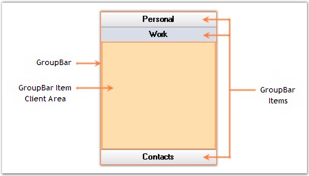

::: {style="DISPLAY: none"}
{#d2h_url_template}{#d2h_package_url style="WIDTH: 0px; DISPLAY: none; HEIGHT: 0px"}
:::

::: {.d2h_secondary_topic style="PADDING-BOTTOM: 10pt; MARGIN: 0pt; PADDING-LEFT: 0pt; PADDING-RIGHT: 0pt; PADDING-TOP: 0pt"}
#### Control Overview {#control-overview style="tab-stops: 0pt"}

[]{style="COLOR: #15428b"} 

The various sections of GroupBar and their description are given below.

[]{style="COLOR: #15428b"} 

{border="0"}[]{style="FONT-FAMILY: 'Calibri','sans-serif'; FONT-SIZE: 11pt"}

 

Figure 854: Sections Of GroupBar

[]{style="COLOR: #15428b"} 

GroupBar Items

[]{style="COLOR: #15428b"} 

GroupBar Items can be used to display text, images and child controls like TreeView, GroupView, etc. The GroupBar itself can be added as a child control to a GroupBar Item.

 

The Appearance of the GroupBar Items can be customized using the various properties provided in the GroupBarItem Collection Editor.

[]{style="COLOR: #15428b"} 

GroupBar Item Client Area

[]{style="COLOR: #15428b"} 

This is the area in which all the contents of the GroupBar Items are displayed. Borders can be set for the client area and the color of the borders can also be set.

 

 

[]{#p591} 

 

[]{#related-topics}
:::
