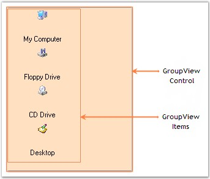

::: {style="DISPLAY: none"}
{#d2h_url_template}{#d2h_package_url style="WIDTH: 0px; DISPLAY: none; HEIGHT: 0px"}
:::

::: {.d2h_secondary_topic style="PADDING-BOTTOM: 10pt; MARGIN: 0pt; PADDING-LEFT: 0pt; PADDING-RIGHT: 0pt; PADDING-TOP: 0pt"}
#### Control Overview {#control-overview style="MARGIN-LEFT: 18pt; tab-stops: 18.0pt"}

[]{style="COLOR: #15428b"} 

The various sections of GroupView and their description are given below.

[]{style="COLOR: #15428b"} 

{border="0"}

[]{style="COLOR: #15428b"} 

Figure 892: Sections Of GroupView

[]{style="COLOR: #15428b"} 

GroupView Control

[]{style="COLOR: #15428b"} 

The GroupView control is a List-type control that can display a list of items.

[]{style="COLOR: #15428b"} 

GroupView Items

[]{style="COLOR: #4a5c8c; FONT-SIZE: 8pt"} 

GroupView Items can be used to display text and images.

[]{style="COLOR: #15428b"} 

The Appearance of the GroupView Items can be customized using the various properties provided in the GroupViewItem Collection Editor.

[]{style="COLOR: #15428b"} 

See Also

[]{style="COLOR: #15428b"} 

[[Concepts and Features]{.UGHyperlink}](../../../../../../../../Documents%20and%20Settings/sylviap/Desktop/Tools%20-%20Part%202.docx#_Concepts_and_Features_2)[]{.UGHyperlink}

 

[]{#p635} 

 

[]{#related-topics}
:::
