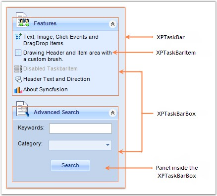

::: {style="DISPLAY: none"}
{#d2h_url_template}{#d2h_package_url style="WIDTH: 0px; DISPLAY: none; HEIGHT: 0px"}
:::

::: {.d2h_secondary_topic style="PADDING-BOTTOM: 10pt; MARGIN: 0pt; PADDING-LEFT: 0pt; PADDING-RIGHT: 0pt; PADDING-TOP: 0pt"}
#### Control Overview {#control-overview style="MARGIN-LEFT: 18pt; tab-stops: 18.0pt"}

[]{style="COLOR: red; FONT-SIZE: 8pt"} 

The various sections of XPTaskBar and their descriptions are given below.

[]{style="COLOR: #15428b"} 

{border="0"}

[]{style="COLOR: #15428b"} 

Figure 928: Sections of XPTaskBar

[]{style="COLOR: #15428b"} 

XPTaskBar

[]{style="COLOR: #4a5c8c; FONT-SIZE: 8pt"} 

It represents a Windows XP like task menu panel.

[]{style="COLOR: #4a5c8c; FONT-SIZE: 8pt"} 

XPTaskBar Box

 

This is the area in which the XPTaskBar Items are displayed.

[]{style="COLOR: #4a5c8c; FONT-SIZE: 8pt"} 

XPTaskBar Items

[]{style="COLOR: #4a5c8c; FONT-SIZE: 8pt"} 

XPTaskBar Items can be used to display text and images.

 

The appearance of the XPTaskBar Items can be customized using the various properties provided in the XPTaskBarItem Collection Editor.

[]{style="COLOR: #15428b"} 

See Also

[]{style="COLOR: #15428b"} 

[[Concepts and Features]{.UGHyperlink}](../../../../../../../../Documents%20and%20Settings/sylviap/Desktop/Tools%20-%20Part%202.docx#_Concepts_and_Features_3)[]{.UGHyperlink}

 

 

[]{#p666} 

 

[]{#related-topics}
:::
