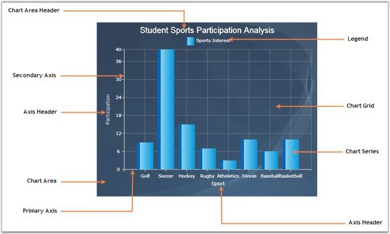

::: {style="DISPLAY: none"}
{#d2h_url_template}{#d2h_package_url style="WIDTH: 0px; DISPLAY: none; HEIGHT: 0px"}
:::

::::: {#nsbanner .d2h_main_nsbanner style="BORDER-BOTTOM: #999999 1px solid; POSITION: relative; PADDING-BOTTOM: 0px; BACKGROUND-COLOR: transparent; PADDING-LEFT: 0px; PADDING-RIGHT: 0px; DISPLAY: none; BORDER-TOP: #999999 1px solid; PADDING-TOP: 0px; LEFT: 0px"}
:::: {#TitleRow .d2h_main_titlerow style="PADDING-BOTTOM: 4px; BACKGROUND-COLOR: transparent; PADDING-LEFT: 22px; WIDTH: 100%; PADDING-RIGHT: 10px; DISPLAY: none; PADDING-TOP: 4px"}
::: {#ienav .d2h_main_ienav style="DISPLAY: none"}
{#D2HPrevious .D2HPreviousEnabled}  {#D2HNext .D2HNextEnabled}
:::
::::
:::::

:::: {#nstext .d2h_main_nstext style="PADDING-BOTTOM: 10px; BACKGROUND-COLOR: transparent; PADDING-LEFT: 22px; PADDING-RIGHT: 10px; HEIGHT: 100%; OVERFLOW: auto; PADDING-TOP: 5px" hasuserbackground="true" valign="bottom"}
::: {#d2h_breadcrumbs .d2h_breadcrumbs}
[Essential Studio User Guide Documentation](ms-xhelp:///?Id=12457748-09e3-4d74-a240-8e049cedf030){.d2h_breadcrumbsNormal}[ \> ]{.d2h_breadcrumbsLinkSeparator}[User Interface Edition](ms-xhelp:///?Id=c29296b7-531c-413b-a0ec-488ca1f7f669){.d2h_breadcrumbsNormal}[ \> ]{.d2h_breadcrumbsLinkSeparator}[Essential Silverlight](ms-xhelp:///?Id=66221bd1-ba2e-43c2-94a7-618f50e01d24){.d2h_breadcrumbsNormal}[ \> ]{.d2h_breadcrumbsLinkSeparator}[Essential Chart]{.d2h_breadcrumbsContentsOnly}[ \> ]{.d2h_breadcrumbsLinkSeparator}[Getting Started](ms-xhelp:///?Id=1598abb6-2919-48fb-8f90-fc8661f74180){.d2h_breadcrumbsNormal}
:::

## Control Structure {#control-structure style="tab-stops: 0pt"}

[]{#p10}[]{style="COLOR: red"} 

The Chart has various elements such as Area, Axis, Series, and Legends so on. The below image highlights the elements of the chart control.

[]{style="COLOR: #15428b"} 

{border="0"}

Figure 5: Chart Elements

[]{style="COLOR: #15428b"} 

Elements of Chart Control

[]{style="COLOR: #15428b"} 

A brief description of the chart control is given below.

[]{style="COLOR: #15428b"} 

Series

[]{style="COLOR: #15428b"} 

The chart data points are represented in a series based on selected chart type.

[]{style="COLOR: #15428b"} 

Area

 

This is the section that holds Axes, Legends, Header and Series.

[]{style="COLOR: #15428b"} 

Primary and Secondary Axes

[]{style="COLOR: #15428b"} 

The Axes is the rectangular coordinate system against which the points are plotted.

[]{style="COLOR: #15428b"} 

Axis Header

[]{style="COLOR: #15428b"} 

Represents the title text of Axis.

[]{style="COLOR: #15428b"} 

Legend

[]{style="COLOR: #15428b"} 

Legend is used to display information about each series. Chart legend can be used to set the visibility of the series, using the check boxes.

[]{#related-topics}
::::
