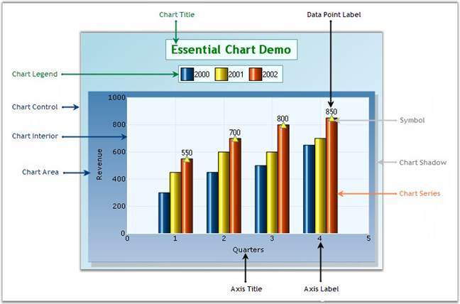

::: {style="DISPLAY: none"}
{#d2h_url_template}{#d2h_package_url style="WIDTH: 0px; DISPLAY: none; HEIGHT: 0px"}
:::

::::: {#nsbanner .d2h_main_nsbanner style="BORDER-BOTTOM: #999999 1px solid; POSITION: relative; PADDING-BOTTOM: 0px; BACKGROUND-COLOR: transparent; PADDING-LEFT: 0px; PADDING-RIGHT: 0px; DISPLAY: none; BORDER-TOP: #999999 1px solid; PADDING-TOP: 0px; LEFT: 0px"}
:::: {#TitleRow .d2h_main_titlerow style="PADDING-BOTTOM: 4px; BACKGROUND-COLOR: transparent; PADDING-LEFT: 22px; WIDTH: 100%; PADDING-RIGHT: 10px; DISPLAY: none; PADDING-TOP: 4px"}
::: {#ienav .d2h_main_ienav style="DISPLAY: none"}
{#D2HPrevious .D2HPreviousEnabled}  {#D2HNext .D2HNextEnabled}
:::
::::
:::::

:::: {#nstext .d2h_main_nstext style="PADDING-BOTTOM: 10px; BACKGROUND-COLOR: transparent; PADDING-LEFT: 22px; PADDING-RIGHT: 10px; HEIGHT: 100%; OVERFLOW: auto; PADDING-TOP: 5px" hasuserbackground="true" valign="bottom"}
::: {#d2h_breadcrumbs .d2h_breadcrumbs}
[Essential Studio User Guide Documentation](ms-xhelp:///?Id=12457748-09e3-4d74-a240-8e049cedf030){.d2h_breadcrumbsNormal}[ \> ]{.d2h_breadcrumbsLinkSeparator}[User Interface Edition](ms-xhelp:///?Id=c29296b7-531c-413b-a0ec-488ca1f7f669){.d2h_breadcrumbsNormal}[ \> ]{.d2h_breadcrumbsLinkSeparator}[Essential Windows](ms-xhelp:///?Id=e60759d8-47a4-4570-9d7a-16a68d63f2ea){.d2h_breadcrumbsNormal}[ \> ]{.d2h_breadcrumbsLinkSeparator}[Essential Chart]{.d2h_breadcrumbsContentsOnly}[ \> ]{.d2h_breadcrumbsLinkSeparator}[Getting Started](ms-xhelp:///?Id=73c15216-47d2-47dd-ba6b-e2414175558c){.d2h_breadcrumbsNormal}
:::

## Control Structure {#control-structure style="tab-stops: 0pt"}

 

This section gives you an idea of the different sections of a Chart control. Below is the image that illustrates various sections of the control and their description in detail below.

 

{border="0"}

 

Figure 5: Chart Components

 

Chart Title

 

The Chart title is the area at the top of the Chart control that displays the text of the ChartControl.

 

Chart Legend

 

The Chart legend is the portion of the display showing an entry for each of the data series added to the ChartControl. The Chart legend is positioned in line within the ChartControl (but outside the ChartArea) by default. However, if the chart legend is set to floating mode, the Chart legend can be positioned any where inside the Chart control.

 

The legend can also contain custom items with custom image and text.

 

Chart Area

 

This is the section that holds the plots / graphs that are defined in the Chart. The Chart Area also includes the Chart axes that are defined. A primary X axis and primary Y axis are defined by default.

 

Chart control

 

The ChartControl is the complete visible display for the Control. All other sections will be inside the ChartControl.

 

Chart Series

 

Chart Series are the elements present inside the chart area.

 

Series Symbol

 

Symbol that can be placed on the series points.

 

Chart Shadow

 

Chart Area Shadow indicates the shadow of the chart area.

 

Chart Interior

 

This section is the interior part of the chart control, within the chart area, which contains the data points plotted against X-axis and Y-axis.

 

Chart Label

 

Represents the label texts on the axes data points in a Chart.

 

Axis Title

 

Indicates the title for individual axis.

 

See Also

 

[Text]{.UGHyperlink}[, ]{.UGHyperlink}[Chart Legend]{.UGHyperlink}[, ]{.UGHyperlink}[Chart Series]{.UGHyperlink}[, ]{.UGHyperlink}[Chart Area]{.UGHyperlink}[, ]{.UGHyperlink}[Axis Label Text Formatting]{.UGHyperlink}[, ]{.UGHyperlink}[Appearance and Positioning]{.UGHyperlink}[, ]{.UGHyperlink}[Customizing Label Text]{.UGHyperlink}[, ]{.UGHyperlink}[Intersecting Labels]{.UGHyperlink}[, ]{.UGHyperlink}[Grouping Labels]{.UGHyperlink}[]{.UGHyperlink}

 

[]{#p10} 

 

[]{#related-topics}
::::
