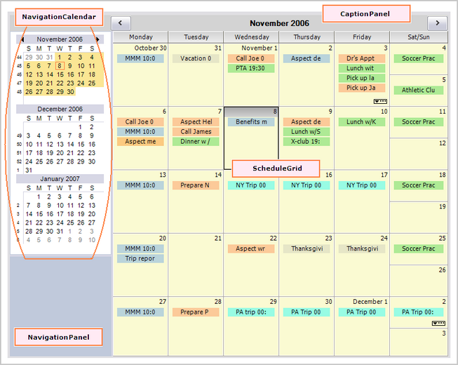
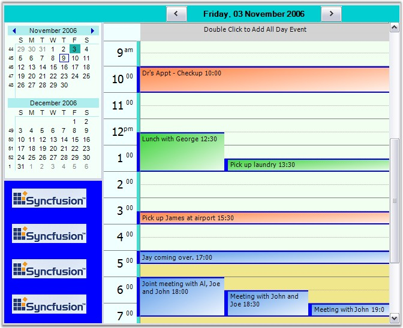
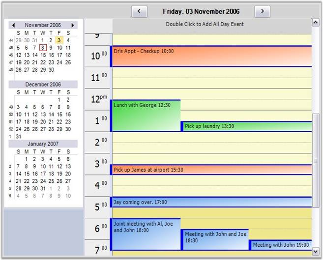
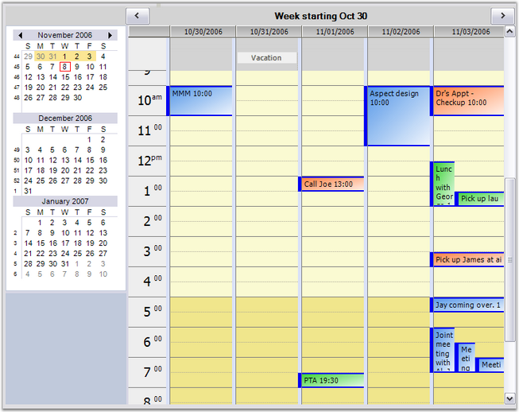
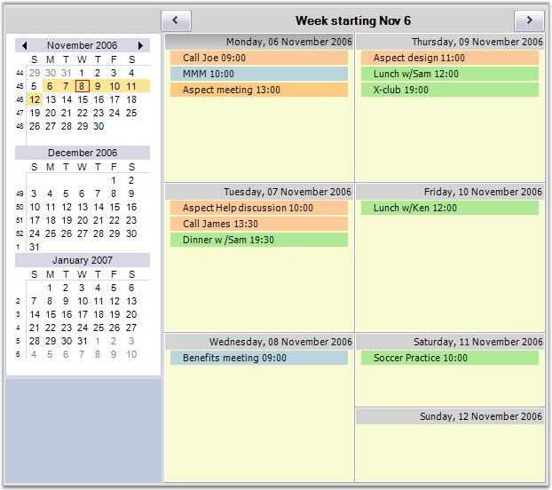
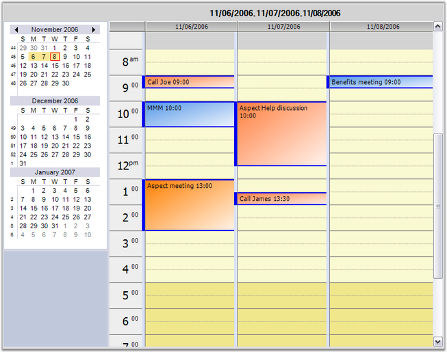

::: {style="DISPLAY: none"}
{#d2h_url_template}{#d2h_package_url style="WIDTH: 0px; DISPLAY: none; HEIGHT: 0px"}
:::

::::: {#nsbanner .d2h_main_nsbanner style="BORDER-BOTTOM: #999999 1px solid; POSITION: relative; PADDING-BOTTOM: 0px; BACKGROUND-COLOR: transparent; PADDING-LEFT: 0px; PADDING-RIGHT: 0px; DISPLAY: none; BORDER-TOP: #999999 1px solid; PADDING-TOP: 0px; LEFT: 0px"}
:::: {#TitleRow .d2h_main_titlerow style="PADDING-BOTTOM: 4px; BACKGROUND-COLOR: transparent; PADDING-LEFT: 22px; WIDTH: 100%; PADDING-RIGHT: 10px; DISPLAY: none; PADDING-TOP: 4px"}
::: {#ienav .d2h_main_ienav style="DISPLAY: none"}
{#D2HPrevious .D2HPreviousEnabled}  {#D2HNext .D2HNextEnabled}
:::
::::
:::::

:::: {#nstext .d2h_main_nstext style="PADDING-BOTTOM: 10px; BACKGROUND-COLOR: transparent; PADDING-LEFT: 22px; PADDING-RIGHT: 10px; HEIGHT: 100%; OVERFLOW: auto; PADDING-TOP: 5px" hasuserbackground="true" valign="bottom"}
::: {#d2h_breadcrumbs .d2h_breadcrumbs}
[Essential Studio User Guide Documentation](ms-xhelp:///?Id=12457748-09e3-4d74-a240-8e049cedf030){.d2h_breadcrumbsNormal}[ \> ]{.d2h_breadcrumbsLinkSeparator}[User Interface Edition](ms-xhelp:///?Id=c29296b7-531c-413b-a0ec-488ca1f7f669){.d2h_breadcrumbsNormal}[ \> ]{.d2h_breadcrumbsLinkSeparator}[Essential Windows](ms-xhelp:///?Id=e60759d8-47a4-4570-9d7a-16a68d63f2ea){.d2h_breadcrumbsNormal}[ \> ]{.d2h_breadcrumbsLinkSeparator}[Essential Schedule]{.d2h_breadcrumbsContentsOnly}[ \> ]{.d2h_breadcrumbsLinkSeparator}[Getting Started](ms-xhelp:///?Id=34399d3a-366c-4184-b6f9-4f2165957a91){.d2h_breadcrumbsNormal}
:::

## Control Structure {#control-structure style="tab-stops: 0pt"}

[]{style="FONT-FAMILY: 'Trebuchet MS','sans-serif'; COLOR: #15428b; FONT-SIZE: 9pt"} 

The following screen shot shows the structure of the ScheduleControl.

[]{style="FONT-FAMILY: 'Trebuchet MS','sans-serif'; COLOR: #15428b; FONT-SIZE: 9pt"} 

{border="0"}

 

Figure 8: Structure of ScheduleControl

[]{style="FONT-FAMILY: 'Trebuchet MS','sans-serif'; COLOR: #15428b; FONT-SIZE: 9pt"} 

[]{style="FONT-FAMILY: 'Trebuchet MS','sans-serif'; COLOR: #15428b; FONT-SIZE: 9pt"} 

**Essential Schedule** primarily consists of a **UserControl derived class** named ***ScheduleControl***.

 This section discusses the main properties of the ScheduleControl. The data for the ScheduleControl comes from any object that implements IScheduleDataProvider. The following discussions elaborate on the concrete implementation of the IScheduleDataProvider, based on an ArrayList-derived object that serializes to a disk file.

[]{style="FONT-FAMILY: 'Trebuchet MS','sans-serif'; COLOR: #15428b; FONT-SIZE: 9pt"} 

The above screen shot shows a ScheduleControl displaying a Month view. The four marked areas are actually Control-derived objects (two Panels and two GridControls). These controls have been added to the **ScheduleControl.Controls** collection. Any of the four controls except the ScheduleGrid can be hidden through the property settings. Here is a short description of each of the 4 labeled areas:

 

**CaptionPanel**: This is a Panel that displays a caption at the top of the ScheduleControl. There are also two button objects on this panel that will navigate the Schedule forward and backward. You can hide this panel by using the ScheduleControl.Appearance.ShowCaption property. This panel is docked at the top of the ScheduleControl client area.

**[]{style="FONT-FAMILY: 'Trebuchet MS','sans-serif'; COLOR: #15428b; FONT-SIZE: 9pt"}** 

**NavigationPanel**: This is a Panel where you can place additional controls and make them appear adjacent to the ScheduleControl. This can be optionally docked to the left or right side of the ScheduleControl. You can also hide this panel. The ScheduleControl.Calendar which is a NavigationCalendar object is docked at the top of this panel. There is also a Splitter docked under the NavigationCalendar that allows you to display more or fewer calendars in the NavigationCalendar. The default setting displays two such calendars. The picture below displays three. You can easily put your own controls under the NavigationCalendar using code similar to these snippets.

[       ]{style="FONT-FAMILY: 'Courier New'; COLOR: black"}

+------------------------------------------------------------------------------------------------------------------------------------------------------------------------------------------------------+
| **[\[C#\]]{style="FONT-FAMILY: 'Courier New'; COLOR: black"}**                                                                                                                                       |
|                                                                                                                                                                                                      |
| []{style="FONT-FAMILY: 'Courier New'; COLOR: black"}                                                                                                                                                 |
|                                                                                                                                                                                                      |
| [Panel]{style="FONT-FAMILY: 'Courier New'; COLOR: teal"}[ p = [new]{style="COLOR: blue"} [Panel]{style="COLOR: teal"}();]{style="FONT-FAMILY: 'Courier New'"}                                        |
|                                                                                                                                                                                                      |
| [p.BackColor = [Color]{style="COLOR: teal"}.Blue;]{style="FONT-FAMILY: 'Courier New'"}                                                                                                               |
|                                                                                                                                                                                                      |
| [p.Dock = [DockStyle]{style="COLOR: teal"}.Fill;]{style="FONT-FAMILY: 'Courier New'"}                                                                                                                |
|                                                                                                                                                                                                      |
| [p.BackgroundImage = [Image]{style="COLOR: teal"}.FromFile([\"..\\\\..\\\\sync.png\"]{style="COLOR: maroon"});]{style="FONT-FAMILY: 'Courier New'"}                                                  |
|                                                                                                                                                                                                      |
| [p.BackgroundImageLayout = [ImageLayout]{style="COLOR: teal"}.Tile;]{style="FONT-FAMILY: 'Courier New'"}                                                                                             |
|                                                                                                                                                                                                      |
| []{style="FONT-FAMILY: 'Courier New'"}                                                                                                                                                               |
|                                                                                                                                                                                                      |
| [this]{style="FONT-FAMILY: 'Courier New'; COLOR: blue"}[.ScheduleControl1.AddControlToNavigationPanel(p);]{style="FONT-FAMILY: 'Courier New'"}[]{style="FONT-FAMILY: 'Courier New'; FONT-SIZE: 9pt"} |
+------------------------------------------------------------------------------------------------------------------------------------------------------------------------------------------------------+

**[]{style="FONT-FAMILY: 'Trebuchet MS','sans-serif'; COLOR: #15428b; FONT-SIZE: 9pt"}** 

**[]{style="FONT-FAMILY: 'Trebuchet MS','sans-serif'; COLOR: #15428b; FONT-SIZE: 9pt"}** 

**NavigationCalendar**: This is a GridControl-derived object that displays multiple calendars allowing you to select the dates displayed in the ScheduleControl. The NavigationCalendar is docked at the top of the NavigationPanel. The number of calendars displayed in the NavigationCalendar is determined by its client height. Enlarging the height of the NavigationCalendar, will display more calendars. This can be facilitated by using the Splitter docked under the NavigationCalendar.

 

**ScheduleGrid**: This is a GridControl-derived object that displays the actual schedule content, i.e., the appointments for the various dates. The actual look of this GridControl is determined by the ScheduleViewType which is set by using the ScheduleControl.ScheduleType property.

 

Here is a Day view that shows a panel added under the NavigationCalendar by using the **ScheduleControl1.AddControlToNavigationPanel** code mentioned above.

You can dock any control under the NavigationCalendar by using this method.

[]{style="FONT-FAMILY: 'Trebuchet MS','sans-serif'; COLOR: #15428b; FONT-SIZE: 9pt"} 

{border="0"}

 

Figure 9: ScheduleControl Day View showing a Special Control added under the NavigationCalendar

[]{style="FONT-FAMILY: 'Trebuchet MS','sans-serif'; COLOR: #15428b; FONT-SIZE: 9pt"} 

[]{style="FONT-FAMILY: 'Trebuchet MS','sans-serif'; COLOR: #15428b; FONT-SIZE: 9pt"} 

In addition to the Month view, the ScheduleControl can also display Day, WorkWeek, Week and Custom views.

A Custom view is one where you can display up to eight individual days in the ScheduleGrid. You can easily switch views by using the**ScheduleControl.PerformSwitchToScheduleViewTypeClick** method.

Here are a series of screen shots illustrating these different views.

[]{style="FONT-FAMILY: 'Trebuchet MS','sans-serif'; COLOR: #15428b; FONT-SIZE: 9pt"} 

{border="0"}

 

Figure 10: ScheduleControl Day View

[]{style="FONT-FAMILY: 'Trebuchet MS','sans-serif'; COLOR: #15428b; FONT-SIZE: 9pt"} 

[]{style="FONT-FAMILY: 'Trebuchet MS','sans-serif'; COLOR: #15428b; FONT-SIZE: 9pt"} 

Notice in the WorkWeek view snapshot below, there is a Vacation entry at the top of 10/31/2006.

This entry is an All-Day entry which has no specific time assigned to it. It is simply associated with the particular date. For the Day, WorkWeek and Custom views, All-Day entries are displayed in a frozen row at the top of the ScheduleGrid. For Week and Month views, All-Day entries are listed with the time entries.

[]{style="FONT-FAMILY: 'Trebuchet MS','sans-serif'; COLOR: #15428b; FONT-SIZE: 9pt"} 

{border="0"}

 

Figure 11: ScheduleControl showing a WorkWeek View

[]{style="FONT-FAMILY: 'Trebuchet MS','sans-serif'; COLOR: #15428b; FONT-SIZE: 9pt"} 

Here is a Week view snapshot.

Notice in the NavigationCalendar on the left, week numbers appear on the left side of each week in the NavigationCalendar. You can optionally turn these numbers off using the **ScheduleControl.Calendar.ShowWeekNumbers** property.

[]{style="FONT-FAMILY: 'Trebuchet MS','sans-serif'; COLOR: #15428b; FONT-SIZE: 9pt"} 

{border="0"}

[]{style="FONT-FAMILY: 'Trebuchet MS','sans-serif'; COLOR: #15428b; FONT-SIZE: 9pt"} 

Figure 12: ScheduleControl showing a Week View

[]{style="FONT-FAMILY: 'Trebuchet MS','sans-serif'; COLOR: #15428b; FONT-SIZE: 9pt"} 

[]{style="FONT-FAMILY: 'Trebuchet MS','sans-serif'; COLOR: #15428b; FONT-SIZE: 9pt"} 

The snapshot below shows a ScheduleControl displaying three days. You can select any combination of up to either dates (either contiguous or not) to be displayed in this manner in a Custom view.

[]{style="FONT-FAMILY: 'Trebuchet MS','sans-serif'; COLOR: #15428b; FONT-SIZE: 9pt"} 

{border="0"}

[]{style="FONT-FAMILY: 'Trebuchet MS','sans-serif'; COLOR: #15428b; FONT-SIZE: 9pt"} 

Figure 13: ScheduleControl showing a Custom View

 

[]{#p10} 

[]{#related-topics}
::::
