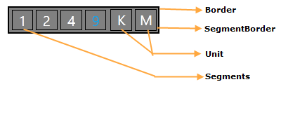

::: {style="DISPLAY: none"}
{#d2h_url_template}{#d2h_package_url style="WIDTH: 0px; DISPLAY: none; HEIGHT: 0px"}
:::

::: {.d2h_secondary_topic style="PADDING-BOTTOM: 10pt; MARGIN: 0pt; PADDING-LEFT: 0pt; PADDING-RIGHT: 0pt; PADDING-TOP: 0pt"}
#### Control Structure {#control-structure style="tab-stops: 0pt"}

Rolling Gauge

[The components of the Circular Gauge Windows Phone control are illustrated in the following screen shot.]{style="BACKGROUND: white"}

**[]{style="FONT-FAMILY: 'Calibri','sans-serif'; COLOR: red"}** 

[]{style="FONT-FAMILY: 'Calibri','sans-serif'"} 

{border="0"}

Figure 87: Rolling Gauge

[]{style="FONT-FAMILY: 'Calibri','sans-serif'"} 

 

[]{#p116} 

 

[]{#related-topics}
:::
