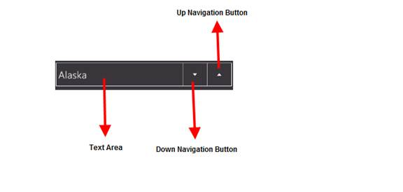

::: {style="DISPLAY: none"}
{#d2h_url_template}{#d2h_package_url style="WIDTH: 0px; DISPLAY: none; HEIGHT: 0px"}
:::

::: {.d2h_secondary_topic style="PADDING-BOTTOM: 10pt; MARGIN: 0pt; PADDING-LEFT: 0pt; PADDING-RIGHT: 0pt; PADDING-TOP: 0pt"}
#### Control Structure {#control-structure style="tab-stops: 0pt"}

 

The various elements of the *DomainUpDown* control are illustrated in the following screenshot:

 

{border="0"}

 

Figure 21: Elements of DomainUpDown Control

 

The following is a brief description on the elements of the DomainUpDown control.

 

Text Area

 

The *Text Area* is the area where the text is displayed.

 

Up Navigation Button

 

The *Up Navigation Button* is used to navigate to the previous value.

 

Down Navigation Button

 

The *Down Navigation Button* is used to navigate to the next value.

 

 

[]{#related-topics}
:::
