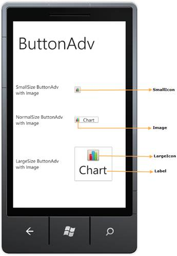

::: {style="DISPLAY: none"}
{#d2h_url_template}{#d2h_package_url style="WIDTH: 0px; DISPLAY: none; HEIGHT: 0px"}
:::

::: {.d2h_secondary_topic style="PADDING-BOTTOM: 10pt; MARGIN: 0pt; PADDING-LEFT: 0pt; PADDING-RIGHT: 0pt; PADDING-TOP: 0pt"}
#### Control Structure {#control-structure style="tab-stops: 0pt"}

The following screenshot shows the three different size modes of ButtonAdv control:

{border="0"}

Figure 32: Icon

[]{style="FONT-FAMILY: 'Calibri','sans-serif'"} 

More:

[ ]{#related-topics}

[{border="0" align="absMiddle"}Declaring ButtonAdv](ms-xhelp:///?Id=0c183747-1b30-4e80-af59-3dfa7a9d4fec){style="TEXT-DECORATION: none"}

[{border="0" align="absMiddle"}ButtonAdv Members](ms-xhelp:///?Id=f8ea49cd-3090-457f-9be9-1d04b9d636b2){style="TEXT-DECORATION: none"}
:::
