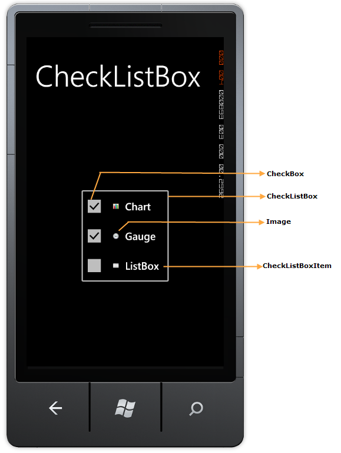

::: {style="DISPLAY: none"}
{#d2h_url_template}{#d2h_package_url style="WIDTH: 0px; DISPLAY: none; HEIGHT: 0px"}
:::

::: {.d2h_secondary_topic style="PADDING-BOTTOM: 10pt; MARGIN: 0pt; PADDING-LEFT: 0pt; PADDING-RIGHT: 0pt; PADDING-TOP: 0pt"}
#### Control Structure {#control-structure style="tab-stops: 0pt"}

 

The various elements of the CheckedListBox control are illustrated as follows:

 

 

{border="0"}

Figure 41: Elements of CheckedListBox Control

**** 

 

The following is a brief description on the elements of the CheckedListBox control.

 

CheckedListBox Item

 

The CheckedListBox Item represents the selectable item inside the CheckedListBox control.

 

Selected Item

 

The Selected Item is the item selected explicitly by the user.

 

Left Image

 

The Left Image is the image that can be seen on the left side of an item.

 

Check Box

 

The Check Box indicates whether a particular CheckedListBox Item is selected or cleared.

[]{#related-topics}
:::
