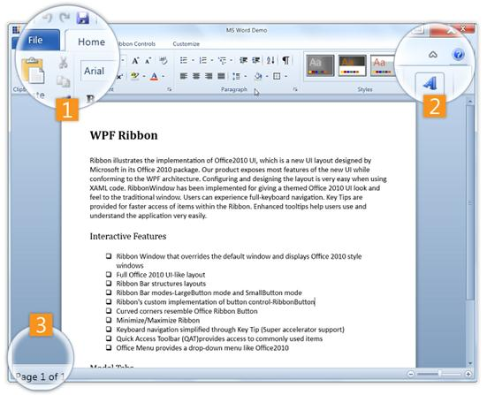
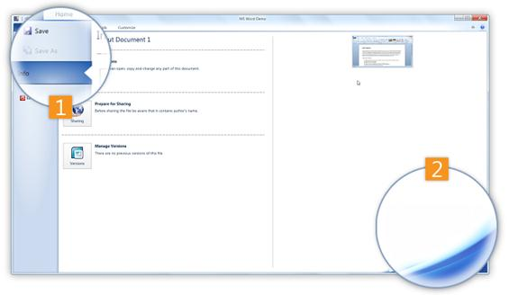

::: {style="DISPLAY: none"}
{#d2h_url_template}{#d2h_package_url style="WIDTH: 0px; DISPLAY: none; HEIGHT: 0px"}
:::

::: {.d2h_secondary_topic style="PADDING-BOTTOM: 10pt; MARGIN: 0pt; PADDING-LEFT: 0pt; PADDING-RIGHT: 0pt; PADDING-TOP: 0pt"}
#### [Control Structure]{style="BACKGROUND: white"} {#control-structure style="tab-stops: 0pt"}

 

 

{border="0"}

Figure 828: Ribbon View

The different components of the control are described below:

1.  **Controls**

[·      ]{style="FONT-FAMILY: Symbol"}BackStage Button -- Used to Show/Hide the Backstage

[·      ]{style="FONT-FAMILY: Symbol"}QAT -   This area holds the frequently accessed items. The user can add/remove items dynamically.

2.   **Minimize Ribbon Button -** Used to change the state (Minimize/Maximize) of Ribbon

3.   **Ribbon Status Bar --** Displays the status bar items

 

{border="0"}

Figure 829: BackStage View

Components of the BackStage view of the control are described below:

1.  **BackStage Items -** The BackStage Items consist of the following:

[·      ]{style="FONT-FAMILY: Symbol"}BackStageCommandButton - This button is similar to a control and is used to perform certain task on click.

[·      ]{style="FONT-FAMILY: Symbol"}BackStageTabItem - This is a tab like control that comprises of Header and Content area. Header is displayed in the left bar and content occupies the remaining area in the RibbonWindow.

2.   **BackStage Corner Image - I**mage placed at the bottom-right corner of the BackStage area

[]{#related-topics}
:::
