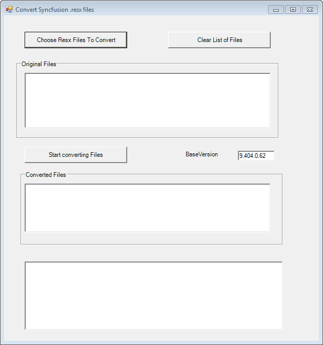
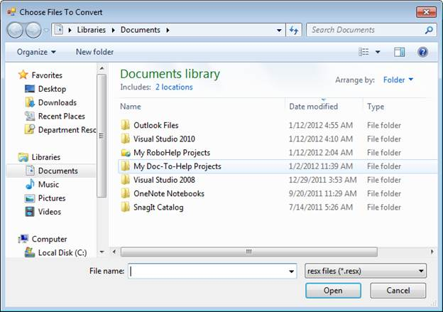
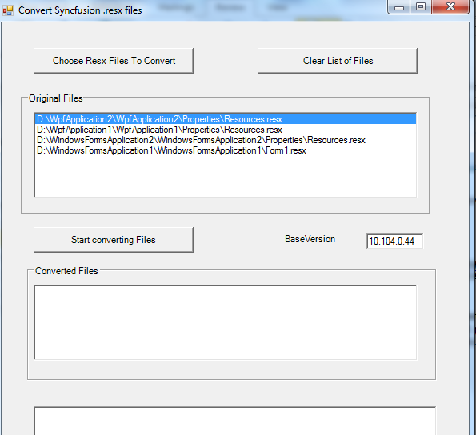
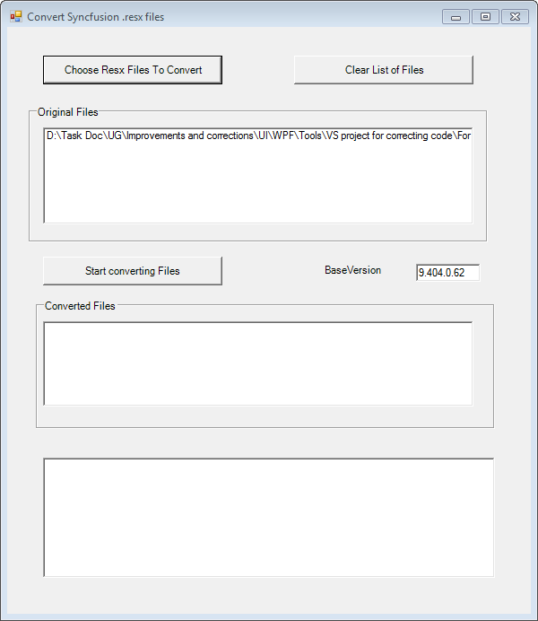

::: {style="DISPLAY: none"}
{#d2h_url_template}{#d2h_package_url style="WIDTH: 0px; DISPLAY: none; HEIGHT: 0px"}
:::

::::: {#nsbanner .d2h_main_nsbanner style="BORDER-BOTTOM: #999999 1px solid; POSITION: relative; PADDING-BOTTOM: 0px; BACKGROUND-COLOR: transparent; PADDING-LEFT: 0px; PADDING-RIGHT: 0px; DISPLAY: none; BORDER-TOP: #999999 1px solid; PADDING-TOP: 0px; LEFT: 0px"}
:::: {#TitleRow .d2h_main_titlerow style="PADDING-BOTTOM: 4px; BACKGROUND-COLOR: transparent; PADDING-LEFT: 22px; WIDTH: 100%; PADDING-RIGHT: 10px; DISPLAY: none; PADDING-TOP: 4px"}
::: {#ienav .d2h_main_ienav style="DISPLAY: none"}
{#D2HPrevious .D2HPreviousEnabled}  {#D2HNext .D2HNextEnabled}
:::
::::
:::::

::::::: {#nstext .d2h_main_nstext style="PADDING-BOTTOM: 10px; BACKGROUND-COLOR: transparent; PADDING-LEFT: 22px; PADDING-RIGHT: 10px; HEIGHT: 100%; OVERFLOW: auto; PADDING-TOP: 5px" hasuserbackground="true" valign="bottom"}
::: {#d2h_breadcrumbs .d2h_breadcrumbs}
[Essential Studio User Guide Documentation](ms-xhelp:///?Id=12457748-09e3-4d74-a240-8e049cedf030){.d2h_breadcrumbsNormal}[ \> ]{.d2h_breadcrumbsLinkSeparator}[Essential Common](ms-xhelp:///?Id=2bfe10b6-fac1-4f91-a173-04db314f10c3){.d2h_breadcrumbsNormal}[ \> ]{.d2h_breadcrumbsLinkSeparator}[Other Utilities](ms-xhelp:///?Id=a8cc7430-cdfc-4de3-a351-6b323ce09ef1){.d2h_breadcrumbsNormal}
:::

## ConvertResx Utility {#convertresx-utility style="tab-stops: 0pt"}

ConvertResx Utility is shipped along with our Essential Studio package to facilitate end-users to easily migrate to a newer version of Essential Studio. When a user creates a project using Essential Studio, the studio version number is hard coded in the **.resx** file. This results in compilation error for a project, when the studio is upgraded to a newer version. Hence while migrating to a newer version of Essential Studio from an earlier version, the **.resx** files also need to be migrated. This utility allows you convert the older .resx files easily.

 

This section covers information on the following topics:

[·      ]{style="FONT-FAMILY: Symbol"}Accessing ConvertResx Utility

[·      ]{style="FONT-FAMILY: Symbol"}Converting .resx files

[]{style="FONT-FAMILY: 'Trebuchet MS','sans-serif'; COLOR: #15428b; FONT-SIZE: 9pt"} 

Accessing ConvertResx Utility

**[]{style="FONT-FAMILY: 'Trebuchet MS','sans-serif'; COLOR: #15428b"}** 

To access ConvertResx utility:

1.   Click **Start -\> All Programs -\> Syncfusion -\> Essential Studio\<Version Number\> -\> Utilities -\> Migration -\> ConvertResx (Framework 2.0) / ConvertResx (Framework 3.5) / ConvertResx (Framework 4.0)**

 

The **Convert Syncfusion .resx files** dialog box opens. The BaseVersion box displays the version number of the currently installed Syncfusion assemblies (10.102.0.44 for .NET Framework 2.0, 10.103.0.44 for .NET Framework 3.5 and 8.104.0.26 for .NET Framework4.0).

[]{style="FONT-FAMILY: 'Trebuchet MS','sans-serif'; COLOR: #15428b; FONT-SIZE: 9pt"} 

 {border="0"}

Figure 133: ConvertResX Utility

::: {style="BORDER-BOTTOM: windowtext 1pt solid; BORDER-LEFT: medium none; PADDING-BOTTOM: 1pt; MARGIN-TOP: 9pt; PADDING-LEFT: 0pt; PADDING-RIGHT: 0pt; MARGIN-BOTTOM: 9pt; BORDER-TOP: windowtext 1pt solid; BORDER-RIGHT: medium none; PADDING-TOP: 1pt"}
{border="0"}Note: Alternatively, the utility can be accessed from the following locations:
:::

[·      ]{style="FONT-FAMILY: Symbol; FONT-SIZE: 9pt"}***[For 2.0 framework, \[Install Drive\]:\\Program Files\\Syncfusion\\Essential Studio\\\<Version Number\>\\Utilities\\Migration\\2.0\\ConvertResX.exe.]{style="FONT-SIZE: 9pt"}***

[·      ]{style="FONT-FAMILY: Symbol; FONT-SIZE: 9pt"}***[For 3.5 framework, \[Install Drive\]:\\Program Files\\Syncfusion\\Essential Studio\\\<Version Number\>\\Utilities\\Migration\\3.5\\ConvertResX.exe.]{style="FONT-SIZE: 9pt"}***

[·      ]{style="FONT-FAMILY: Symbol; FONT-SIZE: 9pt"}***[For 4.0 framework, \[Install Drive\]:\\Program Files\\Syncfusion\\Essential Studio\\\<Version Number\>\\Utilities\\Migration\\4.0\\ConvertResX.exe.]{style="FONT-SIZE: 9pt"}***

[]{style="FONT-FAMILY: 'Trebuchet MS','sans-serif'; COLOR: #15428b; FONT-SIZE: 9pt"} 

**[]{style="FONT-FAMILY: 'Trebuchet MS','sans-serif'; COLOR: #15428b; FONT-SIZE: 9pt"}** 

Converting .resx Files

**[]{style="FONT-FAMILY: 'Trebuchet MS','sans-serif'; COLOR: #15428b"}** 

The following steps illustrate how to convert the older .resx files:

[]{style="FONT-FAMILY: 'Trebuchet MS','sans-serif'; COLOR: #15428b; FONT-SIZE: 9pt"} 

1.   Open the **Convert Syncfusion .resx files** dialog box.

 

{border="0"}

Figure 134: Convert Syncfusion .resx files dialog box

 

2.   Click **Choose Resx Files To Convert.** The **Choose Files To Convert dialog box** opens**.**

 

{border="0"}

Figure 135: Choose Resx Files To Convert Dialog Box

 

3.   Select the required **.resx** files (of the older version) to be converted.

4.   Click **Open**.

 

::: {style="BORDER-BOTTOM: windowtext 1pt solid; BORDER-LEFT: medium none; PADDING-BOTTOM: 1pt; MARGIN-TOP: 9pt; PADDING-LEFT: 0pt; PADDING-RIGHT: 0pt; MARGIN-BOTTOM: 9pt; BORDER-TOP: windowtext 1pt solid; BORDER-RIGHT: medium none; PADDING-TOP: 1pt"}
{border="0"}Note: The path of the selected file is displayed in the Original Files box. This can be cleared from the Original Files box by selecting the required file and clicking Clear List of Files.
:::

{border="0"}

Figure 136: Original Files

**[]{style="FONT-FAMILY: 'Trebuchet MS','sans-serif'; COLOR: #15428b"}** 

5.   Click **Start converting Files** to convert the .resx files.

The path of the converted files will be displayed in the **Converted Files** box.  The last box displays the total number of version entries changed in the converted .resx file. It changes the version details in the .resx file to the existing base version. This is only applicable for Windows platform applications.

{border="0"}[]{style="FONT-FAMILY: 'Trebuchet MS','sans-serif'; COLOR: #15428b; FONT-SIZE: 9pt"}

Figure 137: Converting

[]{style="FONT-FAMILY: 'Trebuchet MS','sans-serif'; COLOR: #15428b; FONT-SIZE: 9pt"} 

::: {style="BORDER-BOTTOM: windowtext 1pt solid; BORDER-LEFT: medium none; PADDING-BOTTOM: 1pt; MARGIN-TOP: 9pt; PADDING-LEFT: 0pt; PADDING-RIGHT: 0pt; MARGIN-BOTTOM: 9pt; BORDER-TOP: windowtext 1pt solid; BORDER-RIGHT: medium none; PADDING-TOP: 1pt"}
{border="0"}Note: After the conversion, the new .resx files will have the same name as the original files. Copies of the original files will be renamed  with a .OLD suffix added to their names.
:::

[]{style="FONT-FAMILY: 'Trebuchet MS','sans-serif'; COLOR: #15428b; FONT-SIZE: 9pt"} 

[]{#related-topics}
:::::::
