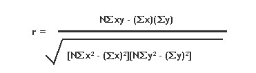

::: {style="DISPLAY: none"}
{#d2h_url_template}{#d2h_package_url style="WIDTH: 0px; DISPLAY: none; HEIGHT: 0px"}
:::

::::: {.d2h_secondary_topic style="PADDING-BOTTOM: 10pt; MARGIN: 0pt; PADDING-LEFT: 0pt; PADDING-RIGHT: 0pt; PADDING-TOP: 0pt"}
#### Correlation {#correlation style="tab-stops: 0pt"}

 

**Correlation**, which is otherwise called as **Correlation Coefficient**, is a statistical formula that determines the degree of relationship between the y values of two series representing two variables. This calculation will then be used to measure the depth of synchronization between those two variables.

 

A **relationship** generally refers to the correspondence between two variables. For instance, let us have two variables with one representing \'Work Experience\' while the other indicating the \'Salary Expectation\'. If the \'Work Experience\' is high, then the \'Salary Expectation\' will also be high. When \'Work Experience\' is low, then the \'Salary Expectation\' also tends to be low. Thereby these two variables are correlated.

 

The relationships can be classified into two types, **Positive** and **Negative**. In a **positive** relationship, high values on one variable are associated with high values on the other and low values on one variable are associated with low values on the other. The **negative** relationship is just the inverse of the positive relationship where the high values on one variable are associated with low values on the other.

 

When the measured correlation coefficient is positive, the series values would be positively correlated where as if the correlation coefficient is negative, then the series values would then be negatively correlated. Below is the formula for calculating correlation coefficient.

 

{border="0"}

where,

x is the y value of first series and

y is the y value of second series.

 

Using the Formula

 

The Correlation Coefficient can easily be calculated by using the Correlation method available with the BasicStatisticalFormulas class. The following table describes the details of this method. This method returns the covariance of the datasets divided by the product of their standard deviations.

 

::: {align="center"}
+-----------------------+-----------------------------------------------------------------------------------------------------------------------------------------------------------------------------------+----------------------------------------------------------------------------------------------------------------------+
| Method Name           | Parameters                                                                                                                                                                        | Return Value                                                                                                         |
+-----------------------+-----------------------------------------------------------------------------------------------------------------------------------------------------------------------------------+----------------------------------------------------------------------------------------------------------------------+
| Correlation           | 1.**FirstInputSeries**: A ChartSeries object that stores the first group\'s data.                                                                                                 | A double that represents the correlation value between the two groups of data. The value always ranges from -1 to 1. |
|                       |                                                                                                                                                                                   |                                                                                                                      |
|                       |                                                                                                                                                                                   |                                                                                                                      |
|                       |                                                                                                                                                                                   |                                                                                                                      |
|                       | 2.**SecondInputSeries**: A ChartSeries object that stores the second group\'s data. An exception will be raised if the input series does not have the same number of data points. |                                                                                                                      |
+-----------------------+-----------------------------------------------------------------------------------------------------------------------------------------------------------------------------------+----------------------------------------------------------------------------------------------------------------------+
:::

 

Example

 

The below code snippet demonstrates how to get the correlation coefficient between two groups of data (Series1 and Series2) using the in-built formula.

 

+------------------------------------------------------------------------------------------------------------------------------------------------------------------------------------+
| **[\[C#\]]{style="FONT-FAMILY: 'Courier New'; COLOR: black"}**                                                                                                                     |
|                                                                                                                                                                                    |
| []{style="COLOR: black"}                                                                                                                                                           |
|                                                                                                                                                                                    |
| [using Syncfusion.Windows.Forms.Chart.Statistics;]{style="FONT-FAMILY: 'Courier New'; COLOR: black"}                                                                               |
|                                                                                                                                                                                    |
| [\...\...\...\...]{style="FONT-FAMILY: 'Courier New'; COLOR: black"}                                                                                                               |
|                                                                                                                                                                                    |
| [double]{style="FONT-FAMILY: 'Courier New'; COLOR: blue"}[ Correlation1= BasicStatisticalFormulas.Correlation(series1,series2);]{style="FONT-FAMILY: 'Courier New'; COLOR: black"} |
+------------------------------------------------------------------------------------------------------------------------------------------------------------------------------------+

 

+--------------------------------------------------------------------------------------------------------------------------------------------------------------------------------------+
| **[\[VB.NET\]]{style="FONT-FAMILY: 'Courier New'; COLOR: black"}**                                                                                                                   |
|                                                                                                                                                                                      |
| []{style="COLOR: black"}                                                                                                                                                             |
|                                                                                                                                                                                      |
| [Imports Syncfusion.Windows.Forms.Chart.Statistics]{style="FONT-FAMILY: 'Courier New'; COLOR: black"}                                                                                |
|                                                                                                                                                                                      |
| [\...\...\...\....]{style="FONT-FAMILY: 'Courier New'; COLOR: black"}                                                                                                                |
|                                                                                                                                                                                      |
| [Dim]{style="FONT-FAMILY: 'Courier New'; COLOR: blue"}[ Correlation1 ]{style="FONT-FAMILY: 'Courier New'; COLOR: black"}[As Double]{style="FONT-FAMILY: 'Courier New'; COLOR: blue"} |
|                                                                                                                                                                                      |
| [Correlation1=BasicStatisticalFormulas.Correlation(series,series1)]{style="FONT-FAMILY: 'Courier New'; COLOR: black"}                                                                |
+--------------------------------------------------------------------------------------------------------------------------------------------------------------------------------------+

 

::: {style="BORDER-BOTTOM: windowtext 1pt solid; BORDER-LEFT: medium none; PADDING-BOTTOM: 1pt; MARGIN-TOP: 9pt; PADDING-LEFT: 0pt; PADDING-RIGHT: 0pt; MARGIN-BOTTOM: 9pt; BORDER-TOP: windowtext 1pt solid; BORDER-RIGHT: medium none; PADDING-TOP: 1pt"}
{border="0"}Note: For further details, refer to this Browser Sample:
:::

 

[\[Installed drive\]:\\Documents and Settings\\\[User name\]\\My Documents\\Syncfusion\\EssentialStudio\\\[Installed version\]\\Windows\\ Chart.Windows\\Samples\\2.0\\Statistical Analysis\\Chart Statistical Formulas]{.UGHyperlink}

[]{#p219} 

 

[]{#related-topics}
:::::
