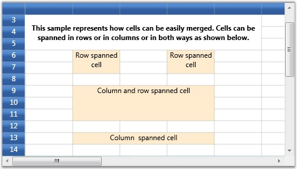

::: {style="DISPLAY: none"}
{#d2h_url_template}{#d2h_package_url style="WIDTH: 0px; DISPLAY: none; HEIGHT: 0px"}
:::

::: {.d2h_secondary_topic style="PADDING-BOTTOM: 10pt; MARGIN: 0pt; PADDING-LEFT: 0pt; PADDING-RIGHT: 0pt; PADDING-TOP: 0pt"}
#### Covered Ranges {#covered-ranges style="tab-stops: 0pt"}

[]{style="FONT-FAMILY: 'Trebuchet MS','sans-serif'; COLOR: #15428b; FONT-SIZE: 9pt"} 

Covered Cells are cells that span over neighboring cells. The combined cells will act as if they are one single cell visually and programmatically. There are different possible options to form a covered range. You can combine the cells in adjacent rows or columns or both.

[]{style="FONT-FAMILY: 'Trebuchet MS','sans-serif'; COLOR: #15428b; FONT-SIZE: 9pt"} 

Creating Covered Range

[]{style="FONT-FAMILY: 'Trebuchet MS','sans-serif'; COLOR: #15428b; FONT-SIZE: 9pt"} 

+------------------------------------------------------------------------------------------------------------------------------------------------------------------------------------------------------------------------------+
| **[\[C#\]]{style="FONT-FAMILY: 'Courier New'; COLOR: black"}**                                                                                                                                                               |
|                                                                                                                                                                                                                              |
| []{style="FONT-FAMILY: 'Courier New'; COLOR: blue"}                                                                                                                                                                          |
|                                                                                                                                                                                                                              |
| [this]{style="FONT-FAMILY: 'Courier New'; COLOR: blue"}[.grid.Model.CoveredCells.Add ([new]{style="COLOR: blue"} [CoveredCellInfo]{style="COLOR: #2b91af"} (6, 4, 7, 4));            ]{style="FONT-FAMILY: 'Courier New'"}   |
|                                                                                                                                                                                                                              |
| [this]{style="FONT-FAMILY: 'Courier New'; COLOR: blue"}[.grid.Model.CoveredCells.Add ([new]{style="COLOR: blue"} [CoveredCellInfo]{style="COLOR: #2b91af"} (6, 6, 7, 6));]{style="FONT-FAMILY: 'Courier New'"}               |
|                                                                                                                                                                                                                              |
| []{style="FONT-FAMILY: 'Courier New'"}                                                                                                                                                                                       |
|                                                                                                                                                                                                                              |
| [cell = [this]{style="COLOR: blue"}.grid.Model\[6, 4\];]{style="FONT-FAMILY: 'Courier New'"}                                                                                                                                 |
|                                                                                                                                                                                                                              |
| [cell.CellValue = [\"Row spanned cell\"]{style="COLOR: #a31515"};]{style="FONT-FAMILY: 'Courier New'"}                                                                                                                       |
|                                                                                                                                                                                                                              |
| [cell.Background = [Brushes]{style="COLOR: #2b91af"}.BlanchedAlmond;]{style="FONT-FAMILY: 'Courier New'"}                                                                                                                    |
|                                                                                                                                                                                                                              |
| [cell.[HorizontalAlignment]{style="COLOR: #2b91af"} = [HorizontalAlignment]{style="COLOR: #2b91af"}.Center;]{style="FONT-FAMILY: 'Courier New'"}                                                                             |
|                                                                                                                                                                                                                              |
| []{style="FONT-FAMILY: 'Courier New'"}                                                                                                                                                                                       |
|                                                                                                                                                                                                                              |
| [cell = [this]{style="COLOR: blue"}.grid.Model\[6, 6\];]{style="FONT-FAMILY: 'Courier New'"}                                                                                                                                 |
|                                                                                                                                                                                                                              |
| [cell.CellValue = [\"Row spanned cell\"]{style="COLOR: #a31515"};]{style="FONT-FAMILY: 'Courier New'"}                                                                                                                       |
|                                                                                                                                                                                                                              |
| [cell.[HorizontalAlignment]{style="COLOR: #2b91af"} = [HorizontalAlignment]{style="COLOR: #2b91af"}.Center;]{style="FONT-FAMILY: 'Courier New'"}                                                                             |
|                                                                                                                                                                                                                              |
| [cell.Background = [Brushes]{style="COLOR: #2b91af"}.BlanchedAlmond;            ]{style="FONT-FAMILY: 'Courier New'"}                                                                                                        |
|                                                                                                                                                                                                                              |
| []{style="FONT-FAMILY: 'Courier New'"}                                                                                                                                                                                       |
|                                                                                                                                                                                                                              |
| [this]{style="FONT-FAMILY: 'Courier New'; COLOR: blue"}[.grid.Model.CoveredCells.Add ([new]{style="COLOR: blue"} [CoveredCellInfo]{style="COLOR: #2b91af"} (9, 4, 11, 6));            ]{style="FONT-FAMILY: 'Courier New'"}  |
|                                                                                                                                                                                                                              |
| []{style="FONT-FAMILY: 'Courier New'"}                                                                                                                                                                                       |
|                                                                                                                                                                                                                              |
| [cell = [this]{style="COLOR: blue"}.grid.Model\[9, 4\];]{style="FONT-FAMILY: 'Courier New'"}                                                                                                                                 |
|                                                                                                                                                                                                                              |
| [cell.CellValue = [\"Column and row spanned cell\"]{style="COLOR: #a31515"};            ]{style="FONT-FAMILY: 'Courier New'"}                                                                                                |
|                                                                                                                                                                                                                              |
| [cell.[HorizontalAlignment]{style="COLOR: #2b91af"} = [HorizontalAlignment]{style="COLOR: #2b91af"}.Center;]{style="FONT-FAMILY: 'Courier New'"}                                                                             |
|                                                                                                                                                                                                                              |
| [cell.Background = [Brushes]{style="COLOR: #2b91af"}.BlanchedAlmond;            ]{style="FONT-FAMILY: 'Courier New'"}                                                                                                        |
|                                                                                                                                                                                                                              |
| []{style="FONT-FAMILY: 'Courier New'"}                                                                                                                                                                                       |
|                                                                                                                                                                                                                              |
| [this]{style="FONT-FAMILY: 'Courier New'; COLOR: blue"}[.grid.Model.CoveredCells.Add ([new]{style="COLOR: blue"} [CoveredCellInfo]{style="COLOR: #2b91af"} (13, 4, 13, 6));            ]{style="FONT-FAMILY: 'Courier New'"} |
|                                                                                                                                                                                                                              |
| [cell = [this]{style="COLOR: blue"}.grid.Model\[13, 4\];]{style="FONT-FAMILY: 'Courier New'"}                                                                                                                                |
|                                                                                                                                                                                                                              |
| [cell.CellValue = [\"Column spanned cell\"]{style="COLOR: #a31515"};]{style="FONT-FAMILY: 'Courier New'"}                                                                                                                    |
|                                                                                                                                                                                                                              |
| [cell.Background = [Brushes]{style="COLOR: #2b91af"}.BlanchedAlmond;]{style="FONT-FAMILY: 'Courier New'"}                                                                                                                    |
|                                                                                                                                                                                                                              |
| [cell.[HorizontalAlignment]{style="COLOR: #2b91af"} = [HorizontalAlignment]{style="COLOR: #2b91af"}.Center;]{style="FONT-FAMILY: 'Courier New'"}                                                                             |
+------------------------------------------------------------------------------------------------------------------------------------------------------------------------------------------------------------------------------+

[]{style="FONT-FAMILY: 'Trebuchet MS','sans-serif'; COLOR: #15428b; FONT-SIZE: 9pt"} 

Output

**[]{style="FONT-FAMILY: 'Trebuchet MS','sans-serif'; COLOR: #15428b; FONT-SIZE: 9pt"}** 

The following output is generated using the code above.

[]{style="FONT-FAMILY: 'Trebuchet MS','sans-serif'; COLOR: #15428b; FONT-SIZE: 9pt"} 

{border="0"}

[]{style="FONT-FAMILY: 'Trebuchet MS','sans-serif'; COLOR: #15428b; FONT-SIZE: 9pt"} 

Figure 45: Covered Ranges

[]{style="FONT-FAMILY: 'Trebuchet MS','sans-serif'; COLOR: #15428b; FONT-SIZE: 9pt"} 

See Also

[]{style="FONT-FAMILY: 'Trebuchet MS','sans-serif'; COLOR: #15428b; FONT-SIZE: 9pt"} 

[QueryCoveredRange event]{style="COLOR: windowtext; TEXT-DECORATION: none; text-underline: none"}[]{style="COLOR: black"}

[]{#p186} 

 

[]{#related-topics}
:::
