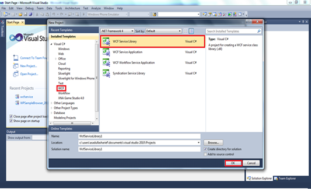
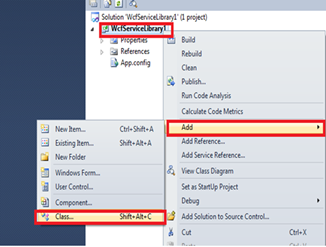
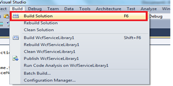
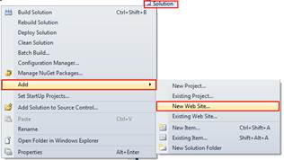
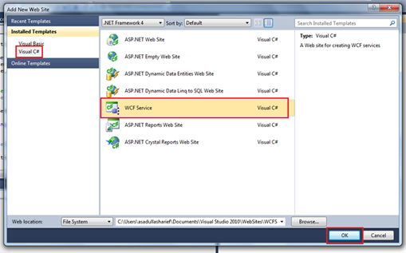
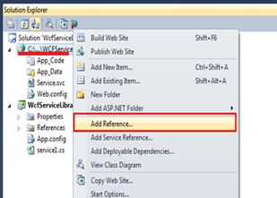
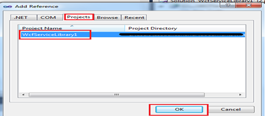
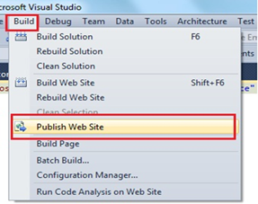
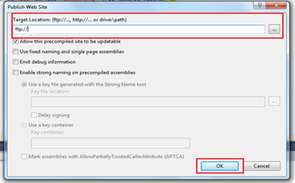

::: {style="DISPLAY: none"}
{#d2h_url_template}{#d2h_package_url style="WIDTH: 0px; DISPLAY: none; HEIGHT: 0px"}
:::

::::: {#nsbanner .d2h_main_nsbanner style="BORDER-BOTTOM: #999999 1px solid; POSITION: relative; PADDING-BOTTOM: 0px; BACKGROUND-COLOR: transparent; PADDING-LEFT: 0px; PADDING-RIGHT: 0px; DISPLAY: none; BORDER-TOP: #999999 1px solid; PADDING-TOP: 0px; LEFT: 0px"}
:::: {#TitleRow .d2h_main_titlerow style="PADDING-BOTTOM: 4px; BACKGROUND-COLOR: transparent; PADDING-LEFT: 22px; WIDTH: 100%; PADDING-RIGHT: 10px; DISPLAY: none; PADDING-TOP: 4px"}
::: {#ienav .d2h_main_ienav style="DISPLAY: none"}
{#D2HPrevious .D2HPreviousEnabled}  {#D2HNext .D2HNextEnabled}
:::
::::
:::::

:::: {#nstext .d2h_main_nstext style="PADDING-BOTTOM: 10px; BACKGROUND-COLOR: transparent; PADDING-LEFT: 22px; PADDING-RIGHT: 10px; HEIGHT: 100%; OVERFLOW: auto; PADDING-TOP: 5px" hasuserbackground="true" valign="bottom"}
::: {#d2h_breadcrumbs .d2h_breadcrumbs}
[Essential Studio User Guide Documentation](ms-xhelp:///?Id=12457748-09e3-4d74-a240-8e049cedf030){.d2h_breadcrumbsNormal}[ \> ]{.d2h_breadcrumbsLinkSeparator}[User Interface Edition](ms-xhelp:///?Id=c29296b7-531c-413b-a0ec-488ca1f7f669){.d2h_breadcrumbsNormal}[ \> ]{.d2h_breadcrumbsLinkSeparator}[Essential Windows Phone](ms-xhelp:///?Id=5ea1999c-4eff-4775-b84e-407dc825f555){.d2h_breadcrumbsNormal}[ \> ]{.d2h_breadcrumbsLinkSeparator}[Essential Chart]{.d2h_breadcrumbsContentsOnly}[ \> ]{.d2h_breadcrumbsLinkSeparator}[How to?](ms-xhelp:///?Id=0ed1e887-3ff6-4f63-ada4-d9bcdcaeda20){.d2h_breadcrumbsNormal}
:::

## Create a WCF Service Library? {#create-a-wcf-service-library style="tab-stops: 0pt"}

To create a WCF Service Library:

1.   Open **Visual Studio** and go **to File -\> New -\> Project**.

2.   Then select the **WCF** tab, and select **WCF Service Library**.

{border="0"}

 

Figure 114: Create a WCF Library

3.   Create new class and add the following code (Note: code depends upon the individual requirement).

 

{border="0"}

 

Figure 115:  Adding a New Class

4.   Include the following namespaces:

         

+--------------------------------------------------------------------------------------------------------------------------------------------------------+
| **[\[C#\]]{style="FONT-FAMILY: 'Courier New'"}**                                                                                                       |
|                                                                                                                                                        |
| [using]{style="FONT-FAMILY: Consolas; COLOR: blue; FONT-SIZE: 9.5pt"}[ System.Runtime.Serialization;]{style="FONT-FAMILY: Consolas; FONT-SIZE: 9.5pt"} |
|                                                                                                                                                        |
| [using]{style="FONT-FAMILY: Consolas; COLOR: blue; FONT-SIZE: 9.5pt"}[ System.ServiceModel;]{style="FONT-FAMILY: Consolas; FONT-SIZE: 9.5pt"}          |
|                                                                                                                                                        |
| []{style="FONT-FAMILY: Consolas; FONT-SIZE: 9.5pt"}                                                                                                    |
|                                                                                                                                                        |
|                                                                                                                                                        |
+--------------------------------------------------------------------------------------------------------------------------------------------------------+

         

5.   Add the following sample code:

         

+---------------------------------------------------------------------------------------------------------------------------------------------------------------------------------------------------------------------------------------------------------------------+
| **[\[C#\]]{style="FONT-FAMILY: 'Courier New'"}**                                                                                                                                                                                                                    |
|                                                                                                                                                                                                                                                                     |
| []{style="FONT-FAMILY: Consolas; FONT-SIZE: 9.5pt"}                                                                                                                                                                                                                 |
|                                                                                                                                                                                                                                                                     |
| []{style="FONT-FAMILY: Consolas; FONT-SIZE: 9.5pt"}                                                                                                                                                                                                                 |
|                                                                                                                                                                                                                                                                     |
| [namespace]{style="FONT-FAMILY: Consolas; COLOR: blue; FONT-SIZE: 9.5pt"}[ WcfServiceLibrary1]{style="FONT-FAMILY: Consolas; FONT-SIZE: 9.5pt"}                                                                                                                     |
|                                                                                                                                                                                                                                                                     |
| [{]{style="FONT-FAMILY: Consolas; FONT-SIZE: 9.5pt"}                                                                                                                                                                                                                |
|                                                                                                                                                                                                                                                                     |
| [    \[[DataContract]{style="COLOR: #2b91af"}\] [// annotate the field]{style="COLOR: green"}]{style="FONT-FAMILY: Consolas; FONT-SIZE: 9.5pt"}                                                                                                                     |
|                                                                                                                                                                                                                                                                     |
| [    [public]{style="COLOR: blue"} [class]{style="COLOR: blue"} [my]{style="COLOR: #2b91af"}]{style="FONT-FAMILY: Consolas; FONT-SIZE: 9.5pt"}                                                                                                                      |
|                                                                                                                                                                                                                                                                     |
| [    {]{style="FONT-FAMILY: Consolas; FONT-SIZE: 9.5pt"}                                                                                                                                                                                                            |
|                                                                                                                                                                                                                                                                     |
| [        \[[DataMember]{style="COLOR: #2b91af"}\]]{style="FONT-FAMILY: Consolas; FONT-SIZE: 9.5pt"}                                                                                                                                                                 |
|                                                                                                                                                                                                                                                                     |
| [        [public]{style="COLOR: blue"} [int]{style="COLOR: blue"} a; [// variables]{style="COLOR: green"}]{style="FONT-FAMILY: Consolas; FONT-SIZE: 9.5pt"}                                                                                                         |
|                                                                                                                                                                                                                                                                     |
| []{style="FONT-FAMILY: Consolas; FONT-SIZE: 9.5pt"}                                                                                                                                                                                                                 |
|                                                                                                                                                                                                                                                                     |
| [        ]{style="FONT-FAMILY: Consolas; FONT-SIZE: 9.5pt"}                                                                                                                                                                                                         |
|                                                                                                                                                                                                                                                                     |
| [    }]{style="FONT-FAMILY: Consolas; FONT-SIZE: 9.5pt"}                                                                                                                                                                                                            |
|                                                                                                                                                                                                                                                                     |
| []{style="FONT-FAMILY: Consolas; FONT-SIZE: 9.5pt"}                                                                                                                                                                                                                 |
|                                                                                                                                                                                                                                                                     |
| []{style="FONT-FAMILY: Consolas; FONT-SIZE: 9.5pt"}                                                                                                                                                                                                                 |
|                                                                                                                                                                                                                                                                     |
| [    \[[ServiceContract]{style="COLOR: #2b91af"}\] [// annotate the interface]{style="COLOR: green"}]{style="FONT-FAMILY: Consolas; FONT-SIZE: 9.5pt"}                                                                                                              |
|                                                                                                                                                                                                                                                                     |
| [    [public]{style="COLOR: blue"} [interface]{style="COLOR: blue"} [Imyservice]{style="COLOR: #2b91af"}]{style="FONT-FAMILY: Consolas; FONT-SIZE: 9.5pt"}                                                                                                          |
|                                                                                                                                                                                                                                                                     |
| [    {]{style="FONT-FAMILY: Consolas; FONT-SIZE: 9.5pt"}                                                                                                                                                                                                            |
|                                                                                                                                                                                                                                                                     |
| [        \[[OperationContract]{style="COLOR: #2b91af"}\]]{style="FONT-FAMILY: Consolas; FONT-SIZE: 9.5pt"}                                                                                                                                                          |
|                                                                                                                                                                                                                                                                     |
| [        [void]{style="COLOR: blue"} setdata([my]{style="COLOR: #2b91af"} m); [// function to receive the data of type my(class)]{style="COLOR: green"}]{style="FONT-FAMILY: Consolas; FONT-SIZE: 9.5pt"}                                                           |
|                                                                                                                                                                                                                                                                     |
| []{style="FONT-FAMILY: Consolas; FONT-SIZE: 9.5pt"}                                                                                                                                                                                                                 |
|                                                                                                                                                                                                                                                                     |
| [        \[[OperationContract]{style="COLOR: #2b91af"}\]]{style="FONT-FAMILY: Consolas; FONT-SIZE: 9.5pt"}                                                                                                                                                          |
|                                                                                                                                                                                                                                                                     |
| [        [List]{style="COLOR: #2b91af"}\<[my]{style="COLOR: #2b91af"}\> getdata([my]{style="COLOR: #2b91af"} m);]{style="FONT-FAMILY: Consolas; FONT-SIZE: 9.5pt"}                                                                                                  |
|                                                                                                                                                                                                                                                                     |
| []{style="FONT-FAMILY: Consolas; FONT-SIZE: 9.5pt"}                                                                                                                                                                                                                 |
|                                                                                                                                                                                                                                                                     |
| [    }]{style="FONT-FAMILY: Consolas; FONT-SIZE: 9.5pt"}                                                                                                                                                                                                            |
|                                                                                                                                                                                                                                                                     |
| []{style="FONT-FAMILY: Consolas; FONT-SIZE: 9.5pt"}                                                                                                                                                                                                                 |
|                                                                                                                                                                                                                                                                     |
| []{style="FONT-FAMILY: Consolas; FONT-SIZE: 9.5pt"}                                                                                                                                                                                                                 |
|                                                                                                                                                                                                                                                                     |
| []{style="FONT-FAMILY: Consolas; FONT-SIZE: 9.5pt"}                                                                                                                                                                                                                 |
|                                                                                                                                                                                                                                                                     |
| [    \[[ServiceBehavior]{style="COLOR: #2b91af"}(InstanceContextMode = [InstanceContextMode]{style="COLOR: #2b91af"}.Single)\] [// to have only single instance mode running in the host. ]{style="COLOR: green"}]{style="FONT-FAMILY: Consolas; FONT-SIZE: 9.5pt"} |
|                                                                                                                                                                                                                                                                     |
| [    [public]{style="COLOR: blue"} [class]{style="COLOR: blue"} [myservice]{style="COLOR: #2b91af"} : [Imyservice]{style="COLOR: #2b91af"}]{style="FONT-FAMILY: Consolas; FONT-SIZE: 9.5pt"}                                                                        |
|                                                                                                                                                                                                                                                                     |
| [    {]{style="FONT-FAMILY: Consolas; FONT-SIZE: 9.5pt"}                                                                                                                                                                                                            |
|                                                                                                                                                                                                                                                                     |
| [        [List]{style="COLOR: #2b91af"}\<[my]{style="COLOR: #2b91af"}\> obj = [new]{style="COLOR: blue"} [List]{style="COLOR: #2b91af"}\<[my]{style="COLOR: #2b91af"}\>();]{style="FONT-FAMILY: Consolas; FONT-SIZE: 9.5pt"}                                        |
|                                                                                                                                                                                                                                                                     |
| [        ]{style="FONT-FAMILY: Consolas; FONT-SIZE: 9.5pt"}                                                                                                                                                                                                         |
|                                                                                                                                                                                                                                                                     |
| [        [public]{style="COLOR: blue"} [void]{style="COLOR: blue"} setdata([my]{style="COLOR: #2b91af"} m)]{style="FONT-FAMILY: Consolas; FONT-SIZE: 9.5pt"}                                                                                                        |
|                                                                                                                                                                                                                                                                     |
| [        {]{style="FONT-FAMILY: Consolas; FONT-SIZE: 9.5pt"}                                                                                                                                                                                                        |
|                                                                                                                                                                                                                                                                     |
| [            obj.Add(m);  [// method to add new  value]{style="COLOR: green"}]{style="FONT-FAMILY: Consolas; FONT-SIZE: 9.5pt"}                                                                                                                                     |
|                                                                                                                                                                                                                                                                     |
| [        }]{style="FONT-FAMILY: Consolas; FONT-SIZE: 9.5pt"}                                                                                                                                                                                                        |
|                                                                                                                                                                                                                                                                     |
| []{style="FONT-FAMILY: Consolas; FONT-SIZE: 9.5pt"}                                                                                                                                                                                                                 |
|                                                                                                                                                                                                                                                                     |
| [        [public]{style="COLOR: blue"}   [List]{style="COLOR: #2b91af"}\<[my]{style="COLOR: #2b91af"}\> getdata()]{style="FONT-FAMILY: Consolas; FONT-SIZE: 9.5pt"}                                                                                                 |
|                                                                                                                                                                                                                                                                     |
| [        {]{style="FONT-FAMILY: Consolas; FONT-SIZE: 9.5pt"}                                                                                                                                                                                                        |
|                                                                                                                                                                                                                                                                     |
| [            [return]{style="COLOR: blue"} obj; [// method to get the values]{style="COLOR: green"}]{style="FONT-FAMILY: Consolas; FONT-SIZE: 9.5pt"}                                                                                                               |
|                                                                                                                                                                                                                                                                     |
| [        }]{style="FONT-FAMILY: Consolas; FONT-SIZE: 9.5pt"}                                                                                                                                                                                                        |
|                                                                                                                                                                                                                                                                     |
| []{style="FONT-FAMILY: Consolas; FONT-SIZE: 9.5pt"}                                                                                                                                                                                                                 |
|                                                                                                                                                                                                                                                                     |
| [    }]{style="FONT-FAMILY: Consolas; FONT-SIZE: 9.5pt"}                                                                                                                                                                                                            |
|                                                                                                                                                                                                                                                                     |
| []{style="FONT-FAMILY: Consolas; FONT-SIZE: 9.5pt"}                                                                                                                                                                                                                 |
|                                                                                                                                                                                                                                                                     |
| [}]{style="FONT-FAMILY: Consolas; FONT-SIZE: 9.5pt"}                                                                                                                                                                                                                |
|                                                                                                                                                                                                                                                                     |
| []{style="FONT-FAMILY: Consolas; FONT-SIZE: 9.5pt"}                                                                                                                                                                                                                 |
|                                                                                                                                                                                                                                                                     |
| []{style="FONT-FAMILY: Consolas; FONT-SIZE: 9.5pt"}                                                                                                                                                                                                                 |
|                                                                                                                                                                                                                                                                     |
|                                                                                                                                                                                                                                                                     |
+---------------------------------------------------------------------------------------------------------------------------------------------------------------------------------------------------------------------------------------------------------------------+

 

6.   Build the Service Library.

 

 

{border="0"}

 

Figure 116: Building the Solution

 

7.   Add a new web service by, right-clicking the **Solution** and select **Add** and then select **New Website**.

{hspace="12" align="left"}

 

 

 

 

 

 

 

 

Figure 117: Adding a New Website to the Solution

 

8.   Select the type as **WCF Service**.

 

{border="0"}

 

Figure 118: Adding a WCF Service Website

 

9.   Refer to the **WCF Service Library** to the newly added project.

10.  Right-click **Add Reference**.** **

 

{border="0"}

Figure 119:  Referring the Service Library

 

{border="0"}

Figure 120:  Selecting the Reference

 

11.  In **Add Reference Window**, Publish the **WCF Service** website at your hosting space, once your website is published. The service reference link to be added at the client site application is automatically generated.

To Publish the Website:

12.  Go to **Build** [à]{style="FONT-FAMILY: Wingdings"}  **Publish**. A window appears. Specify the publish type, credentials and the location (web address).

 

{border="0"}

Publishing the Web Service\
\
[]{style="FONT-STYLE: normal"}

{border="0"}

 

Selecting the Publish type

The above steps help to create and host a WCF service application that enables binding the data dynamically in a website.

 

[]{#related-topics}
::::
