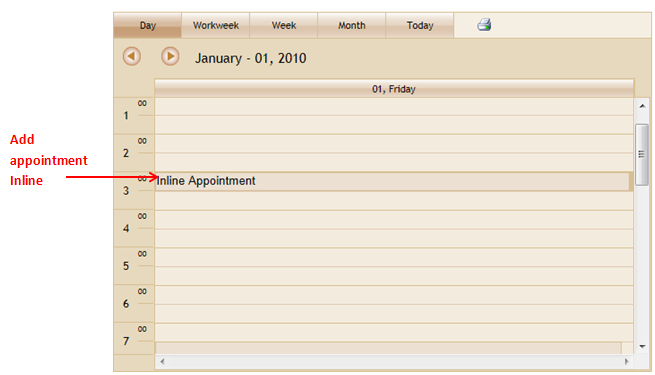
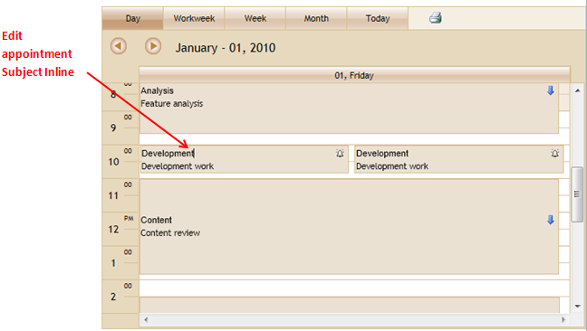

::: {style="DISPLAY: none"}
{#d2h_url_template}{#d2h_package_url style="WIDTH: 0px; DISPLAY: none; HEIGHT: 0px"}
:::

::::: {#nsbanner .d2h_main_nsbanner style="BORDER-BOTTOM: #999999 1px solid; POSITION: relative; PADDING-BOTTOM: 0px; BACKGROUND-COLOR: transparent; PADDING-LEFT: 0px; PADDING-RIGHT: 0px; DISPLAY: none; BORDER-TOP: #999999 1px solid; PADDING-TOP: 0px; LEFT: 0px"}
:::: {#TitleRow .d2h_main_titlerow style="PADDING-BOTTOM: 4px; BACKGROUND-COLOR: transparent; PADDING-LEFT: 22px; WIDTH: 100%; PADDING-RIGHT: 10px; DISPLAY: none; PADDING-TOP: 4px"}
::: {#ienav .d2h_main_ienav style="DISPLAY: none"}
{#D2HPrevious .D2HPreviousEnabled}  {#D2HNext .D2HNextEnabled}
:::
::::
:::::

:::: {#nstext .d2h_main_nstext style="PADDING-BOTTOM: 10px; BACKGROUND-COLOR: transparent; PADDING-LEFT: 22px; PADDING-RIGHT: 10px; HEIGHT: 100%; OVERFLOW: auto; PADDING-TOP: 5px" hasuserbackground="true" valign="bottom"}
::: {#d2h_breadcrumbs .d2h_breadcrumbs}
[Essential Studio User Guide Documentation](ms-xhelp:///?Id=12457748-09e3-4d74-a240-8e049cedf030){.d2h_breadcrumbsNormal}[ \> ]{.d2h_breadcrumbsLinkSeparator}[User Interface Edition](ms-xhelp:///?Id=c29296b7-531c-413b-a0ec-488ca1f7f669){.d2h_breadcrumbsNormal}[ \> ]{.d2h_breadcrumbsLinkSeparator}[Essential ASP.NET MVC](ms-xhelp:///?Id=4b14e7d1-65c4-4f67-b1aa-2c37709905a5){.d2h_breadcrumbsNormal}[ \> ]{.d2h_breadcrumbsLinkSeparator}[Essential Schedule]{.d2h_breadcrumbsContentsOnly}[ \> ]{.d2h_breadcrumbsLinkSeparator}[Concepts and Features](ms-xhelp:///?Id=150b7e3e-75c6-4609-ab78-cdde2bca2b16){.d2h_breadcrumbsNormal}[ \> ]{.d2h_breadcrumbsLinkSeparator}[Appointment](ms-xhelp:///?Id=67db6273-bfee-4b89-ac80-61e76818a9d9){.d2h_breadcrumbsNormal}
:::

### Create/Edit Appointments Inline {#createedit-appointments-inline style="tab-stops: 0pt"}

You can add and edit appointments inline, without opening the Add/Edit Dialog.

Appointments added inline will get automatically get the start and end time from the selected work cell. This feature allows you to add/edit appointments with ease.

 

Use Case Scenario

This feature allows you to add appointments quickly without having to go through the Add/Edit Dialog.

You can edit the subject of appointments just by clicking over the appointment's subject.

 

Feature Summary

**To add a new appointment**:

Using this feature, you would just have to select the required work cell and press the ENTER key.

This will enable you to add a subject for the appointment in question. The post action (which contains the data of the new appointment) is triggered by pressing the ENTER key again. You can save the added appointment using the **Save** post action.

{border="0"}

Figure 106: Adding a new appointment inline

 

**To edit an appointment inline**

Editing an appointment would require you to select a specific appointment, select its subject by clicking on it, making the necessary edit, and then pressing the ENTER key.

\
The post action gets triggered by pressing the ENTER key. You can save the edited subject in the database, using the EditInline post action.

{border="0"}

Figure 107: Editing appointments inline

 

This makes editing and adding appointments much easier than having to go through the dialog box every time.

[]{#_Property_to_enable}Property to enable inline appointments

+-------------+---------------------------------------------------------+------------------+------------------+--------------+
| Property    | Description                                             | Type of property | Value it accepts | Dependencies |
+-------------+---------------------------------------------------------+------------------+------------------+--------------+
| AllowInline | This property allow user to Add/Edit Appointment Inline | bool             | True             | NA           |
|             |                                                         |                  |                  |              |
|             |                                                         |                  | False            |              |
+-------------+---------------------------------------------------------+------------------+------------------+--------------+

 

More:

[ ]{#related-topics}

[{border="0" align="absMiddle"}Enabling Inline Appointments](ms-xhelp:///?Id=b7db5f83-b661-4fc2-a0a6-0684a449f2d8){style="TEXT-DECORATION: none"}
::::
