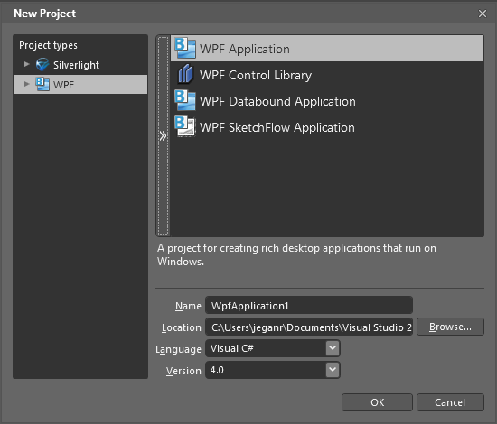
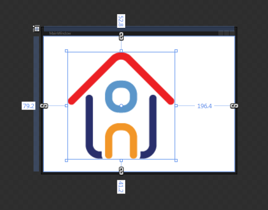
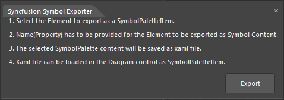
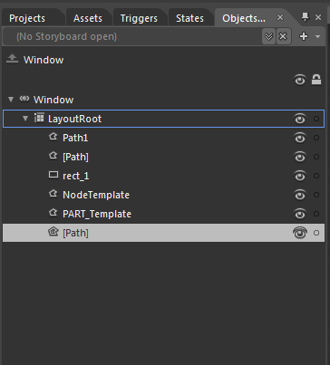
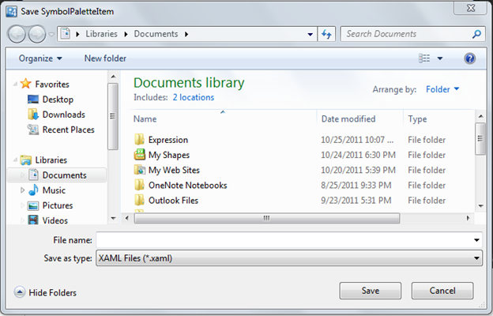

::: {style="DISPLAY: none"}
{#d2h_url_template}{#d2h_package_url style="WIDTH: 0px; DISPLAY: none; HEIGHT: 0px"}
:::

:::::: {.d2h_secondary_topic style="PADDING-BOTTOM: 10pt; MARGIN: 0pt; PADDING-LEFT: 0pt; PADDING-RIGHT: 0pt; PADDING-TOP: 0pt"}
#### Create SymbolPaletteItem {#create-symbolpaletteitem style="tab-stops: 0pt"}

You can create SymbolPaletteItem in two methods. They are:

[·      ]{style="FONT-FAMILY: Symbol"}Using Symbol Designer

[·      ]{style="FONT-FAMILY: Symbol"}Using Microsoft Expression Blend 4

 

Using Symbol Design

To create SymbolPaletteItem using Symbol Designer, refer to the [[Symbol Designer]{.underline}](ms-xhelp:///?Id=18757426-5b22-4b31-bdc1-0a8acb9645ac)[ ]{.MsoHyperlink}section[. ]{.MsoHyperlink}

 

Using Microsoft Expression Blend 4

Essential Diagram provides an add-on for creating SymbolPaletteItem's content. You can also export the created content as SymbolPaletteItem using this add on.  The exported content can be imported into the diagram control for later.

To enable this you need to add the Syncfusion.Diagram.SymbolExporter.dll in the Extension folder.

 

When Micorsoft Expression Blend is installed before installing Essential Studio, the exporter assembly will automatically be placed in the *Extensions* folder.

When Microsoft Expression Blend is installed after installing Essential Studio, then you need to run the **SyncfusionExpressionBlendAddin** exe, to place assembly in the correct location.

The **SyncfusionExpressionBlendAddin** exe is available in the following location:

 

\[\$Essential Studio\]\\\[\$Current Version\]\\Utilities\\Diagram\\WPF

Or you can also place the assembly manually in the following location:

 

***{\$Microsoft Expression\]\\Blend 4\\Extensions***

 

::: {style="BORDER-BOTTOM: windowtext 1pt solid; BORDER-LEFT: medium none; PADDING-BOTTOM: 1pt; MARGIN-TOP: 9pt; PADDING-LEFT: 0pt; PADDING-RIGHT: 0pt; MARGIN-BOTTOM: 9pt; BORDER-TOP: windowtext 1pt solid; BORDER-RIGHT: medium none; PADDING-TOP: 1pt"}
{border="0"}Note: currently exporter support is available only for the Blend 4 (4.0.20524.0) and Blend 4 service packs 1 (version 4.0.20901.0).
:::

 

 

To Create SymbolPaletteItem Content 

1.   Create a symbol that has to be exported.

2.   Select the element that has to be exported as a SymbolPaletteItem.

3.   The Name property has to be provided for the element that has to be exported as the symbol content.

4.   The selected SymbolPalette content will be exported as a XAML file using the add-on.

5.   The exported XAML file can be imported in the DiagramControl as SymbolPaletteItem.

[]{style="COLOR: #1f497d"} 

The following are the steps to create a SymbolPaletteItem and import symbols from Blend:

1.   Create a WPF application.

[]{style="COLOR: #1f497d"} 

{border="0"}

Figure 192: New Project

 

2.   Design the content as required.

{border="0"}

Figure 193: Design Content

[]{style="COLOR: #1f497d"} 

3.   Select the part of the element, which you want to export as symbol content. You can also select this from the **Object and Timeline**.

 

::: {style="BORDER-BOTTOM: windowtext 1pt solid; BORDER-LEFT: medium none; PADDING-BOTTOM: 1pt; MARGIN-TOP: 9pt; PADDING-LEFT: 0pt; PADDING-RIGHT: 0pt; MARGIN-BOTTOM: 9pt; BORDER-TOP: windowtext 1pt solid; BORDER-RIGHT: medium none; PADDING-TOP: 1pt"}
{border="0"}Note: The selected part will act as the parent element, name the element as desired.
:::

 

4.   Specify the **Name** property for parent element.

 

::: {style="BORDER-BOTTOM: windowtext 1pt solid; BORDER-LEFT: medium none; PADDING-BOTTOM: 1pt; MARGIN-TOP: 9pt; PADDING-LEFT: 0pt; PADDING-RIGHT: 0pt; MARGIN-BOTTOM: 9pt; BORDER-TOP: windowtext 1pt solid; BORDER-RIGHT: medium none; PADDING-TOP: 1pt"}
{border="0"}Note: This name property is required for serialization. So this property cannot be set to null.
:::

 

5.   Click Window option in the blend menu.

6.   Select the **Syncfusion Symbol Exporter** add-on.

7.   A popup window will be displayed. You can dock this within the blend as shown in following screenshot:

[]{style="COLOR: #1f497d"} 

[ ]{style="BORDER-BOTTOM: windowtext 1pt; BORDER-LEFT: windowtext 1pt; PADDING-BOTTOM: 0pt; PADDING-LEFT: 0pt; LAYOUT-GRID-MODE: line; PADDING-RIGHT: 0pt; FONT-FAMILY: 'Times New Roman','serif'; BACKGROUND: black; COLOR: black; FONT-SIZE: 1pt; BORDER-TOP: windowtext 1pt; BORDER-RIGHT: windowtext 1pt; PADDING-TOP: 0pt"}{border="0"}

Figure 194: Syncfusion Symbol Exporter

{border="0"}

Figure 195: Object and Timeline Window

8.   Click **Export**.

9.   The **Save SymbolPaletteItem** dialog opens.

10.  Name the file and save this as XAML file in the desired location.

{border="0"}

Figure 196: Save Dialog Box

 

11.  The selected part will be exported as the SymbolPalleteItem content.

 

The exported file can be imported in SymbolPalette. To import symbols from XAML file, refer to the [[SymbolPaletteSerialization]{.underline}](ms-xhelp:///?Id=18757426-5b22-4b31-bdc1-0a8acb9645ac). []{style="COLOR: #1f497d"}

[]{#related-topics}
::::::
