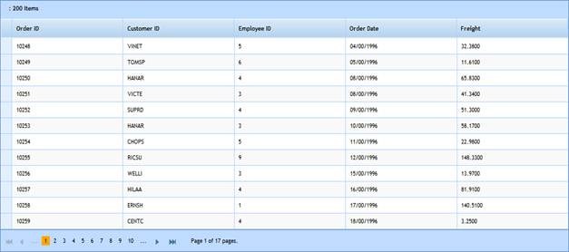

::: {style="DISPLAY: none"}
{#d2h_url_template}{#d2h_package_url style="WIDTH: 0px; DISPLAY: none; HEIGHT: 0px"}
:::

::::: {#nsbanner .d2h_main_nsbanner style="BORDER-BOTTOM: #999999 1px solid; POSITION: relative; PADDING-BOTTOM: 0px; BACKGROUND-COLOR: transparent; PADDING-LEFT: 0px; PADDING-RIGHT: 0px; DISPLAY: none; BORDER-TOP: #999999 1px solid; PADDING-TOP: 0px; LEFT: 0px"}
:::: {#TitleRow .d2h_main_titlerow style="PADDING-BOTTOM: 4px; BACKGROUND-COLOR: transparent; PADDING-LEFT: 22px; WIDTH: 100%; PADDING-RIGHT: 10px; DISPLAY: none; PADDING-TOP: 4px"}
::: {#ienav .d2h_main_ienav style="DISPLAY: none"}
{#D2HPrevious .D2HPreviousEnabled}  {#D2HNext .D2HNextEnabled}
:::
::::
:::::

:::: {#nstext .d2h_main_nstext style="PADDING-BOTTOM: 10px; BACKGROUND-COLOR: transparent; PADDING-LEFT: 22px; PADDING-RIGHT: 10px; HEIGHT: 100%; OVERFLOW: auto; PADDING-TOP: 5px" hasuserbackground="true" valign="bottom"}
::: {#d2h_breadcrumbs .d2h_breadcrumbs}
[Essential Studio User Guide Documentation](ms-xhelp:///?Id=12457748-09e3-4d74-a240-8e049cedf030){.d2h_breadcrumbsNormal}[ \> ]{.d2h_breadcrumbsLinkSeparator}[User Interface Edition](ms-xhelp:///?Id=c29296b7-531c-413b-a0ec-488ca1f7f669){.d2h_breadcrumbsNormal}[ \> ]{.d2h_breadcrumbsLinkSeparator}[Essential ASP.NET MVC](ms-xhelp:///?Id=4b14e7d1-65c4-4f67-b1aa-2c37709905a5){.d2h_breadcrumbsNormal}[ \> ]{.d2h_breadcrumbsLinkSeparator}[Essential Grid]{.d2h_breadcrumbsContentsOnly}[ \> ]{.d2h_breadcrumbsLinkSeparator}[How to](ms-xhelp:///?Id=0d8a7383-ca49-43db-8609-dca7963c87ab){.d2h_breadcrumbsNormal}
:::

## Create the Grid using view customization with Default view. {#create-the-grid-using-view-customization-with-default-view. style="tab-stops: 0pt"}

 

1.   Create a model in the application (Refer to [[Getting Started\>Adding a Model to the Application]{style="COLOR: blue"}]{.underline}).

2.   In the **Index** view,  you can use **DataSource** to bind the data source. Then you need to explicitly specify the type of the data item.

 

+--------------------------------------------------------------------------------------------------------------------------------------------------------------------------------------------------------------------------------------------------------------------------------------+
| **[View]{style="FONT-FAMILY: 'Courier New'; COLOR: black"}**                                                                                                                                                                                                                         |
|                                                                                                                                                                                                                                                                                      |
| []{style="FONT-FAMILY: 'Courier New'; BACKGROUND: yellow"}                                                                                                                                                                                                                           |
|                                                                                                                                                                                                                                                                                      |
| []{style="FONT-FAMILY: 'Courier New'; BACKGROUND: yellow"}                                                                                                                                                                                                                           |
|                                                                                                                                                                                                                                                                                      |
| [\<%]{style="FONT-FAMILY: 'Courier New'; BACKGROUND: yellow"}[=]{style="FONT-FAMILY: 'Courier New'; COLOR: blue"}[Html.Syncfusion().Grid\<MvcSampleApplication.Models.[Order]{style="COLOR: #2b91af"}\>([\"FlatGrid\"]{style="COLOR: #a31515"})]{style="FONT-FAMILY: 'Courier New'"} |
|                                                                                                                                                                                                                                                                                      |
| [        .Datasource(([IEnumerable]{style="COLOR: #2b91af"}\<MvcSampleApplication.Models.[Order]{style="COLOR: #2b91af"}\>)ViewData\[[\"data\"]{style="COLOR: #a31515"}\])        ]{style="FONT-FAMILY: 'Courier New'"}                                                              |
|                                                                                                                                                                                                                                                                                      |
| [        .EnablePaging()]{style="FONT-FAMILY: 'Courier New'"}                                                                                                                                                                                                                        |
|                                                                                                                                                                                                                                                                                      |
| [        .EnableSorting()]{style="FONT-FAMILY: 'Courier New'"}                                                                                                                                                                                                                       |
|                                                                                                                                                                                                                                                                                      |
| [        .ActionMode([\"Server\"]{style="COLOR: #a31515"})]{style="FONT-FAMILY: 'Courier New'"}                                                                                                                                                                                      |
|                                                                                                                                                                                                                                                                                      |
| [        .Column( column =\> {]{style="FONT-FAMILY: 'Courier New'"}                                                                                                                                                                                                                  |
|                                                                                                                                                                                                                                                                                      |
| [            column.Add(c =\> c.OrderID).HeaderText([\"Order ID\"]{style="COLOR: #a31515"});]{style="FONT-FAMILY: 'Courier New'"}                                                                                                                                                    |
|                                                                                                                                                                                                                                                                                      |
| [            column.Add(c =\> c.CustomerID).HeaderText([\"Customer ID\"]{style="COLOR: #a31515"});]{style="FONT-FAMILY: 'Courier New'"}                                                                                                                                              |
|                                                                                                                                                                                                                                                                                      |
| [            column.Add(c =\> c.EmployeeID).HeaderText([\"Employee ID\"]{style="COLOR: #a31515"});]{style="FONT-FAMILY: 'Courier New'"}                                                                                                                                              |
|                                                                                                                                                                                                                                                                                      |
| [            column.Add(c =\> c.OrderDate).HeaderText([\"Order Date\"]{style="COLOR: #a31515"}).Format([\"{OrderDate:dd/mm/yyyy}\"]{style="COLOR: #a31515"});]{style="FONT-FAMILY: 'Courier New'"}                                                                                   |
|                                                                                                                                                                                                                                                                                      |
| [            column.Add(c =\> c.Freight).HeaderText([\"Freight\"]{style="COLOR: #a31515"});            ]{style="FONT-FAMILY: 'Courier New'"}                                                                                                                                         |
|                                                                                                                                                                                                                                                                                      |
| [            })]{style="FONT-FAMILY: 'Courier New'"}                                                                                                                                                                                                                                 |
|                                                                                                                                                                                                                                                                                      |
| [        [%\>]{style="BACKGROUND: yellow"}]{style="FONT-FAMILY: 'Courier New'"}                                                                                                                                                                                                      |
+--------------------------------------------------------------------------------------------------------------------------------------------------------------------------------------------------------------------------------------------------------------------------------------+

 

3.   Set its data source and render the view.

 

+--------------------------------------------------------------------------------------------------------------------------------------------------------------------------------------------------------------------------------+
| **[Controller]{style="FONT-FAMILY: 'Courier New'; COLOR: black"}**                                                                                                                                                             |
|                                                                                                                                                                                                                                |
| []{style="FONT-FAMILY: 'Courier New'; COLOR: gray"}                                                                                                                                                                            |
|                                                                                                                                                                                                                                |
| [///]{style="FONT-FAMILY: 'Courier New'; COLOR: gray"}[ ]{style="FONT-FAMILY: 'Courier New'; COLOR: green"}[\<summary\>]{style="FONT-FAMILY: 'Courier New'; COLOR: gray"}[]{style="FONT-FAMILY: 'Courier New'"}                |
|                                                                                                                                                                                                                                |
| [        [///]{style="COLOR: gray"}[ Used to bind the grid. ]{style="COLOR: green"}]{style="FONT-FAMILY: 'Courier New'"}                                                                                                       |
|                                                                                                                                                                                                                                |
| [        [///]{style="COLOR: gray"}[ ]{style="COLOR: green"}[\</summary\>]{style="COLOR: gray"}]{style="FONT-FAMILY: 'Courier New'"}                                                                                           |
|                                                                                                                                                                                                                                |
| [        [///]{style="COLOR: gray"}[ ]{style="COLOR: green"}[\<returns\>]{style="COLOR: gray"}[View page; it displays the grid.]{style="COLOR: green"}[\</returns\>]{style="COLOR: gray"}]{style="FONT-FAMILY: 'Courier New'"} |
|                                                                                                                                                                                                                                |
| [        [public]{style="COLOR: blue"} [ActionResult]{style="COLOR: #2b91af"} Index()]{style="FONT-FAMILY: 'Courier New'"}                                                                                                     |
|                                                                                                                                                                                                                                |
| [        {]{style="FONT-FAMILY: 'Courier New'"}                                                                                                                                                                                |
|                                                                                                                                                                                                                                |
| [            [var]{style="COLOR: blue"} data = [new]{style="COLOR: blue"} [NorthwindDataContext]{style="COLOR: #2b91af"}().Orders.Take(200);]{style="FONT-FAMILY: 'Courier New'"}                                              |
|                                                                                                                                                                                                                                |
| [            [return]{style="COLOR: blue"} View(data);]{style="FONT-FAMILY: 'Courier New'"}                                                                                                                                    |
|                                                                                                                                                                                                                                |
| [        }]{style="FONT-FAMILY: 'Courier New'"}                                                                                                                                                                                |
|                                                                                                                                                                                                                                |
| []{style="FONT-FAMILY: 'Courier New'"}                                                                                                                                                                                         |
|                                                                                                                                                                                                                                |
| []{style="FONT-FAMILY: 'Courier New'"}                                                                                                                                                                                         |
+--------------------------------------------------------------------------------------------------------------------------------------------------------------------------------------------------------------------------------+

 

4.   In order to work with paging and sorting actions, create a **Post** method for **Index** actions and bind the data source to the grid as shown in the following code sample.

 

+-------------------------------------------------------------------------------------------------------------------------------------------------------------------------------------------------------------------------------------+
| **[Controller]{style="FONT-FAMILY: 'Courier New'; COLOR: black"}**                                                                                                                                                                  |
|                                                                                                                                                                                                                                     |
| []{style="FONT-FAMILY: 'Courier New'; COLOR: gray"}                                                                                                                                                                                 |
|                                                                                                                                                                                                                                     |
| [///]{style="FONT-FAMILY: 'Courier New'; COLOR: gray"}[ ]{style="FONT-FAMILY: 'Courier New'; COLOR: green"}[\<summary\>]{style="FONT-FAMILY: 'Courier New'; COLOR: gray"}[]{style="FONT-FAMILY: 'Courier New'"}                     |
|                                                                                                                                                                                                                                     |
| [        [///]{style="COLOR: gray"}[ Paging/sorting requests are mapped to this method. This method invokes the HtmlActionResult]{style="COLOR: green"}]{style="FONT-FAMILY: 'Courier New'"}                                        |
|                                                                                                                                                                                                                                     |
| [        [///]{style="COLOR: gray"}[ from the grid. The required response is generated.]{style="COLOR: green"}]{style="FONT-FAMILY: 'Courier New'"}                                                                                 |
|                                                                                                                                                                                                                                     |
| [        [///]{style="COLOR: gray"}[ ]{style="COLOR: green"}[\</summary\>]{style="COLOR: gray"}]{style="FONT-FAMILY: 'Courier New'"}                                                                                                |
|                                                                                                                                                                                                                                     |
| [        [///]{style="COLOR: gray"}[ ]{style="COLOR: green"}[\<param name=\"args\"\>]{style="COLOR: gray"}[Contains paging properties.]{style="COLOR: green"}[\</param\>]{style="COLOR: gray"}]{style="FONT-FAMILY: 'Courier New'"} |
|                                                                                                                                                                                                                                     |
| [        [///]{style="COLOR: gray"}[ ]{style="COLOR: green"}[\<returns\>]{style="COLOR: gray"}]{style="FONT-FAMILY: 'Courier New'"}                                                                                                 |
|                                                                                                                                                                                                                                     |
| [        [///]{style="COLOR: gray"}[ HtmlActionResult returns the data displayed in the grid.]{style="COLOR: green"}]{style="FONT-FAMILY: 'Courier New'"}                                                                           |
|                                                                                                                                                                                                                                     |
| [        [///]{style="COLOR: gray"}[ ]{style="COLOR: green"}[\</returns\>]{style="COLOR: gray"}]{style="FONT-FAMILY: 'Courier New'"}                                                                                                |
|                                                                                                                                                                                                                                     |
| [        \[[AcceptVerbs]{style="COLOR: #2b91af"}([HttpVerbs]{style="COLOR: #2b91af"}.Post)\]]{style="FONT-FAMILY: 'Courier New'"}                                                                                                   |
|                                                                                                                                                                                                                                     |
| [        [public]{style="COLOR: blue"} [ActionResult]{style="COLOR: #2b91af"} Index([PagingParams]{style="COLOR: #2b91af"} args)]{style="FONT-FAMILY: 'Courier New'"}                                                               |
|                                                                                                                                                                                                                                     |
| [        {]{style="FONT-FAMILY: 'Courier New'"}                                                                                                                                                                                     |
|                                                                                                                                                                                                                                     |
| [            [IEnumerable]{style="COLOR: #2b91af"} data = [new]{style="COLOR: blue"} [NorthwindDataContext]{style="COLOR: #2b91af"}().Orders.Take(200);]{style="FONT-FAMILY: 'Courier New'"}                                        |
|                                                                                                                                                                                                                                     |
| [            [return]{style="COLOR: blue"} data.GridActions\<[Order]{style="COLOR: #2b91af"}\>();]{style="FONT-FAMILY: 'Courier New'"}                                                                                              |
|                                                                                                                                                                                                                                     |
| [        }]{style="FONT-FAMILY: 'Courier New'"}                                                                                                                                                                                     |
+-------------------------------------------------------------------------------------------------------------------------------------------------------------------------------------------------------------------------------------+

 

5.   Run the application. The grid will appear as shown below.

 

{border="0"}

Figure 346: Grid with Data

 

[]{#related-topics}
::::
