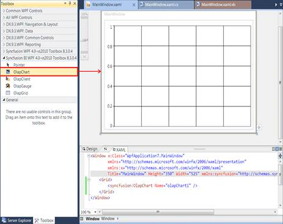
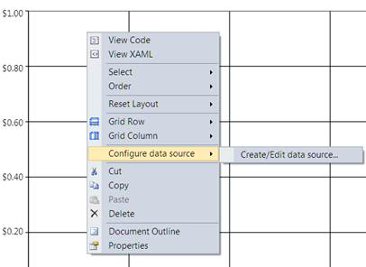
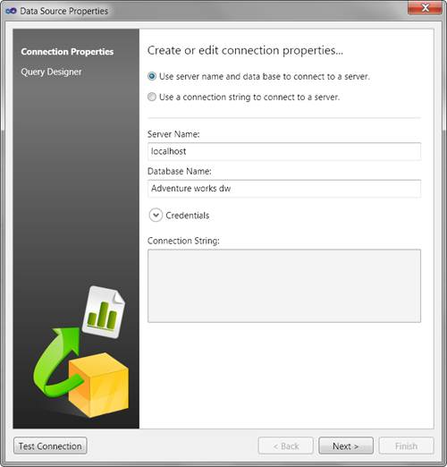
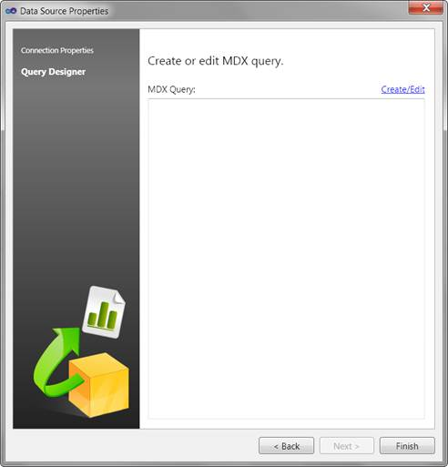
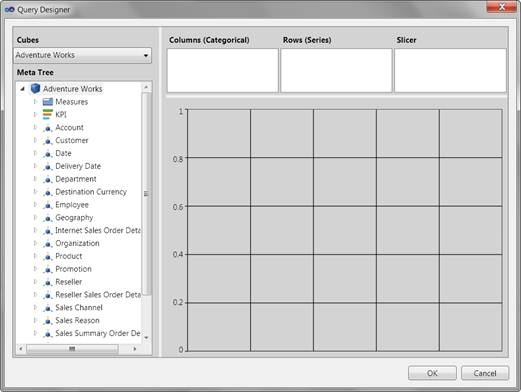
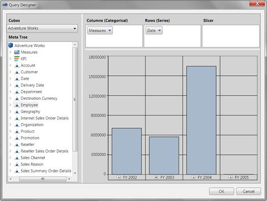
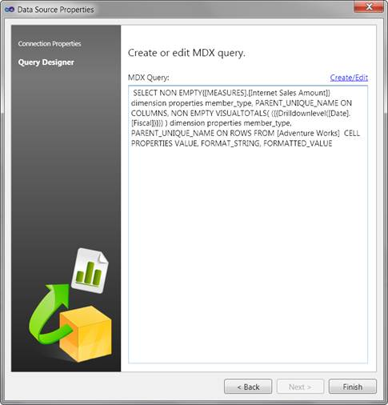

::: {style="DISPLAY: none"}
{#d2h_url_template}{#d2h_package_url style="WIDTH: 0px; DISPLAY: none; HEIGHT: 0px"}
:::

::::: {.d2h_secondary_topic style="PADDING-BOTTOM: 10pt; MARGIN: 0pt; PADDING-LEFT: 0pt; PADDING-RIGHT: 0pt; PADDING-TOP: 0pt"}
#### Creating a Basic Report during design-time {#creating-a-basic-report-during-design-time style="tab-stops: 0pt"}

[]{style="FONT-FAMILY: 'Calibri','sans-serif'; COLOR: black; FONT-SIZE: 11pt"} 

1.   Drag and drop the control from the toolbox to the visual studio designer surface.

[]{style="FONT-FAMILY: 'Calibri','sans-serif'; FONT-SIZE: 11pt"} 

{border="0"}

 

Figure 10: OlapChart in Visual studio designer

***[]{style="FONT-FAMILY: 'Calibri','sans-serif'; FONT-SIZE: 11pt"}*** 

2.   Right-click the **OlapChart**.****

3.   Then, navigate to **** the **Configure data source -\> Create/Edit data source...** option in the context menu.****

 

**** 

{border="0"}

 

Figure 11: OlapChart control context menu in the Visual Studio Designer surface**[]{style="FONT-STYLE: normal; FONT-FAMILY: 'Calibri','sans-serif'; FONT-SIZE: 11pt"}**

***[]{style="FONT-FAMILY: 'Calibri','sans-serif'; FONT-SIZE: 11pt"}*** 

The Data Source Properties wizard will be opened.****

{border="0"}

Figure 12: Data Source Properties Dialog**[]{style="FONT-STYLE: normal; FONT-FAMILY: 'Calibri','sans-serif'; FONT-SIZE: 11pt"}**

**[]{style="FONT-FAMILY: 'Calibri','sans-serif'; FONT-SIZE: 11pt"}** 

**[]{style="FONT-FAMILY: 'Calibri','sans-serif'; FONT-SIZE: 11pt"}** 

4.   From the Data Source Property wizard select the connection type.

a.   If you want to connect by using the server name and the data base name, then choose the first option. You can also provide credentials to login by expanding the Credentials **** expander.****

b.   If you want to connect to SSAS by providing an existing connection string, then choose the second option.****

{border="0"}

Figure 13: Connecting to a Server**[]{style="FONT-STYLE: normal; FONT-FAMILY: 'Calibri','sans-serif'; FONT-SIZE: 11pt"}**

***[]{style="FONT-FAMILY: 'Calibri','sans-serif'; FONT-SIZE: 11pt"}*** 

***[]{style="FONT-FAMILY: 'Calibri','sans-serif'; FONT-SIZE: 11pt"}*** 

5.   If you want to test the connection, click the **Test Connection** button, which is displayed on the bottom left corner of the window*.*

6.   Click the **Next** button, to proceed. ****

::: {style="BORDER-BOTTOM: windowtext 1pt solid; BORDER-LEFT: medium none; PADDING-BOTTOM: 1pt; MARGIN-TOP: 9pt; PADDING-LEFT: 0pt; PADDING-RIGHT: 0pt; MARGIN-BOTTOM: 9pt; BORDER-TOP: windowtext 1pt solid; BORDER-RIGHT: medium none; PADDING-TOP: 1pt"}
Note: The Next button will be enabled only when any one of the connection option is filled properly.
:::

**** 

7.   If the connection is valid. It will display the summary page of the Data Source Properties Wizard.****

{border="0"}

Figure 14: Summary page of the Data Source Properties Wizard**[]{style="FONT-STYLE: normal; FONT-FAMILY: 'Calibri','sans-serif'; FONT-SIZE: 11pt"}**

***[]{style="FONT-FAMILY: 'Calibri','sans-serif'; FONT-SIZE: 11pt"}*** 

8.   The MDX query text box in the summary page will be empty, if you are creating a query for the first time. If you are editing an already existing query it will display the current query in the text box.****

9.   For creating or editing a query, click **** the **Create/Edit** link label, which is displayed on the top-right side of the MDX query textbox. This will open a Query Designer dialog. ****

{border="0"}

Figure 15: An empty Query Designer dialog**[]{style="FONT-STYLE: normal; FONT-FAMILY: 'Calibri','sans-serif'; FONT-SIZE: 11pt"}**

***[]{style="FONT-FAMILY: 'Calibri','sans-serif'; FONT-SIZE: 11pt"}*** 

10.  If you are editing an existing query it will display the required dimensions in the specific axis of the query designer and the preview of that query will be displayed in a chart control.****

::: {style="BORDER-BOTTOM: windowtext 1pt solid; BORDER-LEFT: medium none; PADDING-BOTTOM: 1pt; MARGIN-TOP: 9pt; PADDING-LEFT: 0pt; PADDING-RIGHT: 0pt; MARGIN-BOTTOM: 9pt; BORDER-TOP: windowtext 1pt solid; BORDER-RIGHT: medium none; PADDING-TOP: 1pt"}
Note: It will not display any style/formatting applied to the chart. It will just display the result of the query.
:::

**** 

11.  Drag and drop the dimensions, to form a new query. ****

**** 

{border="0"}

Figure 16: Preview after a couple of Drag and Drop operations**[]{style="FONT-STYLE: normal; FONT-FAMILY: 'Calibri','sans-serif'; FONT-SIZE: 11pt"}**

***[]{style="FONT-FAMILY: 'Calibri','sans-serif'; FONT-SIZE: 11pt"}*** 

12.  Then, click **OK**, to save the query or click **Cancel**, to revert the changes made during this session.****

13.  ****The summary page of the **Data Source Properties** will display the resultant MDX query. ****

{border="0"}

Figure 17: Summary page with MDX Query**[]{style="FONT-STYLE: normal; FONT-FAMILY: 'Calibri','sans-serif'; FONT-SIZE: 11pt"}**

***[]{style="FONT-FAMILY: 'Calibri','sans-serif'; FONT-SIZE: 11pt"}*** 

14.  Click **Finish**.

15.  Run the application.

 

[]{#related-topics}
:::::
