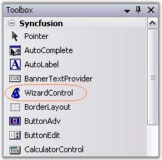
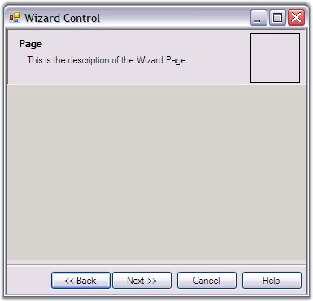
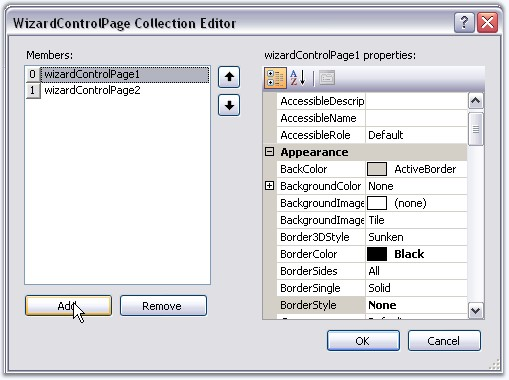
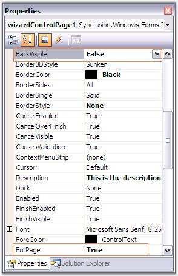
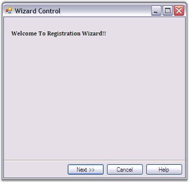

::: {style="DISPLAY: none"}
{#d2h_url_template}{#d2h_package_url style="WIDTH: 0px; DISPLAY: none; HEIGHT: 0px"}
:::

::: {.d2h_secondary_topic style="PADDING-BOTTOM: 10pt; MARGIN: 0pt; PADDING-LEFT: 0pt; PADDING-RIGHT: 0pt; PADDING-TOP: 0pt"}
#### Creating a Basic Wizard {#creating-a-basic-wizard style="MARGIN-LEFT: 18pt; tab-stops: 18.0pt"}

[]{style="COLOR: #15428b"} 

This section will guide you to create a basic wizard using the Wizard control.

 

To create a basic wizard, follow the below steps.

[]{style="COLOR: #15428b"} 

[·      ]{style="FONT-FAMILY: Symbol"}Add the**[ ]{style="COLOR: black"}**WizardControl from the Toolbox to the form, in the designer.

[]{style="COLOR: #15428b"} 

{border="0"}

[]{style="COLOR: #15428b"} 

Figure 1207: Wizard Control in ToolBox

[]{style="COLOR: #15428b"} 

[·      ]{style="FONT-FAMILY: Symbol"}Set the WizardControl.Dock property to Fill.

[]{style="COLOR: #15428b"} 

{border="0"}

 

Figure 1208: Basic Wizard Control Added to the Form

[]{style="COLOR: #15428b"} 

[·      ]{style="FONT-FAMILY: Symbol"}Wizard Control lets you add multiple pages in a single wizard. You can add pages to the wizard container by four different ways. They are,

[]{style="COLOR: #15428b"} 

[·      ]{style="FONT-FAMILY: Symbol"}\"Add Page\" option in the smart tag.

[·      ]{style="FONT-FAMILY: Symbol"}Accessing Add Page command in properties grid.

[·      ]{style="FONT-FAMILY: Symbol"}Context menu of the Wizard control.

 

See [[Options to Add Page, Remove Page, Previous page and Next Page]{.UGHyperlink}](../../../../../../../../Documents%20and%20Settings/sylviap/Desktop/Tools%20-%20Part%202.docx#_Options_to_Add) topic for more details.

[]{style="COLOR: #15428b"} 

[·      ]{style="FONT-FAMILY: Symbol"}Accessing WizardControl.WizardPages property will invoke WizardControlPage Collection Editor which also lets you add or remove pages.

[]{style="COLOR: #15428b"} 

{border="0"}

[]{style="COLOR: #15428b"} 

Figure 1209: WizardControlPage Collection Editor invoked by using WizardPages Property

[]{style="COLOR: #15428b"} 

Programmatically, the pages can be added to the wizard container as follows.

[]{style="COLOR: #15428b"} 

+-------------------------------------------------------------------------------------------------------------------------------------------------------------------------------------------------------------------------------------------------------------------------------------------------------------------------------------------------------------------------------+
| **[\[C#\]]{style="FONT-FAMILY: 'Courier New'; COLOR: black"}**                                                                                                                                                                                                                                                                                                                |
|                                                                                                                                                                                                                                                                                                                                                                               |
| []{style="COLOR: #15428b"}                                                                                                                                                                                                                                                                                                                                                    |
|                                                                                                                                                                                                                                                                                                                                                                               |
| [this]{style="FONT-FAMILY: 'Courier New'; COLOR: blue"}[.wizardControl1.WizardPages = [new]{style="COLOR: blue"}]{style="FONT-FAMILY: 'Courier New'"}[ ]{style="FONT-FAMILY: 'Courier New'"}[Syncfusion.Windows.Forms.Tools.WizardControlPage\[\] {[this]{style="COLOR: blue"}.wizardControlPage1,]{style="FONT-FAMILY: 'Courier New'"}[]{style="FONT-FAMILY: 'Courier New'"} |
|                                                                                                                                                                                                                                                                                                                                                                               |
| [this]{style="FONT-FAMILY: 'Courier New'; COLOR: blue"}[.wizardControlPage2,[this]{style="COLOR: blue"}.wizardControlPage3};  ]{style="FONT-FAMILY: 'Courier New'"}                                                                                                                                                                                                           |
|                                                                                                                                                                                                                                                                                                                                                                               |
| [this]{style="FONT-FAMILY: 'Courier New'; COLOR: blue"}[.wizardControl1.SelectedWizardPage = [this]{style="COLOR: blue"}.wizardControlPage2;    ]{style="FONT-FAMILY: 'Courier New'"}[]{style="FONT-FAMILY: 'Courier New'"}                                                                                                                                                   |
+-------------------------------------------------------------------------------------------------------------------------------------------------------------------------------------------------------------------------------------------------------------------------------------------------------------------------------------------------------------------------------+

[]{#p1045}[]{style="COLOR: #15428b"} 

+--------------------------------------------------------------------------------------------------------------------------------------------------------------------------------------------------------------------------------------------------------------------------------------------------------------------------------------------------+
| **[\[VB.NET\]]{style="FONT-FAMILY: 'Courier New'; COLOR: black"}**                                                                                                                                                                                                                                                                               |
|                                                                                                                                                                                                                                                                                                                                                  |
| []{style="COLOR: #15428b"}                                                                                                                                                                                                                                                                                                                       |
|                                                                                                                                                                                                                                                                                                                                                  |
| [Me]{style="FONT-FAMILY: 'Courier New'; COLOR: blue"}[.wizardControl1.WizardPages = [New]{style="COLOR: blue"} Syncfusion.Windows.Forms.Tools.WizardControlPage() {[Me]{style="COLOR: blue"}.wizardControlPage1, [Me]{style="COLOR: blue"}.wizardControlPage2,[Me]{style="COLOR: blue"}.wizardControlPage3}]{style="FONT-FAMILY: 'Courier New'"} |
|                                                                                                                                                                                                                                                                                                                                                  |
| [Me]{style="FONT-FAMILY: 'Courier New'; COLOR: blue"}[.wizardControl1.SelectedWizardPage = [Me]{style="COLOR: blue"}.wizardControlPage2]{style="FONT-FAMILY: 'Courier New'"}[]{style="FONT-FAMILY: 'Courier New'"}                                                                                                                               |
+--------------------------------------------------------------------------------------------------------------------------------------------------------------------------------------------------------------------------------------------------------------------------------------------------------------------------------------------------+

[]{style="COLOR: #15428b"} 

[·      ]{style="FONT-FAMILY: Symbol"}Wizard Control comes with properties which controls its appearance and behavior. Set **FullPage** property of WizardControlPage1 to**[ ]{style="COLOR: black"}**True if you wish to hide the header portion in the first page. Put a label control on this wizard page with introductory text. Also set **BackVisible** property of wizard page to False to hide the back button since this is the first page.

[]{style="COLOR: #15428b"} 

{border="0"}

[]{style="COLOR: #15428b"} 

Figure 1210: BackVisible and FullPage Properties of WizardControlPage

[]{style="COLOR: #15428b"} 

[·      ]{style="FONT-FAMILY: Symbol"}The output will be as follows.

[]{style="COLOR: #15428b"} 

{border="0"}

[]{style="COLOR: #15428b"} 

Figure 1211: Simple Front page of Wizard Control

[]{style="COLOR: #15428b"} 

See Also

[]{style="COLOR: #15428b"} 

[[Concepts and Features]{.UGHyperlink}](../../../../../../../../Documents%20and%20Settings/sylviap/Desktop/Tools%20-%20Part%202.docx#_Concepts_and_Features_1)[]{.UGHyperlink}

 

 

 

[]{#related-topics}
:::
