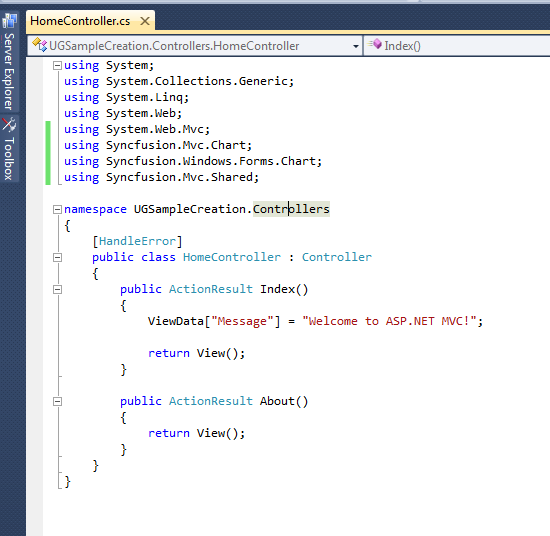
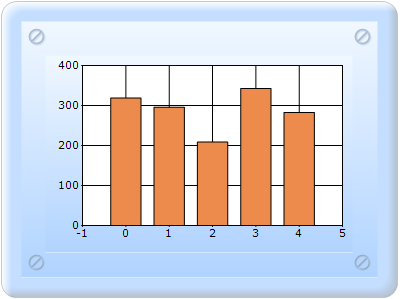

::: {style="DISPLAY: none"}
{#d2h_url_template}{#d2h_package_url style="WIDTH: 0px; DISPLAY: none; HEIGHT: 0px"}
:::

::::: {#nsbanner .d2h_main_nsbanner style="BORDER-BOTTOM: #999999 1px solid; POSITION: relative; PADDING-BOTTOM: 0px; BACKGROUND-COLOR: transparent; PADDING-LEFT: 0px; PADDING-RIGHT: 0px; DISPLAY: none; BORDER-TOP: #999999 1px solid; PADDING-TOP: 0px; LEFT: 0px"}
:::: {#TitleRow .d2h_main_titlerow style="PADDING-BOTTOM: 4px; BACKGROUND-COLOR: transparent; PADDING-LEFT: 22px; WIDTH: 100%; PADDING-RIGHT: 10px; DISPLAY: none; PADDING-TOP: 4px"}
::: {#ienav .d2h_main_ienav style="DISPLAY: none"}
{#D2HPrevious .D2HPreviousEnabled}  {#D2HNext .D2HNextEnabled}
:::
::::
:::::

:::: {#nstext .d2h_main_nstext style="PADDING-BOTTOM: 10px; BACKGROUND-COLOR: transparent; PADDING-LEFT: 22px; PADDING-RIGHT: 10px; HEIGHT: 100%; OVERFLOW: auto; PADDING-TOP: 5px" hasuserbackground="true" valign="bottom"}
::: {#d2h_breadcrumbs .d2h_breadcrumbs}
[Essential Studio User Guide Documentation](ms-xhelp:///?Id=12457748-09e3-4d74-a240-8e049cedf030){.d2h_breadcrumbsNormal}[ \> ]{.d2h_breadcrumbsLinkSeparator}[User Interface Edition](ms-xhelp:///?Id=c29296b7-531c-413b-a0ec-488ca1f7f669){.d2h_breadcrumbsNormal}[ \> ]{.d2h_breadcrumbsLinkSeparator}[Essential ASP.NET MVC](ms-xhelp:///?Id=4b14e7d1-65c4-4f67-b1aa-2c37709905a5){.d2h_breadcrumbsNormal}[ \> ]{.d2h_breadcrumbsLinkSeparator}[Essential Chart]{.d2h_breadcrumbsContentsOnly}[ \> ]{.d2h_breadcrumbsLinkSeparator}[Getting Started](ms-xhelp:///?Id=30fbb064-4c5c-425c-8c35-28b16d94c58d){.d2h_breadcrumbsNormal}[ \> ]{.d2h_breadcrumbsLinkSeparator}[Adding Essential Chart to the Application](ms-xhelp:///?Id=e0c4d55f-b8db-4833-b317-501af9caf88a){.d2h_breadcrumbsNormal}
:::

### Creating a Chart Through ChartModel {#creating-a-chart-through-chartmodel style="tab-stops: 0pt"}

[]{style="FONT-FAMILY: 'Calibri','sans-serif'"} 

To create a chart through ChartModel:

1.   Select **Index.aspx** from the **View/Home** folder.

2.   Add the following code in the **SimpleChart.aspx** file, to create the **Chart** control in the **View** page.

[]{style="FONT-FAMILY: 'Calibri','sans-serif'"} 

+---------------------------------------------------------------------------------------------------------------------------------------------------------------------------------------------------------------------------------------------------------------------------------------------------------+
| **[\[ASPX\]]{style="FONT-FAMILY: 'Courier New'"}**                                                                                                                                                                                                                                                      |
|                                                                                                                                                                                                                                                                                                         |
| **[]{style="FONT-FAMILY: 'Courier New'"}**                                                                                                                                                                                                                                                              |
|                                                                                                                                                                                                                                                                                                         |
| [\<%]{style="FONT-FAMILY: 'Courier New'; BACKGROUND: yellow"}[=]{style="FONT-FAMILY: 'Courier New'; COLOR: blue"}[ Html.Chart([\"SimpleChart\"]{style="COLOR: #a31515"},([MVCChartModel]{style="COLOR: #2b91af"})ViewData.Model) [%\>]{style="BACKGROUND: yellow"}]{style="FONT-FAMILY: 'Courier New'"} |
|                                                                                                                                                                                                                                                                                                         |
| []{style="FONT-FAMILY: Consolas; COLOR: blue; FONT-SIZE: 9.5pt"}                                                                                                                                                                                                                                        |
+---------------------------------------------------------------------------------------------------------------------------------------------------------------------------------------------------------------------------------------------------------------------------------------------------------+

[]{style="FONT-FAMILY: 'Calibri','sans-serif'"} 

[]{style="FONT-FAMILY: 'Calibri','sans-serif'"} 

3.   In the **Controller/Home** folder, double-click **HomeController.cs**. The HomeController.cs page is displayed in the main window.

[]{style="FONT-FAMILY: 'Calibri','sans-serif'"} 

{border="0"}

[]{style="FONT-FAMILY: 'Calibri','sans-serif'"} 

Figure 47: HomeController.cs page

***[]{style="FONT-FAMILY: 'Calibri','sans-serif'"}*** 

4.   Include the following namespaces to the HomeController by using the code displayed below:

 

[·      ]{style="FONT-FAMILY: Symbol"}Syncfusion.Mvc.Shared

[·      ]{style="FONT-FAMILY: Symbol"}Syncfusion.Mvc.Chart

[·      ]{style="FONT-FAMILY: Symbol"}Syncfusion.Windows.Forms.Chart

[]{style="FONT-FAMILY: 'Calibri','sans-serif'"} 

+--------------------------------------------------------------------------------------------------------------------------------+
| **[\[C#\]]{style="FONT-FAMILY: 'Courier New'"}**                                                                               |
|                                                                                                                                |
| [using]{style="FONT-FAMILY: 'Courier New'; COLOR: blue"}[ Syncfusion.Mvc.Chart;]{style="FONT-FAMILY: 'Courier New'"}           |
|                                                                                                                                |
| [using]{style="FONT-FAMILY: 'Courier New'; COLOR: blue"}[ Syncfusion.Mvc.Shared;]{style="FONT-FAMILY: 'Courier New'"}          |
|                                                                                                                                |
| [using]{style="FONT-FAMILY: 'Courier New'; COLOR: blue"}[ Syncfusion.Windows.Forms.Chart;]{style="FONT-FAMILY: 'Courier New'"} |
|                                                                                                                                |
| []{style="FONT-FAMILY: Consolas; COLOR: blue; FONT-SIZE: 9.5pt"}                                                               |
+--------------------------------------------------------------------------------------------------------------------------------+

[]{style="FONT-FAMILY: 'Calibri','sans-serif'"} 

[]{style="FONT-FAMILY: 'Calibri','sans-serif'"} 

[]{style="FONT-FAMILY: Consolas; FONT-SIZE: 9.5pt"} 

5.   Add the **SimpleChart** method, as displayed below:

[]{style="FONT-FAMILY: 'Calibri','sans-serif'"} 

+---------------------------------------------------------------------------------------------------------------------------------------------------------------------------------------------------------------------------------------------------------------------+
| []{style="FONT-FAMILY: Consolas; COLOR: gray; FONT-SIZE: 9.5pt"}                                                                                                                                                                                                    |
|                                                                                                                                                                                                                                                                     |
| [///]{style="FONT-FAMILY: Consolas; COLOR: gray; FONT-SIZE: 9.5pt"}[ ]{style="FONT-FAMILY: Consolas; COLOR: green; FONT-SIZE: 9.5pt"}[\<summary\>]{style="FONT-FAMILY: Consolas; COLOR: gray; FONT-SIZE: 9.5pt"}[]{style="FONT-FAMILY: Consolas; FONT-SIZE: 9.5pt"} |
|                                                                                                                                                                                                                                                                     |
| [        [///]{style="COLOR: gray"}[ Used to create the simple chart ]{style="COLOR: green"}]{style="FONT-FAMILY: Consolas; FONT-SIZE: 9.5pt"}                                                                                                                      |
|                                                                                                                                                                                                                                                                     |
| [        [///]{style="COLOR: gray"}[ ]{style="COLOR: green"}[\</summary\>]{style="COLOR: gray"}]{style="FONT-FAMILY: Consolas; FONT-SIZE: 9.5pt"}                                                                                                                   |
|                                                                                                                                                                                                                                                                     |
| [        [///]{style="COLOR: gray"}[ ]{style="COLOR: green"}[\<returns\>]{style="COLOR: gray"}[View page, it displays the Chart]{style="COLOR: green"}[\</returns\>]{style="COLOR: gray"}]{style="FONT-FAMILY: Consolas; FONT-SIZE: 9.5pt"}                         |
|                                                                                                                                                                                                                                                                     |
| [        [public]{style="COLOR: blue"} [ActionResult]{style="COLOR: #2b91af"} SimpleChart()]{style="FONT-FAMILY: Consolas; FONT-SIZE: 9.5pt"}                                                                                                                       |
|                                                                                                                                                                                                                                                                     |
| [        {]{style="FONT-FAMILY: Consolas; FONT-SIZE: 9.5pt"}                                                                                                                                                                                                        |
|                                                                                                                                                                                                                                                                     |
| [            [MVCChartModel]{style="COLOR: #2b91af"} simpleChart = [new]{style="COLOR: blue"} [MVCChartModel]{style="COLOR: #2b91af"}();]{style="FONT-FAMILY: Consolas; FONT-SIZE: 9.5pt"}                                                                          |
|                                                                                                                                                                                                                                                                     |
| [            simpleChart.ShowLegend = [false]{style="COLOR: blue"};]{style="FONT-FAMILY: Consolas; FONT-SIZE: 9.5pt"}                                                                                                                                               |
|                                                                                                                                                                                                                                                                     |
| [            simpleChart.SmoothingMode = System.Drawing.Drawing2D.[SmoothingMode]{style="COLOR: #2b91af"}.AntiAlias;]{style="FONT-FAMILY: Consolas; FONT-SIZE: 9.5pt"}                                                                                              |
|                                                                                                                                                                                                                                                                     |
| [            simpleChart.Skins = [ChartModelSkins]{style="COLOR: #2b91af"}.Office2007Blue;]{style="FONT-FAMILY: Consolas; FONT-SIZE: 9.5pt"}                                                                                                                        |
|                                                                                                                                                                                                                                                                     |
| [            simpleChart.BorderAppearance.SkinStyle = [ChartBorderSkinStyle]{style="COLOR: #2b91af"}.Pinned;]{style="FONT-FAMILY: Consolas; FONT-SIZE: 9.5pt"}                                                                                                      |
|                                                                                                                                                                                                                                                                     |
| [            ViewData.Model = simpleChart;]{style="FONT-FAMILY: Consolas; FONT-SIZE: 9.5pt"}                                                                                                                                                                        |
|                                                                                                                                                                                                                                                                     |
| [            [return]{style="COLOR: blue"} View();]{style="FONT-FAMILY: Consolas; FONT-SIZE: 9.5pt"}                                                                                                                                                                |
|                                                                                                                                                                                                                                                                     |
| [        }]{style="FONT-FAMILY: Consolas; FONT-SIZE: 9.5pt"}                                                                                                                                                                                                        |
|                                                                                                                                                                                                                                                                     |
| []{style="FONT-FAMILY: Consolas; COLOR: blue; FONT-SIZE: 9.5pt"}                                                                                                                                                                                                    |
+---------------------------------------------------------------------------------------------------------------------------------------------------------------------------------------------------------------------------------------------------------------------+

[]{style="FONT-FAMILY: 'Calibri','sans-serif'"} 

 

Code Explanation:

[]{style="FONT-FAMILY: 'Calibri','sans-serif'"} 

An Object created for MVCChartModel and the following chart properties are assigned to a model.

 

[ShowLegend - Gets or sets whether the legend for the Chart control needs to be visible or not.]{style="COLOR: black"}

[SmoothingMode - Specifies how the chart elements should be rendered.]{style="COLOR: black"}

[Skins - Gets or sets a Skin to apply for the Chart control.]{style="COLOR: black"}

[SkinStyle - Specifies the border skin style.]{style="COLOR: black"}

[]{style="FONT-FAMILY: 'Calibri','sans-serif'"} 

6.   Pass the model to view by using the ViewData. This will pass the chart properties from the controller to view.

[]{style="FONT-FAMILY: 'Calibri','sans-serif'"} 

Syntax :

ViewData.Model = simpleChart;

[]{style="FONT-FAMILY: 'Calibri','sans-serif'"} 

7.   Run the application, to get the following output.

[]{style="FONT-FAMILY: 'Calibri','sans-serif'"} 

[]{style="FONT-FAMILY: 'Calibri','sans-serif'"} 

{border="0"}

[]{style="FONT-FAMILY: 'Calibri','sans-serif'"} 

Figure 48: Chart control added to the application

[]{style="FONT-FAMILY: 'Calibri','sans-serif'"} 

[]{#related-topics}
::::
