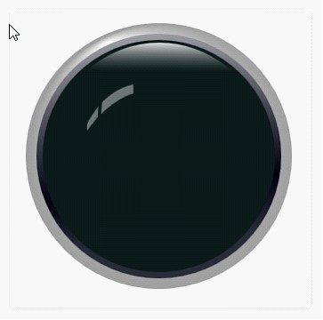
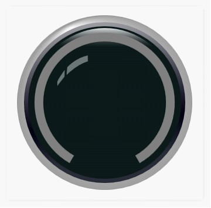
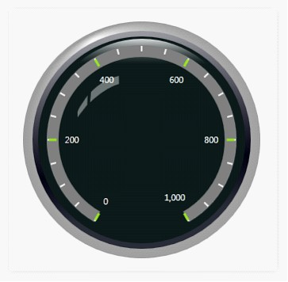
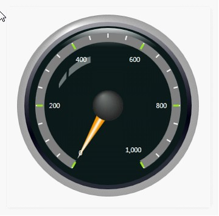
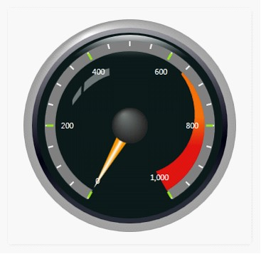
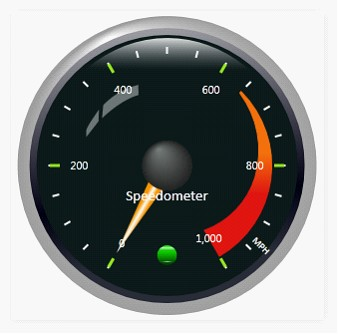

::: {style="DISPLAY: none"}
{#d2h_url_template}{#d2h_package_url style="WIDTH: 0px; DISPLAY: none; HEIGHT: 0px"}
:::

::: {.d2h_secondary_topic style="PADDING-BOTTOM: 10pt; MARGIN: 0pt; PADDING-LEFT: 0pt; PADDING-RIGHT: 0pt; PADDING-TOP: 0pt"}
#### Creating a Circular Gauge {#creating-a-circular-gauge style="tab-stops: 0pt"}

Circular Gauges is enhanced with circle frame type or semi-circle frame type. This section covers how to create a basic gauge and add element to it.

[]{style="FONT-FAMILY: 'Trebuchet MS','sans-serif'; COLOR: #15428b; FONT-SIZE: 9pt"} 

1.   Create a basic circular gauge by using the following code.

**[]{style="FONT-FAMILY: 'Times New Roman','serif'"}** 

+------------------------------------------------------------------------------------------------------------------------------------------------------------------------------------------------------------------------------------------------------------------------------------------------------------------------------------------------+
| **[\[XAML\]]{style="FONT-FAMILY: 'Courier New'"}**                                                                                                                                                                                                                                                                                             |
|                                                                                                                                                                                                                                                                                                                                                |
| **[]{style="FONT-FAMILY: 'Times New Roman','serif'"}**                                                                                                                                                                                                                                                                                         |
|                                                                                                                                                                                                                                                                                                                                                |
| [\<]{style="FONT-FAMILY: Consolas; COLOR: blue"}[syncfusion]{style="FONT-FAMILY: Consolas; COLOR: #a31515"}[:]{style="FONT-FAMILY: Consolas; COLOR: blue"}[CircularGauge]{style="FONT-FAMILY: Consolas; COLOR: #a31515"}[ Name]{style="FONT-FAMILY: Consolas; COLOR: red"}[=\"circulargauge1\"/\>]{style="FONT-FAMILY: Consolas; COLOR: blue"} |
+------------------------------------------------------------------------------------------------------------------------------------------------------------------------------------------------------------------------------------------------------------------------------------------------------------------------------------------------+

**[]{style="FONT-FAMILY: 'Times New Roman','serif'"}** 

+----------------------------------------------------------------------------------------------------------------------------------------------------------------------------------------+
| **[\[C#\]]{style="FONT-FAMILY: 'Courier New'"}**                                                                                                                                       |
|                                                                                                                                                                                        |
| []{style="FONT-FAMILY: Consolas; COLOR: #2b91af"}                                                                                                                                      |
|                                                                                                                                                                                        |
| [CircularGauge]{style="FONT-FAMILY: Consolas; COLOR: #2b91af"}[ circulargauge1 = [new]{style="COLOR: blue"} [CircularGauge]{style="COLOR: #2b91af"}();]{style="FONT-FAMILY: Consolas"} |
|                                                                                                                                                                                        |
| [LayoutRoot.Children.Add(circulargauge1);]{style="FONT-FAMILY: Consolas"}                                                                                                              |
+----------------------------------------------------------------------------------------------------------------------------------------------------------------------------------------+

[]{style="FONT-FAMILY: Consolas"} 

When the code runs the following output displays.

[]{style="FONT-FAMILY: 'Trebuchet MS','sans-serif'; COLOR: #15428b; FONT-SIZE: 9pt"} 

{border="0"}

Figure 10: Basic Gauge

***[]{style="FONT-FAMILY: 'Trebuchet MS','sans-serif'; COLOR: #15428b; FONT-SIZE: 9pt"}*** 

[]{style="FONT-FAMILY: 'Times New Roman','serif'"} 

2.   Add Scale to the Circular Gauge, by using the following code**[.]{style="FONT-FAMILY: 'Times New Roman','serif'"}**

[]{style="FONT-FAMILY: 'Times New Roman','serif'"} 

+------------------------------------------------------------------------------------------------------------------------------------------------------------------------------------------------------------------------------------------------------------------------------------------------------------------------------------------------------------------------------------------------------------------------------------------------------------------------------------------------------------------------------------------------------------------------------------------------------------------+
| **[\[XAML\]]{style="FONT-FAMILY: 'Courier New'"}**                                                                                                                                                                                                                                                                                                                                                                                                                                                                                                                                                               |
|                                                                                                                                                                                                                                                                                                                                                                                                                                                                                                                                                                                                                  |
| **[]{style="FONT-FAMILY: 'Times New Roman','serif'"}**                                                                                                                                                                                                                                                                                                                                                                                                                                                                                                                                                           |
|                                                                                                                                                                                                                                                                                                                                                                                                                                                                                                                                                                                                                  |
| [\<!\--Scale for Gauge control\--\>]{style="FONT-FAMILY: Consolas; COLOR: green"}[ ]{style="FONT-FAMILY: Consolas; COLOR: #a31515"}                                                                                                                                                                                                                                                                                                                                                                                                                                                                              |
|                                                                                                                                                                                                                                                                                                                                                                                                                                                                                                                                                                                                                  |
| [\<]{style="FONT-FAMILY: Consolas; COLOR: blue"}[syncfusion]{style="FONT-FAMILY: Consolas; COLOR: #a31515"}[:]{style="FONT-FAMILY: Consolas; COLOR: blue"}[CircularScale]{style="FONT-FAMILY: Consolas; COLOR: #a31515"}[ Name]{style="FONT-FAMILY: Consolas; COLOR: red"}[=\"m_scale\"]{style="FONT-FAMILY: Consolas; COLOR: blue"}[ BorderWidth]{style="FONT-FAMILY: Consolas; COLOR: red"}[=\"3\"]{style="FONT-FAMILY: Consolas; COLOR: blue"}[ GapSweepAngle]{style="FONT-FAMILY: Consolas; COLOR: red"}[=\"300\"]{style="FONT-FAMILY: Consolas; COLOR: blue"}[ ]{style="FONT-FAMILY: Consolas; COLOR: red"} |
|                                                                                                                                                                                                                                                                                                                                                                                                                                                                                                                                                                                                                  |
| [  MajorIntervalValue]{style="FONT-FAMILY: Consolas; COLOR: red"}[=\"200\"]{style="FONT-FAMILY: Consolas; COLOR: blue"}[ [Maximum]{style="COLOR: red"}[=\"1000\"]{style="COLOR: blue"}[ Minimum]{style="COLOR: red"}[=\"0\"]{style="COLOR: blue"}[ MinorIntervalValue]{style="COLOR: red"}[=\"50\"]{style="COLOR: blue"}[ ]{style="COLOR: red"}]{style="FONT-FAMILY: Consolas"}                                                                                                                                                                                                                                  |
|                                                                                                                                                                                                                                                                                                                                                                                                                                                                                                                                                                                                                  |
| [  BackgroundBrush]{style="FONT-FAMILY: Consolas; COLOR: red"}[=\"Gray\"]{style="FONT-FAMILY: Consolas; COLOR: blue"}[BorderBrush]{style="FONT-FAMILY: Consolas; COLOR: red"}[=\"Transparent\"]{style="FONT-FAMILY: Consolas; COLOR: blue"}[ Radius]{style="FONT-FAMILY: Consolas; COLOR: red"}[=\"120\"]{style="FONT-FAMILY: Consolas; COLOR: blue"}[ ScaleBarSize]{style="FONT-FAMILY: Consolas; COLOR: red"}[=\"15\"]{style="FONT-FAMILY: Consolas; COLOR: blue"}[     ]{style="FONT-FAMILY: Consolas; COLOR: red"}                                                                                           |
|                                                                                                                                                                                                                                                                                                                                                                                                                                                                                                                                                                                                                  |
| [  ShadowOffset]{style="FONT-FAMILY: Consolas; COLOR: red"}[=\"0\"]{style="FONT-FAMILY: Consolas; COLOR: blue"}[ [StartAngle]{style="COLOR: red"}[=\"120\"\>]{style="COLOR: blue"}]{style="FONT-FAMILY: Consolas"}                                                                                                                                                                                                                                                                                                                                                                                               |
|                                                                                                                                                                                                                                                                                                                                                                                                                                                                                                                                                                                                                  |
| [\</]{style="FONT-FAMILY: Consolas; COLOR: blue"}[syncfusion]{style="FONT-FAMILY: Consolas; COLOR: #a31515"}[:]{style="FONT-FAMILY: Consolas; COLOR: blue"}[CircularScale]{style="FONT-FAMILY: Consolas; COLOR: #a31515"}[\>]{style="FONT-FAMILY: Consolas; COLOR: blue"}                                                                                                                                                                                                                                                                                                                                        |
+------------------------------------------------------------------------------------------------------------------------------------------------------------------------------------------------------------------------------------------------------------------------------------------------------------------------------------------------------------------------------------------------------------------------------------------------------------------------------------------------------------------------------------------------------------------------------------------------------------------+

**[]{style="FONT-FAMILY: 'Times New Roman','serif'; COLOR: black"}** 

+---------------------------------------------------------------------------------------------------------------------------------------------------------------------------------+
| **[\[C#\]]{style="FONT-FAMILY: 'Courier New'; COLOR: black"}**                                                                                                                  |
|                                                                                                                                                                                 |
| **[]{style="FONT-FAMILY: 'Calibri','sans-serif'; COLOR: black"}**                                                                                                               |
|                                                                                                                                                                                 |
| [// Creating Scale and adding to Gauge.]{style="FONT-FAMILY: Consolas; COLOR: green"}                                                                                           |
|                                                                                                                                                                                 |
| [CircularScale]{style="FONT-FAMILY: Consolas; COLOR: #2b91af"}[ m_scale = [new]{style="COLOR: blue"} [CircularScale]{style="COLOR: #2b91af"}();]{style="FONT-FAMILY: Consolas"} |
|                                                                                                                                                                                 |
| [m_scale.BorderWidth = 3;]{style="FONT-FAMILY: Consolas"}                                                                                                                       |
|                                                                                                                                                                                 |
| [m_scale.GapSweepAngle = 300;]{style="FONT-FAMILY: Consolas"}                                                                                                                   |
|                                                                                                                                                                                 |
| [m_scale.MajorIntervalValue = 200;]{style="FONT-FAMILY: Consolas"}                                                                                                              |
|                                                                                                                                                                                 |
| [m_scale.Maximum = 1000;]{style="FONT-FAMILY: Consolas"}                                                                                                                        |
|                                                                                                                                                                                 |
| [m_scale.Minimum = 0;]{style="FONT-FAMILY: Consolas"}                                                                                                                           |
|                                                                                                                                                                                 |
| [m_scale.MinorIntervalValue = 50;]{style="FONT-FAMILY: Consolas"}                                                                                                               |
|                                                                                                                                                                                 |
| [m_scale.StartAngle = 120;]{style="FONT-FAMILY: Consolas"}                                                                                                                      |
|                                                                                                                                                                                 |
| [m_scale.BackgroundBrush = [Brushes]{style="COLOR: #2b91af"}.Gray;]{style="FONT-FAMILY: Consolas"}                                                                              |
|                                                                                                                                                                                 |
| [m_scale.BorderBrush = [Brushes]{style="COLOR: #2b91af"}.Transparent;]{style="FONT-FAMILY: Consolas"}                                                                           |
|                                                                                                                                                                                 |
| [m_scale.Radius = 120;]{style="FONT-FAMILY: Consolas"}                                                                                                                          |
|                                                                                                                                                                                 |
| [m_scale.ScaleBarSize = 15;]{style="FONT-FAMILY: Consolas"}                                                                                                                     |
|                                                                                                                                                                                 |
| [m_scale.ShadowOffset = 0;]{style="FONT-FAMILY: Consolas"}                                                                                                                      |
|                                                                                                                                                                                 |
| [circulargauge1.Scales.Add(m_scale);]{style="FONT-FAMILY: Consolas"}                                                                                                            |
+---------------------------------------------------------------------------------------------------------------------------------------------------------------------------------+

**[]{style="FONT-FAMILY: 'Times New Roman','serif'; COLOR: black"}** 

When the code runs the following output displays.

[]{style="FONT-FAMILY: 'Times New Roman','serif'"} 

{border="0"}

Figure 11: Gauge with Scale

[]{style="FONT-FAMILY: Consolas"} 

3.   Add Ticks to Circular Scale, by using the following code.

**[]{style="FONT-FAMILY: 'Times New Roman','serif'"}** 

+--------------------------------------------------------------------------------------------------------------------------------------------------------------------------------------------------------------------------------------------------------------------------------------------------------------------------------------------------------------------------------------------------------------------------------------------------------------------------------------------------------------------------------------------------------------------------------------------------------------------------------------------------------------------+
| **[\[XAML\]]{style="FONT-FAMILY: 'Courier New'"}**                                                                                                                                                                                                                                                                                                                                                                                                                                                                                                                                                                                                                 |
|                                                                                                                                                                                                                                                                                                                                                                                                                                                                                                                                                                                                                                                                    |
| **[]{style="FONT-FAMILY: 'Times New Roman','serif'"}**                                                                                                                                                                                                                                                                                                                                                                                                                                                                                                                                                                                                             |
|                                                                                                                                                                                                                                                                                                                                                                                                                                                                                                                                                                                                                                                                    |
| [\<]{style="FONT-FAMILY: Consolas; COLOR: blue"}[syncfusion]{style="FONT-FAMILY: Consolas; COLOR: #a31515"}[:]{style="FONT-FAMILY: Consolas; COLOR: blue"}[CircularScale.Ticks]{style="FONT-FAMILY: Consolas; COLOR: #a31515"}[\>]{style="FONT-FAMILY: Consolas; COLOR: blue"}                                                                                                                                                                                                                                                                                                                                                                                     |
|                                                                                                                                                                                                                                                                                                                                                                                                                                                                                                                                                                                                                                                                    |
| []{style="FONT-FAMILY: Consolas"}                                                                                                                                                                                                                                                                                                                                                                                                                                                                                                                                                                                                                                  |
|                                                                                                                                                                                                                                                                                                                                                                                                                                                                                                                                                                                                                                                                    |
| [  \<!\--Minor Tick for Circular Scale.\--\>]{style="FONT-FAMILY: Consolas; COLOR: green"}                                                                                                                                                                                                                                                                                                                                                                                                                                                                                                                                                                         |
|                                                                                                                                                                                                                                                                                                                                                                                                                                                                                                                                                                                                                                                                    |
| [  \<]{style="FONT-FAMILY: Consolas; COLOR: blue"}[syncfusion]{style="FONT-FAMILY: Consolas; COLOR: #a31515"}[:]{style="FONT-FAMILY: Consolas; COLOR: blue"}[CircularMarkTick]{style="FONT-FAMILY: Consolas; COLOR: #a31515"}[ TickHeight]{style="FONT-FAMILY: Consolas; COLOR: red"}[=\"7\"]{style="FONT-FAMILY: Consolas; COLOR: blue"}[ Name]{style="FONT-FAMILY: Consolas; COLOR: red"}[=\"minorTick\"]{style="FONT-FAMILY: Consolas; COLOR: blue"}[ DistanceFromScale]{style="FONT-FAMILY: Consolas; COLOR: red"}[=\"3\"]{style="FONT-FAMILY: Consolas; COLOR: blue"}[ ]{style="FONT-FAMILY: Consolas"}                                                       |
|                                                                                                                                                                                                                                                                                                                                                                                                                                                                                                                                                                                                                                                                    |
| [    TickStyle]{style="FONT-FAMILY: Consolas; COLOR: red"}[=\"MinorTick\"]{style="FONT-FAMILY: Consolas; COLOR: blue"}[ TickShape]{style="FONT-FAMILY: Consolas; COLOR: red"}[=\"Rectangle\"]{style="FONT-FAMILY: Consolas; COLOR: blue"}[ TickWidth]{style="FONT-FAMILY: Consolas; COLOR: red"}[=\"2\"/\>]{style="FONT-FAMILY: Consolas; COLOR: blue"}                                                                                                                                                                                                                                                                                                            |
|                                                                                                                                                                                                                                                                                                                                                                                                                                                                                                                                                                                                                                                                    |
| []{style="FONT-FAMILY: Consolas; COLOR: blue"}                                                                                                                                                                                                                                                                                                                                                                                                                                                                                                                                                                                                                     |
|                                                                                                                                                                                                                                                                                                                                                                                                                                                                                                                                                                                                                                                                    |
| [  ]{style="FONT-FAMILY: Consolas; COLOR: #a31515"}[\<!\--Major Tick for Circular Scale.\--\>]{style="FONT-FAMILY: Consolas; COLOR: green"}                                                                                                                                                                                                                                                                                                                                                                                                                                                                                                                        |
|                                                                                                                                                                                                                                                                                                                                                                                                                                                                                                                                                                                                                                                                    |
| [  ]{style="FONT-FAMILY: Consolas; COLOR: #a31515"}[\<]{style="FONT-FAMILY: Consolas; COLOR: blue"}[syncfusion]{style="FONT-FAMILY: Consolas; COLOR: #a31515"}[:]{style="FONT-FAMILY: Consolas; COLOR: blue"}[CircularMarkTick]{style="FONT-FAMILY: Consolas; COLOR: #a31515"}[ Name]{style="FONT-FAMILY: Consolas; COLOR: red"}[=\"majorTick\"]{style="FONT-FAMILY: Consolas; COLOR: blue"}[ Angle]{style="FONT-FAMILY: Consolas; COLOR: red"}[=\"0\"]{style="FONT-FAMILY: Consolas; COLOR: blue"}[ TickHeight]{style="FONT-FAMILY: Consolas; COLOR: red"}[=\"10\"]{style="FONT-FAMILY: Consolas; COLOR: blue"}[ ]{style="FONT-FAMILY: Consolas; COLOR: red"}     |
|                                                                                                                                                                                                                                                                                                                                                                                                                                                                                                                                                                                                                                                                    |
| [    TickShape]{style="FONT-FAMILY: Consolas; COLOR: red"}[=\"Rectangle\"]{style="FONT-FAMILY: Consolas; COLOR: blue"}[ [TickStyle]{style="COLOR: red"}[=\"MajorTick\"]{style="COLOR: blue"}[ TickWidth]{style="COLOR: red"}[=\"3\"/\>]{style="COLOR: blue"}]{style="FONT-FAMILY: Consolas"}                                                                                                                                                                                                                                                                                                                                                                       |
|                                                                                                                                                                                                                                                                                                                                                                                                                                                                                                                                                                                                                                                                    |
| []{style="FONT-FAMILY: Consolas; COLOR: blue"}                                                                                                                                                                                                                                                                                                                                                                                                                                                                                                                                                                                                                     |
|                                                                                                                                                                                                                                                                                                                                                                                                                                                                                                                                                                                                                                                                    |
| [  ]{style="FONT-FAMILY: Consolas; COLOR: #a31515"}[\<!\--Label Tick for Circular Scale.\--\>]{style="FONT-FAMILY: Consolas; COLOR: green"}                                                                                                                                                                                                                                                                                                                                                                                                                                                                                                                        |
|                                                                                                                                                                                                                                                                                                                                                                                                                                                                                                                                                                                                                                                                    |
| [  ]{style="FONT-FAMILY: Consolas; COLOR: #a31515"}[\<]{style="FONT-FAMILY: Consolas; COLOR: blue"}[syncfusion]{style="FONT-FAMILY: Consolas; COLOR: #a31515"}[:]{style="FONT-FAMILY: Consolas; COLOR: blue"}[CircularLabelTick]{style="FONT-FAMILY: Consolas; COLOR: #a31515"}[ Name]{style="FONT-FAMILY: Consolas; COLOR: red"}[=\"majorLabelTick\"]{style="FONT-FAMILY: Consolas; COLOR: blue"}[ DistanceFromScale]{style="FONT-FAMILY: Consolas; COLOR: red"}[=\"8\"]{style="FONT-FAMILY: Consolas; COLOR: blue"}[ FontSize]{style="FONT-FAMILY: Consolas; COLOR: red"}[=\"11\"]{style="FONT-FAMILY: Consolas; COLOR: blue"}[ ]{style="FONT-FAMILY: Consolas"} |
|                                                                                                                                                                                                                                                                                                                                                                                                                                                                                                                                                                                                                                                                    |
| [    [TickPlacement]{style="COLOR: red"}[=\"Inside\"]{style="COLOR: blue"}[ TickStyle]{style="COLOR: red"}[=\"MajorTick\" /\>]{style="COLOR: blue"}]{style="FONT-FAMILY: Consolas"}                                                                                                                                                                                                                                                                                                                                                                                                                                                                                |
|                                                                                                                                                                                                                                                                                                                                                                                                                                                                                                                                                                                                                                                                    |
| []{style="FONT-FAMILY: Consolas"}                                                                                                                                                                                                                                                                                                                                                                                                                                                                                                                                                                                                                                  |
|                                                                                                                                                                                                                                                                                                                                                                                                                                                                                                                                                                                                                                                                    |
| [\</]{style="FONT-FAMILY: Consolas; COLOR: blue"}[syncfusion]{style="FONT-FAMILY: Consolas; COLOR: #a31515"}[:]{style="FONT-FAMILY: Consolas; COLOR: blue"}[CircularScale.Ticks]{style="FONT-FAMILY: Consolas; COLOR: #a31515"}[\>]{style="FONT-FAMILY: Consolas; COLOR: blue"}                                                                                                                                                                                                                                                                                                                                                                                    |
+--------------------------------------------------------------------------------------------------------------------------------------------------------------------------------------------------------------------------------------------------------------------------------------------------------------------------------------------------------------------------------------------------------------------------------------------------------------------------------------------------------------------------------------------------------------------------------------------------------------------------------------------------------------------+

**[]{style="FONT-FAMILY: 'Times New Roman','serif'"}** 

+------------------------------------------------------------------------------------------------------------------------------------------------------------------------------------------------+
| **[\[C#\]]{style="FONT-FAMILY: 'Courier New'"}**                                                                                                                                               |
|                                                                                                                                                                                                |
| **[]{style="FONT-FAMILY: 'Calibri','sans-serif'"}**                                                                                                                                            |
|                                                                                                                                                                                                |
| [// Creating Minor Mark Tick and adding it to Scale.]{style="FONT-FAMILY: Consolas; COLOR: green"}                                                                                             |
|                                                                                                                                                                                                |
| [CircularMarkTick]{style="FONT-FAMILY: Consolas; COLOR: #2b91af"}[ minorTick = [new]{style="COLOR: blue"} [CircularMarkTick]{style="COLOR: #2b91af"}();]{style="FONT-FAMILY: Consolas"}        |
|                                                                                                                                                                                                |
| [minorTick.TickHeight = 7;]{style="FONT-FAMILY: Consolas"}                                                                                                                                     |
|                                                                                                                                                                                                |
| [minorTick.DistanceFromScale = 3;]{style="FONT-FAMILY: Consolas"}                                                                                                                              |
|                                                                                                                                                                                                |
| [minorTick.TickStyle = [TickStyle]{style="COLOR: #2b91af"}.MinorTick;]{style="FONT-FAMILY: Consolas"}                                                                                          |
|                                                                                                                                                                                                |
| [minorTick.TickShape = [TickShape]{style="COLOR: #2b91af"}.Rectangle;]{style="FONT-FAMILY: Consolas"}                                                                                          |
|                                                                                                                                                                                                |
| [minorTick.TickWidth = 2;]{style="FONT-FAMILY: Consolas"}                                                                                                                                      |
|                                                                                                                                                                                                |
| [m_scale.Ticks.Add(minorTick);]{style="FONT-FAMILY: Consolas"}                                                                                                                                 |
|                                                                                                                                                                                                |
| []{style="FONT-FAMILY: Consolas"}                                                                                                                                                              |
|                                                                                                                                                                                                |
| [// Creating Major Mark Tick and adding it to Scale.]{style="FONT-FAMILY: Consolas; COLOR: green"}                                                                                             |
|                                                                                                                                                                                                |
| [CircularMarkTick]{style="FONT-FAMILY: Consolas; COLOR: #2b91af"}[ majorTick = [new]{style="COLOR: blue"} [CircularMarkTick]{style="COLOR: #2b91af"}();]{style="FONT-FAMILY: Consolas"}        |
|                                                                                                                                                                                                |
| [majorTick.Angle = 0;]{style="FONT-FAMILY: Consolas"}                                                                                                                                          |
|                                                                                                                                                                                                |
| [majorTick.TickHeight = 10;]{style="FONT-FAMILY: Consolas"}                                                                                                                                    |
|                                                                                                                                                                                                |
| [majorTick.TickShape = [TickShape]{style="COLOR: #2b91af"}.Rectangle;]{style="FONT-FAMILY: Consolas"}                                                                                          |
|                                                                                                                                                                                                |
| [majorTick.TickStyle = [TickStyle]{style="COLOR: #2b91af"}.MajorTick;]{style="FONT-FAMILY: Consolas"}                                                                                          |
|                                                                                                                                                                                                |
| [majorTick.TickWidth = 3;]{style="FONT-FAMILY: Consolas"}                                                                                                                                      |
|                                                                                                                                                                                                |
| [m_scale.Ticks.Add(majorTick);]{style="FONT-FAMILY: Consolas"}                                                                                                                                 |
|                                                                                                                                                                                                |
| []{style="FONT-FAMILY: Consolas"}                                                                                                                                                              |
|                                                                                                                                                                                                |
| [// Creating Label Tick and adding it to Scale.]{style="FONT-FAMILY: Consolas; COLOR: green"}                                                                                                  |
|                                                                                                                                                                                                |
| [CircularLabelTick]{style="FONT-FAMILY: Consolas; COLOR: #2b91af"}[ majorLabelTick = [new]{style="COLOR: blue"} [CircularLabelTick]{style="COLOR: #2b91af"}();]{style="FONT-FAMILY: Consolas"} |
|                                                                                                                                                                                                |
| [majorLabelTick.DistanceFromScale = 8;]{style="FONT-FAMILY: Consolas"}                                                                                                                         |
|                                                                                                                                                                                                |
| [majorLabelTick.FontSize = 11;]{style="FONT-FAMILY: Consolas"}                                                                                                                                 |
|                                                                                                                                                                                                |
| [majorLabelTick.TickPlacement = [ScalePlacement]{style="COLOR: #2b91af"}.Inside;]{style="FONT-FAMILY: Consolas"}                                                                               |
|                                                                                                                                                                                                |
| [majorLabelTick.TickStyle = [TickStyle]{style="COLOR: #2b91af"}.MajorTick;]{style="FONT-FAMILY: Consolas"}                                                                                     |
|                                                                                                                                                                                                |
| [m_scale.Ticks.Add(majorLabelTick);]{style="FONT-FAMILY: Consolas"}                                                                                                                            |
+------------------------------------------------------------------------------------------------------------------------------------------------------------------------------------------------+

**[]{style="FONT-FAMILY: Consolas"}** 

When the code runs the following output displays.

***[]{style="FONT-FAMILY: 'Trebuchet MS','sans-serif'; COLOR: #15428b; FONT-SIZE: 9pt"}*** 

{border="0"}

Figure 12: Gauge with Ticks

**[]{style="FONT-FAMILY: Consolas"}** 

4.   Add Pointer to Circular Scale, by using the following code.

[]{style="FONT-FAMILY: 'Times New Roman','serif'"} 

+----------------------------------------------------------------------------------------------------------------------------------------------------------------------------------------------------------------------------------------------------------------------------------------------------------------------------------------------------------------------------------------------------------------------------------------------------------------------------------------------------------------------------------------------------------------------------------------------------------------------------------------------------+
| **[\[XAML\]]{style="FONT-FAMILY: 'Courier New'"}**                                                                                                                                                                                                                                                                                                                                                                                                                                                                                                                                                                                                 |
|                                                                                                                                                                                                                                                                                                                                                                                                                                                                                                                                                                                                                                                    |
| **[]{style="FONT-FAMILY: 'Times New Roman','serif'"}**                                                                                                                                                                                                                                                                                                                                                                                                                                                                                                                                                                                             |
|                                                                                                                                                                                                                                                                                                                                                                                                                                                                                                                                                                                                                                                    |
| [\<!\--Hosting circular pointer\--\>]{style="FONT-FAMILY: Consolas; COLOR: green"}                                                                                                                                                                                                                                                                                                                                                                                                                                                                                                                                                                 |
|                                                                                                                                                                                                                                                                                                                                                                                                                                                                                                                                                                                                                                                    |
| [\<]{style="FONT-FAMILY: Consolas; COLOR: blue"}[syncfusion]{style="FONT-FAMILY: Consolas; COLOR: #a31515"}[:]{style="FONT-FAMILY: Consolas; COLOR: blue"}[CircularScale.Pointers]{style="FONT-FAMILY: Consolas; COLOR: #a31515"}[\>]{style="FONT-FAMILY: Consolas; COLOR: blue"}                                                                                                                                                                                                                                                                                                                                                                  |
|                                                                                                                                                                                                                                                                                                                                                                                                                                                                                                                                                                                                                                                    |
| [  ]{style="FONT-FAMILY: Consolas; COLOR: #a31515"}[\<]{style="FONT-FAMILY: Consolas; COLOR: blue"}[syncfusion]{style="FONT-FAMILY: Consolas; COLOR: #a31515"}[:]{style="FONT-FAMILY: Consolas; COLOR: blue"}[CircularPointer]{style="FONT-FAMILY: Consolas; COLOR: #a31515"}[ Name]{style="FONT-FAMILY: Consolas; COLOR: red"}[=\"pointer1\"]{style="FONT-FAMILY: Consolas; COLOR: blue"}[ Value]{style="FONT-FAMILY: Consolas; COLOR: red"}[=\"0\"]{style="FONT-FAMILY: Consolas; COLOR: blue"}[ BorderWidth]{style="FONT-FAMILY: Consolas; COLOR: red"}[=\"0.3\"]{style="FONT-FAMILY: Consolas; COLOR: blue"}[ ]{style="FONT-FAMILY: Consolas"} |
|                                                                                                                                                                                                                                                                                                                                                                                                                                                                                                                                                                                                                                                    |
| [    PointerLength]{style="FONT-FAMILY: Consolas; COLOR: red"}[=\"100\"]{style="FONT-FAMILY: Consolas; COLOR: blue"}[ [PointerPlacement]{style="COLOR: red"}[=\"Inside\"]{style="COLOR: blue"}[ PointerWidth]{style="COLOR: red"}[=\"20\"/\>]{style="COLOR: blue"}]{style="FONT-FAMILY: Consolas"}                                                                                                                                                                                                                                                                                                                                                 |
|                                                                                                                                                                                                                                                                                                                                                                                                                                                                                                                                                                                                                                                    |
| [\</]{style="FONT-FAMILY: Consolas; COLOR: blue"}[syncfusion]{style="FONT-FAMILY: Consolas; COLOR: #a31515"}[:]{style="FONT-FAMILY: Consolas; COLOR: blue"}[CircularScale.Pointers]{style="FONT-FAMILY: Consolas; COLOR: #a31515"}[\>]{style="FONT-FAMILY: Consolas; COLOR: blue"}                                                                                                                                                                                                                                                                                                                                                                 |
+----------------------------------------------------------------------------------------------------------------------------------------------------------------------------------------------------------------------------------------------------------------------------------------------------------------------------------------------------------------------------------------------------------------------------------------------------------------------------------------------------------------------------------------------------------------------------------------------------------------------------------------------------+

**[]{style="FONT-FAMILY: 'Times New Roman','serif'"}** 

+--------------------------------------------------------------------------------------------------------------------------------------------------------------------------------------+
| **[\[C#\]]{style="FONT-FAMILY: 'Courier New'"}**                                                                                                                                     |
|                                                                                                                                                                                      |
| **[]{style="FONT-FAMILY: 'Calibri','sans-serif'"}**                                                                                                                                  |
|                                                                                                                                                                                      |
| [// Creating and adding Pointer to Scale.]{style="FONT-FAMILY: Consolas; COLOR: green"}                                                                                              |
|                                                                                                                                                                                      |
| [CircularPointer]{style="FONT-FAMILY: Consolas; COLOR: #2b91af"}[ pointer1 = [new]{style="COLOR: blue"} [CircularPointer]{style="COLOR: #2b91af"}();]{style="FONT-FAMILY: Consolas"} |
|                                                                                                                                                                                      |
| [pointer1.Value = 0;]{style="FONT-FAMILY: Consolas"}                                                                                                                                 |
|                                                                                                                                                                                      |
| [pointer1.BorderWidth = 0.3;]{style="FONT-FAMILY: Consolas"}                                                                                                                         |
|                                                                                                                                                                                      |
| [pointer1.PointerLength = 100;]{style="FONT-FAMILY: Consolas"}                                                                                                                       |
|                                                                                                                                                                                      |
| [pointer1.PointerPlacement = [ScalePlacement]{style="COLOR: #2b91af"}.Inside;]{style="FONT-FAMILY: Consolas"}                                                                        |
|                                                                                                                                                                                      |
| [pointer1.PointerWidth = 20;]{style="FONT-FAMILY: Consolas"}                                                                                                                         |
|                                                                                                                                                                                      |
| [m_scale.Pointers.Add(pointer1);]{style="FONT-FAMILY: Consolas"}                                                                                                                     |
+--------------------------------------------------------------------------------------------------------------------------------------------------------------------------------------+

**[]{style="FONT-FAMILY: 'Times New Roman','serif'"}** 

When the code runs the following output displays.

[]{style="FONT-FAMILY: 'Times New Roman','serif'"} 

{border="0"}

Figure 13: Gauge with Pointer

**[]{style="FONT-FAMILY: 'Calibri','sans-serif'"}** 

5.   Add Range to Circular Scale, by using the following code.

**[]{style="FONT-FAMILY: 'Times New Roman','serif'"}** 

+---------------------------------------------------------------------------------------------------------------------------------------------------------------------------------------------------------------------------------------------------------------------------------------------------------------------------------------------------------------------------------------------------------------------------------------------------------------------------------------------------------------------------------------------------------------------------------------------------------------------------------------------------------+
| **[\[XAML\]]{style="FONT-FAMILY: 'Courier New'"}**                                                                                                                                                                                                                                                                                                                                                                                                                                                                                                                                                                                                      |
|                                                                                                                                                                                                                                                                                                                                                                                                                                                                                                                                                                                                                                                         |
| **[]{style="FONT-FAMILY: 'Times New Roman','serif'"}**                                                                                                                                                                                                                                                                                                                                                                                                                                                                                                                                                                                                  |
|                                                                                                                                                                                                                                                                                                                                                                                                                                                                                                                                                                                                                                                         |
| [\<!\--Range for Circular gauge\--\>]{style="FONT-FAMILY: Consolas; COLOR: green"}[ ]{style="FONT-FAMILY: Consolas; COLOR: #a31515"}                                                                                                                                                                                                                                                                                                                                                                                                                                                                                                                    |
|                                                                                                                                                                                                                                                                                                                                                                                                                                                                                                                                                                                                                                                         |
| [\<]{style="FONT-FAMILY: Consolas; COLOR: blue"}[syncfusion]{style="FONT-FAMILY: Consolas; COLOR: #a31515"}[:]{style="FONT-FAMILY: Consolas; COLOR: blue"}[CircularScale.Ranges]{style="FONT-FAMILY: Consolas; COLOR: #a31515"}[\>]{style="FONT-FAMILY: Consolas; COLOR: blue"}                                                                                                                                                                                                                                                                                                                                                                         |
|                                                                                                                                                                                                                                                                                                                                                                                                                                                                                                                                                                                                                                                         |
| [  ]{style="FONT-FAMILY: Consolas; COLOR: #a31515"}[\<]{style="FONT-FAMILY: Consolas; COLOR: blue"}[syncfusion]{style="FONT-FAMILY: Consolas; COLOR: #a31515"}[:]{style="FONT-FAMILY: Consolas; COLOR: blue"}[CircularRange]{style="FONT-FAMILY: Consolas; COLOR: #a31515"}[ Name]{style="FONT-FAMILY: Consolas; COLOR: red"}[=\"range\"]{style="FONT-FAMILY: Consolas; COLOR: blue"}[ BorderWidth]{style="FONT-FAMILY: Consolas; COLOR: red"}[=\"1\"]{style="FONT-FAMILY: Consolas; COLOR: blue"}[ DistanceFromScale]{style="FONT-FAMILY: Consolas; COLOR: red"}[=\"0\"]{style="FONT-FAMILY: Consolas; COLOR: blue"}[ ]{style="FONT-FAMILY: Consolas"} |
|                                                                                                                                                                                                                                                                                                                                                                                                                                                                                                                                                                                                                                                         |
| [    [EndValue]{style="COLOR: red"}[=\"1000\"]{style="COLOR: blue"}[ StartValue]{style="COLOR: red"}[=\"650\"]{style="COLOR: blue"}[ EndWidth]{style="COLOR: red"}[=\"30\"]{style="COLOR: blue"} [RangePosition]{style="COLOR: red"}[=\"Inside\"]{style="COLOR: blue"}]{style="FONT-FAMILY: Consolas"}                                                                                                                                                                                                                                                                                                                                                  |
|                                                                                                                                                                                                                                                                                                                                                                                                                                                                                                                                                                                                                                                         |
| [    StartWidth]{style="FONT-FAMILY: Consolas; COLOR: red"}[=\"2\" /\>]{style="FONT-FAMILY: Consolas; COLOR: blue"}                                                                                                                                                                                                                                                                                                                                                                                                                                                                                                                                     |
|                                                                                                                                                                                                                                                                                                                                                                                                                                                                                                                                                                                                                                                         |
| [\</]{style="FONT-FAMILY: Consolas; COLOR: blue"}[syncfusion]{style="FONT-FAMILY: Consolas; COLOR: #a31515"}[:]{style="FONT-FAMILY: Consolas; COLOR: blue"}[CircularScale.Ranges]{style="FONT-FAMILY: Consolas; COLOR: #a31515"}[\>]{style="FONT-FAMILY: Consolas; COLOR: blue"}                                                                                                                                                                                                                                                                                                                                                                        |
+---------------------------------------------------------------------------------------------------------------------------------------------------------------------------------------------------------------------------------------------------------------------------------------------------------------------------------------------------------------------------------------------------------------------------------------------------------------------------------------------------------------------------------------------------------------------------------------------------------------------------------------------------------+

**[]{style="FONT-FAMILY: 'Calibri','sans-serif'"}** 

+-------------------------------------------------------------------------------------------------------------------------------------------------------------------------------+
| **[\[C#\]]{style="FONT-FAMILY: 'Courier New'"}**                                                                                                                              |
|                                                                                                                                                                               |
| []{style="FONT-FAMILY: Consolas; COLOR: green"}                                                                                                                               |
|                                                                                                                                                                               |
| [// Creating and adding Range to Scale.]{style="FONT-FAMILY: Consolas; COLOR: green"}                                                                                         |
|                                                                                                                                                                               |
| [CircularRange]{style="FONT-FAMILY: Consolas; COLOR: #2b91af"}[ range = [new]{style="COLOR: blue"} [CircularRange]{style="COLOR: #2b91af"}();]{style="FONT-FAMILY: Consolas"} |
|                                                                                                                                                                               |
| [range.BorderWidth = 1;]{style="FONT-FAMILY: Consolas"}                                                                                                                       |
|                                                                                                                                                                               |
| [range.DistanceFromScale = 0;]{style="FONT-FAMILY: Consolas"}                                                                                                                 |
|                                                                                                                                                                               |
| [range.StartValue = 650;]{style="FONT-FAMILY: Consolas"}                                                                                                                      |
|                                                                                                                                                                               |
| [range.EndValue = 1000;]{style="FONT-FAMILY: Consolas"}                                                                                                                       |
|                                                                                                                                                                               |
| [range.StartWidth = 2;]{style="FONT-FAMILY: Consolas"}                                                                                                                        |
|                                                                                                                                                                               |
| [range.EndWidth = 30;]{style="FONT-FAMILY: Consolas"}                                                                                                                         |
|                                                                                                                                                                               |
| [range.RangePosition = [ScalePlacement]{style="COLOR: #2b91af"}.Inside;]{style="FONT-FAMILY: Consolas"}                                                                       |
|                                                                                                                                                                               |
| [m_scale.Ranges.Add(range);]{style="FONT-FAMILY: Consolas"}                                                                                                                   |
+-------------------------------------------------------------------------------------------------------------------------------------------------------------------------------+

[]{style="FONT-FAMILY: 'Trebuchet MS','sans-serif'; COLOR: #15428b; FONT-SIZE: 9pt"} 

When the code runs, the following output displays.

**[]{style="FONT-FAMILY: 'Times New Roman','serif'"}** 

{border="0"}

Figure 14: Gauge with Range

***[]{style="FONT-FAMILY: 'Trebuchet MS','sans-serif'; COLOR: #15428b; FONT-SIZE: 9pt"}*** 

[]{style="FONT-FAMILY: 'Trebuchet MS','sans-serif'; COLOR: #15428b; FONT-SIZE: 9pt"} 

Add complete circular gauge, by using the following code.

[]{style="FONT-FAMILY: 'Trebuchet MS','sans-serif'; COLOR: #15428b; FONT-SIZE: 9pt"} 

+-----------------------------------------------------------------------------------------------------------------------------------------------------------------------------------------------------------------------------------------------------------------------------------------------------------------------------------------------------------------------------------------------------------------------------------------------------------------------------------------------------------------------------------------------------------------------------------------------------------------------------------------------------------------------+
| **[\[XAML\]]{style="FONT-FAMILY: 'Courier New'"}**                                                                                                                                                                                                                                                                                                                                                                                                                                                                                                                                                                                                                    |
|                                                                                                                                                                                                                                                                                                                                                                                                                                                                                                                                                                                                                                                                       |
| **[]{style="FONT-FAMILY: 'Times New Roman','serif'"}**                                                                                                                                                                                                                                                                                                                                                                                                                                                                                                                                                                                                                |
|                                                                                                                                                                                                                                                                                                                                                                                                                                                                                                                                                                                                                                                                       |
| [\<]{style="FONT-FAMILY: Consolas; COLOR: blue"}[syncfusion]{style="FONT-FAMILY: Consolas; COLOR: #a31515"}[:]{style="FONT-FAMILY: Consolas; COLOR: blue"}[CircularGauge]{style="FONT-FAMILY: Consolas; COLOR: #a31515"}[ Name]{style="FONT-FAMILY: Consolas; COLOR: red"}[=\"circulargauge1\"\>]{style="FONT-FAMILY: Consolas; COLOR: blue"}                                                                                                                                                                                                                                                                                                                         |
|                                                                                                                                                                                                                                                                                                                                                                                                                                                                                                                                                                                                                                                                       |
| [  ]{style="FONT-FAMILY: Consolas; COLOR: #a31515"}[\<]{style="FONT-FAMILY: Consolas; COLOR: blue"}[syncfusion]{style="FONT-FAMILY: Consolas; COLOR: #a31515"}[:]{style="FONT-FAMILY: Consolas; COLOR: blue"}[CircularGauge.Scales]{style="FONT-FAMILY: Consolas; COLOR: #a31515"}[\>]{style="FONT-FAMILY: Consolas; COLOR: blue"}                                                                                                                                                                                                                                                                                                                                    |
|                                                                                                                                                                                                                                                                                                                                                                                                                                                                                                                                                                                                                                                                       |
| [    ]{style="FONT-FAMILY: Consolas; COLOR: #a31515"}[\<!\--Circular Scale for Gauge control\--\>]{style="FONT-FAMILY: Consolas; COLOR: green"}                                                                                                                                                                                                                                                                                                                                                                                                                                                                                                                       |
|                                                                                                                                                                                                                                                                                                                                                                                                                                                                                                                                                                                                                                                                       |
| [    ]{style="FONT-FAMILY: Consolas; COLOR: #a31515"}[\<]{style="FONT-FAMILY: Consolas; COLOR: blue"}[syncfusion]{style="FONT-FAMILY: Consolas; COLOR: #a31515"}[:]{style="FONT-FAMILY: Consolas; COLOR: blue"}[CircularScale]{style="FONT-FAMILY: Consolas; COLOR: #a31515"}[ Name]{style="FONT-FAMILY: Consolas; COLOR: red"}[=\"m_scale\"]{style="FONT-FAMILY: Consolas; COLOR: blue"}[ BorderWidth]{style="FONT-FAMILY: Consolas; COLOR: red"}[=\"3\"]{style="FONT-FAMILY: Consolas; COLOR: blue"}[ GapSweepAngle]{style="FONT-FAMILY: Consolas; COLOR: red"}[=\"300\"]{style="FONT-FAMILY: Consolas; COLOR: blue"}[ ]{style="FONT-FAMILY: Consolas; COLOR: red"} |
|                                                                                                                                                                                                                                                                                                                                                                                                                                                                                                                                                                                                                                                                       |
| [      MajorIntervalValue]{style="FONT-FAMILY: Consolas; COLOR: red"}[=\"200\"]{style="FONT-FAMILY: Consolas; COLOR: blue"}[ [Maximum]{style="COLOR: red"}[=\"1000\"]{style="COLOR: blue"}[ Minimum]{style="COLOR: red"}[=\"0\"]{style="COLOR: blue"}[ MinorIntervalValue]{style="COLOR: red"}[=\"50\"]{style="COLOR: blue"}[ ]{style="COLOR: red"}]{style="FONT-FAMILY: Consolas"}                                                                                                                                                                                                                                                                                   |
|                                                                                                                                                                                                                                                                                                                                                                                                                                                                                                                                                                                                                                                                       |
| [      BackgroundBrush]{style="FONT-FAMILY: Consolas; COLOR: red"}[=\"Transparent\" ]{style="FONT-FAMILY: Consolas; COLOR: blue"}[BorderBrush]{style="FONT-FAMILY: Consolas; COLOR: red"}[=\"Transparent\"]{style="FONT-FAMILY: Consolas; COLOR: blue"}[ Radius]{style="FONT-FAMILY: Consolas; COLOR: red"}[=\"120\"]{style="FONT-FAMILY: Consolas; COLOR: blue"}[ ]{style="FONT-FAMILY: Consolas; COLOR: red"}                                                                                                                                                                                                                                                       |
|                                                                                                                                                                                                                                                                                                                                                                                                                                                                                                                                                                                                                                                                       |
| [      ScaleBarSize]{style="FONT-FAMILY: Consolas; COLOR: red"}[=\"15\"]{style="FONT-FAMILY: Consolas; COLOR: blue"}[ ShadowOffset]{style="FONT-FAMILY: Consolas; COLOR: red"}[=\"0\"]{style="FONT-FAMILY: Consolas; COLOR: blue"}[ [StartAngle]{style="COLOR: red"}[=\"120\"\>]{style="COLOR: blue"}]{style="FONT-FAMILY: Consolas"}                                                                                                                                                                                                                                                                                                                                 |
|                                                                                                                                                                                                                                                                                                                                                                                                                                                                                                                                                                                                                                                                       |
| [ \<]{style="FONT-FAMILY: Consolas; COLOR: blue"}[syncfusion]{style="FONT-FAMILY: Consolas; COLOR: #a31515"}[:]{style="FONT-FAMILY: Consolas; COLOR: blue"}[CircularScale.Ticks]{style="FONT-FAMILY: Consolas; COLOR: #a31515"}[\>]{style="FONT-FAMILY: Consolas; COLOR: blue"}                                                                                                                                                                                                                                                                                                                                                                                       |
|                                                                                                                                                                                                                                                                                                                                                                                                                                                                                                                                                                                                                                                                       |
| []{style="FONT-FAMILY: Consolas; COLOR: blue"}                                                                                                                                                                                                                                                                                                                                                                                                                                                                                                                                                                                                                        |
|                                                                                                                                                                                                                                                                                                                                                                                                                                                                                                                                                                                                                                                                       |
| []{style="FONT-FAMILY: Consolas; COLOR: blue"}                                                                                                                                                                                                                                                                                                                                                                                                                                                                                                                                                                                                                        |
|                                                                                                                                                                                                                                                                                                                                                                                                                                                                                                                                                                                                                                                                       |
| []{style="FONT-FAMILY: Consolas"}                                                                                                                                                                                                                                                                                                                                                                                                                                                                                                                                                                                                                                     |
|                                                                                                                                                                                                                                                                                                                                                                                                                                                                                                                                                                                                                                                                       |
| [   ]{style="FONT-FAMILY: Consolas; COLOR: #a31515"}[\<!\--Minor Tick for Circular Scale\--\>]{style="FONT-FAMILY: Consolas; COLOR: green"}                                                                                                                                                                                                                                                                                                                                                                                                                                                                                                                           |
|                                                                                                                                                                                                                                                                                                                                                                                                                                                                                                                                                                                                                                                                       |
| [     ]{style="FONT-FAMILY: Consolas; COLOR: #a31515"}[\<]{style="FONT-FAMILY: Consolas; COLOR: blue"}[syncfusion]{style="FONT-FAMILY: Consolas; COLOR: #a31515"}[:]{style="FONT-FAMILY: Consolas; COLOR: blue"}[CircularMarkTick]{style="FONT-FAMILY: Consolas; COLOR: #a31515"}[ TickHeight]{style="FONT-FAMILY: Consolas; COLOR: red"}[=\"7\"]{style="FONT-FAMILY: Consolas; COLOR: blue"}[ Name]{style="FONT-FAMILY: Consolas; COLOR: red"}[=\"minorTick\"]{style="FONT-FAMILY: Consolas; COLOR: blue"}[ ]{style="FONT-FAMILY: Consolas; COLOR: red"}                                                                                                             |
|                                                                                                                                                                                                                                                                                                                                                                                                                                                                                                                                                                                                                                                                       |
| [     DistanceFromScale]{style="FONT-FAMILY: Consolas; COLOR: red"}[=\"3\"]{style="FONT-FAMILY: Consolas; COLOR: blue"}[ [TickStyle]{style="COLOR: red"}[=\"MinorTick\"]{style="COLOR: blue"}[ TickShape]{style="COLOR: red"}[=\"Rectangle\"]{style="COLOR: blue"}[ ]{style="COLOR: red"}]{style="FONT-FAMILY: Consolas"}                                                                                                                                                                                                                                                                                                                                             |
|                                                                                                                                                                                                                                                                                                                                                                                                                                                                                                                                                                                                                                                                       |
| [     TickWidth]{style="FONT-FAMILY: Consolas; COLOR: red"}[=\"2\"/\>]{style="FONT-FAMILY: Consolas; COLOR: blue"}                                                                                                                                                                                                                                                                                                                                                                                                                                                                                                                                                    |
|                                                                                                                                                                                                                                                                                                                                                                                                                                                                                                                                                                                                                                                                       |
| []{style="FONT-FAMILY: Consolas; COLOR: blue"}                                                                                                                                                                                                                                                                                                                                                                                                                                                                                                                                                                                                                        |
|                                                                                                                                                                                                                                                                                                                                                                                                                                                                                                                                                                                                                                                                       |
| [   \<!\--Major Tick for Circular Scale\--\>]{style="FONT-FAMILY: Consolas; COLOR: green"}                                                                                                                                                                                                                                                                                                                                                                                                                                                                                                                                                                            |
|                                                                                                                                                                                                                                                                                                                                                                                                                                                                                                                                                                                                                                                                       |
| [   ]{style="FONT-FAMILY: Consolas; COLOR: #a31515"}[\<]{style="FONT-FAMILY: Consolas; COLOR: blue"}[syncfusion]{style="FONT-FAMILY: Consolas; COLOR: #a31515"}[:]{style="FONT-FAMILY: Consolas; COLOR: blue"}[CircularMarkTick]{style="FONT-FAMILY: Consolas; COLOR: #a31515"}[ Name]{style="FONT-FAMILY: Consolas; COLOR: red"}[=\"majorTick\"]{style="FONT-FAMILY: Consolas; COLOR: blue"}[ Angle]{style="FONT-FAMILY: Consolas; COLOR: red"}[=\"0\"]{style="FONT-FAMILY: Consolas; COLOR: blue"}[ TickHeight]{style="FONT-FAMILY: Consolas; COLOR: red"}[=\"10\"]{style="FONT-FAMILY: Consolas; COLOR: blue"}[ ]{style="FONT-FAMILY: Consolas; COLOR: red"}       |
|                                                                                                                                                                                                                                                                                                                                                                                                                                                                                                                                                                                                                                                                       |
| [     TickShape]{style="FONT-FAMILY: Consolas; COLOR: red"}[=\"Rectangle\"]{style="FONT-FAMILY: Consolas; COLOR: blue"}[ [TickStyle]{style="COLOR: red"}[=\"MajorTick\"]{style="COLOR: blue"}[ TickWidth]{style="COLOR: red"}[=\"3\"/\>]{style="COLOR: blue"}]{style="FONT-FAMILY: Consolas"}                                                                                                                                                                                                                                                                                                                                                                         |
|                                                                                                                                                                                                                                                                                                                                                                                                                                                                                                                                                                                                                                                                       |
| []{style="FONT-FAMILY: Consolas; COLOR: blue"}                                                                                                                                                                                                                                                                                                                                                                                                                                                                                                                                                                                                                        |
|                                                                                                                                                                                                                                                                                                                                                                                                                                                                                                                                                                                                                                                                       |
| [   [\<!\--Label Tick for Circular Scale\--\>]{style="COLOR: green"}]{style="FONT-FAMILY: Consolas"}                                                                                                                                                                                                                                                                                                                                                                                                                                                                                                                                                                  |
|                                                                                                                                                                                                                                                                                                                                                                                                                                                                                                                                                                                                                                                                       |
| [   ]{style="FONT-FAMILY: Consolas; COLOR: #a31515"}[\<]{style="FONT-FAMILY: Consolas; COLOR: blue"}[syncfusion]{style="FONT-FAMILY: Consolas; COLOR: #a31515"}[:]{style="FONT-FAMILY: Consolas; COLOR: blue"}[CircularLabelTick]{style="FONT-FAMILY: Consolas; COLOR: #a31515"}[ Name]{style="FONT-FAMILY: Consolas; COLOR: red"}[=\"majorLabelTick\"]{style="FONT-FAMILY: Consolas; COLOR: blue"}[ DistanceFromScale]{style="FONT-FAMILY: Consolas; COLOR: red"}[=\"8\"]{style="FONT-FAMILY: Consolas; COLOR: blue"}[ ]{style="FONT-FAMILY: Consolas; COLOR: red"}                                                                                                  |
|                                                                                                                                                                                                                                                                                                                                                                                                                                                                                                                                                                                                                                                                       |
| [     FontSize]{style="FONT-FAMILY: Consolas; COLOR: red"}[=\"11\"]{style="FONT-FAMILY: Consolas; COLOR: blue"}[ [TickPlacement]{style="COLOR: red"}[=\"Inside\" ]{style="COLOR: blue"}[TickStyle]{style="COLOR: red"}[=\"MajorTick\" /\>]{style="COLOR: blue"}]{style="FONT-FAMILY: Consolas"}                                                                                                                                                                                                                                                                                                                                                                       |
|                                                                                                                                                                                                                                                                                                                                                                                                                                                                                                                                                                                                                                                                       |
| [ \</]{style="FONT-FAMILY: Consolas; COLOR: blue"}[syncfusion]{style="FONT-FAMILY: Consolas; COLOR: #a31515"}[:]{style="FONT-FAMILY: Consolas; COLOR: blue"}[CircularScale.Ticks]{style="FONT-FAMILY: Consolas; COLOR: #a31515"}[\>]{style="FONT-FAMILY: Consolas; COLOR: blue"}                                                                                                                                                                                                                                                                                                                                                                                      |
|                                                                                                                                                                                                                                                                                                                                                                                                                                                                                                                                                                                                                                                                       |
| []{style="FONT-FAMILY: Consolas"}                                                                                                                                                                                                                                                                                                                                                                                                                                                                                                                                                                                                                                     |
|                                                                                                                                                                                                                                                                                                                                                                                                                                                                                                                                                                                                                                                                       |
| [ ]{style="FONT-FAMILY: Consolas; COLOR: #a31515"}[\<!\--Hosting circular pointer\--\>]{style="FONT-FAMILY: Consolas; COLOR: green"}                                                                                                                                                                                                                                                                                                                                                                                                                                                                                                                                  |
|                                                                                                                                                                                                                                                                                                                                                                                                                                                                                                                                                                                                                                                                       |
| [ ]{style="FONT-FAMILY: Consolas; COLOR: #a31515"}[\<]{style="FONT-FAMILY: Consolas; COLOR: blue"}[syncfusion]{style="FONT-FAMILY: Consolas; COLOR: #a31515"}[:]{style="FONT-FAMILY: Consolas; COLOR: blue"}[CircularScale.Pointers]{style="FONT-FAMILY: Consolas; COLOR: #a31515"}[\>]{style="FONT-FAMILY: Consolas; COLOR: blue"}                                                                                                                                                                                                                                                                                                                                   |
|                                                                                                                                                                                                                                                                                                                                                                                                                                                                                                                                                                                                                                                                       |
| [   ]{style="FONT-FAMILY: Consolas; COLOR: #a31515"}[\<]{style="FONT-FAMILY: Consolas; COLOR: blue"}[syncfusion]{style="FONT-FAMILY: Consolas; COLOR: #a31515"}[:]{style="FONT-FAMILY: Consolas; COLOR: blue"}[CircularPointer]{style="FONT-FAMILY: Consolas; COLOR: #a31515"}[ Name]{style="FONT-FAMILY: Consolas; COLOR: red"}[=\"pointer1\"]{style="FONT-FAMILY: Consolas; COLOR: blue"}[ BorderWidth]{style="FONT-FAMILY: Consolas; COLOR: red"}[=\"0.3\"]{style="FONT-FAMILY: Consolas; COLOR: blue"}[ ]{style="FONT-FAMILY: Consolas"}                                                                                                                          |
|                                                                                                                                                                                                                                                                                                                                                                                                                                                                                                                                                                                                                                                                       |
| [     [PointerLength]{style="COLOR: red"}[=\"100\"]{style="COLOR: blue"}[ PointerPlacement]{style="COLOR: red"}[=\"Inside\"]{style="COLOR: blue"}[ PointerWidth]{style="COLOR: red"}[=\"20\"]{style="COLOR: blue"}[ Value]{style="COLOR: red"}[=\"10\"/\>]{style="COLOR: blue"}]{style="FONT-FAMILY: Consolas"}                                                                                                                                                                                                                                                                                                                                                       |
|                                                                                                                                                                                                                                                                                                                                                                                                                                                                                                                                                                                                                                                                       |
| [ [\</]{style="COLOR: blue"}[syncfusion]{style="COLOR: #a31515"}[:]{style="COLOR: blue"}[CircularScale.Pointers]{style="COLOR: #a31515"}[\>]{style="COLOR: blue"}]{style="FONT-FAMILY: Consolas"}                                                                                                                                                                                                                                                                                                                                                                                                                                                                     |
|                                                                                                                                                                                                                                                                                                                                                                                                                                                                                                                                                                                                                                                                       |
| [                    ]{style="FONT-FAMILY: Consolas; COLOR: #a31515"}                                                                                                                                                                                                                                                                                                                                                                                                                                                                                                                                                                                                 |
|                                                                                                                                                                                                                                                                                                                                                                                                                                                                                                                                                                                                                                                                       |
| [ ]{style="FONT-FAMILY: Consolas; COLOR: #a31515"}[\<!\--Hosting Pointer Cap\--\>]{style="FONT-FAMILY: Consolas; COLOR: green"}                                                                                                                                                                                                                                                                                                                                                                                                                                                                                                                                       |
|                                                                                                                                                                                                                                                                                                                                                                                                                                                                                                                                                                                                                                                                       |
| [ ]{style="FONT-FAMILY: Consolas; COLOR: #a31515"}[\<]{style="FONT-FAMILY: Consolas; COLOR: blue"}[syncfusion]{style="FONT-FAMILY: Consolas; COLOR: #a31515"}[:]{style="FONT-FAMILY: Consolas; COLOR: blue"}[CircularScale.PointerCap]{style="FONT-FAMILY: Consolas; COLOR: #a31515"}[\>]{style="FONT-FAMILY: Consolas; COLOR: blue"}                                                                                                                                                                                                                                                                                                                                 |
|                                                                                                                                                                                                                                                                                                                                                                                                                                                                                                                                                                                                                                                                       |
| [   ]{style="FONT-FAMILY: Consolas; COLOR: #a31515"}[\<]{style="FONT-FAMILY: Consolas; COLOR: blue"}[syncfusion]{style="FONT-FAMILY: Consolas; COLOR: #a31515"}[:]{style="FONT-FAMILY: Consolas; COLOR: blue"}[PointerCap]{style="FONT-FAMILY: Consolas; COLOR: #a31515"}[ Name]{style="FONT-FAMILY: Consolas; COLOR: red"}[=\"pointercap\"]{style="FONT-FAMILY: Consolas; COLOR: blue"}[ CapOnTop]{style="FONT-FAMILY: Consolas; COLOR: red"}[=\"True\"]{style="FONT-FAMILY: Consolas; COLOR: blue"}[ ]{style="FONT-FAMILY: Consolas; COLOR: red"}                                                                                                                   |
|                                                                                                                                                                                                                                                                                                                                                                                                                                                                                                                                                                                                                                                                       |
| [     PointerCapRadius]{style="FONT-FAMILY: Consolas; COLOR: red"}[=\"10\"]{style="FONT-FAMILY: Consolas; COLOR: blue"}[ Width]{style="FONT-FAMILY: Consolas; COLOR: red"}[=\"25\"]{style="FONT-FAMILY: Consolas; COLOR: blue"}[ PointerCapType]{style="FONT-FAMILY: Consolas; COLOR: red"}[=\"Default\"/\>]{style="FONT-FAMILY: Consolas; COLOR: blue"}                                                                                                                                                                                                                                                                                                              |
|                                                                                                                                                                                                                                                                                                                                                                                                                                                                                                                                                                                                                                                                       |
| [ ]{style="FONT-FAMILY: Consolas; COLOR: #a31515"}[\</]{style="FONT-FAMILY: Consolas; COLOR: blue"}[syncfusion]{style="FONT-FAMILY: Consolas; COLOR: #a31515"}[:]{style="FONT-FAMILY: Consolas; COLOR: blue"}[CircularScale.PointerCap]{style="FONT-FAMILY: Consolas; COLOR: #a31515"}[\>]{style="FONT-FAMILY: Consolas; COLOR: blue"}                                                                                                                                                                                                                                                                                                                                |
|                                                                                                                                                                                                                                                                                                                                                                                                                                                                                                                                                                                                                                                                       |
| []{style="FONT-FAMILY: Consolas"}                                                                                                                                                                                                                                                                                                                                                                                                                                                                                                                                                                                                                                     |
|                                                                                                                                                                                                                                                                                                                                                                                                                                                                                                                                                                                                                                                                       |
| [ ]{style="FONT-FAMILY: Consolas; COLOR: #a31515"}[\<!\--Range for Circular gauge with start and end value\--\>]{style="FONT-FAMILY: Consolas; COLOR: green"}                                                                                                                                                                                                                                                                                                                                                                                                                                                                                                         |
|                                                                                                                                                                                                                                                                                                                                                                                                                                                                                                                                                                                                                                                                       |
| [ ]{style="FONT-FAMILY: Consolas; COLOR: #a31515"}[\<]{style="FONT-FAMILY: Consolas; COLOR: blue"}[syncfusion]{style="FONT-FAMILY: Consolas; COLOR: #a31515"}[:]{style="FONT-FAMILY: Consolas; COLOR: blue"}[CircularScale.Ranges]{style="FONT-FAMILY: Consolas; COLOR: #a31515"}[\>]{style="FONT-FAMILY: Consolas; COLOR: blue"}                                                                                                                                                                                                                                                                                                                                     |
|                                                                                                                                                                                                                                                                                                                                                                                                                                                                                                                                                                                                                                                                       |
| [   ]{style="FONT-FAMILY: Consolas; COLOR: #a31515"}[\<]{style="FONT-FAMILY: Consolas; COLOR: blue"}[syncfusion]{style="FONT-FAMILY: Consolas; COLOR: #a31515"}[:]{style="FONT-FAMILY: Consolas; COLOR: blue"}[CircularRange]{style="FONT-FAMILY: Consolas; COLOR: #a31515"}[ Name]{style="FONT-FAMILY: Consolas; COLOR: red"}[=\"range\"]{style="FONT-FAMILY: Consolas; COLOR: blue"}[ BorderWidth]{style="FONT-FAMILY: Consolas; COLOR: red"}[=\"1\"]{style="FONT-FAMILY: Consolas; COLOR: blue"}[ DistanceFromScale]{style="FONT-FAMILY: Consolas; COLOR: red"}[=\"0\"]{style="FONT-FAMILY: Consolas; COLOR: blue"}[ ]{style="FONT-FAMILY: Consolas"}              |
|                                                                                                                                                                                                                                                                                                                                                                                                                                                                                                                                                                                                                                                                       |
| [     [EndValue]{style="COLOR: red"}[=\"1000\"]{style="COLOR: blue"}[ StartValue]{style="COLOR: red"}[=\"650\"]{style="COLOR: blue"}[ EndWidth]{style="COLOR: red"}[=\"30\"]{style="COLOR: blue"} [RangePosition]{style="COLOR: red"}[=\"Inside\"]{style="COLOR: blue"}[ ]{style="COLOR: red"}]{style="FONT-FAMILY: Consolas"}                                                                                                                                                                                                                                                                                                                                        |
|                                                                                                                                                                                                                                                                                                                                                                                                                                                                                                                                                                                                                                                                       |
| [     StartWidth]{style="FONT-FAMILY: Consolas; COLOR: red"}[=\"2\" /\>]{style="FONT-FAMILY: Consolas; COLOR: blue"}                                                                                                                                                                                                                                                                                                                                                                                                                                                                                                                                                  |
|                                                                                                                                                                                                                                                                                                                                                                                                                                                                                                                                                                                                                                                                       |
| [   ]{style="FONT-FAMILY: Consolas; COLOR: #a31515"}[\</]{style="FONT-FAMILY: Consolas; COLOR: blue"}[syncfusion]{style="FONT-FAMILY: Consolas; COLOR: #a31515"}[:]{style="FONT-FAMILY: Consolas; COLOR: blue"}[CircularScale.Ranges]{style="FONT-FAMILY: Consolas; COLOR: #a31515"}[\>]{style="FONT-FAMILY: Consolas; COLOR: blue"}                                                                                                                                                                                                                                                                                                                                  |
|                                                                                                                                                                                                                                                                                                                                                                                                                                                                                                                                                                                                                                                                       |
| [ ]{style="FONT-FAMILY: Consolas; COLOR: #a31515"}[\</]{style="FONT-FAMILY: Consolas; COLOR: blue"}[syncfusion]{style="FONT-FAMILY: Consolas; COLOR: #a31515"}[:]{style="FONT-FAMILY: Consolas; COLOR: blue"}[CircularScale]{style="FONT-FAMILY: Consolas; COLOR: #a31515"}[\>]{style="FONT-FAMILY: Consolas; COLOR: blue"}                                                                                                                                                                                                                                                                                                                                           |
|                                                                                                                                                                                                                                                                                                                                                                                                                                                                                                                                                                                                                                                                       |
| [      \</]{style="FONT-FAMILY: Consolas; COLOR: blue"}[syncfusion]{style="FONT-FAMILY: Consolas; COLOR: #a31515"}[:]{style="FONT-FAMILY: Consolas; COLOR: blue"}[CircularGauge.Scales]{style="FONT-FAMILY: Consolas; COLOR: #a31515"}[\>]{style="FONT-FAMILY: Consolas; COLOR: blue"}                                                                                                                                                                                                                                                                                                                                                                                |
|                                                                                                                                                                                                                                                                                                                                                                                                                                                                                                                                                                                                                                                                       |
| [           ]{style="FONT-FAMILY: Consolas; COLOR: #a31515"}                                                                                                                                                                                                                                                                                                                                                                                                                                                                                                                                                                                                          |
|                                                                                                                                                                                                                                                                                                                                                                                                                                                                                                                                                                                                                                                                       |
| [      ]{style="FONT-FAMILY: Consolas; COLOR: #a31515"}[\<!\-- Hosting CircularGauge CustomLabels \--\>]{style="FONT-FAMILY: Consolas; COLOR: green"}                                                                                                                                                                                                                                                                                                                                                                                                                                                                                                                 |
|                                                                                                                                                                                                                                                                                                                                                                                                                                                                                                                                                                                                                                                                       |
| [      ]{style="FONT-FAMILY: Consolas; COLOR: #a31515"}[\<]{style="FONT-FAMILY: Consolas; COLOR: blue"}[syncfusion]{style="FONT-FAMILY: Consolas; COLOR: #a31515"}[:]{style="FONT-FAMILY: Consolas; COLOR: blue"}[CircularGauge.CustomLabels]{style="FONT-FAMILY: Consolas; COLOR: #a31515"}[\>]{style="FONT-FAMILY: Consolas; COLOR: blue"}                                                                                                                                                                                                                                                                                                                          |
|                                                                                                                                                                                                                                                                                                                                                                                                                                                                                                                                                                                                                                                                       |
| [ ]{style="FONT-FAMILY: Consolas; COLOR: #a31515"}[\<]{style="FONT-FAMILY: Consolas; COLOR: blue"}[syncfusion]{style="FONT-FAMILY: Consolas; COLOR: #a31515"}[:]{style="FONT-FAMILY: Consolas; COLOR: blue"}[CircularCustomLabel]{style="FONT-FAMILY: Consolas; COLOR: #a31515"}[ Name]{style="FONT-FAMILY: Consolas; COLOR: red"}[=\"customlabel1\"]{style="FONT-FAMILY: Consolas; COLOR: blue"}[ FontFamily]{style="FONT-FAMILY: Consolas; COLOR: red"}[=\"Calibri\"]{style="FONT-FAMILY: Consolas; COLOR: blue"}[ ]{style="FONT-FAMILY: Consolas; COLOR: red"}                                                                                                     |
|                                                                                                                                                                                                                                                                                                                                                                                                                                                                                                                                                                                                                                                                       |
| [   FontSize]{style="FONT-FAMILY: Consolas; COLOR: red"}[=\"15\"]{style="FONT-FAMILY: Consolas; COLOR: blue"}[ TextAngle]{style="FONT-FAMILY: Consolas; COLOR: red"}[=\"0\"]{style="FONT-FAMILY: Consolas; COLOR: blue"}[ Location]{style="FONT-FAMILY: Consolas; COLOR: red"}[=\"50,60\"]{style="FONT-FAMILY: Consolas; COLOR: blue"}[ [LabelValue]{style="COLOR: red"}[=\"Speedometer\"/\>]{style="COLOR: blue"}]{style="FONT-FAMILY: Consolas"}                                                                                                                                                                                                                    |
|                                                                                                                                                                                                                                                                                                                                                                                                                                                                                                                                                                                                                                                                       |
| [ \<]{style="FONT-FAMILY: Consolas; COLOR: blue"}[syncfusion]{style="FONT-FAMILY: Consolas; COLOR: #a31515"}[:]{style="FONT-FAMILY: Consolas; COLOR: blue"}[CircularCustomLabel]{style="FONT-FAMILY: Consolas; COLOR: #a31515"}[ Name]{style="FONT-FAMILY: Consolas; COLOR: red"}[=\"customlabel2\"]{style="FONT-FAMILY: Consolas; COLOR: blue"}[ FontFamily]{style="FONT-FAMILY: Consolas; COLOR: red"}[=\"Calibri\"]{style="FONT-FAMILY: Consolas; COLOR: blue"}[ ]{style="FONT-FAMILY: Consolas; COLOR: red"}                                                                                                                                                      |
|                                                                                                                                                                                                                                                                                                                                                                                                                                                                                                                                                                                                                                                                       |
| [   FontSize]{style="FONT-FAMILY: Consolas; COLOR: red"}[=\"10\"]{style="FONT-FAMILY: Consolas; COLOR: blue"}[ TextAngle]{style="FONT-FAMILY: Consolas; COLOR: red"}[=\"45\"]{style="FONT-FAMILY: Consolas; COLOR: blue"}[ Location]{style="FONT-FAMILY: Consolas; COLOR: red"}[=\"70,75\"]{style="FONT-FAMILY: Consolas; COLOR: blue"}[ [LabelValue]{style="COLOR: red"}[=\"MPH\"/\>]{style="COLOR: blue"}]{style="FONT-FAMILY: Consolas"}                                                                                                                                                                                                                           |
|                                                                                                                                                                                                                                                                                                                                                                                                                                                                                                                                                                                                                                                                       |
| [      \</]{style="FONT-FAMILY: Consolas; COLOR: blue"}[syncfusion]{style="FONT-FAMILY: Consolas; COLOR: #a31515"}[:]{style="FONT-FAMILY: Consolas; COLOR: blue"}[CircularGauge.CustomLabels]{style="FONT-FAMILY: Consolas; COLOR: #a31515"}[\>]{style="FONT-FAMILY: Consolas; COLOR: blue"}                                                                                                                                                                                                                                                                                                                                                                          |
|                                                                                                                                                                                                                                                                                                                                                                                                                                                                                                                                                                                                                                                                       |
| []{style="FONT-FAMILY: Consolas"}                                                                                                                                                                                                                                                                                                                                                                                                                                                                                                                                                                                                                                     |
|                                                                                                                                                                                                                                                                                                                                                                                                                                                                                                                                                                                                                                                                       |
| [      ]{style="FONT-FAMILY: Consolas; COLOR: #a31515"}[\<!\--Hosting State Indicator\--\>]{style="FONT-FAMILY: Consolas; COLOR: green"}                                                                                                                                                                                                                                                                                                                                                                                                                                                                                                                              |
|                                                                                                                                                                                                                                                                                                                                                                                                                                                                                                                                                                                                                                                                       |
| [      ]{style="FONT-FAMILY: Consolas; COLOR: #a31515"}[\<]{style="FONT-FAMILY: Consolas; COLOR: blue"}[syncfusion]{style="FONT-FAMILY: Consolas; COLOR: #a31515"}[:]{style="FONT-FAMILY: Consolas; COLOR: blue"}[CircularGauge.StateIndicators]{style="FONT-FAMILY: Consolas; COLOR: #a31515"}[\>]{style="FONT-FAMILY: Consolas; COLOR: blue"}                                                                                                                                                                                                                                                                                                                       |
|                                                                                                                                                                                                                                                                                                                                                                                                                                                                                                                                                                                                                                                                       |
| [ ]{style="FONT-FAMILY: Consolas; COLOR: #a31515"}[\<]{style="FONT-FAMILY: Consolas; COLOR: blue"}[syncfusion]{style="FONT-FAMILY: Consolas; COLOR: #a31515"}[:]{style="FONT-FAMILY: Consolas; COLOR: blue"}[StateIndicator]{style="FONT-FAMILY: Consolas; COLOR: #a31515"}[ Name]{style="FONT-FAMILY: Consolas; COLOR: red"}[=\"m_indicator\"]{style="FONT-FAMILY: Consolas; COLOR: blue"}[ Value]{style="FONT-FAMILY: Consolas; COLOR: red"}[=\"50\"]{style="FONT-FAMILY: Consolas; COLOR: blue"}[ [Text]{style="COLOR: red"}[=\"Off\"]{style="COLOR: blue"}[ ]{style="COLOR: red"}]{style="FONT-FAMILY: Consolas"}                                                 |
|                                                                                                                                                                                                                                                                                                                                                                                                                                                                                                                                                                                                                                                                       |
| [   FontFamily]{style="FONT-FAMILY: Consolas; COLOR: red"}[=\"Verdana\"]{style="FONT-FAMILY: Consolas; COLOR: blue"}[ FontSize]{style="FONT-FAMILY: Consolas; COLOR: red"}[=\"12\"]{style="FONT-FAMILY: Consolas; COLOR: blue"}[ [IndicatorHeight]{style="COLOR: red"}[=\"20\"]{style="COLOR: blue"}[ ]{style="COLOR: red"}]{style="FONT-FAMILY: Consolas"}                                                                                                                                                                                                                                                                                                           |
|                                                                                                                                                                                                                                                                                                                                                                                                                                                                                                                                                                                                                                                                       |
| [   IndicatorStyle]{style="FONT-FAMILY: Consolas; COLOR: red"}[=\"CircularLED\"]{style="FONT-FAMILY: Consolas; COLOR: blue"}[ IndicatorWidth]{style="FONT-FAMILY: Consolas; COLOR: red"}[=\"20\"]{style="FONT-FAMILY: Consolas; COLOR: blue"}[ [Location]{style="COLOR: red"}[=\"50,80\"\>]{style="COLOR: blue"}]{style="FONT-FAMILY: Consolas"}                                                                                                                                                                                                                                                                                                                      |
|                                                                                                                                                                                                                                                                                                                                                                                                                                                                                                                                                                                                                                                                       |
| [   \<!\--Hosting State Range to Indicator\--\>]{style="FONT-FAMILY: Consolas; COLOR: green"}                                                                                                                                                                                                                                                                                                                                                                                                                                                                                                                                                                         |
|                                                                                                                                                                                                                                                                                                                                                                                                                                                                                                                                                                                                                                                                       |
| [   [\<]{style="COLOR: blue"}[syncfusion]{style="COLOR: #a31515"}[:]{style="COLOR: blue"}[StateIndicator.StateRanges]{style="COLOR: #a31515"}[\>]{style="COLOR: blue"}]{style="FONT-FAMILY: Consolas"}                                                                                                                                                                                                                                                                                                                                                                                                                                                                |
|                                                                                                                                                                                                                                                                                                                                                                                                                                                                                                                                                                                                                                                                       |
| [     ]{style="FONT-FAMILY: Consolas; COLOR: #a31515"}[\<]{style="FONT-FAMILY: Consolas; COLOR: blue"}[syncfusion]{style="FONT-FAMILY: Consolas; COLOR: #a31515"}[:]{style="FONT-FAMILY: Consolas; COLOR: blue"}[StateRange]{style="FONT-FAMILY: Consolas; COLOR: #a31515"}[ StartValue]{style="FONT-FAMILY: Consolas; COLOR: red"}[=\"650\"]{style="FONT-FAMILY: Consolas; COLOR: blue"}[ EndValue]{style="FONT-FAMILY: Consolas; COLOR: red"}[=\"1000\"/\>]{style="FONT-FAMILY: Consolas; COLOR: blue"}                                                                                                                                                             |
|                                                                                                                                                                                                                                                                                                                                                                                                                                                                                                                                                                                                                                                                       |
| [   ]{style="FONT-FAMILY: Consolas; COLOR: #a31515"}[\</]{style="FONT-FAMILY: Consolas; COLOR: blue"}[syncfusion]{style="FONT-FAMILY: Consolas; COLOR: #a31515"}[:]{style="FONT-FAMILY: Consolas; COLOR: blue"}[StateIndicator.StateRanges]{style="FONT-FAMILY: Consolas; COLOR: #a31515"}[\>]{style="FONT-FAMILY: Consolas; COLOR: blue"}                                                                                                                                                                                                                                                                                                                            |
|                                                                                                                                                                                                                                                                                                                                                                                                                                                                                                                                                                                                                                                                       |
| [ ]{style="FONT-FAMILY: Consolas; COLOR: #a31515"}[\</]{style="FONT-FAMILY: Consolas; COLOR: blue"}[syncfusion]{style="FONT-FAMILY: Consolas; COLOR: #a31515"}[:]{style="FONT-FAMILY: Consolas; COLOR: blue"}[StateIndicator]{style="FONT-FAMILY: Consolas; COLOR: #a31515"}[\>]{style="FONT-FAMILY: Consolas; COLOR: blue"}                                                                                                                                                                                                                                                                                                                                          |
|                                                                                                                                                                                                                                                                                                                                                                                                                                                                                                                                                                                                                                                                       |
| [      ]{style="FONT-FAMILY: Consolas; COLOR: #a31515"}[\</]{style="FONT-FAMILY: Consolas; COLOR: blue"}[syncfusion]{style="FONT-FAMILY: Consolas; COLOR: #a31515"}[:]{style="FONT-FAMILY: Consolas; COLOR: blue"}[CircularGauge.StateIndicators]{style="FONT-FAMILY: Consolas; COLOR: #a31515"}[\>]{style="FONT-FAMILY: Consolas; COLOR: blue"}                                                                                                                                                                                                                                                                                                                      |
|                                                                                                                                                                                                                                                                                                                                                                                                                                                                                                                                                                                                                                                                       |
| [\</]{style="FONT-FAMILY: Consolas; COLOR: blue"}[syncfusion]{style="FONT-FAMILY: Consolas; COLOR: #a31515"}[:]{style="FONT-FAMILY: Consolas; COLOR: blue"}[CircularGauge]{style="FONT-FAMILY: Consolas; COLOR: #a31515"}[\>]{style="FONT-FAMILY: Consolas; COLOR: blue"}                                                                                                                                                                                                                                                                                                                                                                                             |
+-----------------------------------------------------------------------------------------------------------------------------------------------------------------------------------------------------------------------------------------------------------------------------------------------------------------------------------------------------------------------------------------------------------------------------------------------------------------------------------------------------------------------------------------------------------------------------------------------------------------------------------------------------------------------+

**[]{style="FONT-FAMILY: 'Times New Roman','serif'"}** 

+----------------------------------------------------------------------------------------------------------------------------------------------------------------------------------------------------+
| **[\[C#\]]{style="FONT-FAMILY: 'Courier New'"}**                                                                                                                                                   |
|                                                                                                                                                                                                    |
| **[]{style="FONT-FAMILY: 'Calibri','sans-serif'"}**                                                                                                                                                |
|                                                                                                                                                                                                    |
| [            CircularGauge]{style="FONT-FAMILY: Consolas; COLOR: #2b91af"}[ circulargauge1 = [new]{style="COLOR: blue"} [CircularGauge]{style="COLOR: #2b91af"}();]{style="FONT-FAMILY: Consolas"} |
|                                                                                                                                                                                                    |
| [            LayoutRoot.Children.Add(circulargauge1);]{style="FONT-FAMILY: Consolas"}                                                                                                              |
|                                                                                                                                                                                                    |
| []{style="FONT-FAMILY: Consolas"}                                                                                                                                                                  |
|                                                                                                                                                                                                    |
| [            [// Creating Scale and adding to Gauge.]{style="COLOR: green"}]{style="FONT-FAMILY: Consolas"}                                                                                        |
|                                                                                                                                                                                                    |
| [            [CircularScale]{style="COLOR: #2b91af"} m_scale = [new]{style="COLOR: blue"} [CircularScale]{style="COLOR: #2b91af"}();]{style="FONT-FAMILY: Consolas"}                               |
|                                                                                                                                                                                                    |
| [            m_scale.BorderWidth = 3;]{style="FONT-FAMILY: Consolas"}                                                                                                                              |
|                                                                                                                                                                                                    |
| [            m_scale.GapSweepAngle = 300;]{style="FONT-FAMILY: Consolas"}                                                                                                                          |
|                                                                                                                                                                                                    |
| [            m_scale.MajorIntervalValue = 200;]{style="FONT-FAMILY: Consolas"}                                                                                                                     |
|                                                                                                                                                                                                    |
| [            m_scale.Maximum = 1000;]{style="FONT-FAMILY: Consolas"}                                                                                                                               |
|                                                                                                                                                                                                    |
| [            m_scale.Minimum = 0;]{style="FONT-FAMILY: Consolas"}                                                                                                                                  |
|                                                                                                                                                                                                    |
| [            m_scale.MinorIntervalValue = 50;]{style="FONT-FAMILY: Consolas"}                                                                                                                      |
|                                                                                                                                                                                                    |
| [            m_scale.StartAngle = 120;]{style="FONT-FAMILY: Consolas"}                                                                                                                             |
|                                                                                                                                                                                                    |
| [            m_scale.BackgroundBrush = [Brushes]{style="COLOR: #2b91af"}.Transparent;]{style="FONT-FAMILY: Consolas"}                                                                              |
|                                                                                                                                                                                                    |
| [            m_scale.BorderBrush = [Brushes]{style="COLOR: #2b91af"}.Transparent;]{style="FONT-FAMILY: Consolas"}                                                                                  |
|                                                                                                                                                                                                    |
| [            m_scale.Radius = 120;]{style="FONT-FAMILY: Consolas"}                                                                                                                                 |
|                                                                                                                                                                                                    |
| [            m_scale.ScaleBarSize = 15;]{style="FONT-FAMILY: Consolas"}                                                                                                                            |
|                                                                                                                                                                                                    |
| [            m_scale.ShadowOffset = 0;]{style="FONT-FAMILY: Consolas"}                                                                                                                             |
|                                                                                                                                                                                                    |
| [            circulargauge1.Scales.Add(m_scale);]{style="FONT-FAMILY: Consolas"}                                                                                                                   |
|                                                                                                                                                                                                    |
| []{style="FONT-FAMILY: Consolas"}                                                                                                                                                                  |
|                                                                                                                                                                                                    |
| [            [// Creating Minor Mark Tick and adding it to Scale.]{style="COLOR: green"}]{style="FONT-FAMILY: Consolas"}                                                                           |
|                                                                                                                                                                                                    |
| [            [CircularMarkTick]{style="COLOR: #2b91af"} minorTick = [new]{style="COLOR: blue"} [CircularMarkTick]{style="COLOR: #2b91af"}();]{style="FONT-FAMILY: Consolas"}                       |
|                                                                                                                                                                                                    |
| [            minorTick.TickHeight = 7;]{style="FONT-FAMILY: Consolas"}                                                                                                                             |
|                                                                                                                                                                                                    |
| [            minorTick.DistanceFromScale = 3;]{style="FONT-FAMILY: Consolas"}                                                                                                                      |
|                                                                                                                                                                                                    |
| [            minorTick.TickStyle = [TickStyle]{style="COLOR: #2b91af"}.MinorTick;]{style="FONT-FAMILY: Consolas"}                                                                                  |
|                                                                                                                                                                                                    |
| [            minorTick.TickShape = [TickShape]{style="COLOR: #2b91af"}.Rectangle;]{style="FONT-FAMILY: Consolas"}                                                                                  |
|                                                                                                                                                                                                    |
| [            minorTick.TickWidth = 2;]{style="FONT-FAMILY: Consolas"}                                                                                                                              |
|                                                                                                                                                                                                    |
| [            m_scale.Ticks.Add(minorTick);]{style="FONT-FAMILY: Consolas"}                                                                                                                         |
|                                                                                                                                                                                                    |
| []{style="FONT-FAMILY: Consolas"}                                                                                                                                                                  |
|                                                                                                                                                                                                    |
| [            [// Creating Major Mark Tick and adding it to Scale.]{style="COLOR: green"}]{style="FONT-FAMILY: Consolas"}                                                                           |
|                                                                                                                                                                                                    |
| [            [CircularMarkTick]{style="COLOR: #2b91af"} majorTick = [new]{style="COLOR: blue"} [CircularMarkTick]{style="COLOR: #2b91af"}();]{style="FONT-FAMILY: Consolas"}                       |
|                                                                                                                                                                                                    |
| [            majorTick.Angle = 0;]{style="FONT-FAMILY: Consolas"}                                                                                                                                  |
|                                                                                                                                                                                                    |
| [            majorTick.TickHeight = 10;]{style="FONT-FAMILY: Consolas"}                                                                                                                            |
|                                                                                                                                                                                                    |
| [            majorTick.TickShape = [TickShape]{style="COLOR: #2b91af"}.Rectangle;]{style="FONT-FAMILY: Consolas"}                                                                                  |
|                                                                                                                                                                                                    |
| [            majorTick.TickStyle = [TickStyle]{style="COLOR: #2b91af"}.MajorTick;]{style="FONT-FAMILY: Consolas"}                                                                                  |
|                                                                                                                                                                                                    |
| [            majorTick.TickWidth = 3;]{style="FONT-FAMILY: Consolas"}                                                                                                                              |
|                                                                                                                                                                                                    |
| [            m_scale.Ticks.Add(majorTick);]{style="FONT-FAMILY: Consolas"}                                                                                                                         |
|                                                                                                                                                                                                    |
| []{style="FONT-FAMILY: Consolas"}                                                                                                                                                                  |
|                                                                                                                                                                                                    |
| [            [// Creating Label Tick and adding it to Scale.]{style="COLOR: green"}]{style="FONT-FAMILY: Consolas"}                                                                                |
|                                                                                                                                                                                                    |
| [            [CircularLabelTick]{style="COLOR: #2b91af"} majorLabelTick = [new]{style="COLOR: blue"} [CircularLabelTick]{style="COLOR: #2b91af"}();]{style="FONT-FAMILY: Consolas"}                |
|                                                                                                                                                                                                    |
| [            majorLabelTick.DistanceFromScale = 8;]{style="FONT-FAMILY: Consolas"}                                                                                                                 |
|                                                                                                                                                                                                    |
| [            majorLabelTick.FontSize = 11;]{style="FONT-FAMILY: Consolas"}                                                                                                                         |
|                                                                                                                                                                                                    |
| [            majorLabelTick.TickPlacement = [ScalePlacement]{style="COLOR: #2b91af"}.Inside;]{style="FONT-FAMILY: Consolas"}                                                                       |
|                                                                                                                                                                                                    |
| [            majorLabelTick.TickStyle = [TickStyle]{style="COLOR: #2b91af"}.MajorTick;]{style="FONT-FAMILY: Consolas"}                                                                             |
|                                                                                                                                                                                                    |
| [            m_scale.Ticks.Add(majorLabelTick);]{style="FONT-FAMILY: Consolas"}                                                                                                                    |
|                                                                                                                                                                                                    |
| []{style="FONT-FAMILY: Consolas"}                                                                                                                                                                  |
|                                                                                                                                                                                                    |
| [            [// Creating and adding Pointer to Scale.]{style="COLOR: green"}]{style="FONT-FAMILY: Consolas"}                                                                                      |
|                                                                                                                                                                                                    |
| [            [CircularPointer]{style="COLOR: #2b91af"} pointer1 = [new]{style="COLOR: blue"} [CircularPointer]{style="COLOR: #2b91af"}();]{style="FONT-FAMILY: Consolas"}                          |
|                                                                                                                                                                                                    |
| [            pointer1.Value = 0;]{style="FONT-FAMILY: Consolas"}                                                                                                                                   |
|                                                                                                                                                                                                    |
| [            pointer1.BorderWidth = 0.3;]{style="FONT-FAMILY: Consolas"}                                                                                                                           |
|                                                                                                                                                                                                    |
| [            pointer1.PointerLength = 100;]{style="FONT-FAMILY: Consolas"}                                                                                                                         |
|                                                                                                                                                                                                    |
| [            pointer1.PointerPlacement = [ScalePlacement]{style="COLOR: #2b91af"}.Inside;]{style="FONT-FAMILY: Consolas"}                                                                          |
|                                                                                                                                                                                                    |
| [            pointer1.PointerWidth = 20;]{style="FONT-FAMILY: Consolas"}                                                                                                                           |
|                                                                                                                                                                                                    |
| [            m_scale.Pointers.Add(pointer1);]{style="FONT-FAMILY: Consolas"}                                                                                                                       |
|                                                                                                                                                                                                    |
| []{style="FONT-FAMILY: Consolas"}                                                                                                                                                                  |
|                                                                                                                                                                                                    |
| [            [// Creating and adding Range to Scale.]{style="COLOR: green"}]{style="FONT-FAMILY: Consolas"}                                                                                        |
|                                                                                                                                                                                                    |
| [            [CircularRange]{style="COLOR: #2b91af"} range = [new]{style="COLOR: blue"} [CircularRange]{style="COLOR: #2b91af"}();]{style="FONT-FAMILY: Consolas"}                                 |
|                                                                                                                                                                                                    |
| [            range.BorderWidth = 1;]{style="FONT-FAMILY: Consolas"}                                                                                                                                |
|                                                                                                                                                                                                    |
| [            range.DistanceFromScale = 0;]{style="FONT-FAMILY: Consolas"}                                                                                                                          |
|                                                                                                                                                                                                    |
| [            range.StartValue = 650;]{style="FONT-FAMILY: Consolas"}                                                                                                                               |
|                                                                                                                                                                                                    |
| [            range.EndValue = 1000;]{style="FONT-FAMILY: Consolas"}                                                                                                                                |
|                                                                                                                                                                                                    |
| [            range.StartWidth = 2;]{style="FONT-FAMILY: Consolas"}                                                                                                                                 |
|                                                                                                                                                                                                    |
| [            range.EndWidth = 30;]{style="FONT-FAMILY: Consolas"}                                                                                                                                  |
|                                                                                                                                                                                                    |
| [            range.RangePosition = [ScalePlacement]{style="COLOR: #2b91af"}.Inside;]{style="FONT-FAMILY: Consolas"}                                                                                |
|                                                                                                                                                                                                    |
| [            m_scale.Ranges.Add(range);]{style="FONT-FAMILY: Consolas"}                                                                                                                            |
|                                                                                                                                                                                                    |
| []{style="FONT-FAMILY: Consolas"}                                                                                                                                                                  |
|                                                                                                                                                                                                    |
| [            [// Creating and adding PointerCap to Scale.]{style="COLOR: green"}]{style="FONT-FAMILY: Consolas"}                                                                                   |
|                                                                                                                                                                                                    |
| [            [PointerCap]{style="COLOR: #2b91af"} pointercap = [new]{style="COLOR: blue"} [PointerCap]{style="COLOR: #2b91af"}();]{style="FONT-FAMILY: Consolas"}                                  |
|                                                                                                                                                                                                    |
| [            pointercap.CapOnTop = [true]{style="COLOR: blue"};]{style="FONT-FAMILY: Consolas"}                                                                                                    |
|                                                                                                                                                                                                    |
| [            pointercap.PointerCapRadius = 10;]{style="FONT-FAMILY: Consolas"}                                                                                                                     |
|                                                                                                                                                                                                    |
| [            pointercap.Width = 25;]{style="FONT-FAMILY: Consolas"}                                                                                                                                |
|                                                                                                                                                                                                    |
| [            pointercap.PointerCapType = [PointerCapType]{style="COLOR: #2b91af"}.Default;]{style="FONT-FAMILY: Consolas"}                                                                         |
|                                                                                                                                                                                                    |
| [            m_scale.PointerCap = pointercap;]{style="FONT-FAMILY: Consolas"}                                                                                                                      |
|                                                                                                                                                                                                    |
| []{style="FONT-FAMILY: Consolas"}                                                                                                                                                                  |
|                                                                                                                                                                                                    |
| [            [// Creating and adding Custom label to Scale.]{style="COLOR: green"}]{style="FONT-FAMILY: Consolas"}                                                                                 |
|                                                                                                                                                                                                    |
| [            [CircularCustomLabel]{style="COLOR: #2b91af"} customlabel1 = [new]{style="COLOR: blue"} [CircularCustomLabel]{style="COLOR: #2b91af"}();]{style="FONT-FAMILY: Consolas"}              |
|                                                                                                                                                                                                    |
| [            customlabel1.FontFamily = [new]{style="COLOR: blue"} [FontFamily]{style="COLOR: #2b91af"}([\"Calibri\"]{style="COLOR: #a31515"});]{style="FONT-FAMILY: Consolas"}                     |
|                                                                                                                                                                                                    |
| [            customlabel1.FontSize = 15;]{style="FONT-FAMILY: Consolas"}                                                                                                                           |
|                                                                                                                                                                                                    |
| [            customlabel1.TextAngle = 0;]{style="FONT-FAMILY: Consolas"}                                                                                                                           |
|                                                                                                                                                                                                    |
| [            customlabel1.Location = [new]{style="COLOR: blue"} [Point]{style="COLOR: #2b91af"}(50, 60);]{style="FONT-FAMILY: Consolas"}                                                           |
|                                                                                                                                                                                                    |
| [            customlabel1.LabelValue = [\"Speedometer\"]{style="COLOR: #a31515"};]{style="FONT-FAMILY: Consolas"}                                                                                  |
|                                                                                                                                                                                                    |
| [            circulargauge1.CustomLabels.Add(customlabel1);]{style="FONT-FAMILY: Consolas"}                                                                                                        |
|                                                                                                                                                                                                    |
| []{style="FONT-FAMILY: Consolas"}                                                                                                                                                                  |
|                                                                                                                                                                                                    |
| [            [// Creating and adding Custom label to Circular gauge.]{style="COLOR: green"}]{style="FONT-FAMILY: Consolas"}                                                                        |
|                                                                                                                                                                                                    |
| [            [CircularCustomLabel]{style="COLOR: #2b91af"} customlabel2 = [new]{style="COLOR: blue"} [CircularCustomLabel]{style="COLOR: #2b91af"}();]{style="FONT-FAMILY: Consolas"}              |
|                                                                                                                                                                                                    |
| [            customlabel2.FontFamily = [new]{style="COLOR: blue"} [FontFamily]{style="COLOR: #2b91af"}([\"Calibri\"]{style="COLOR: #a31515"});]{style="FONT-FAMILY: Consolas"}                     |
|                                                                                                                                                                                                    |
| [            customlabel2.FontSize = 10;]{style="FONT-FAMILY: Consolas"}                                                                                                                           |
|                                                                                                                                                                                                    |
| [            customlabel2.TextAngle = 45;]{style="FONT-FAMILY: Consolas"}                                                                                                                          |
|                                                                                                                                                                                                    |
| [            customlabel2.Location = [new]{style="COLOR: blue"} [Point]{style="COLOR: #2b91af"}(70, 75);]{style="FONT-FAMILY: Consolas"}                                                           |
|                                                                                                                                                                                                    |
| [            customlabel2.LabelValue = [\"MPH\"]{style="COLOR: #a31515"};]{style="FONT-FAMILY: Consolas"}                                                                                          |
|                                                                                                                                                                                                    |
| [            circulargauge1.CustomLabels.Add(customlabel2);]{style="FONT-FAMILY: Consolas"}                                                                                                        |
|                                                                                                                                                                                                    |
| []{style="FONT-FAMILY: Consolas"}                                                                                                                                                                  |
|                                                                                                                                                                                                    |
| [            [// Creating and adding State Indicator to Circular gauge.]{style="COLOR: green"}]{style="FONT-FAMILY: Consolas"}                                                                     |
|                                                                                                                                                                                                    |
| [            [StateIndicator]{style="COLOR: #2b91af"} m_indicator = [new]{style="COLOR: blue"} [StateIndicator]{style="COLOR: #2b91af"}();]{style="FONT-FAMILY: Consolas"}                         |
|                                                                                                                                                                                                    |
| [            m_indicator.Value = 50;]{style="FONT-FAMILY: Consolas"}                                                                                                                               |
|                                                                                                                                                                                                    |
| [            m_indicator.IndicatorHeight = 20;]{style="FONT-FAMILY: Consolas"}                                                                                                                     |
|                                                                                                                                                                                                    |
| [            m_indicator.IndicatorWidth = 20;]{style="FONT-FAMILY: Consolas"}                                                                                                                      |
|                                                                                                                                                                                                    |
| [            m_indicator.IndicatorStyle = [IndicatorStyle]{style="COLOR: #2b91af"}.CircularLED;]{style="FONT-FAMILY: Consolas"}                                                                    |
|                                                                                                                                                                                                    |
| [            m_indicator.Location = [new]{style="COLOR: blue"} [Point]{style="COLOR: #2b91af"}(50, 80);]{style="FONT-FAMILY: Consolas"}                                                            |
|                                                                                                                                                                                                    |
| [            m_indicator.StateRanges.Add([new]{style="COLOR: blue"} [StateRange]{style="COLOR: #2b91af"}(650, 1000));]{style="FONT-FAMILY: Consolas"}                                              |
|                                                                                                                                                                                                    |
| [            circulargauge1.StateIndicators.Add(m_indicator);]{style="FONT-FAMILY: Consolas"}                                                                                                      |
+----------------------------------------------------------------------------------------------------------------------------------------------------------------------------------------------------+

 

When the code runs, the following output displays.

 

{border="0"}

Figure 15: Complete Gauge

[]{style="FONT-FAMILY: 'Trebuchet MS','sans-serif'; COLOR: #15428b; FONT-SIZE: 9pt"} 

See Also

[[Concepts and Features[]{#p16}]{.UGHyperlink}](ms-xhelp:///?Id=5e8a35d4-3dd3-4532-9c20-727884ec57a3)[]{.UGHyperlink}

[]{#related-topics}
:::
