::: {style="DISPLAY: none"}
{#d2h_url_template}{#d2h_package_url style="WIDTH: 0px; DISPLAY: none; HEIGHT: 0px"}
:::

::: {.d2h_secondary_topic style="PADDING-BOTTOM: 10pt; MARGIN: 0pt; PADDING-LEFT: 0pt; PADDING-RIGHT: 0pt; PADDING-TOP: 0pt"}
##### [Creating a HierarchyNavigator control by using Expression Blend]{#_Ref261963736} {#creating-a-hierarchynavigator-control-by-using-expression-blend style="tab-stops: 0pt"}

The HierarchyNavigator control is fully customizable by using Expression Blend.

The steps to create a HierarchyNavigator control in a WPF application by using Expression Blend are as follows:

1.   Open the Expression Blend application.

2.   On the File menu, click **New Project**. This opens the New Project dialog box.

[]{style="FONT-FAMILY: 'Trebuchet MS','sans-serif'; COLOR: #15428b; FONT-SIZE: 9pt"} 

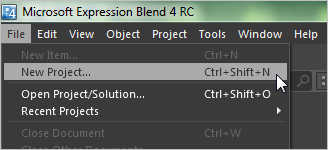{border="0"}

 

Figure 557: File menu in Expression Blend

 

3.   In the **Name** field, type the name of the project, and then click **OK**.

 

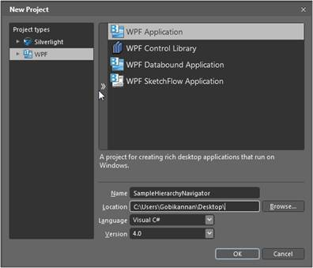{border="0"}

 

Figure 558: New Project dialog

**[]{style="COLOR: #4f81bd; FONT-SIZE: 9pt"}** 

4.   Add the following references with the sample project:

[·      ]{style="FONT-FAMILY: Symbol"}Syncfusion.Shared.WPF.dll

[·      ]{style="FONT-FAMILY: Symbol"}Syncfusion.Tools.WPF.dll

5.   On the Window menu, select **Assets**. This opens the Assets Library dialog box.

6.   In the search box, type **HierarchyNavigator**, and then press **ENTER**. This displays the search results.

[]{style="FONT-FAMILY: 'Trebuchet MS','sans-serif'; COLOR: #15428b; FONT-SIZE: 9pt"} 

[]{style="FONT-FAMILY: 'Trebuchet MS','sans-serif'; COLOR: #15428b; FONT-SIZE: 9pt"} 

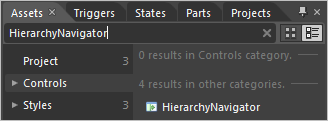{border="0"}

 

Figure 559: Assets library

**[]{style="COLOR: #4f81bd; FONT-SIZE: 9pt"}** 

7.   Drag the **HierarchyNavigator** control to Design View.

 

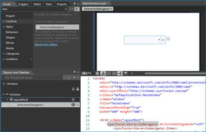{border="0"}

 

Figure 560: Expression Blend Design View

 

8.   Select the **HierarchyNavigator** control from the Objects and Timeline Pane and navigate to Miscellaneous, located in the Properties pane; click the button next to the Items collection. This will display the Object Collection Editor dialog box.

[]{style="FONT-FAMILY: 'Trebuchet MS','sans-serif'; COLOR: #15428b; FONT-SIZE: 9pt"} 

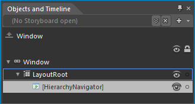{border="0"}

 

Figure 561: Objects and Timeline pane

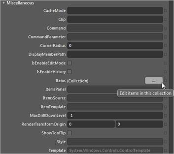{border="0"}

 

Figure 562: Properties window

 

The HierarchyNavigator Collection Editor contains the Items and the Properties pane. The Items pane contains a list of items that can be added to the HierarchyNavigator control.

 

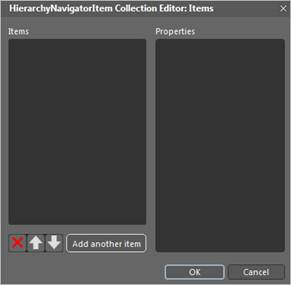{border="0"}

 

Figure 563: HierarchyNavigator Collection Editor

 

9.   Click the **Add another item** button, to add an item in the Items pane, and then in the Properties pane add content and items for the selected item.

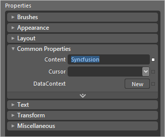{border="0"}

 

Figure 564: Properties pane

 

10.  To add items in a hierarchical data format, in the Properties pane, find the Items field and add items to the next level.

 

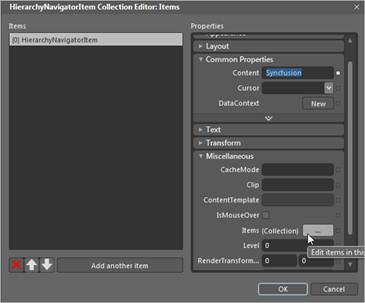{border="0"}

 

Figure 565: Items field to the left

 

The items will then be displayed in XAML, as shown in the following figure:

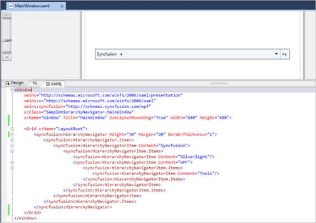{border="0"}

 

[Figure]{#_Ref262044397} 566: Items displayed in XAML

 

Editing a HierarchyNavigator Template in Expression Blend

You can edit a HierarchyNavigator control after it is added. The steps to edit a HierarchyNavigator control in Expression Blend are as follows:

1.   Select the **HierarchyNavigator** control.

2.   On the Object menu, select **Edit Style**, and then select **Edit a Copy**. This opens the Create Style Resource dialog box.

[]{style="FONT-FAMILY: 'Trebuchet MS','sans-serif'; COLOR: #15428b; FONT-SIZE: 9pt"} 

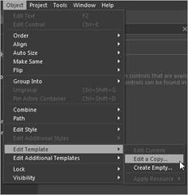{border="0"}

 

Figure 567: Edit Style in Object menu

**[]{style="COLOR: #4f81bd; FONT-SIZE: 9pt"}** 

**[]{style="COLOR: #4f81bd; FONT-SIZE: 9pt"}** 

3.   In the **Name** field, type the style name.

4.   In the **Define in** section, select **This document**, and then select the user control.

5.   Click the **OK** button, to create a default style for the HierarchyNavigator control so that each part can be customized. Refer [Customizing templates with Expression Blend](ms-xhelp:///?Id=4d97098f-cb60-41b2-aad6-8e6aa81a9da2).

 

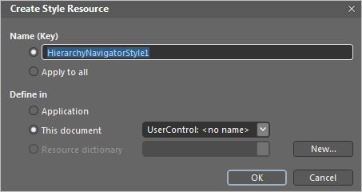{border="0"}

 

Figure 568: Create Style Resource dialog

 

[]{#related-topics}
:::
