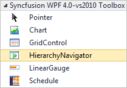
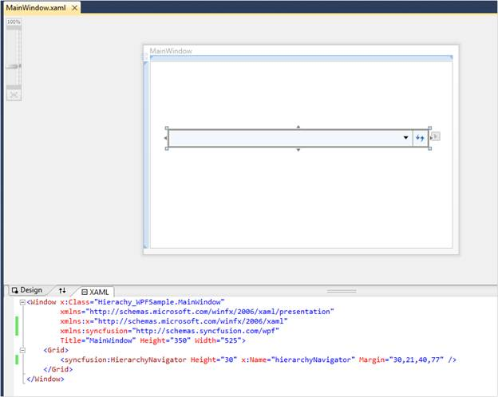

::: {style="DISPLAY: none"}
{#d2h_url_template}{#d2h_package_url style="WIDTH: 0px; DISPLAY: none; HEIGHT: 0px"}
:::

::: {.d2h_secondary_topic style="PADDING-BOTTOM: 10pt; MARGIN: 0pt; PADDING-LEFT: 0pt; PADDING-RIGHT: 0pt; PADDING-TOP: 0pt"}
##### Creating a HierarchyNavigator control by using Visual Studio {#creating-a-hierarchynavigator-control-by-using-visual-studio style="tab-stops: 0pt"}

 

The steps to create a HierarchyNavigator control in a WPF application by using Visual Studio are as follows:

1.   Create a new WPF application in Visual Studio.

2.   In the **Visual Studio** Toolbox, click the **Syncfusion WPF Toolbox** tab, and select **HierarchyNavigator**.

{border="0"}

 

Figure 555: HierarchyNavigator in Syncfusion WPF Toolbox

 

3.   Drag the **HierarchyNavigator** to Design View, to add the HierarchyNavigator control.

 

{border="0"}

 

Figure 556: Control added to Design View

**[]{style="COLOR: #4f81bd; FONT-SIZE: 9pt"}** 

4.   On the Properties window, customize the properties of the HierarchyNavigator control.

[]{#related-topics}
:::
