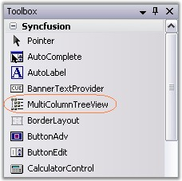
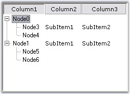

::: {style="DISPLAY: none"}
{#d2h_url_template}{#d2h_package_url style="WIDTH: 0px; DISPLAY: none; HEIGHT: 0px"}
:::

::::: {#nsbanner .d2h_main_nsbanner style="BORDER-BOTTOM: #999999 1px solid; POSITION: relative; PADDING-BOTTOM: 0px; BACKGROUND-COLOR: transparent; PADDING-LEFT: 0px; PADDING-RIGHT: 0px; DISPLAY: none; BORDER-TOP: #999999 1px solid; PADDING-TOP: 0px; LEFT: 0px"}
:::: {#TitleRow .d2h_main_titlerow style="PADDING-BOTTOM: 4px; BACKGROUND-COLOR: transparent; PADDING-LEFT: 22px; WIDTH: 100%; PADDING-RIGHT: 10px; DISPLAY: none; PADDING-TOP: 4px"}
::: {#ienav .d2h_main_ienav style="DISPLAY: none"}
{#D2HPrevious .D2HPreviousEnabled}  {#D2HNext .D2HNextEnabled}
:::
::::
:::::

:::: {#nstext .d2h_main_nstext style="PADDING-BOTTOM: 10px; BACKGROUND-COLOR: transparent; PADDING-LEFT: 22px; PADDING-RIGHT: 10px; HEIGHT: 100%; OVERFLOW: auto; PADDING-TOP: 5px" hasuserbackground="true" valign="bottom"}
::: {#d2h_breadcrumbs .d2h_breadcrumbs}
[Essential Studio User Guide Documentation](ms-xhelp:///?Id=12457748-09e3-4d74-a240-8e049cedf030){.d2h_breadcrumbsNormal}[ \> ]{.d2h_breadcrumbsLinkSeparator}[User Interface Edition](ms-xhelp:///?Id=c29296b7-531c-413b-a0ec-488ca1f7f669){.d2h_breadcrumbsNormal}[ \> ]{.d2h_breadcrumbsLinkSeparator}[Essential Windows](ms-xhelp:///?Id=e60759d8-47a4-4570-9d7a-16a68d63f2ea){.d2h_breadcrumbsNormal}[ \> ]{.d2h_breadcrumbsLinkSeparator}[Essential Tools]{.d2h_breadcrumbsContentsOnly}[ \> ]{.d2h_breadcrumbsLinkSeparator}[Tools Controls](ms-xhelp:///?Id=13c3c4f4-9d16-4b69-93f2-7e98eec67452){.d2h_breadcrumbsNormal}[ \> ]{.d2h_breadcrumbsLinkSeparator}[MultiColumnTreeView](ms-xhelp:///?Id=9b20100e-db9e-421a-b04d-43e6068eac33){.d2h_breadcrumbsNormal}
:::

### Creating a MultiColumnTreeView {#creating-a-multicolumntreeview style="MARGIN-LEFT: 18pt; tab-stops: 18.0pt"}

[]{style="COLOR: #15428b"} 

To create a MultiColumnTreeView control, follow the steps that are given below.

[]{style="COLOR: #15428b"} 

1.   Open your form in the designer. Add the Syncfusion controls to your VS .NET toolbox if you haven\'t done so already (the install would have automatically done this unless you selected not to complete toolbox integration during installation).

[]{style="COLOR: #15428b"} 

{border="0"}

[]{style="COLOR: #15428b"} 

Figure 1175: MultiColumnTreeView in the Toolbox

**[]{style="COLOR: #15428b"}** 

2.   Drag and drop the MultiColumnTreeView control on to the form.

[]{style="COLOR: #15428b"} 

3.   Open the [[[Nodes Collection Editor]{style="COLOR: windowtext"}]{.UGHyperlink}](../../../../../../../../Documents%20and%20Settings/sylviap/Desktop/Tools%20-%20Part%202.docx#_Editors_for_the), add required nodes using Add nodes and Add Child buttons.

 

4.   You can add columns using [[[Columns Editor]{style="COLOR: windowtext"}]{.UGHyperlink}](../../../../../../../../Documents%20and%20Settings/sylviap/Desktop/Tools%20-%20Part%202.docx#_Editors_for_the)[[ ]{style="COLOR: windowtext"}]{.UGHyperlink}by clicking add columns button.

 

5.   The Subitems can be added through [[[SubItems Collection Editor]{style="COLOR: windowtext"}]{.UGHyperlink}](../../../../../../../../Documents%20and%20Settings/sylviap/Desktop/Tools%20-%20Part%202.docx#_Editors_for_the) available in the Nodes Collection Editor. You can add any number of columns using this collection. Refer [[[Adding Multiple Columns and SubItems]{style="COLOR: windowtext"}]{.UGHyperlink}](../../../../../../../../Documents%20and%20Settings/sylviap/Desktop/Tools%20-%20Part%202.docx#_Adding_Multiple_Columns).

[]{style="COLOR: #15428b"} 

6.   Appearance and behavior related aspects can be controlled by setting the appropriate properties through the property grid of the MultiColumnTreeView control.

[]{style="COLOR: #15428b"} 

7.   A simple MultiColumnTreeView with three columns is displayed below.

[]{style="COLOR: #15428b"} 

{border="0"}

[]{style="COLOR: #15428b"} 

Figure 1176: SubItems Added to Node3 and Node1

**[]{style="COLOR: #15428b"}** 

8.   Namespace to be added while creating programmatically.

[]{style="COLOR: #15428b"} 

+----------------------------------------------------------------------------------------------------------------------------------------------------+
| **[\[C#\]]{style="FONT-FAMILY: 'Courier New'; COLOR: black"}**                                                                                     |
|                                                                                                                                                    |
| []{style="COLOR: #15428b"}                                                                                                                         |
|                                                                                                                                                    |
| [using]{style="FONT-FAMILY: 'Courier New'; COLOR: blue"}[ Syncfusion.Windows.Forms.Tools.MultiColumnTreeView;]{style="FONT-FAMILY: 'Courier New'"} |
+----------------------------------------------------------------------------------------------------------------------------------------------------+

[]{style="COLOR: #15428b"} 

+-------------------------------------------------------------------------------------------------------------------------------------------------------------------------------------------+
| **[\[VB.NET\]]{style="FONT-FAMILY: 'Courier New'; COLOR: black"}**                                                                                                                        |
|                                                                                                                                                                                           |
| []{style="COLOR: #15428b"}                                                                                                                                                                |
|                                                                                                                                                                                           |
| [Imports ]{style="FONT-FAMILY: 'Courier New'; COLOR: blue"}[Syncfusion.Windows.Forms.Tools.MultiColumnTreeView]{style="FONT-FAMILY: 'Courier New'"}[]{style="FONT-FAMILY: 'Courier New'"} |
+-------------------------------------------------------------------------------------------------------------------------------------------------------------------------------------------+

[]{style="COLOR: #15428b"} 

See Also

[]{style="COLOR: #15428b"} 

[[Adding Multiple Columns and SubItems]{.UGHyperlink}](../../../../../../../../Documents%20and%20Settings/sylviap/Desktop/Tools%20-%20Part%202.docx#_Adding_Multiple_Columns)[, ]{.UGHyperlink}[[Concepts and Features]{.UGHyperlink}](../../../../../../../../Documents%20and%20Settings/sylviap/Desktop/Tools%20-%20Part%202.docx#_Concepts_and_Features)[]{.UGHyperlink}

 

 

 

 

[]{#related-topics}
::::
