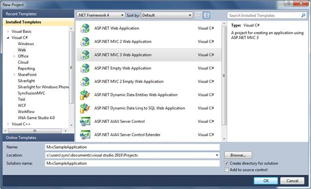
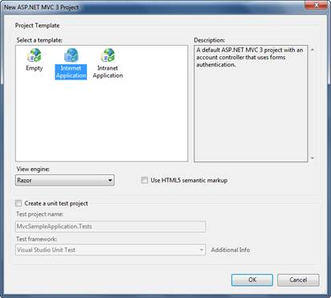
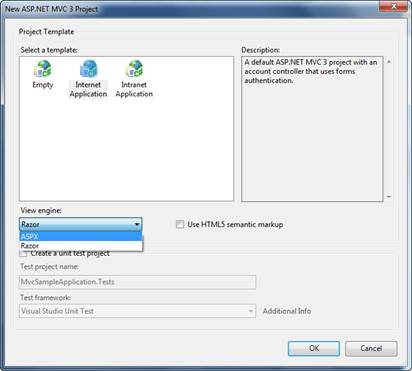

::: {style="DISPLAY: none"}
{#d2h_url_template}{#d2h_package_url style="WIDTH: 0px; DISPLAY: none; HEIGHT: 0px"}
:::

::::: {#nsbanner .d2h_main_nsbanner style="BORDER-BOTTOM: #999999 1px solid; POSITION: relative; PADDING-BOTTOM: 0px; BACKGROUND-COLOR: transparent; PADDING-LEFT: 0px; PADDING-RIGHT: 0px; DISPLAY: none; BORDER-TOP: #999999 1px solid; PADDING-TOP: 0px; LEFT: 0px"}
:::: {#TitleRow .d2h_main_titlerow style="PADDING-BOTTOM: 4px; BACKGROUND-COLOR: transparent; PADDING-LEFT: 22px; WIDTH: 100%; PADDING-RIGHT: 10px; DISPLAY: none; PADDING-TOP: 4px"}
::: {#ienav .d2h_main_ienav style="DISPLAY: none"}
{#D2HPrevious .D2HPreviousEnabled}  {#D2HNext .D2HNextEnabled}
:::
::::
:::::

:::: {#nstext .d2h_main_nstext style="PADDING-BOTTOM: 10px; BACKGROUND-COLOR: transparent; PADDING-LEFT: 22px; PADDING-RIGHT: 10px; HEIGHT: 100%; OVERFLOW: auto; PADDING-TOP: 5px" hasuserbackground="true" valign="bottom"}
::: {#d2h_breadcrumbs .d2h_breadcrumbs}
[Essential Studio User Guide Documentation](ms-xhelp:///?Id=12457748-09e3-4d74-a240-8e049cedf030){.d2h_breadcrumbsNormal}[ \> ]{.d2h_breadcrumbsLinkSeparator}[User Interface Edition](ms-xhelp:///?Id=c29296b7-531c-413b-a0ec-488ca1f7f669){.d2h_breadcrumbsNormal}[ \> ]{.d2h_breadcrumbsLinkSeparator}[Essential ASP.NET MVC](ms-xhelp:///?Id=4b14e7d1-65c4-4f67-b1aa-2c37709905a5){.d2h_breadcrumbsNormal}[ \> ]{.d2h_breadcrumbsLinkSeparator}[Essential Gauge]{.d2h_breadcrumbsContentsOnly}[ \> ]{.d2h_breadcrumbsLinkSeparator}[Getting Started](ms-xhelp:///?Id=0eb97268-6d10-4db1-8ac8-dab54249067e){.d2h_breadcrumbsNormal}[ \> ]{.d2h_breadcrumbsLinkSeparator}[Creating a Platform Application](ms-xhelp:///?Id=16776837-f0d9-4448-80ff-94a1a7c62c22){.d2h_breadcrumbsNormal}
:::

### Creating a new MVC project {#creating-a-new-mvc-project style="tab-stops: 0pt"}

 

1.   On the **File** menu, click **New Project**.

 

The **New Project** dialog box displays.

 

{border="0"}

Figure 30: New Project Dialog Box

 

2.   In the upper-right corner, make sure that .NET Framework 4.0 is selected.

3.   Under **Project** types, expand either **Visual Basic** or **Visual C#**, and then click **Web**.

4.   Under Visual Studio installed templates, select **ASP.NET MVC 3 Web Application**.

5.   In the **Name** box, enter **MvcSampleApplication**.

6.   In the **Location** box, enter a name for the project folder.

7.   If you want the name of the solution to differ from the project name, enter a name in the **Solution Name** box.

8.   Select the **Create** directory for solution.

9.   Click **OK**.

 

The new ASP.NET MVC3 Project dialog is displayed.

[]{style="FONT-FAMILY: 'Calibri','sans-serif'"} 

{border="0"}

Figure 31: Create Unit Test Project Dialog Box

**[]{style="FONT-FAMILY: 'Calibri','sans-serif'"}** 

10.  Select **ASPX** from **View Engine** dropdown.[]{style="FONT-FAMILY: 'Calibri','sans-serif'"}

[{border="0"}]{style="FONT-FAMILY: 'Calibri','sans-serif'"}

Figure 32: Selecting a view engine

**[]{style="FONT-FAMILY: 'Calibri','sans-serif'"}** 

11.  Click **OK**.

 

The new MVC application project and a test project are generated. (If you are using the Standard or Express editions of Visual Studio, the test project is not created)

 

[]{#related-topics}
::::
