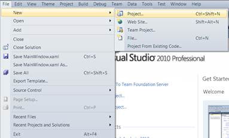
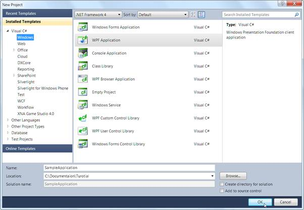
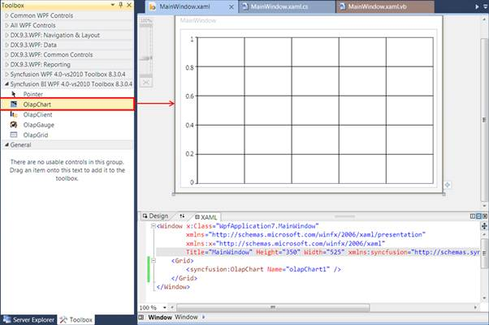

::: {style="DISPLAY: none"}
{#d2h_url_template}{#d2h_package_url style="WIDTH: 0px; DISPLAY: none; HEIGHT: 0px"}
:::

::::: {#nsbanner .d2h_main_nsbanner style="BORDER-BOTTOM: #999999 1px solid; POSITION: relative; PADDING-BOTTOM: 0px; BACKGROUND-COLOR: transparent; PADDING-LEFT: 0px; PADDING-RIGHT: 0px; DISPLAY: none; BORDER-TOP: #999999 1px solid; PADDING-TOP: 0px; LEFT: 0px"}
:::: {#TitleRow .d2h_main_titlerow style="PADDING-BOTTOM: 4px; BACKGROUND-COLOR: transparent; PADDING-LEFT: 22px; WIDTH: 100%; PADDING-RIGHT: 10px; DISPLAY: none; PADDING-TOP: 4px"}
::: {#ienav .d2h_main_ienav style="DISPLAY: none"}
{#D2HPrevious .D2HPreviousEnabled}  {#D2HNext .D2HNextEnabled}
:::
::::
:::::

:::: {#nstext .d2h_main_nstext style="PADDING-BOTTOM: 10px; BACKGROUND-COLOR: transparent; PADDING-LEFT: 22px; PADDING-RIGHT: 10px; HEIGHT: 100%; OVERFLOW: auto; PADDING-TOP: 5px" hasuserbackground="true" valign="bottom"}
::: {#d2h_breadcrumbs .d2h_breadcrumbs}
[Essential Studio User Guide Documentation](ms-xhelp:///?Id=12457748-09e3-4d74-a240-8e049cedf030){.d2h_breadcrumbsNormal}[ \> ]{.d2h_breadcrumbsLinkSeparator}[Business Intelligence Edition](ms-xhelp:///?Id=fdf33dd8-62b2-47b9-ad7b-fc50e590bca5){.d2h_breadcrumbsNormal}[ \> ]{.d2h_breadcrumbsLinkSeparator}[Essential BI WPF](ms-xhelp:///?Id=41e3d586-d922-4a01-8272-679fe4ae7343){.d2h_breadcrumbsNormal}[ \> ]{.d2h_breadcrumbsLinkSeparator}[Essential BI Chart]{.d2h_breadcrumbsContentsOnly}[ \> ]{.d2h_breadcrumbsLinkSeparator}[Essential OLAP Chart for WPF](ms-xhelp:///?Id=4d89e52f-a14a-4da7-a710-b908bfbede08){.d2h_breadcrumbsNormal}[ \> ]{.d2h_breadcrumbsLinkSeparator}[Getting Started](ms-xhelp:///?Id=0e27a1d4-bb4f-4a17-82f3-57cc29db3716){.d2h_breadcrumbsNormal}
:::

### Creating an Sample Application with OLAP {#creating-an-sample-application-with-olap style="tab-stops: 0pt"}

The steps to create a new WPF application in Visual Studio 2008 are as follows:

1.   Open **Visual Studio IDE** (either 2008 or 2010. In this sample, we have used visual studio 2010). From the **File** menu, select **New Project**.

 

{border="0"}

Figure 7: File -\> New -\> Project

 

2.   In the **New Project** Dialog box, click the **Windows** tab and select **WPF Application**.

[3.   ]{style="COLOR: black"}Then, type a name for the application and click **OK**. In this example, the name of the application is typed as **SampleApplication***[.]{style="FONT-FAMILY: 'Calibri','sans-serif'; COLOR: black; FONT-SIZE: 11pt"}*[]{style="FONT-FAMILY: 'Calibri','sans-serif'; COLOR: black; FONT-SIZE: 11pt"}

{border="0"}

Figure 8: New Project Dialog -- WPF Application

 

4.   A new WPF application is created. Now, add the OlapChart control to this application.

 

The steps to add the OlapChart to the application are as follows:

1.   From the **Visual Studio** Toolbox, drag and drop the **OlapChart** under the Syncfusion **BI WPF** band. It will automatically add the required referenced assemblies.

{border="0"}

 

Figure 9: OlapChart added from the Toolbox[]{style="FONT-FAMILY: 'Calibri','sans-serif'; FONT-SIZE: 11pt"}

[]{style="FONT-FAMILY: 'Calibri','sans-serif'; FONT-SIZE: 11pt"} 

2.   Alternatively, you can add the OlapChart to an application by using any of the following code snippets:

[]{style="FONT-FAMILY: 'Calibri','sans-serif'; FONT-SIZE: 11pt"} 

+-----------------------------------------------------------------------------------------------------------------------------------------------------------------------------------------------+
| **\[XAML\]**                                                                                                                                                                                  |
|                                                                                                                                                                                               |
|                                                                                                                                                                                               |
|                                                                                                                                                                                               |
| [\<]{style="COLOR: blue"}[syncfusion]{style="COLOR: #a31515"}[:]{style="COLOR: blue"}[OlapChart]{style="COLOR: #a31515"}[ Name]{style="COLOR: red"}[=\"olapChart1\" /\>]{style="COLOR: blue"} |
+-----------------------------------------------------------------------------------------------------------------------------------------------------------------------------------------------+

[]{style="FONT-FAMILY: 'Calibri','sans-serif'; FONT-SIZE: 11pt"} 

+-------------------------------------------------------------------------------------------------------------------+
| **\[C#\]**                                                                                                        |
|                                                                                                                   |
|                                                                                                                   |
|                                                                                                                   |
| [OlapChart]{style="COLOR: #2b91af"} olapChart = [new]{style="COLOR: blue"} [OlapChart]{style="COLOR: #2b91af"}(); |
+-------------------------------------------------------------------------------------------------------------------+

[]{style="FONT-FAMILY: 'Calibri','sans-serif'; FONT-SIZE: 11pt"} 

+-----------------------------------------------------------------------------------------------------------------------------------------------------------------------+
| **\[VB\]**                                                                                                                                                            |
|                                                                                                                                                                       |
|                                                                                                                                                                       |
|                                                                                                                                                                       |
| [Dim]{style="COLOR: blue"} olapChart [As]{style="COLOR: blue"} [OlapChart]{style="COLOR: #2b91af"} = [New]{style="COLOR: blue"} [OlapChart]{style="COLOR: #2b91af"}() |
+-----------------------------------------------------------------------------------------------------------------------------------------------------------------------+

[]{style="FONT-FAMILY: 'Calibri','sans-serif'; COLOR: black; FONT-SIZE: 11pt"} 

3.   Then, ensure that the following assemblies are included in the project reference:

[·      ]{style="FONT-FAMILY: Symbol"}Syncfusion.Chart.WPF

[·      ]{style="FONT-FAMILY: Symbol"}Syncfusion.Core

[·      ]{style="FONT-FAMILY: Symbol"}Syncfusion.Olap.Base

[·      ]{style="FONT-FAMILY: Symbol"}Syncfusion.OlapChart.WPF

[·      ]{style="FONT-FAMILY: Symbol"}Syncfusion.OlapShared.WPF

[·      ]{style="FONT-FAMILY: Symbol"}Syncfusion.Shared.WPF

 

4.   Include the following namespaces:

[·      ]{style="FONT-FAMILY: Symbol"}Syncfusion.Olap.Reports

[·      ]{style="FONT-FAMILY: Symbol"}Syncfusion.Olap.Manager

 

5.   Declare a member variable for OlapDataManager, as shown below.

 

+-------------------------------------------------------------------------------------------+
| **\[C#\]**                                                                                |
|                                                                                           |
|                                                                                           |
|                                                                                           |
| [private]{style="COLOR: blue"}[ OlapDataManager]{style="COLOR: #2b91af"} olapDataManager; |
+-------------------------------------------------------------------------------------------+

[]{style="FONT-FAMILY: 'Calibri','sans-serif'; FONT-SIZE: 11pt"} 

+--------------------------------------------------------------------------------------------------------------------------+
| **            \[VB\]**                                                                                                   |
|                                                                                                                          |
|                                                                                                                          |
|                                                                                                                          |
| [      Private]{style="COLOR: blue"} olapDataManager [As]{style="COLOR: blue"} [OlapDataManager]{style="COLOR: #2b91af"} |
+--------------------------------------------------------------------------------------------------------------------------+

[]{style="FONT-FAMILY: 'Calibri','sans-serif'; COLOR: black; FONT-SIZE: 11pt"} 

6.   In the window's default constructor include the following codes, to initialize the connection:

 

+------------------------------------------------------------------------------------------------------------------------------------------------------------------------------------------------------------------+
| **\[C#\]**                                                                                                                                                                                                       |
|                                                                                                                                                                                                                  |
|                                                                                                                                                                                                                  |
|                                                                                                                                                                                                                  |
| [string]{style="COLOR: blue"}[ connectionString = ]{style="COLOR: black"}                                                                                                                                        |
|                                                                                                                                                                                                                  |
| [@\"Data source=.;Initial Catalog=Adventure Works DW\"]{style="COLOR: #a31515"}[;]{style="COLOR: black"}                                                                                                         |
|                                                                                                                                                                                                                  |
| [               ]{style="COLOR: black"}                                                                                                                                                                          |
|                                                                                                                                                                                                                  |
| [// Created connection is assigned to data manager]{style="COLOR: green"}[                ]{style="COLOR: black"}                                                                                                |
|                                                                                                                                                                                                                  |
| [if]{style="COLOR: blue"}[ (connectionString != ]{style="COLOR: black"}[\"\"]{style="COLOR: #a31515"}[)                    ]{style="COLOR: black"}                                                               |
|                                                                                                                                                                                                                  |
| [   this.]{style="COLOR: blue"}[olapDataManager = ]{style="COLOR: black"}[new]{style="COLOR: blue"}[ ]{style="COLOR: black"}[OlapDataManager]{style="COLOR: #2b91af"}[(connectionString);]{style="COLOR: black"} |
+------------------------------------------------------------------------------------------------------------------------------------------------------------------------------------------------------------------+

[]{style="FONT-FAMILY: 'Calibri','sans-serif'; FONT-SIZE: 11pt"} 

+---------------------------------------------------------------------------------------------------------------------------------------------+
| **            \[VB\]**                                                                                                                      |
|                                                                                                                                             |
|                                                                                                                                             |
|                                                                                                                                             |
| [      Dim]{style="COLOR: blue"} connectionString [As]{style="COLOR: blue"} [String]{style="COLOR: blue"} =                                 |
|                                                                                                                                             |
|       [\"Data source=.;Initial Catalog=Adventure Works DW\"]{style="COLOR: #a31515"}                                                        |
|                                                                                                                                             |
|                                                                                                                                             |
|                                                                                                                                             |
| [      \' Created connection is assigned to data manager                ]{style="COLOR: green"}                                             |
|                                                                                                                                             |
| [      If]{style="COLOR: blue"} connectionString \<\> \"\" [Then]{style="COLOR: blue"}                                                      |
|                                                                                                                                             |
|          [Me]{style="COLOR: blue"}.olapDataManager = [New]{style="COLOR: blue"} [OlapDataManager]{style="COLOR: #2b91af"}(connectionString) |
|                                                                                                                                             |
| [      End]{style="COLOR: blue"} [If]{style="COLOR: blue"}                                                                                  |
+---------------------------------------------------------------------------------------------------------------------------------------------+

[]{style="FONT-FAMILY: 'Calibri','sans-serif'; COLOR: black; FONT-SIZE: 11pt"} 

7.   Include the following method, which contains a simple report created from the Adventure works cube:

 

+-------------------------------------------------------------------------------------------------------------------------------------------------------------------------------------+
| **\[C#\]**                                                                                                                                                                          |
|                                                                                                                                                                                     |
|                                                                                                                                                                                     |
|                                                                                                                                                                                     |
| [        private]{style="COLOR: blue"} [OlapReport]{style="COLOR: #2b91af"} SimpleDimensions()\                                                                                     |
|         {\                                                                                                                                                                          |
|             [OlapReport]{style="COLOR: #2b91af"} olapReport = [new]{style="COLOR: blue"} [OlapReport]{style="COLOR: #2b91af"}();\                                                   |
|             olapReport.CurrentCubeName = [\"Adventure Works\"]{style="COLOR: #a31515"};\                                                                                            |
|             [DimensionElement]{style="COLOR: #2b91af"} dimensionElementColumn = [new]{style="COLOR: blue"} [DimensionElement]{style="COLOR: #2b91af"}();\                           |
|  \                                                                                                                                                                                  |
|             [//Specifying the Column Name for the Dimension and measure elements]{style="COLOR: green"}\                                                                            |
|             dimensionElementColumn.Name = [\"Customer\"]{style="COLOR: #a31515"};\                                                                                                  |
|             dimensionElementColumn.AddLevel([\"Customer Geography\"]{style="COLOR: #a31515"}, [\"Country\"]{style="COLOR: #a31515"});\                                              |
|             [MeasureElements]{style="COLOR: #2b91af"} measureElementColumn = [new]{style="COLOR: blue"} [MeasureElements]{style="COLOR: #2b91af"}();\                               |
|             measureElementColumn.Elements.Add([new]{style="COLOR: blue"} [MeasureElement]{style="COLOR: #2b91af"} { Name = [\"Internet Sales Amount\"]{style="COLOR: #a31515"} });\ |
|  \                                                                                                                                                                                  |
|             [//Specifying the Row Name for the Dimension element]{style="COLOR: green"}\                                                                                            |
|             [DimensionElement]{style="COLOR: #2b91af"} dimensionElementRow = [new]{style="COLOR: blue"} [DimensionElement]{style="COLOR: #2b91af"}();\                              |
|             dimensionElementRow.Name = [\"Date\"]{style="COLOR: #a31515"};\                                                                                                         |
|             dimensionElementRow.AddLevel([\"Fiscal\"]{style="COLOR: #a31515"}, [\"Fiscal Year\"]{style="COLOR: #a31515"});\                                                         |
|  \                                                                                                                                                                                  |
|             [///]{style="COLOR: gray"}[ Adding Column Members]{style="COLOR: green"}\                                                                                               |
|             olapReport.CategoricalElements.Add(dimensionElementColumn);\                                                                                                            |
|             [///]{style="COLOR: gray"}[Adding Measure Element]{style="COLOR: green"}\                                                                                               |
|             olapReport.CategoricalElements.Add(measureElementColumn);\                                                                                                              |
|             [///]{style="COLOR: gray"}[Adding Row Members]{style="COLOR: green"}\                                                                                                   |
|             olapReport.SeriesElements.Add(dimensionElementRow);\                                                                                                                    |
|             [return]{style="COLOR: blue"} olapReport;\                                                                                                                              |
|         }                                                                                                                                                                           |
|                                                                                                                                                                                     |
|                                                                                                                                                                                     |
+-------------------------------------------------------------------------------------------------------------------------------------------------------------------------------------+

[]{style="FONT-FAMILY: 'Calibri','sans-serif'; FONT-SIZE: 11pt"} 

+----------------------------------------------------------------------------------------------------------------------------------------------------------------------------------------------------------------------------------------+
| **            \[VB\]**                                                                                                                                                                                                                 |
|                                                                                                                                                                                                                                        |
|                                                                                                                                                                                                                                        |
|                                                                                                                                                                                                                                        |
| [      ]{style="COLOR: blue"}[Private]{style="COLOR: blue"} [Function]{style="COLOR: blue"} SimpleDimensions() [As]{style="COLOR: blue"} [OlapReport]{style="COLOR: #2b91af"}\                                                         |
|                                      [Dim]{style="COLOR: blue"} olapReport [As]{style="COLOR: blue"} [OlapReport]{style="COLOR: #2b91af"} = [New]{style="COLOR: blue"} [OlapReport]{style="COLOR: #2b91af"}()\                         |
|                                      olapReport.CurrentCubeName = [\"Adventure Works\"]{style="COLOR: #a31515"}\                                                                                                                       |
|  \                                                                                                                                                                                                                                     |
|                                      [Dim]{style="COLOR: blue"} dimensionElementColumn [As]{style="COLOR: blue"} [DimensionElement]{style="COLOR: #2b91af"} = [New]{style="COLOR: blue"} [DimensionElement]{style="COLOR: #2b91af"}()\ |
|                                      [\'Specifying the Name for the Dimension Element]{style="COLOR: green"}\                                                                                                                          |
|                                      dimensionElementColumn.Name = [\"Customer\"]{style="COLOR: #a31515"}\                                                                                                                             |
|             dimensionElementColumn.AddLevel([\"Customer Geography\"]{style="COLOR: #a31515"}, [\"Country\"]{style="COLOR: #a31515"})\                                                                                                  |
|  \                                                                                                                                                                                                                                     |
|                                      [Dim]{style="COLOR: blue"} measureElementColumn [As]{style="COLOR: blue"} [MeasureElements]{style="COLOR: #2b91af"} = [New]{style="COLOR: blue"} [MeasureElements]{style="COLOR: #2b91af"}()\     |
|             measureElementColumn.Elements.Add([New]{style="COLOR: blue"} [MeasureElement]{style="COLOR: #2b91af"} [With]{style="COLOR: blue"} {.Name = [\"Internet Sales Amount\"]{style="COLOR: #a31515"}})\                          |
|  \                                                                                                                                                                                                                                     |
|                                      [Dim]{style="COLOR: blue"} dimensionElementRow [As]{style="COLOR: blue"} [DimensionElement]{style="COLOR: #2b91af"} = [New]{style="COLOR: blue"} [DimensionElement]{style="COLOR: #2b91af"}()\    |
|                                      [\'Specifying the Dimension Name]{style="COLOR: green"}\                                                                                                                                          |
|                                      dimensionElementRow.Name = [\"Date\"]{style="COLOR: #a31515"}\                                                                                                                                    |
|             dimensionElementRow.AddLevel([\"Fiscal\"]{style="COLOR: #a31515"}, [\"Fiscal Year\"]{style="COLOR: #a31515"})\                                                                                                             |
|  \                                                                                                                                                                                                                                     |
|             [\'\'\'Adding Column Members]{style="COLOR: green"}\                                                                                                                                                                       |
|             olapReport.CategoricalElements.Add(dimensionElementColumn)\                                                                                                                                                                |
|                                      [\'\'\'Adding Measure Element]{style="COLOR: green"}\                                                                                                                                             |
|             olapReport.CategoricalElements.Add(measureElementColumn)\                                                                                                                                                                  |
|                                      [\'\'\'Adding Row Members]{style="COLOR: green"}\                                                                                                                                                 |
|             olapReport.SeriesElements.Add(dimensionElementRow)\                                                                                                                                                                        |
|                                      [Return]{style="COLOR: blue"} olapReport\                                                                                                                                                         |
|                         [End]{style="COLOR: blue"} [Function]{style="COLOR: blue"}                                                                                                                                                     |
+----------------------------------------------------------------------------------------------------------------------------------------------------------------------------------------------------------------------------------------+

[]{style="FONT-FAMILY: 'Calibri','sans-serif'; COLOR: black; FONT-SIZE: 11pt"} 

[]{style="FONT-FAMILY: 'Calibri','sans-serif'; COLOR: black; FONT-SIZE: 11pt"} 

8.   In the window's loaded event include the following code snippet, to bind the report with the control:

 

+-------------------------------------------------------------------------------------------------------------------------+
| **\[C#\]**                                                                                                              |
|                                                                                                                         |
|                                                                                                                         |
|                                                                                                                         |
|                 [if]{style="COLOR: blue"} ([this]{style="COLOR: blue"}.olapDataManager != [null]{style="COLOR: blue"})\ |
|                 {\                                                                                                      |
|                     [// Reports are set to data manager]{style="COLOR: green"}\                                         |
|                     [this]{style="COLOR: blue"}.olapDataManager.SetCurrentReport(SimpleDimensions());                   |
|                                                                                                                         |
| \                                                                                                                       |
|                     [// The chart gets the data from data manager now]{style="COLOR: green"}\                           |
|                     [this]{style="COLOR: blue"}.olapchart1.OlapDataManager = olapDataManager;                           |
|                                                                                                                         |
| \                                                                                                                       |
|                     [// Data Binding is done]{style="COLOR: green"}\                                                    |
|                     [this]{style="COLOR: blue"}.olapchart1.DataBind();\                                                 |
|                 }                                                                                                       |
|                                                                                                                         |
|                                                                                                                         |
+-------------------------------------------------------------------------------------------------------------------------+

[]{style="FONT-FAMILY: 'Calibri','sans-serif'; FONT-SIZE: 11pt"} 

+----------------------------------------------------------------------------------------------------------------------------------------------------+
| **\[VB\]**                                                                                                                                         |
|                                                                                                                                                    |
|                                                                                                                                                    |
|                                                                                                                                                    |
|                 [If]{style="COLOR: blue"} olapDataManager [IsNot]{style="COLOR: blue"} [Nothing]{style="COLOR: blue"} [Then]{style="COLOR: blue"}\ |
|                     olapDataManager.SetCurrentReport(SimpleDimensions())\                                                                          |
|                     [Me]{style="COLOR: blue"}.olapchart1.OlapDataManager = olapDataManager\                                                        |
|                     [Me]{style="COLOR: blue"}.olapchart1.DataBind()\                                                                               |
|                 [End]{style="COLOR: blue"} [If]{style="COLOR: blue"}                                                                               |
|                                                                                                                                                    |
|                                                                                                                                                    |
+----------------------------------------------------------------------------------------------------------------------------------------------------+

[]{style="FONT-FAMILY: 'Calibri','sans-serif'; COLOR: black; FONT-SIZE: 11pt"} 

9.   Run the application.

[]{#related-topics}
::::
