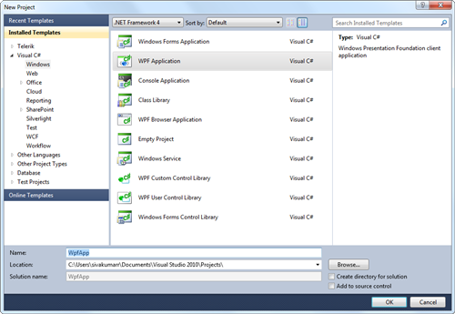
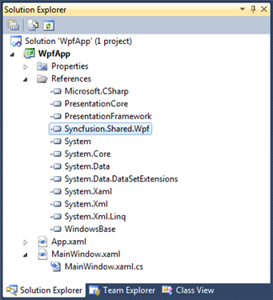

::: {style="DISPLAY: none"}
{#d2h_url_template}{#d2h_package_url style="WIDTH: 0px; DISPLAY: none; HEIGHT: 0px"}
:::

:::: {.d2h_secondary_topic style="PADDING-BOTTOM: 10pt; MARGIN: 0pt; PADDING-LEFT: 0pt; PADDING-RIGHT: 0pt; PADDING-TOP: 0pt"}
##### Creating a PercentTextBox by using C# {#creating-a-percenttextbox-by-using-c style="tab-stops: 0pt"}

 

The steps to create a PercentTextBox by using Visual Studio in C# are as follows[:]{style="FONT-FAMILY: 'Trebuchet MS','sans-serif'; COLOR: #15428b; FONT-SIZE: 9pt"}

1.            Open Visual Studio.

2.   On the File menu, select **New -\> Project**. This opens the New Project Dialog box.

 

 

{border="0"}

Figure 763: Open New Project

 

3.   On the Project Dialog window, select **WPF Application**, in the name field, type the name of the project, and then click **OK**.

[]{style="FONT-FAMILY: 'Trebuchet MS','sans-serif'; COLOR: #15428b; FONT-SIZE: 9pt"} 

{border="0"}

Figure 764: New Project Dialog

 

4.   Add the following reference with the sample project:

[·      ]{style="FONT-FAMILY: Symbol; COLOR: #15428b; FONT-SIZE: 9pt"}**Syncfusion.Shared.WPF.dll**[]{style="FONT-FAMILY: 'Trebuchet MS','sans-serif'; COLOR: #15428b; FONT-SIZE: 9pt"}

[]{style="FONT-FAMILY: 'Trebuchet MS','sans-serif'; COLOR: #15428b; FONT-SIZE: 9pt"} 

{border="0"}

Figure 765: Solution Explorer

[]{style="FONT-FAMILY: 'Trebuchet MS','sans-serif'; COLOR: #15428b"} 

[·      ]{style="FONT-FAMILY: Symbol"}Click the **C#** file, to open the C# file and add the **PercentTextBox** to the application.

 

+-------------------------------------------------------------------------------------------------------------------------------------------------------------------------------------------------------------------------------------------------------------------+
| **[C#]{style="COLOR: black"}**[]{style="COLOR: black"}                                                                                                                                                                                                            |
|                                                                                                                                                                                                                                                                   |
|                                                                                                                                                                                                                                                                   |
|                                                                                                                                                                                                                                                                   |
| **[public]{style="FONT-FAMILY: Consolas; COLOR: blue; FONT-SIZE: 9.5pt"}[ [partial]{style="COLOR: blue"} [class]{style="COLOR: blue"} [MainWindow]{style="COLOR: #2b91af"} : [Window]{style="COLOR: #2b91af"}]{style="FONT-FAMILY: Consolas; FONT-SIZE: 9.5pt"}** |
|                                                                                                                                                                                                                                                                   |
| **[    {]{style="FONT-FAMILY: Consolas; FONT-SIZE: 9.5pt"}**                                                                                                                                                                                                      |
|                                                                                                                                                                                                                                                                   |
| **[        [public]{style="COLOR: blue"} MainWindow()]{style="FONT-FAMILY: Consolas; FONT-SIZE: 9.5pt"}**                                                                                                                                                         |
|                                                                                                                                                                                                                                                                   |
| **[        {]{style="FONT-FAMILY: Consolas; FONT-SIZE: 9.5pt"}**                                                                                                                                                                                                  |
|                                                                                                                                                                                                                                                                   |
| **[            InitializeComponent();]{style="FONT-FAMILY: Consolas; FONT-SIZE: 9.5pt"}**                                                                                                                                                                         |
|                                                                                                                                                                                                                                                                   |
| **[            Syncfusion.Windows.Shared.[PercentTextBox]{style="COLOR: #2b91af"} percentTextBox = [new]{style="COLOR: blue"} Syncfusion.Windows.Shared.[PercentTextBox]{style="COLOR: #2b91af"}();]{style="FONT-FAMILY: Consolas; FONT-SIZE: 9.5pt"}**           |
|                                                                                                                                                                                                                                                                   |
| **[            percentTextBox.Width = 150;]{style="FONT-FAMILY: Consolas; FONT-SIZE: 9.5pt"}**                                                                                                                                                                    |
|                                                                                                                                                                                                                                                                   |
| **[            percentTextBox.Height = 25;]{style="FONT-FAMILY: Consolas; FONT-SIZE: 9.5pt"}**                                                                                                                                                                    |
|                                                                                                                                                                                                                                                                   |
| **[            [this]{style="COLOR: blue"}.LayoutRoot.Children.Add(percentTextBox);]{style="FONT-FAMILY: Consolas; FONT-SIZE: 9.5pt"}**                                                                                                                           |
|                                                                                                                                                                                                                                                                   |
| **[        }]{style="FONT-FAMILY: Consolas; FONT-SIZE: 9.5pt"}**                                                                                                                                                                                                  |
|                                                                                                                                                                                                                                                                   |
| **[     }]{style="FONT-FAMILY: Consolas; FONT-SIZE: 9.5pt"}**                                                                                                                                                                                                     |
+-------------------------------------------------------------------------------------------------------------------------------------------------------------------------------------------------------------------------------------------------------------------+

 

{border="0"}

Figure 766: Percent TextBox

::: {style="BORDER-BOTTOM: windowtext 1pt solid; BORDER-LEFT: medium none; PADDING-BOTTOM: 1pt; MARGIN: 9pt 0pt 9pt 18pt; PADDING-LEFT: 0pt; PADDING-RIGHT: 0pt; BORDER-TOP: windowtext 1pt solid; BORDER-RIGHT: medium none; PADDING-TOP: 1pt"}
Note:

If you do not set any PercentValue to the PercentTextBox then the default value will be as follows:

If the UseNullOption is set to true then,

Value of the NullValue property will be the default value.

Otherwise

 Zero will be the default value (based on the MinValue and MaxValue the default value will change).

 
:::

See Also

[[Creating a PercentTextBox by using XAML]{.UGHyperlink}](ms-xhelp:///?Id=1a482aa9-ea60-4be4-941e-64ef754bd4f2)[]{.UGHyperlink}

[[Creating a PercentTextBox by using Expression Blend]{.UGHyperlink}](ms-xhelp:///?Id=014a8c51-676e-4236-8433-da32c839e593)[]{.UGHyperlink}

 

[]{#related-topics}
::::
