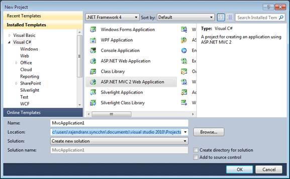
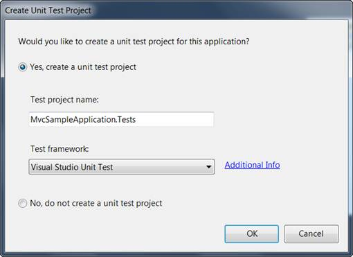
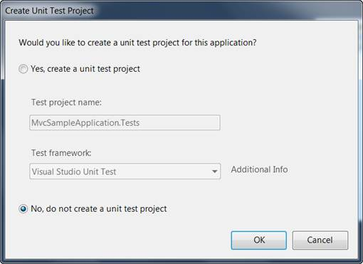

::: {style="DISPLAY: none"}
{#d2h_url_template}{#d2h_package_url style="WIDTH: 0px; DISPLAY: none; HEIGHT: 0px"}
:::

::::: {#nsbanner .d2h_main_nsbanner style="BORDER-BOTTOM: #999999 1px solid; POSITION: relative; PADDING-BOTTOM: 0px; BACKGROUND-COLOR: transparent; PADDING-LEFT: 0px; PADDING-RIGHT: 0px; DISPLAY: none; BORDER-TOP: #999999 1px solid; PADDING-TOP: 0px; LEFT: 0px"}
:::: {#TitleRow .d2h_main_titlerow style="PADDING-BOTTOM: 4px; BACKGROUND-COLOR: transparent; PADDING-LEFT: 22px; WIDTH: 100%; PADDING-RIGHT: 10px; DISPLAY: none; PADDING-TOP: 4px"}
::: {#ienav .d2h_main_ienav style="DISPLAY: none"}
{#D2HPrevious .D2HPreviousEnabled}  {#D2HNext .D2HNextEnabled}
:::
::::
:::::

::::: {#nstext .d2h_main_nstext style="PADDING-BOTTOM: 10px; BACKGROUND-COLOR: transparent; PADDING-LEFT: 22px; PADDING-RIGHT: 10px; HEIGHT: 100%; OVERFLOW: auto; PADDING-TOP: 5px" hasuserbackground="true" valign="bottom"}
::: {#d2h_breadcrumbs .d2h_breadcrumbs}
[Essential Studio User Guide Documentation](ms-xhelp:///?Id=12457748-09e3-4d74-a240-8e049cedf030){.d2h_breadcrumbsNormal}[ \> ]{.d2h_breadcrumbsLinkSeparator}[User Interface Edition](ms-xhelp:///?Id=c29296b7-531c-413b-a0ec-488ca1f7f669){.d2h_breadcrumbsNormal}[ \> ]{.d2h_breadcrumbsLinkSeparator}[Essential ASP.NET MVC](ms-xhelp:///?Id=4b14e7d1-65c4-4f67-b1aa-2c37709905a5){.d2h_breadcrumbsNormal}[ \> ]{.d2h_breadcrumbsLinkSeparator}[Essential Diagram]{.d2h_breadcrumbsContentsOnly}[ \> ]{.d2h_breadcrumbsLinkSeparator}[Getting Started](ms-xhelp:///?Id=06ba3073-04aa-4a41-a98d-d08c4c1b04fc){.d2h_breadcrumbsNormal}
:::

## Creating a Platform Application {#creating-a-platform-application style="tab-stops: 0pt"}

To begin, you will create a new ASP.NET MVC project.

To create a new MVC project:

1.   On the **File** menu, click **New Project**. The **New Project** dialog box is displayed.

[]{style="FONT-FAMILY: 'Calibri','sans-serif'"} 

{border="0"}

Figure 6: New Project Dialog Box

[]{style="FONT-FAMILY: 'Calibri','sans-serif'"} 

2.   On the upper-right corner, make sure that **.NET Framework 4.0** is selected.

3.   Under **Project types**, expand either **Visual Basic** or **Visual C#**, and then click **Web**.

4.   Under Installed Templates, select **ASP.NET MVC 2 Web Application**.

5.   In the **Name** box, enter **MvcSampleApplication**.

6.   In the **Location** box, enter a name for the project folder.

\
If you want the name of the solution to differ from the project name, enter a name in the **Solution Name** box.

1.   Select **Create directory for solution**.

2.   Click **OK**.

[]{style="FONT-FAMILY: 'Calibri','sans-serif'"} 

The **Create Unit Test Project** dialog box is displayed.

[]{style="FONT-FAMILY: 'Calibri','sans-serif'"} 

{border="0"}

Figure 7: Create Unit Test Project Dialog Box

[]{style="FONT-FAMILY: 'Calibri','sans-serif'"} 

[]{style="FONT-FAMILY: 'Calibri','sans-serif'"} 

3.   Select **No**. Do not create a unit test project.

4.   Click **OK**.

[]{style="FONT-FAMILY: 'Calibri','sans-serif'; FONT-SIZE: 11pt"} 

By default, the name of the test project is the application project name with **Tests** added. However, you can change the name of the test project. By default, the test project will use the Visual Studio Unit Test framework.

[]{style="FONT-FAMILY: 'Calibri','sans-serif'; FONT-SIZE: 11pt"} 

::: {style="BORDER-BOTTOM: windowtext 1pt solid; BORDER-LEFT: medium none; PADDING-BOTTOM: 1pt; MARGIN-TOP: 9pt; PADDING-LEFT: 0pt; PADDING-RIGHT: 0pt; MARGIN-BOTTOM: 9pt; BORDER-TOP: windowtext 1pt solid; BORDER-RIGHT: medium none; PADDING-TOP: 1pt"}
{border="0"}Note: The other option becomes unavailable for selection, as shown in the following image.
:::

[]{style="FONT-FAMILY: 'Calibri','sans-serif'"} 

{border="0"}

Figure 8: Selecting an Option

[]{style="FONT-FAMILY: 'Calibri','sans-serif'"} 

5.   Click **OK**.

[]{style="FONT-FAMILY: 'Calibri','sans-serif'"} 

The new MVC application project and a test project are generated. (If you are using the Standard or Express editions of Visual Studio, the test project is not created.)

[]{style="FONT-FAMILY: 'Calibri','sans-serif'"} 

[]{#related-topics}
:::::
