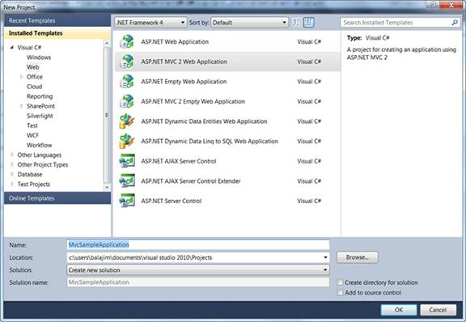
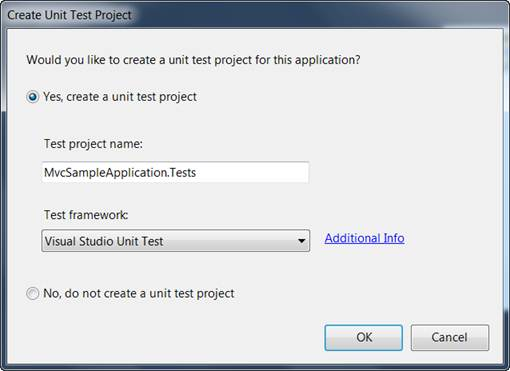
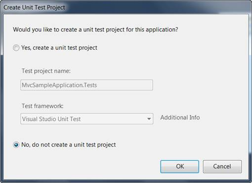

::: {style="DISPLAY: none"}
{#d2h_url_template}{#d2h_package_url style="WIDTH: 0px; DISPLAY: none; HEIGHT: 0px"}
:::

::::: {#nsbanner .d2h_main_nsbanner style="BORDER-BOTTOM: #999999 1px solid; POSITION: relative; PADDING-BOTTOM: 0px; BACKGROUND-COLOR: transparent; PADDING-LEFT: 0px; PADDING-RIGHT: 0px; DISPLAY: none; BORDER-TOP: #999999 1px solid; PADDING-TOP: 0px; LEFT: 0px"}
:::: {#TitleRow .d2h_main_titlerow style="PADDING-BOTTOM: 4px; BACKGROUND-COLOR: transparent; PADDING-LEFT: 22px; WIDTH: 100%; PADDING-RIGHT: 10px; DISPLAY: none; PADDING-TOP: 4px"}
::: {#ienav .d2h_main_ienav style="DISPLAY: none"}
{#D2HPrevious .D2HPreviousEnabled}  {#D2HNext .D2HNextEnabled}
:::
::::
:::::

::::: {#nstext .d2h_main_nstext style="PADDING-BOTTOM: 10px; BACKGROUND-COLOR: transparent; PADDING-LEFT: 22px; PADDING-RIGHT: 10px; HEIGHT: 100%; OVERFLOW: auto; PADDING-TOP: 5px" hasuserbackground="true" valign="bottom"}
::: {#d2h_breadcrumbs .d2h_breadcrumbs}
[Essential Studio User Guide Documentation](ms-xhelp:///?Id=12457748-09e3-4d74-a240-8e049cedf030){.d2h_breadcrumbsNormal}[ \> ]{.d2h_breadcrumbsLinkSeparator}[User Interface Edition](ms-xhelp:///?Id=c29296b7-531c-413b-a0ec-488ca1f7f669){.d2h_breadcrumbsNormal}[ \> ]{.d2h_breadcrumbsLinkSeparator}[Essential ASP.NET MVC](ms-xhelp:///?Id=4b14e7d1-65c4-4f67-b1aa-2c37709905a5){.d2h_breadcrumbsNormal}[ \> ]{.d2h_breadcrumbsLinkSeparator}[Essential Grid]{.d2h_breadcrumbsContentsOnly}[ \> ]{.d2h_breadcrumbsLinkSeparator}[Getting Started](ms-xhelp:///?Id=c7ed3902-b25b-4170-be58-1d3d0b57748a){.d2h_breadcrumbsNormal}
:::

## Creating a Platform Application {#creating-a-platform-application style="tab-stops: 0pt"}

 

To begin, you will create a new ASP.NET MVC project.

To create a new MVC project

1.   On the **File** menu, click **New Project**.

The **New Project** dialog box is displayed.

[]{style="FONT-FAMILY: 'Times New Roman','serif'; FONT-SIZE: 12pt"} 

{border="0"}

Figure 31: New Project Dialog Box

 

2.   In the drop-down list at the top, make sure that **.NET Framework 4.0** is selected.

3.   In the **Installed Templates** panel, expand either **Visual Basic** or **Visual C#**, and then click **Web**.

4.   Select **ASP.NET MVC 2 Web Application** in the main window.

5.   In the **Name** box, type **MvcSampleApplication**.

6.   In the **Location** box, type a name for the project folder.

7.   If you want the name of the solution to differ from the project name, type a name in the **Solution name** box.

8.   Select the **Create directory for solution** check box.

9.   Click OK.

 

The **Create Unit Test Project** dialog box is displayed.

[]{style="FONT-FAMILY: 'Times New Roman','serif'; FONT-SIZE: 12pt"} 

[]{style="FONT-FAMILY: 'Times New Roman','serif'; FONT-SIZE: 12pt"} 

{border="0"}

Figure 32: Create Unit Test Project Dialog Box

10.  Select **No, do not create a unit test project** and click **OK**.

 

By default, the name of the test project is the application project name with \"Tests\" added. However, you can change the name of the test project. By default, the test project will use the Visual Studio Unit Test framework.

::: {style="BORDER-BOTTOM: windowtext 1pt solid; BORDER-LEFT: medium none; PADDING-BOTTOM: 1pt; MARGIN-TOP: 9pt; PADDING-LEFT: 0pt; PADDING-RIGHT: 0pt; MARGIN-BOTTOM: 9pt; BORDER-TOP: windowtext 1pt solid; BORDER-RIGHT: medium none; PADDING-TOP: 1pt"}
{border="0"}Note: The other option becomes unavailable for selection as shown in the image below.
:::

 

 

{border="0"}

Figure 33:Selecting an Option

11.  Click **OK**.

 

The new MVC application project and a test project are generated. (If you are using the Standard or Express editions of Visual Studio, the test project is not created.)

 

Examining the MVC Project

The following illustration shows the folder structure of a newly created MVC solution.

 

{border="0"}

Figure 34: Solution Explorer

 

The folder structure of an MVC project differs from that of an ASP.NET Web site project. The MVC project contains the following folders:

 

[·      ]{style="FONT-FAMILY: Symbol"}**Content**, which is for content support files. This folder contains the cascading style sheet (.css file) for the application.

[·      ]{style="FONT-FAMILY: Symbol"}**Controllers**, which is for controller files. This folder contains the application\'s sample controllers, which are named **AccountController** and **HomeController**. The **AccountController** class contains login logic for the application. The **HomeController** class contains logic that is called by default when the application starts.

[·      ]{style="FONT-FAMILY: Symbol"}**Models**, which is for data-model files such as LINQ-to-SQL .dbml files or data-entity files.

[·      ]{style="FONT-FAMILY: Symbol"}**Scripts**, which is for script files such as those that support ASP.NET AJAX and jQuery.

[·      ]{style="FONT-FAMILY: Symbol"}**Views**, which is for view page files. This folder contains three subfolders: **Account**, **Home**, and **Shared**. The **Account** folder contains views that are used as UI for logging in and changing passwords. The **Home** folder contains an Index view (the default starting page for the application) and an About page view. The **Shared** folder contains the master-page view for the application.

 

The newly generated MVC project is a complete application that you can compile and run without change. The following illustration shows what the application looks like when it runs in a browser.

 

{border="0"}

Figure 35: MVC Application Output

[]{#related-topics}
:::::
